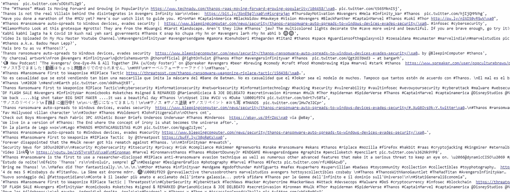

# 人工智能在灭霸推特上，使用火炬码的情绪检测器

> 原文：<https://pub.towardsai.net/ai-on-thanos-tweets-emotion-detector-using-torchmoji-eda6026625be?source=collection_archive---------1----------------------->

## [自然语言处理](https://towardsai.net/p/category/nlp)

## 在 NLP 上使用深度学习。[完整代码可在我的 Github 回购。](https://github.com/arditoibryan/Projects/tree/master/20200621_Thanos_Emotion_Detection)


灭霸大战复仇者联盟，无限战争，2018

[在我的上一篇教程](https://medium.com/towards-artificial-intelligence/using-torchmoji-with-python-and-deep-learning-3fefee62c9a1)中，我终于能够发布代码，在你的 python 代码中使用 torch moji(deep moji 的 PyTorch 版本)。所有接近 NLP 的人工智能开发人员都希望从对一些文本进行情感分析开始。

然而，情感分析有很大的局限性。情感分析的输出范围从-1 到 1，一个单一的维度。你可以在一维输出中找到的集群是通过排序一个列表得到的，到目前为止，没什么特别的。

## 为什么我要使用情绪检测？

DeepMoji 已经在 1.246.000 条社交媒体文本上进行了训练，以识别何时使用了 64 种不同的情绪。输出不是单一维度，而是 64 个维度(64 列)。我可以执行更深入的分析，甚至在数据中找到聚类，这增加了我管理 NLP 问题的复杂性。

# 下载推文

要下载成千上万条推文，你可以使用原始的 Twitter API，也可以使用 twint。因为使用这个工具违反了 Twitter 的服务条款，所以要明智。我不会在学术出版物中使用这些数据，并且，在我的存储库中，我将只保存那些不会向您显示发布补间者的用户信息的数据集部分。

```
!pip3 install twint[https://github.com/twintproject/twint](https://github.com/twintproject/twint)import twint# Configure
c = twint.Config()
c.Search = '#thanos', 'Thanos'
#c.Search = 'Thanos', 'snap'
c.Store_csv = True
c.Since = "2018-06-16 00:00:00" #anno, mese, giorno
#c.g="48.880048,2.385939,1km" #1km radius from Paris
c.Limit = 10000 #non funziona
c.Output = "Thanos.csv"
```

有了这些设置，当我运行下面的代码时，软件将下载它在网上找到的所有推文。我只对推文感兴趣，所以我会放弃所有其他信息。

```
# Run
twint.run.Search(c)
```

经过 10 分钟的等待时间，我已经能够存储 5k 条推文进行分析。的。csv 文件已自动存储在我的文件中，因此我可以在以后检索它。

# 正在安装 DeepMoji

不幸的是，安装需要几分钟，并且需要下载大量数据。

```
#Install torchMoji
!pip3 install torch==1.0.1 -f [https://download.pytorch.org/whl/cpu/stable](https://download.pytorch.org/whl/cpu/stable) 
!git clone [https://github.com/huggingface/torchMoji](https://github.com/huggingface/torchMoji)
import os
os.chdir('torchMoji')
!pip3 install -e .
```

请注意，软件现在会要求您重新启动笔记本电脑，但是，如果您这样做了，笔记本电脑有可能会在循环中崩溃。如果你设法好奇，使它卡住了，小心重置所有设置，以防止崩溃循环。

```
!python3 scripts/download_weights.py
```

要完成第二部分，您必须授权下载。

```
import numpy as np
import emoji, json
from torchmoji.global_variables import PRETRAINED_PATH, VOCAB_PATH
from torchmoji.sentence_tokenizer import SentenceTokenizer
from torchmoji.model_def import torchmoji_emojis

EMOJIS = ":joy: :unamused: :weary: :sob: :heart_eyes: :pensive: :ok_hand: :blush: :heart: :smirk: :grin: :notes: :flushed: :100: :sleeping: :relieved: :relaxed: :raised_hands: :two_hearts: :expressionless: :sweat_smile: :pray: :confused: :kissing_heart: :heartbeat: :neutral_face: :information_desk_person: :disappointed: :see_no_evil: :tired_face: :v: :sunglasses: :rage: :thumbsup: :cry: :sleepy: :yum: :triumph: :hand: :mask: :clap: :eyes: :gun: :persevere: :smiling_imp: :sweat: :broken_heart: :yellow_heart: :musical_note: :speak_no_evil: :wink: :skull: :confounded: :smile: :stuck_out_tongue_winking_eye: :angry: :no_good: :muscle: :facepunch: :purple_heart: :sparkling_heart: :blue_heart: :grimacing: :sparkles:".split(' ')
model = torchmoji_emojis(PRETRAINED_PATH)
with open(VOCAB_PATH, 'r') as f:
  vocabulary = json.load(f)
st = SentenceTokenizer(vocabulary, 30)
```

创建解码函数。虽然这个函数在源代码中已经可用，但我添加了一些简单的修改，让你可以访问情绪检测的概率分布，这样你就知道从文本中估计的每个表情符号的概率是多少。当我必须执行更复杂的分析(如聚类)时，这些数据将被证明是有用的。

```
def deepmojify(sentence, top_n=5, return_emoji=True, return_prob=False):
  #converte lista probabilità in emoticon più probabili
  def top_elements(array, k):
    ind = np.argpartition(array, -k)[-k:]
    return ind[np.argsort(array[ind])][::-1]tokenized, _, _ = st.tokenize_sentences([sentence])
  #print(tokenized)
  #lista di probabilità
  prob = model(tokenized)[0]
  #se ci sono errori parte da qui: too many values to unpack (expected 2), non riesce a trovare prob
  #trova le n emoticono più alte 
  emoji_ids = top_elements(prob, top_n)#converte questi numeri in emoticons
  emojis = map(lambda x: EMOJIS[x], emoji_ids)

  if return_emoji == False and return_prob == False:
    return None
  elif return_emoji == True and return_prob == False:
    return emoji.emojize(f"{sentence} {' '.join(emojis)}", use_aliases=True)
  elif return_emoji == True and return_prob == True:
    return emoji.emojize(f"{sentence} {' '.join(emojis)}", use_aliases=True), prob
  elif return_emoji == False and return_prob == True:
    return prob
```

## 将单个文本转换为表情符号

```
deepmojify('ciao come stai?', top_n=3, return_emoji=True, return_prob=False)
'ciao come stai? 💓 💛 ❤'
```

这段代码将简单地返回这句话中最可能的表情符号。我将在下一篇文章中使用这段代码来更高级地使用数据分析工具。

```
deepmojify('ciao come stai?', top_n=3, return_emoji=False, return_prob=True)
array([
0.00394054, 0.00129295, 0.00197147, 0.00432513, 0.01371501,        0.00560058, 0.00418637, 0.02010225, 0.07735906, 0.01391253,        0.01317994, 0.00444024, 0.0065301 , 0.0008908 , 0.0036633 ,        0.00902654, 0.03026676, 0.00181301, 0.03949212, 0.00103115,        0.00485938, 0.00700757, 0.00463908, 0.02274275, 0.17968854,        0.00277099, 0.00447128, 0.00739905, 0.02860775, 0.00278266,        0.03876906, 0.0063387 , 0.00113546, 0.00621301, 0.00847516,        0.00747591, 0.01020002, 0.00090959, 0.00828929, 0.00162419,        0.00219347, 0.0071467 , 0.00454975, 0.0043973 , 0.00239056,        0.00502038, 0.00712393, 0.13541125, 0.00248322, 0.02106217,        0.02085136, 0.00176592, 0.00304266, 0.02627314, 0.01630236,        0.00183573, 0.00255118, 0.00402961, 0.00483469, 0.02000473,        0.02692209, 0.02151149, 0.00628529, 0.04087168
], dtype=float32)
```

相反，如果你对 DeepMoji 背后发生的过程感兴趣，通过这些参数，你可以获得这句话的概率分布。

## 错误:要解包的值太多(应为 2)

它可能无缘无故地发生。如果代码运行此错误，重置变量并从零开始重新启动。我把它放在文章里是为了避免你感到沮丧。

## 将列表转换为 DataFrame +表情符号

tweet 数据集被存储为熊猫数据帧。然而，前面的函数将单个文本作为输入。该函数将列表作为输入，然后创建一个数据帧，在下面的列中存储指定数量的表情符号。

```
import pandas as pd#converts a list to emoji
def emoji_dataset(list1, n_emoji=3, only_prob=False):
  emoji_list = [[x] for x in list1]for _ in range(len(list1)):
    for n_emo in range(1, n_emoji+1):
      if only_prob == False:
        emoji_list[_].append(deepmojify(list1[_], top_n=n_emoji, return_emoji=True, return_prob=False)[2*-n_emo+1])
      else:
        emoji_list[_].append(deepmojify(list1[_], top_n=1, return_emoji=False, return_prob=True))emoji_list = pd.DataFrame(emoji_list)
  return emoji_list
```

# 处理推特数据集

## 清理数据

最后，我可以收集 5k 条推文。在将它们输入 emoji_dataset 功能之前，我会仔细检查，至少，这些推文包含关键词“灭霸”。

* * *我认为有更好的方法来从无效的推文中选择有效的，但是我还没有探索它们。Twint 并不总是完美的，它可能会下载不相关的推文。

```
##Emotional Detector
df = pd.read_csv('/content/drive/My Drive/Colab Notebooks/Projects/20200621_Emotion_Detector/Thanos.csv')
df = pd.DataFrame(df['tweet'])
df
```


tweets 数据集的示例

```
def check_string(string1):
  if '#thanos' in string1:
    return 1
  elif 'Thanos' in string1:
    return 1
  elif 'thanos' in string1:
    return 1
  elif 'THANOS' in string1:
    return 1
  else:
    return 0#cleaning the data
df['healthy'] = 0
df
```

我将应用该算法创建另一个列。对于不包含函数中指定的关键字的所有 tweets，该列将显示 0 值。

```
#only conserve tweets with the right keywords
df['healthy'] = df['tweet'].apply(lambda x : check_string(x))
df
```

我将只选择健康值为 0 的列。

```
df = df.loc[df['healthy'] == 1]
df
```


数据集的样本

## 转换成表情符号

现在是时候将整个数据集转换成表情符号了。我选择 5 作为神经网络最有可能做出的选择。对于每一句话，神经网络将估计最可能的 5 个表情符号。

```
df = df['tweet'].to_list()
df
```



请记住，该算法只接受列表。现在我已经有了正确格式的数据集，可以将它输入到模型中了。

```
#start converting text to emoji
df = emoji_dataset(df, 5)
df
```

等待时间大约是 30 分钟。对此我很抱歉，我也没有耐心。


太棒了。我们的数据集已经被转换成表情符号。我将在下一篇文章中讨论如何分析数据来找出聚类在哪里。

## 导出数据集

如果你想在你的电脑上导出结果，这是代码。

```
#export dataset
df.to_csv('Thanos_.csv')
```

如果你喜欢，请随意鼓掌。感谢您的阅读。