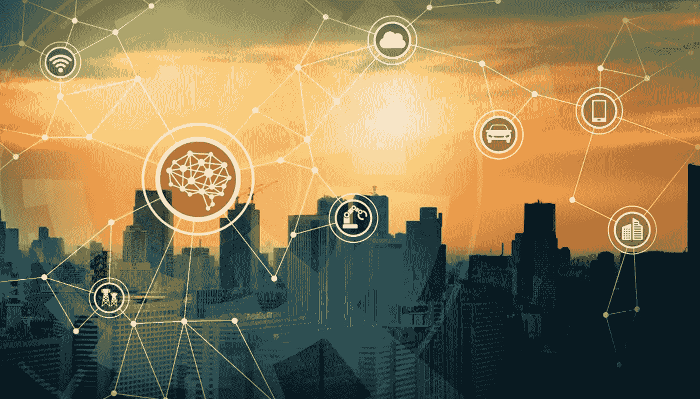
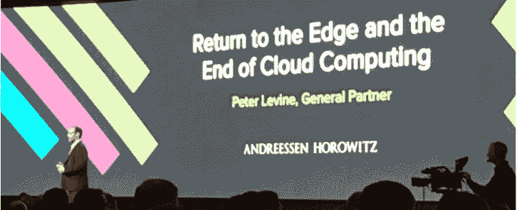
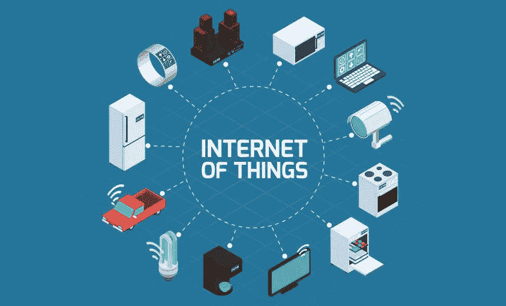
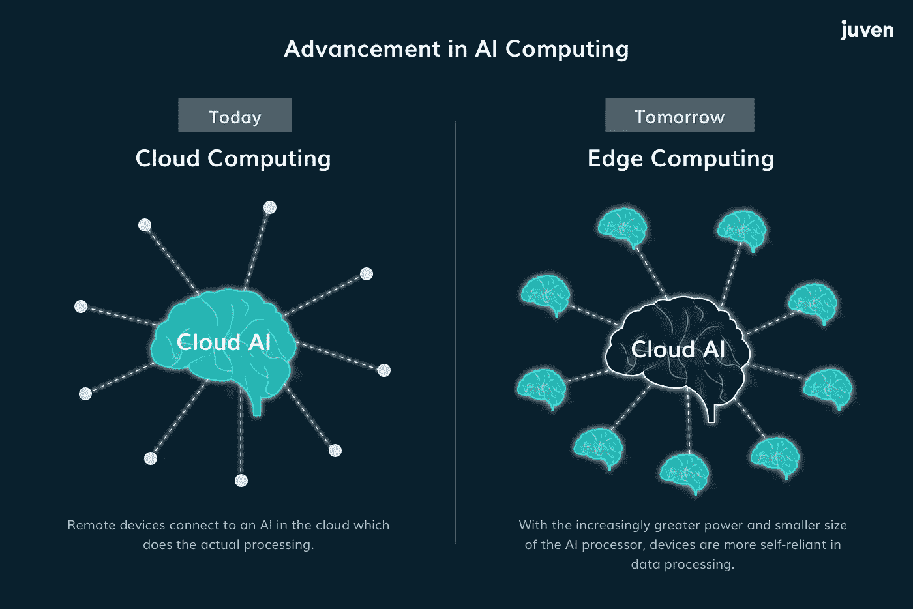
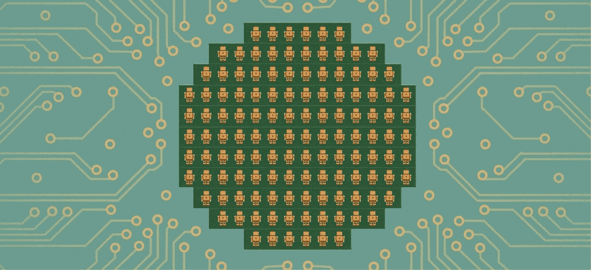

# 边缘的人工智能——人工智能书呆子系列| # 01-试播

> 原文：<https://pub.towardsai.net/ai-on-the-edge-an-ai-nerd-series-01-pilot-7d834f02ad33?source=collection_archive---------1----------------------->

## 边缘计算的出现和将人工智能带到边缘的需要

起初，有一台大型计算机。很快我们开始使用终端连接它(UNIX 时代)。接下来，我们有了个人电脑，这是普通人第一次拥有可以工作的硬件。今天，我们已经进入了云计算时代，这意味着今天的世界是集中的，由一个中央云来完成所有需要的处理。关于云的真正令人惊讶的事情是，现在世界上所有公司中有很大一部分都依赖于极少数云提供商的基础设施、托管、机器学习和计算能力:亚马逊、微软、谷歌和 IBM。但是当安德森·霍洛维茨公司的彼得·莱文在 [a16z](https://youtu.be/4QTAtFaIiyc) 展示他有趣的工作理论时，事情变得有点激动人心。他的演讲题目是*“云计算的终结”*(！！！)

**a16z 的彼得·莱文(图片来源:谷歌图片)**

> 科技领域流行的东西总会被其他东西取代。—彼得·莱文

边缘计算的出现是我们必须关注的事情，因为它是一个时髦的词，暗示着科技巨头对耗尽的云空间的认识。因此，大多数云*云*中的颠覆性机会都位于*边缘。*

# 走向边缘

近年来，物联网(IoT)——收集和接收数据的设备和传感器——已经扩散到新的巨大应用中，如自动驾驶汽车、视频监控、物流、农业、消费电子、增强和虚拟现实、工业自动化、战场技术等。据物联网创新联盟称，到 2021 年，即所谓的“物联网时代”，将有 480 亿(！！！)连接到互联网的设备。这种扩展导致了与之相关的处理需求的转变。云计算——大型数据中心很少，它们使企业能够远程处理和存储他们的信息和应用程序，但不能提供足够的解决方案，特别是在数据是关键任务或要求零延迟的情况下。

> 到 2025 年，边缘计算市场规模预计将达到 290 亿美元。—大观研究

对于这些应用，“边缘计算”提供了答案，它在网络的外围(边缘)增加了计算能力，更接近被服务的设备或作为其一部分。没有必要再等待数百或数千英里之外的“智能”产生。消除了边缘的延迟。边缘计算是指发生在互联网“外部边缘”的计算，与云计算相反，云计算的计算发生在一个中心位置。边缘计算通常在靠近数据源的地方执行，例如在连接的摄像机上或附近。自动驾驶汽车是边缘计算的一个完美例子。为了让汽车安全地行驶在任何道路上，它必须实时观察道路，如果有人走在汽车前面，它就必须停下来。在这种情况下，使用边缘计算在边缘处理视觉信息并做出决定。

# 艾在边缘

Edge AI 将允许实时操作，包括数据创建、决策和行动，在这些操作中，毫秒很重要。实时操作对于自动驾驶汽车、机器人和许多其他领域都很重要。降低功耗，从而提高电池寿命，对于可穿戴设备来说是超级重要的。Edge AI 将降低数据通信的成本，因为将传输更少的数据。通过在本地处理数据，您可以避免将大量数据传输和存储到云中的问题，从隐私的角度来看，这种问题会使您容易受到攻击。

示例:根据定义，手持电动工具位于网络边缘。在电动工具中的微处理器上运行的 Edge AI 软件应用程序实时处理来自电动工具的数据。Edge AI 应用程序生成结果，并将结果存储在设备本地。下班后，电动工具连接到互联网，并将数据发送到云端进行存储和进一步处理。上例中的一个关键特性是电池寿命长。如果电动工具不断地将数据传输到云端，电池很快就会耗尽。

## 欢迎来到 AI on the Edge

所以这只是关于边缘人工智能的介绍，在即将到来的帖子中，我将涵盖一些与可以在边缘设备上使用的人工智能算法相关的非常深刻的概念。必须注意的是，边缘计算领域正在快速发展；这个系列只关注 Edge 的 AI 视角。在这一系列中，我们将涵盖关于边缘***深度学习模型压缩******硬件加速的 ***AI 算法的概念。*** 敬请关注，深入了解边缘 AI 的深度技术！！。***

## *参考文献:*

[什么是 Edge AI？— Imagimob](https://www.imagimob.com/blog/what-is-edge-ai)

[您现在需要从云计算转向边缘计算！](https://towardsdatascience.com/you-need-to-move-from-cloud-computing-to-edge-computing-now-e8759eb9690f)