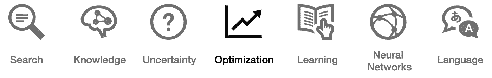
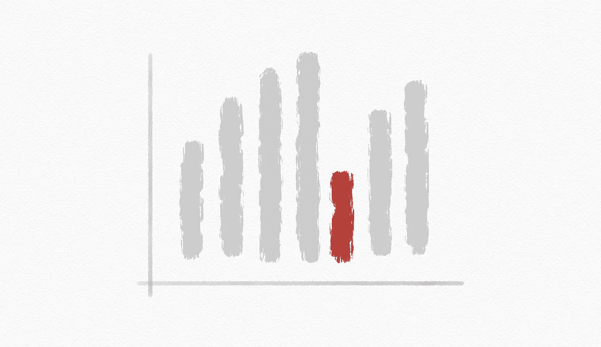
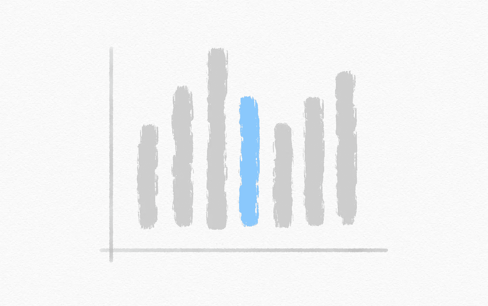
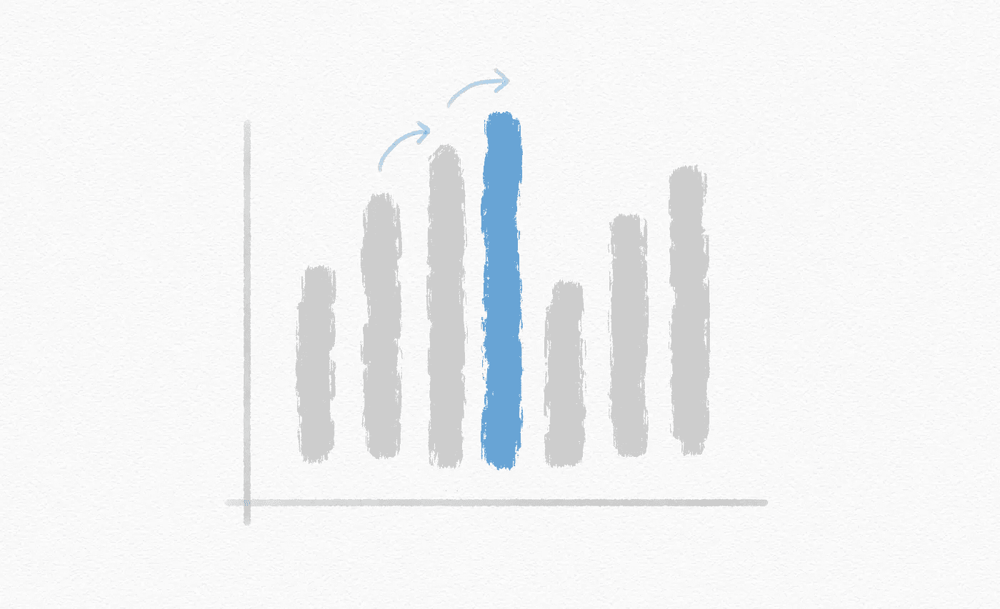
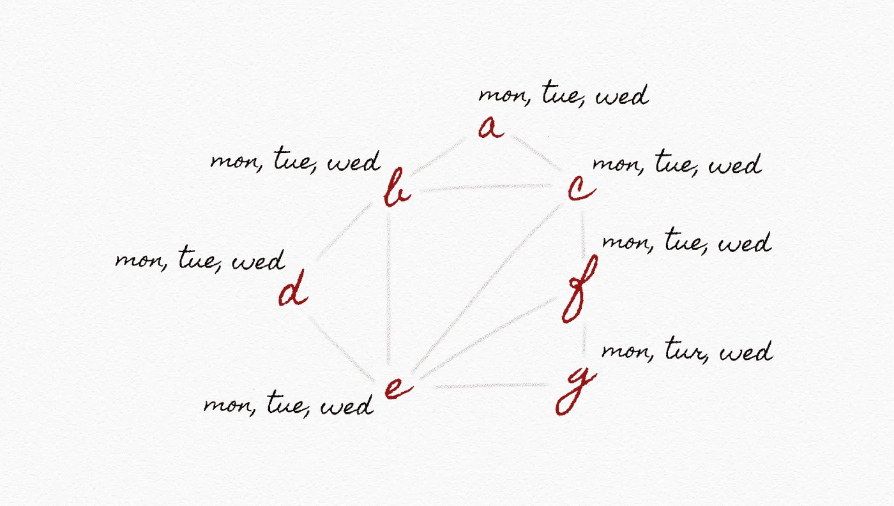
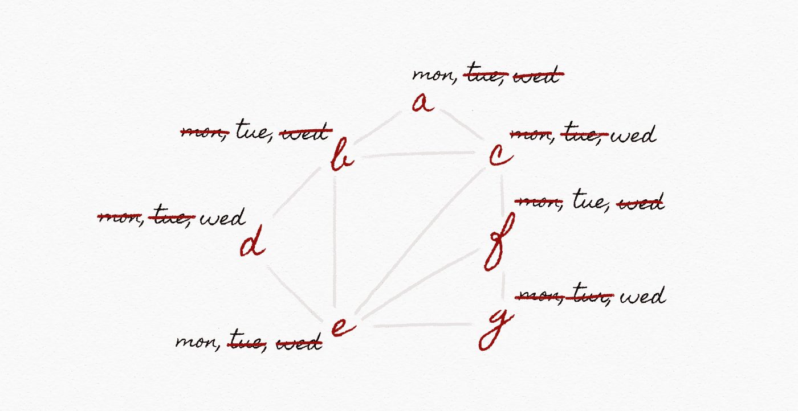

# 关于优化的 28 个词，每个精通人工智能的领导者都必须知道

> 原文：<https://pub.towardsai.net/ai-optimization-b8735dc09448?source=collection_archive---------4----------------------->

## 人工智能

## 你能解释这些吗？检验你的知识！


*【这是* ***系列*** *的第 4 部。在继续之前，请确保您阅读了关于* [*搜索*](https://medium.com/towards-artificial-intelligence/ai-search-e0cb610237f6)[*知识*](https://medium.com/towards-artificial-intelligence/ai-knowledge-1020a00eb45d) 和 [*不确定性*](https://medium.com/towards-artificial-intelligence/ai-uncertainty-4ac6810899ac) *的内容。接下来的题目是* [*机器学习*](https://medium.com/towards-artificial-intelligence/ai-learning-2eaea82ee6d)*[*神经网络*](https://medium.com/towards-artificial-intelligence/26-words-about-neural-networks-every-ai-neural-networks-1085bd972fd5) *，以及* [*语言*](https://medium.com/towards-artificial-intelligence/ai-language-1d266caa72c6) *。】**

**

*超过三分之二的人工智能价值创造来自于对现有系统和流程的改进。这是根据*麦肯锡的* [*【人工智能前沿笔记】*](https://www.mckinsey.com/~/media/McKinsey/Featured%20Insights/Artificial%20Intelligence/Notes%20from%20the%20AI%20frontier%20Applications%20and%20value%20of%20deep%20learning/Notes-from-the-AI-frontier-Insights-from-hundreds-of-use-cases-Discussion-paper.ashx) (一个关于人工智能价值创造的高度推荐的资源和战略商业视角)。*

*尽管这一统计包括传统和先进的技术以及广泛的人工智能应用，但其主要份额植根于简单的优化问题。想想看，改造全球供应链的物流或提高金融预测模型的准确性。*

> *人工智能每年可以创造 15.4 万亿美元的价值。*

*在 ***优化*** 中，目标是从一组预先确定的选项中选择可能的最佳选项，通常隐藏在数据深处。为了释放增量价值，我们可以利用*局部搜索*、*线性规划*或*约束满足*等方法来创建实际的、真实世界的应用程序。*

*为了让你进入这个令人兴奋的领域，本文简要定义了 ***的主要概念和术语。****

# *最佳化*

***本地搜索:**保持单个节点并通过移动到相邻节点进行搜索的搜索算法*

***状态空间景观:**考虑实例的连续状态的过程，目的是找到具有期望属性的目标状态*

***全局最大值:**集合、函数等的整体最大值。，在其整个范围内*

**

*全局极大值*

***全局最小值:**集合、函数等的最小整体值。，在其整个范围内*

**

*全局极小值*

***目标函数:**使其最大化的函数(例如，对于收入)*

***成本函数:**最小化的函数(如成本)；它可能看起来像这样:*

```
*50[x1] + 80[x2]*
```

***当前状态:**(或配置)当前存储在内存中的输入、变量和常量的动态集合*

**

*初速电流状态*

***爬山:**一种优化技术，用于寻找计算问题的“局部最优”解决方案；变体包括最速上升、随机、首选、随机重启和局部波束搜索*

**

*爬山*

***最陡爬坡:**选择最高值邻居的爬山变体*

***随机:**爬山变体，从更高值的邻居中随机选择*

***首选:**爬山变体，它选择第一个更高值的邻居*

***随机重启:**爬山变体，进行多次爬山*

***局部波束搜索:**爬山变体，其选择 k 个最高值的邻居*

*模拟退火:一种用于优化复杂搜索算法的技术*

***线性规划:**一种数学方法，用于从定义的选项或要求中确定最佳可能结果，以线性关系表示*

***单纯形:**常见的线性规划算法*

***内点:**另一种常见的线性规划算法*

***约束满足:**寻找一组约束的解决方案的过程，这些约束强加了变量必须满足的条件；约束类型包括硬约束、软约束、一元约束和二元约束*

**

*约束满足*

***约束函数:**指定非线性规划问题中规定条件的函数，(即时间、劳动或投入)；它可能看起来像这样:*

```
*5[x1] + 2[x2] <= 100*
```

***硬约束:**正确解决方案中必须满足的约束*

***软约束:**约束表达了哪些解决方案优于其他方案的一些概念*

***一元约束:**只涉及一个变量的约束*

```
*{A ≠ Monday}*
```

***二元约束:**涉及两个变量的约束*

```
*{A ≠ B}*
```

***节点一致性:**当一个变量的值域中的所有值都满足该变量的一元约束时*

***弧一致性:**当一个变量的定义域中的所有值都满足该变量的二元约束时；为了使弧相对于 B 一致，从 A 的定义域中删除元素，直到 A 的每个选择对 B 都有可能的选择*

```
*A {mon,tue, wed}
B {mon, tue, wed}
...*
```

**

*电弧一致性*

***反向训练搜索:**深度优先搜索算法，系统地将所有可能的值组合分配给变量，以检查这些分配是否构成解决方案*

***维护弧一致性:**每当我们做一个新的赋值时，执行弧一致性的算法*

***最小约束值启发式:**根据相邻变量被排除的选择数，按顺序返回变量的方法(首先尝试最小约束值)*

*既然你已经能够解释基本的*优化*相关术语，你就有希望更加自如地独自探索这个广阔的领域。*

*然而，如果不探索 ***其他相关主题*** ，包括 [*搜索*](https://medium.com/towards-artificial-intelligence/ai-search-e0cb610237f6)*[*知识*](https://medium.com/towards-artificial-intelligence/ai-knowledge-1020a00eb45d)[*不确定性*](https://medium.com/towards-artificial-intelligence/ai-uncertainty-4ac6810899ac)[*学习*](https://medium.com/towards-artificial-intelligence/ai-learning-2eaea82ee6d)[*神经网络*](https://medium.com/towards-artificial-intelligence/26-words-about-neural-networks-every-ai-neural-networks-1085bd972fd5) 和，你就无法完成成为一名成熟的人工智能领导者的旅程**

****

*****喜欢你读的东西？*** ***渴望了解更多？*** *跟我上* [*中*](https://medium.com/@yannique) *或*[*LinkedIn*](https://www.linkedin.com/in/yannique/)*。***

*****关于作者:*** Yannique Hecht 作品领域结合策略、客户洞察、数据、创新。虽然他的职业生涯一直在航空、旅游、金融和技术行业，但他对管理充满热情。Yannique 专门开发 AI &机器学习产品商业化的策略。**

**由[向艾](https://towardsai.net/)发布**