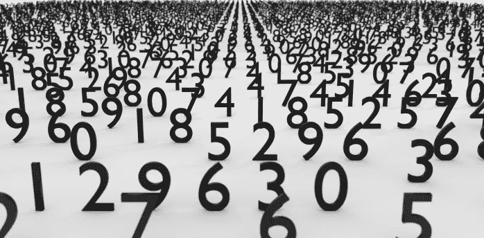
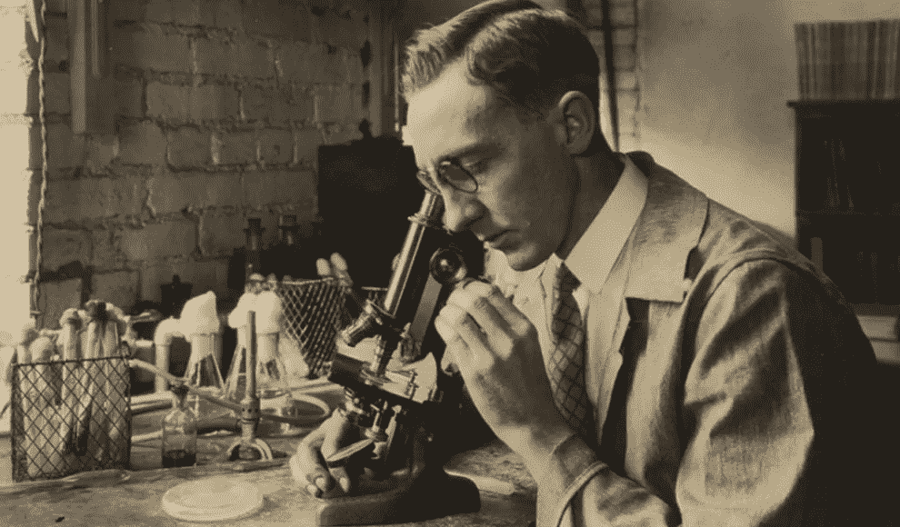
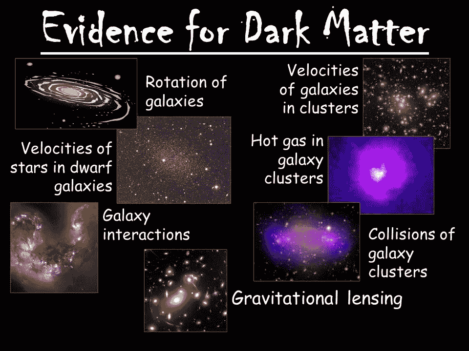
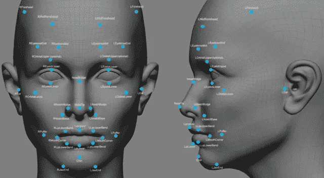
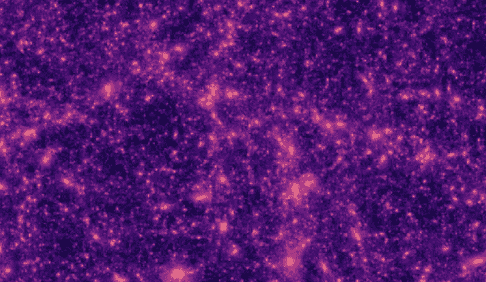
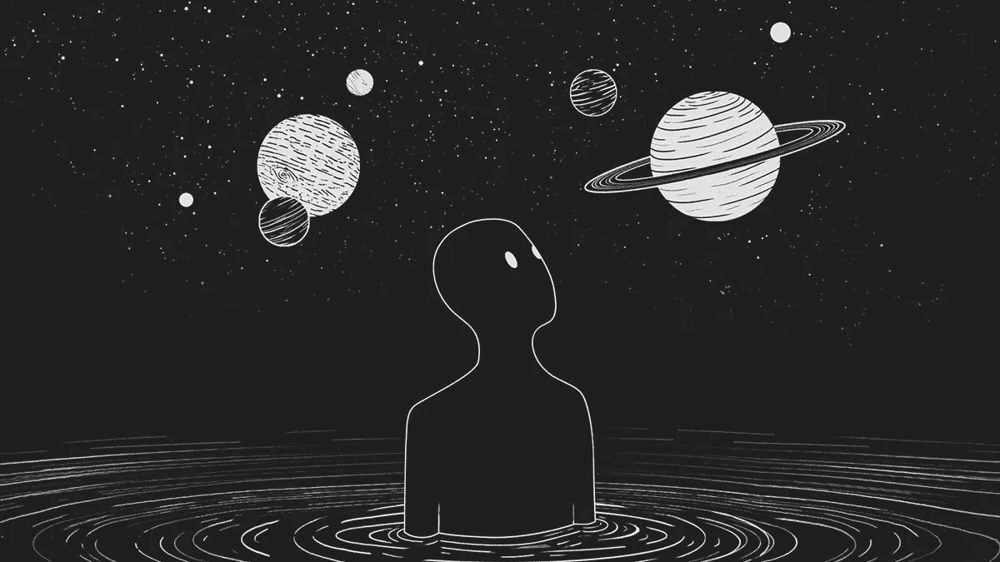

# 人工智能与物理学，第一部分——暗物质也很重要

> 原文：<https://pub.towardsai.net/ai-physics-part-1-dark-matter-matters-too-7bbda3a35dd1?source=collection_archive---------0----------------------->

## 潜入人工智能&物理| [走向人工智能](https://towardsai.net)

物理。我们理解周围宇宙的方式。我们用方程式和公式来尝试和分解基本的真理。找出决定我们成为什么样的人的规则。恒星、星系、黑洞，甚至宇宙本身都必须遵循的规则。

听起来很复杂，对吧？我们人类可能非常聪明，但理解宇宙本身所涉及的数学量绝对超出了我们的能力。但这并不意味着我们会停止努力，越来越接近理解一切。我们一步一步来，不断取得小的进展，并希望最终，他们会回答至少一些大问题。

> “我们是怎么到这里的？”
> 
> "像我们这样的星球还有多少？"
> 
> “宇宙中还有其他智慧生命吗？”

你得到了要点，有一些相当大的，非常模糊的问题需要回答。

# 问题的一部分

用极大(或极小)的部分来观察宇宙的问题是，数学开始处理同样大(或小)的数字。试图在这些规模的大量数字中寻找模式需要我们花费大量的时间。但不是机器。他们专攻它。想一个简单的例子，你能比你的计算器更快地算出 *(3454.709 * 508.3339)* 吗？

对于任何想知道的人来说，答案是*。17360 . 686868686867*

就纯数学能力而言，没有可比性。很明显。但是计算机不能理解数学代表什么或者我们需要解决的问题。某种程度上，它可以学习，但不能学会理解。

人们天生就有好奇心。如果我们没有足够的好奇心去发现如果我们试图像父母那样移动我们的腿会发生什么，我们将永远不会学会走路或说话。我们有一种*需求*去了解我们周围的世界，这种需求驱使我们做出令人难以置信的发现，比如电，或者建造火箭只是为了看看月球上是什么样子。

那么，如果我们可以用训练有素的人工智能的力量来瞄准我们好奇心的焦点，我们会发现什么呢？

# 暗能量和暗物质

我们对暗物质了解不多。我们认为它约占我们周围宇宙的 27%(相当大的一块),但我们不知道它实际上是什么，也不知道它由什么组成。

暗能量是一个类似的故事。我们相信它大约占宇宙的 68%,我们认为这是宇宙膨胀加速而不是减慢的原因。但是真的*不知道*。

所以这仅仅是我们所能看到的整个宇宙的 5%以下。我们所知道的一切，建筑和恒星，汽车和星系，人类和行星……这还不到**的 5%** 。而我们对另一个 **~96%** 几乎一无所知。我们知道暗物质甚至*存在*的唯一原因是因为‘正常物质’没有足够的引力将星系聚集在一起。但是由于重力的存在，宇宙的膨胀现在应该已经慢下来了。

图片来源:[https://slideplayer.com/slide/6061190](https://slideplayer.com/slide/6061190)

但相反，它在加速。原因——暗能量。

两个 ***相当于*** 宇宙的重要部分，引力的主要来源和宇宙膨胀变快的原因。我们甚至找不到他们。

但是有了人工智能，我们可以做到。

# AI 有什么帮助？

那么*人工智能如何帮助我们了解暗物质呢？信不信由你——通过面部识别算法。或者类似的东西。*

首先，面部识别技术是如何工作的？

电脑会看你的一张脸的照片(或者通常是很多张脸的很多张照片)，然后它会在你的脸型、鼻子曲线、下巴轮廓中找到模式。这些模式放在一起，计算机就能识别你的身份。

这如何适用于暗物质和暗能量？嗯，我们也可以使用模式来识别这两者。暗物质和暗能量都会扭曲光线，我们称之为“弱引力透镜”。这是一个很小的扭曲，只有当我们用现代望远镜观察来自极远处的光线时才能看到。我们使用人工智能来分析来自望远镜的图像，它可以发现最细微的图案，这些图案表明光线被暗物质和能量弯曲。

用于训练人工智能的计算机生成的暗物质地图

# 为什么重要？

如果我们能找到暗物质在哪里，并了解它对周围宇宙的影响，我们就能在弄清楚它是什么方面取得进展。我们可以开发更精确的宇宙数学模型。这可能会从根本上改变我们对物理学的理解，以及我们进行新的科学预测和实验的方式。没有人工智能这是不可能的。

像这样的进步就是为什么我们需要在发展人工智能方面更加努力。我之前已经谈过[人工智能如何改变我们在学校的学习方式](http://bit.ly/aiSchools)，但这正在改变我们对宇宙本身的学习方式。

凭借计算机的能力和我们人类的好奇心，我们可以开始解开宇宙的下一个大秘密是什么？