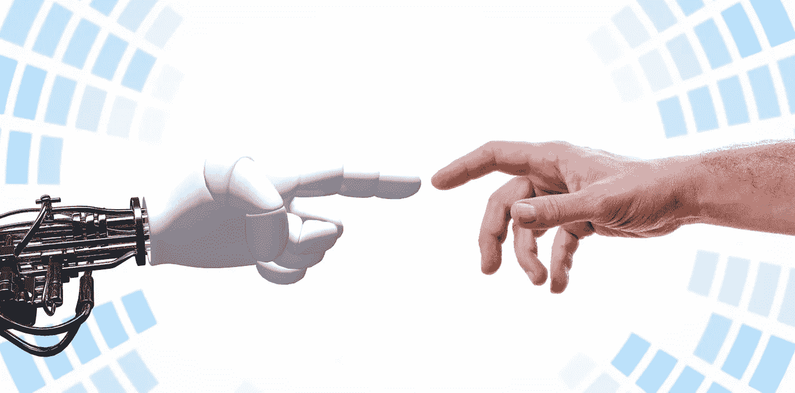

# 人工智能政策:技术的作用

> 原文：<https://pub.towardsai.net/ai-policy-role-of-technology-d925dfd035ca?source=collection_archive---------2----------------------->

## 人-人工智能界面及其后果。

数据和判断是对人工智能的补充，是战争和国家安全决策的核心要素。基于人工智能的技术的类人行为提出了关于科学、技术和社会之间接口的问题。在可持续发展、医疗保健、科学发现和国防领域部署这些技术可以在利益实现方面产生巨大的影响。

在这篇文章中，我们将探索可以使人工智能输出值得信赖的治理过程，数据和人类判断在决策过程中的作用，以及前景光明但需要治理的脑科学的发展。

> 人与人工智能的界面是人工智能价值实现的重要因素。

[人工智能](https://www.publicdomainpictures.net/en/view-image.php?image=382569&picture=artificial-intelligence)

人工智能技术有潜力释放能力，以获得运营和竞争优势。潜在的风险也阻碍了采用，使其在经济上不可行。需要适当的人工智能治理实践来利用增长潜力和减轻风险，而不成为障碍。

信息技术(IT)团队在实现人工智能能力方面发挥着至关重要的作用。IT 组织拥有 IT 治理模型。这些 IT 治理模型可以分解为结构、过程和关系实践，以治理数据、数据质量和数据安全性。通过自动化平凡、复杂和重复的任务，人类可以与人工智能的输出进行交互，以做出更好的决策。

简化流程、拆分工具集，以及采用一个预先活动的工具集来从一开始就解决问题，为建立对人工智能的信任提供了基础。这种自下而上的方法将显著提高数据的信心和质量，从而改善流程和人工智能输出。

> **人工智能将降低预测成本，改善决策，但增加干净数据的价值&判断。**

数据和判断是对人工智能的补充，是战争和国家安全决策的核心要素。人工智能的预测能力可以优化给定函数的效用。但是确定什么效用函数必须被优化是基于人类的判断。

与私营部门不同，这些方面可能不会像原始和狭隘的那样，迫使人类将人工智能预测作为一种信息来源，以做出明智的决定。对人工智能的关注补充了人类判断方面的不足，这是有争议的，而数据的价值(其质量必须得到证明)使人工智能驱动的战争更加旷日持久和令人困惑。

人工智能在商业领域的成功归功于干净的数据、清晰的可量化判断和机构治理模型。没有管理战争的机构，数据可以是纯粹的上下文，判断必须包括战场上不存在的因素，如政治对话、经济可行性等。人类的重要性是基于政策的决策过程的关键，而人工智能预测只是信息的一个来源。

> 人工智能引领了科学的发展，如果落入坏人之手或不受控制地使用，可能会产生严重的不利后果。

[控制论大脑](https://openclipart.org/detail/301267/cybernetic-brain)

人工智能领域的进步使得脑科学领域的快速发展成为可能。在可持续发展、医疗保健、科学发现和国防领域部署这些技术可以带来巨大的社会效益。

然而，这种进步在不良行为者手中或不受控制的使用可能会产生严重的不良后果，如故意滥用、自主武器哑火和脑机增强的不当认知增强。

基于政策的卓越创新治理必须设计为管理和监控人工智能和脑科学研究的使用。基于人工智能的技术的类人行为提出了关于科学、技术和社会之间接口的问题。伦理和治理方面必须在研究过程的上游框架内，公众的投入。授予人工智能代理的自治级别必须基于不同参与者的持续学习和参与来确定。

# **结论**

解决用自动化系统取代人、机器和流程的政治、运营和道德后果至关重要。这些，加上网络安全和机密信息的保密性，必须被视为人工智能的补充领域，以防范间谍和秘密行动。

正如在[人工智能政策:对国家安全的影响](/ai-policy-impact-on-national-security-9bbef5f654d2)中所提到的，人工智能和相关创新的多维度性质和影响使其极具挑战性，需要一种具有紧迫感的多管齐下的方法。

人工智能政策是复杂的，将涵盖国防、食品、水、天然气、电力、卫生、金融、交通、研究、供应链、政府和人类进行的许多其他活动。因此，政策的演变必须关注人与人工智能的接口。

# **参考文献**

1.  Papagiannidis，Emmanouil，Ida Merete Enholm，Chirstian Dremel，Patrick Mikalef 和 John Krogstie。2022."走向人工智能治理:识别最佳实践和潜在的障碍和结果."信息系统前沿:研究与创新杂志。荷兰多德雷赫特:Kluwer 学术出版社。[https://doi.org/10.1007/s10796-022-10251-y](https://doi.org/10.1007/s10796-022-10251-y)。
2.  戈德法布、阿维和乔恩·r·林赛。2021.“预测和判断:为什么人工智能增加了人类在战争中的重要性”，《国际安全》46，46，第 3 期:7–50。https://doi.org/10.1162/isec_a_00425[。](https://doi.org/10.1162/isec_a_00425)
3.  多亚，健二，阿里萨·埃马，平冈拓晃·北野，坂上正道和斯图尔特·罗素。2022.人工智能和神经技术的社会影响和治理，《神经网络》152，152:542–54。【https://doi.org/10.1016/j.neunet.2022.05.012】T4。