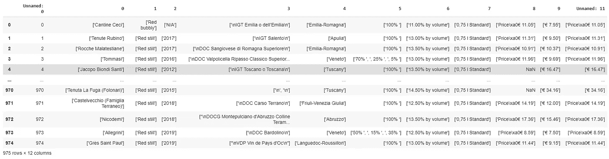
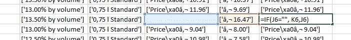
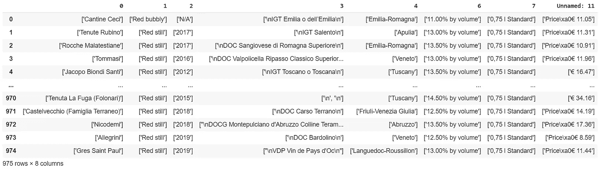
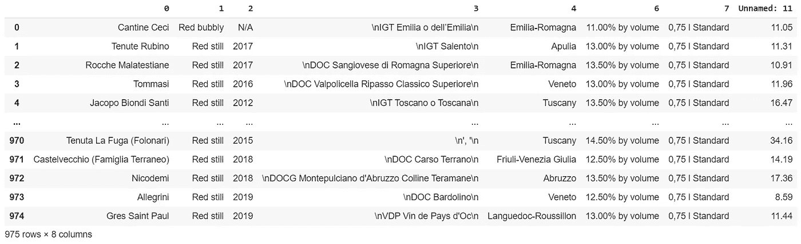
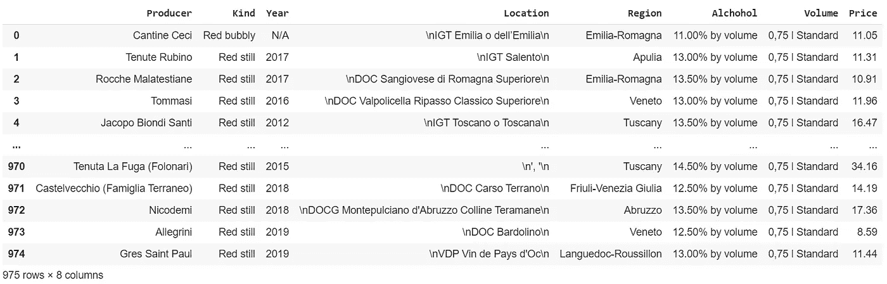
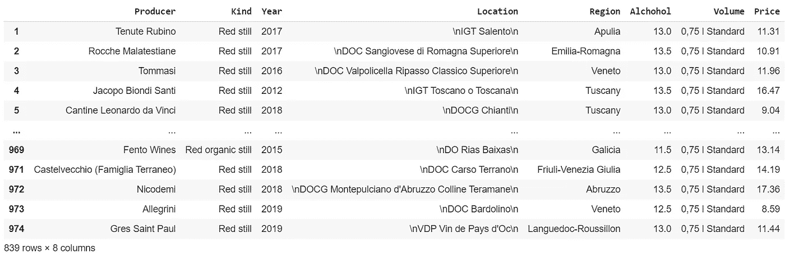
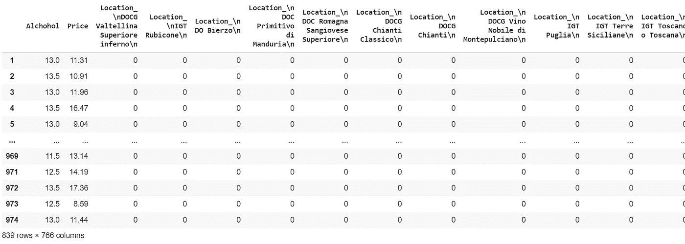
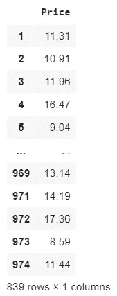
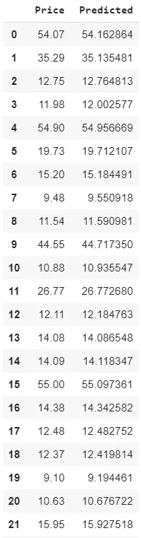

# 人工智能，回归预测葡萄酒价格，99% r 平方

> 原文：<https://pub.towardsai.net/ai-predicting-wine-prices-with-regression-99-r-squared-259ae9af298a?source=collection_archive---------2----------------------->

## [机器学习](https://towardsai.net/p/category/machine-learning)

## 用机器学习估计葡萄酒价格。[Github 上有完整的代码。](https://github.com/arditoibryan/Projects/tree/master/20200613_Wine_Price_Estimator)

在我的上一篇文章中，我已经对我的第一个网站进行了网络抓取，获得了一个包含相关信息的酒瓶数据集。在这篇文章中，我将尝试创建一个可以估计任何一瓶葡萄酒价格的人工智能(使用机器学习模型)。


照片由[托马斯·谢弗](https://unsplash.com/@tomonine?utm_source=medium&utm_medium=referral)在 [Unsplash](https://unsplash.com?utm_source=medium&utm_medium=referral) 拍摄

# 步伐

在本文中，我将遵循以下步骤:

1.  编辑 Excel 文件
2.  导入模块
3.  导入数据集
4.  预处理
5.  提取标签
6.  剧烈的
7.  支持向量回归机
8.  比较结果

## 一个小小的错误…

不幸的是，我在下载数据集时犯了一个小小的错误。通过下载列表，我在提取它们的内容之前将它们转换成字符串。现在，我将享受解决它的乐趣。我创建了一系列函数来预处理第一部分数据。

查看数据集，我立即注意到我(再次为错误道歉)将列表直接编码为字符串，而没有先取出它们。作为预处理步骤的一部分，我需要访问每个元素，去掉括号，提取内容。在价格等连续数据的情况下，我需要将其转换为浮点数。



原始数据集的样本

# 1.编辑 Excel 文件

在开始编码之前，我不得不处理数据集中的一列，这实在让我抓狂。我决定使用 Excel 函数来快速解决问题。在存储库中，编辑后的数据集被命名为 **wines_。csv** 。这是我将在代码中导入的数据集。我分享这个过程是为了更详细地说明我为解决这个问题所采取的步骤。

**Excel 函数:** =IF(J6= " "，K6，J6)



应用于最后一行的函数

我将把这个函数应用到最后一列的每一行。

这就是代码的含义:如果缺少原始价格(蓝色列)，则使用右边一个单元格的价格，否则使用原始价格。我这样做是为了避免使用有偏见的折扣价。

# 2.导入模块

为了简化分类数据的编码，我将使用 Github 上的一个工具，[TF _ dataset _ extractor _ v 1.2 . py](https://github.com/arditoibryan/General/blob/master/tf_dataset_extractor_v1.2.py)。这将允许我对多个列执行 one_hot 编码，而无需手动分离和重新附加它们。

```
import sys
sys.path.append('/content/drive/My Drive/Colab Notebooks/TensorFlow 2.0/modules')
import pandas as pd
import tf_dataset_extractor as e
#import grapher_v1_1 as g
#import LSTM_creator_v1_0 as l
v = e.v
g = e.g
l = e.l
```

# 3.导入数据集

```
import pandas as pd
X = pd.read_csv('/content/drive/My Drive/Colab Notebooks/Projects/20200612_Wine_Price_Estimator/wines_.csv')
```



葡萄酒 _。战斗支援车

# 4.预处理

我可以开始预处理数据了。我将首先删除包含旧价格的列，因为我已经选择了要在新列中分析的列(“未命名:11”)。我还将删除不同葡萄的百分比列；它有随机缺失值，可能会破坏结果。

```
X = X.drop(['Unnamed: 0', '8', '9', '5'], axis=1)
```

为了清理我的数据集，我将使用以下函数。

```
def clean_string(string1):
  char1 = "["
  char2 = "]"
  mystr = string1
  return mystr[mystr.find(char1)+1 : mystr.find(char2)]def clean_commas(string1):
  string1 = string1[1:]
  string1 = string1[:-1]
  return string1def clean(string1):
  string1 = clean_string(string1)
  string1 = clean_commas(string1)
  return string1def clean_price(string1):
  string1 = clean_string(string1)
  string1 = clean_commas(string1)
  string1 = string1.split(' ')[1]
  string1 = string1.replace(',', '.', 1)
  return string1def comma_dot(string1):
  string1 = string1.replace(',', '.', 1)
  return string1def delete_n(string1):
  string1 = string1.replace('\n', '')
  return string1
```

我现在可以处理数据集中的字符串了。我将使用一个应用于每一列的 lambda 函数来编辑它的所有内容，根据我想要进行的更改，使用我在上面声明的函数。

```
X['0'] = X['0'].apply(lambda x : clean(x))
X['1'] = X['1'].apply(lambda x : clean(x))
X['2'] = X['2'].apply(lambda x : clean(x))
X['3'] = X['3'].apply(lambda x : clean(x))
X['3'] = X['3'].apply(lambda x : delete_n(x))
X['4'] = X['4'].apply(lambda x : clean(x))
X['5'] = X['5'].apply(lambda x : clean(x))
X['6'] = X['6'].apply(lambda x : clean(x))
X['7'] = X['7'].apply(lambda x : clean(x))
X['Unnamed: 11'] = X['Unnamed: 11'].apply(lambda x : clean_price(x))
X['Unnamed: 11'] = X['Unnamed: 11'].apply(lambda x : float(x))
```



```
X.columns = ['Producer', 'Kind', 'Year', 'Location', 'Region', 'Alchohol', 'Volume', 'Price']
```



## 编辑剩余的列

```
#drop N/A column in Year
X = X[~X['Year'].isin(['N/A'])]#drop "\\n', '\\n" column in Location
X = X[~X['Location'].isin(["\\n', '\\n"])]X['Alchohol'] = X['Alchohol'].apply(lambda x : x[0:4])
X['Alchohol'] = X['Alchohol'].apply(lambda x : float(comma_dot(x)))
```



```
e.X = X
v.partition.one_hot(['Location', 'Producer', 'Kind', 'Year', 'Region','Volume'])
```



# 5.提取标签

```
y = X.pop('Price')
y = pd.DataFrame(y)
```



# 6.剧烈的

我终于可以将数据分成训练集和测试集了。

```
#splitting
import numpy as np
from sklearn.model_selection import train_test_splitX_train, X_test, y_train, y_test = train_test_split(e.X, y, test_size=0.1, random_state=42)
```

# 7.支持向量回归机

因为这是一个回归问题，我将使用一个非线性支持向量回归机作为模型，使用下面的调优。

```
#SVR, manual procedure
from sklearn.svm import SVR
clf = SVR(kernel='poly', C=1, gamma='auto', degree=3, epsilon=.1, coef0=1)
```

## 训练模型

```
clf.fit(X_train, y_train)
y_pred = clf.predict(X_test)
from sklearn.metrics import r2_score
```

## 评估绩效

我将使用 r 的平方来计算预测结果和真实结果之间的平方相关。

```
#r2 score
from sklearn.metrics import r2_score
print(r2_score(y_test, y_pred))
```

## 交叉验证

因为我对结果相当惊讶，所以我想进行交叉验证，看看该模型在不同比例的数据集上的表现如何:

```
#performance evalutation
v.cross_validation(clf, e.X, y, 10)Accuracy: 1.00 (+/- 0.00),
array([
0.99990355, 
0.99996721, 
0.99996876, 
0.99994828, 
0.99996389,         
0.99998166, 
0.99996577, 
0.99994188, 
0.99988042, 
0.99996255
]))
```

准确度似乎令人吃惊。

# 8.比较结果

因为我被这个模型不可思议的准确性震惊了，所以我必须亲眼看看。我把预测结果附上了模型从未见过的 y_test。他们几乎一模一样！！！

```
#comparing results
y_test = y_test.reset_index()
y_test.pop('index')y_pred = pd.DataFrame(y_pred)
total = pd.concat([y_test, y_pred], axis=1)
total.columns = ['Price', 'Predicted']
```



原始价格和预测价格的比较

我对这种惊人准确性的解释是，价格之间的差异是最小的。给定相似的变量(例如，同一个生产商)，卖方可能会使用相同的价格。