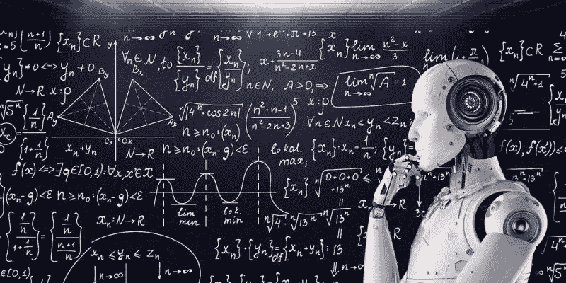

# 人工智能学校——未来的学校

> 原文：<https://pub.towardsai.net/ai-schools-the-schools-of-the-future-4a5f815da503?source=collection_archive---------0----------------------->

## 未来的学校，AI 学校| [走向 AI](https://towardsai.net)

技术正日益成为我们生活的一部分。想象一下，开车去一个没有卫星导航的新地方，在没有应用程序的情况下订购外卖，或者在没有谷歌快速搜索的情况下找到一个新的吃饭的地方。

现在想想你看不到的东西。当你问谷歌“为什么天空是蓝色的？”时，它是如何对找到的数十亿条结果进行排序的或者“迪拜在哪里？”(平均一个月搜索[16.5 万和 6.05 万次](https://keywordtool.io/blog/most-asked-questions/))？

当然，这个搜索只有 228.2 亿个结果。

# 那么这些和学校有什么关系呢？

等等，我还没到。

在小学，我一直喜欢数学(像所有的孩子一样，对吗？).我会在数学课上感到无聊，期待着下一个要学的话题(你能看出我是一个很酷的孩子吗？).但是我是**可怕的 爱尔兰人。我不能组成一个句子“作为盖尔格”来救我的命。**

我在一所小学校，所以我们班大约 20 人，最多 22 或 23 人。我们有一个老师试图教我们所有人 11 个科目。我们的老师尽她最大的努力去帮助那些在每一个科目上挣扎的学生跟上进度，尽管她很了不起，但那是永远不会发生的。我擅长数学，我的朋友为英语写了令人惊奇的小故事，每个人都有自己的主题。但是我从来没有掌握“班”和“班”的用法。而那个在数学上苦苦挣扎的家伙从未掌握代数的窍门。

# 这一切有什么意义吗？

是的，有。我知道，我要花点时间才能到达那里，但请听我说完。

23 个孩子，所有人都有不同的能力，所有人都在同样长的时间里学习同样的课程。一个人类教师只能制定这么多的教案，不能根据单个学生的能力定制问题。

人工智能可以。如果我们有一个可以为每个学生量身定制课程的系统会怎么样？老师仍然会带领一个班级，但是每个学生都会根据他们的水平被提问。这意味着努力学习的学生将有更多的机会练习一个主题的基础知识，以确保他们理解正在发生的事情。另一方面，快速掌握一个话题的学生将被给予更具挑战性的问题，以防止他们失去兴趣，让他们不断受到挑战，保持他们的参与。

# 好吧，听起来不错，但那是好几年以后的事了，对吧？

*错了。*

中国已经开始这样做，数千万学生已经以某种形式与人工智能互动。在中国，教育就像一项竞技运动，学生和家庭会寻找任何可能让他们比其他人稍有优势的东西。这是该走的路吗？

当西方专家就在课堂上使用人工智能的最佳实践展开辩论时，中国也加入了进来。教育科技公司创造了一个十亿美元的市场，希望成为学习的未来。

也许是我们抛弃“一刀切”教学模式的时候了。我们很久以前就接受了每个人都是不同的，每个人学习的方式都不同。那么为什么我们还在用同样的方式教每个人呢？

未来完全取决于我们如何教育下一代。AI 能帮忙吗？还是我们在技术接管之前就已经得到了？你怎么想呢?人工智能是教育的未来还是我们应该坚持我们所知道的？