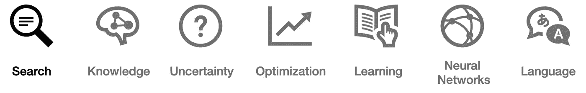

# 关于搜索算法的 27 个词，每个精通人工智能的领导者都必须知道

> 原文：<https://pub.towardsai.net/ai-search-e0cb610237f6?source=collection_archive---------0----------------------->

## 人工智能

## 你能解释这些吗？检验你的知识！



人工智能最终将改造的工作岗位数量是每个人的猜测。大多数预测，包括[德勤的](https://www2.deloitte.com/us/en/insights/focus/cognitive-technologies/ai-adoption-in-the-workforce.html)，在未来五到十年 *内，在***60%到 80%的范围内。****

对于这样的统计数据，世界经济论坛认为人工智能和机器学习是第四次工业进化。即使你仍然持怀疑态度，但很明显，人工智能对未来工作的影响是巨大的，而且迟早会到来。 ***足够的理由来准备和建立你的知识！***

> 为了保持相关性和有效性，即使是非技术领域的领导者也必须学会不仅管理定量分析师，还要管理算法。

了解 AI 的语言和概念只是第一步，但却是最本质的。为了让您有所了解，本文围绕 ***搜索简要定义了 ***的主要概念和术语*** 。*** 这个广阔的领域包括解决实际问题，例如路线导航和玩迷宫赛跑或象棋之类的游戏。

我会在以后的文章中涉及其他 AI 相关的话题，包括 [*知识*](https://medium.com/towards-artificial-intelligence/ai-knowledge-1020a00eb45d)[*不确定性*](https://medium.com/towards-artificial-intelligence/ai-uncertainty-4ac6810899ac)[*优化*](https://medium.com/towards-artificial-intelligence/ai-optimization-b8735dc09448)[*机器学习*](https://medium.com/towards-artificial-intelligence/ai-learning-2eaea82ee6d)[*神经网络*](https://medium.com/towards-artificial-intelligence/26-words-about-neural-networks-every-ai-neural-networks-1085bd972fd5)[*语言*](https://medium.com/towards-artificial-intelligence/ai-language-1d266caa72c6) 。

# 搜索

**算法:**为解决特定问题而设计的一系列步骤

**主体:**感知其环境并作用于该环境的实体

**状态:**代理及其环境的配置

**初始状态:**代理开始的状态

**动作:**在一种状态下可以做出的选择

**转换模型:**描述在任何状态下执行任何适用的动作会产生什么状态

**状态空间:**通过任何动作序列从初始状态可达到的所有状态的集合

**目标测试:**确定给定状态是否为目标状态的方法

**路径成本:**与给定路径相关的数字成本

**解决方案:**从初始状态到目标状态的一系列动作

**最优解:**所有解中路径成本最低的解

**节点:**跟踪状态、父节点(生成该节点的节点)、动作(应用于父节点以获得节点的动作)和路径成本(从初始状态到节点)的数据结构

**边界:**从一个开始节点开始的一组路径，包含初始状态

**深度优先搜索:**总是扩展边界中最深节点的搜索算法

**广度优先搜索:**总是扩展边界中最浅节点的搜索算法

**堆栈:**后进先出数据类型

**队列:**先进先出数据类型

**无信息搜索:**不使用特定问题知识的搜索策略

**知情搜索:**使用特定问题知识更有效地找到解决方案的搜索策略

**贪婪最佳优先搜索:**扩展最接近目标的节点的搜索算法，由启发式函数估计

**启发式函数:**一种提供关于目标方向(相邻节点)的有根据的猜测的方法

**a* search:** 展开具有最小值的节点的搜索算法

```
a(n) + e(g), where a(G) = cost to reach node, and 
  e(n) = estimated cost to goal
```

对抗性搜索:一种搜索，其他代理人计划对你不利，例如在游戏中

**实用程序:**终端状态的最终数值

**minimax:** 提供最优移动以最大化/最小化潜在结果的算法(有时称为 minimax、MM 或鞍点);例如用于决策理论、博弈论或统计学

**深度受限的极大极小值:**传统上无限制的极大极小值的受限版本

**评估函数:**从给定状态估计游戏的预期效用的函数

既然您已经能够解释最基本的搜索相关术语，那么希望您能够更轻松地自己进一步探索这些概念。

然而，如果不探索 ***其他剩余的关键主题*** ，包括 [*知识*](https://medium.com/towards-artificial-intelligence/ai-knowledge-1020a00eb45d)[*不确定性*](https://medium.com/towards-artificial-intelligence/ai-uncertainty-4ac6810899ac)[*优化*](https://medium.com/towards-artificial-intelligence/ai-optimization-b8735dc09448)[*学习*](https://medium.com/towards-artificial-intelligence/ai-learning-2eaea82ee6d)[*神经网络*](https://medium.com/towards-artificial-intelligence/26-words-about-neural-networks-every-ai-neural-networks-1085bd972fd5) 以及 [*语言*](https://medium.com/towards-artificial-intelligence/ai-language-1d266caa72c6)


我将在以后的文章中涉及所有这些领域。

***喜欢读什么？*** ***渴望了解更多？*** *跟我上* [*中*](https://medium.com/@yannique) *或*[*LinkedIn*](https://www.linkedin.com/in/yannique/)*。*

***关于作者:*** Yannique Hecht 作品在结合策略、客户洞察、数据、创新等领域。虽然他的职业生涯一直在航空、旅游、金融和技术行业，但他对管理充满热情。Yannique 专门开发 AI &机器学习产品商业化的策略。