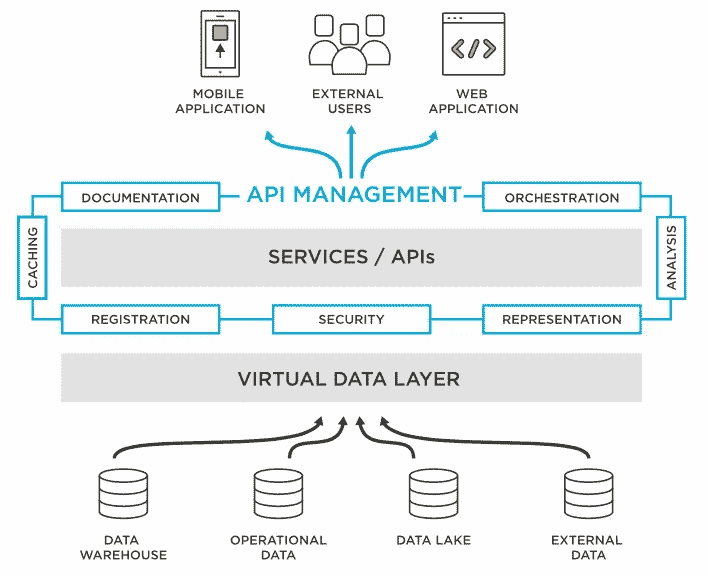
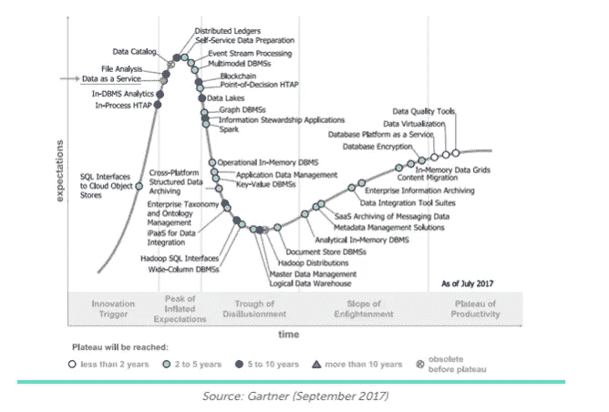
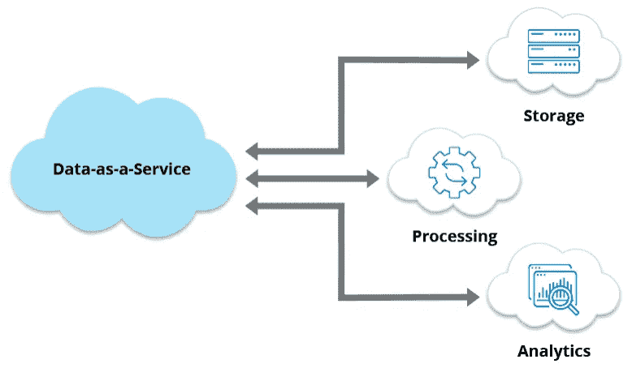
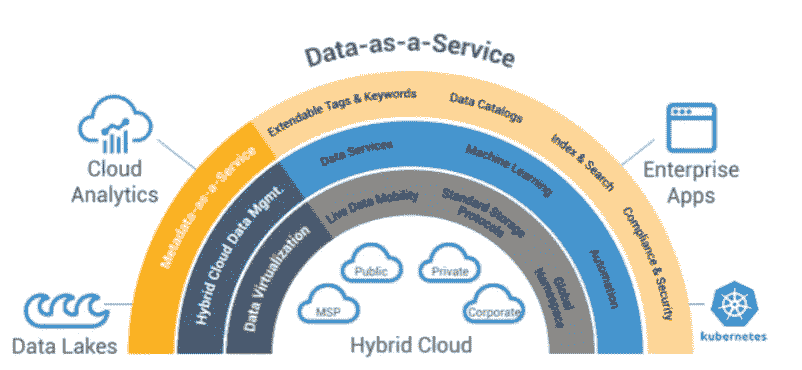
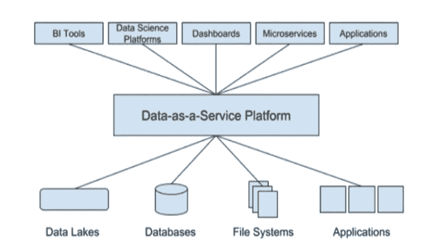

# AI 简化版:数据即服务和 9 个基本最佳实践

> 原文：<https://pub.towardsai.net/ai-simplified-data-as-a-service-and-9-essential-best-practices-86f93d7c4129?source=collection_archive---------3----------------------->

## 数据即服务的优势，以及使用案例、最佳实践和挑战

**By** [hobijist3d](https://unsplash.com/@hobijist3d) 来自 Unsplash

数据即服务指的是一种服务模型，在这种模型中，使用一个平台来管理、访问和交付数据，该平台可能由第三方提供商提供，或者已经作为组织内部使用的内部平台存在。

**在数据即服务模式中，数据存储在中央位置，授权用户可以通过基于 web 的界面访问数据[1]。数据可以是结构化的或非结构化的，可以来自内部或外部来源。**

参考文献:[2]

数据即服务模式提供了许多优势，包括能够从任何位置快速轻松地访问数据，根据需要扩展存储容量，以及与其他用户共享数据。此外，该模型有助于提高数据质量并降低与维护数据集相关的成本。

利用这种能力的一些机会包括以下能力:( 1)快速可靠地收集、存储和分析大量数据；(2)根据具体用户的需求定制信息；(3)全天候按需提供数据；(4)利用分析改进业务运营；以及(5)与其他系统集成数据。

参考文献:[3]

**数据即服务有什么好处？**

1.数据即服务可以提供比传统数据源更准确和最新的信息。例如，这种服务可以提供传统数据管理方法难以企及的高度灵活性和可伸缩性。由于云是提取、转换和加载数据的关键存储库，数据的服务方法可以更容易地从各种设备和位置访问数字内容(存储在云中)，从而实现更具移动性和协作性的工作方式。

参考:[4]

2.数据即服务可以实时更新，因此组织始终拥有最新的可用信息。通过将存储与计算分离，DaaS 可以更轻松地根据需要扩展或缩减处理能力，而无需配置或取消配置物理硬件。

参考文献:[5]

3.数据即服务可能比传统数据源更便宜，因为组织可以选择为他们需要和使用的数据付费。

4.这类服务的提供商通常提供各种工具和功能来进行数据分析和可视化，从而更容易从数据中获得洞察力。

5.DaaS 通过为存储敏感数据提供更加集中和可控的环境，有助于提高安全性和合规性。

参考:[6]

# **9 项最佳实践**

数据即服务的一些可能的最佳实践包括保持数据整洁有序、实施适当的安全措施、维持正常运行时间、提供用户支持以及开发对提供商和客户都有利的定价模式。考虑作为服务提供的数据类型以及服务的目标受众也很重要。

1.发展数据运营文化:确保使用和管理数据的人对数据分析和大数据实践有深刻的理解。交流什么是 dataOps 以及它与传统 it 有何不同的机会将为使用特定术语建立对数据团队目标的共同理解铺平道路。这种沟通的一部分是创造一种环境，在这种环境中，员工感觉他们可以自信地在团队中分享想法和见解。

2.自动化数据发现和管理流程:使用自动化工具帮助更快地查找、挖掘和分析数据。自动化可以通过使探索和分析洞察的过程更快、更容易、更一致(目标是更快、更容易地找到正确的数据)来改进数据发现。自动化数据发现还有助于识别数据中的模式和趋势，否则这些模式和趋势可能会被遗漏，从而有可能基于数据分析做出基于数据的决策。需要注意的是，自动化还有助于确保数据的准确性和一致性，这对于确保数据分析的质量非常重要。如果发现数据不准确或过时，这可能会影响从该数据得出的结论的准确性。

3.使用大数据分析工具:利用大数据分析工具获得使用传统方法无法获得的洞察力。利用它们的机会包括以下能力:( 1)识别否则无法检测到的模式和洞察力,( 2)查明组织运营中的弱点或机会，以及(3)预测未来趋势。通过将大数据分析与其他信息系统和分析工具相结合，组织可以以多种方式改善其决策和绩效。

作者 Pixabay

4.标准化您的数据管理平台:选择一个标准的数据管理平台，您的团队可以使用它以一致的方式处理您的所有数据源。

5.实施适当的安全措施，防止数据被未经授权的访问或更改。

6.培训用户如何使用数据以及如何对数据进行更改，以帮助他们有效和高效地使用数据。

7.可伸缩性设计:随着数据量和复杂性的增加，使用可伸缩数据作为服务可以帮助您的应用程序平稳运行。特定设计的一些机会可能包括:

—使用数组存储数据。数组提供了一种将相关数据分组在一起的方法，有助于扩展数据。

—使用可以根据需要增长和收缩的数据结构。一个好的可伸缩性数据结构可能是一个对象数组，这样就可以在不影响数据整体结构的情况下添加或删除项目。

—使用能够处理大量数据的数据库系统。数据库系统可能会提供像列存储[7]这样的特性，它允许你将数据分成小的部分，以便按顺序读取。

8.使用 RESTful API:当请求您的数据作为服务时，使用 RESTful API 使其他应用程序能够轻松访问您的数据并与之集成。从一开始，RESTful APIs 就比传统 API 更高效，因为它们减少了完成任务所需的 HTTP 请求数量。此外，通过提供一组可以使用各种编程语言访问的标准化端点，它们可以帮助简化开发过程。

9.使用复制和负载平衡:当数据开始变得活跃并被大量使用时，确保您有一个部署和扩展数据即服务的策略。复制和负载平衡有助于确保您的数据随时随地可用。为了达到这样的访问级别，负载平衡有助于将数据库的负载分布在多个服务器上，这样就不会将负载放在应用程序或网段中的任何一个服务器上。目标是复制可以帮助确保不同系统之间的数据保持一致，负载平衡可以帮助将应用程序的负载均匀地分布在多个系统上。

**五种方法的简化视图:**

1.尽可能使用标准和开放协议

2.高可用性设计

3.使用复制和流式传输跨多个节点分发数据

4.利用服务级别协议(SLA)

5.以计算机程序可读的格式存储数据

来自 Pixabay

# **4 个用例**

1.团队的知识管理:最终用户可能需要能够及时访问正确的数据，以便做出明智的决策。他们可以将数据作为服务来访问他们需要的数据，而不必在不同的来源中搜寻。

2.法规遵从性:企业需要了解所有适用的法规，并能够遵守这些法规。他们可以将数据作为一种服务，以方便、及时的方式访问所需的数据。

3.预测分析:组织可以对未来趋势做出明智的决策，他们可以使用预测分析来做到这一点。数据即服务可以让他们访问大量相关数据。

4.客户分析:当需要了解客户群以设计和提供最好的产品和服务时。使用数据即服务，组织可以描述他们的客户，以了解他们的购买习惯和偏好。

# **五大挑战**

1.跨不同的应用程序和数据中心创建一致的数据环境(无论数据以何种方式存储在何处)。

2.快速准确地管理和清理大量数据。

3.鼓励组织内数据治理态势的透明度和问责制。

4.在将数据用于创新或决策时，平衡隐私需求与开放需求。

5.确保数据始终可以访问和使用，以便为业务决策提供新的见解。

如果您对进一步扩展此主题有任何编辑/修订建议或建议，请考虑与我分享您的想法。

# **另外，请考虑订阅我的每周通讯:**

 [## 周日报道#1

### 设计思维与人工智能的共生关系设计思维能向人工智能揭示什么，以及人工智能如何拥抱……

pventures.substack.com](https://pventures.substack.com/) 

# **我曾写过以下与此有关的帖子；它们可能与您的兴趣相似:**

 [## 大数据直观指南:10 种差异与数据和技术

### 了解数据和大数据之间的 10 个区别，大数据实施过程中采取的 4 个高级步骤…

pub.towardsai.net](/visual-guide-to-big-data-10-differences-vs-data-and-technologies-7bd8b27ba87) 

***参考。***

*1 .版本控制管理。(n.d .)。MasterControl。检索日期:2022-07-18，摘自*[*https://www . master control . com/quality/document-control-software/version-control/*](https://www.mastercontrol.com/quality/document-control-software/version-control/)

*2 .什么是数据即服务(DaaS)？(n.d .)。TIBCO 软件公司。检索日期:2022-07-18，摘自*[*https://www . tibco . com/reference-center/what-is-data-as-as-as-a-service*](https://www.tibco.com/reference-center/what-is-data-as-a-service-daas)

*3 .b . b . Greene(2018 年 6 月 25 日)。数据即服务:什么、为什么、如何、谁、何时。RocketSource。*[https://www.rocketsource.co/blog/data-as-a-service/](https://www.rocketsource.co/blog/data-as-a-service/)

*4 .哈泽尔德明。(2020 年 4 月 7 日)。数据即服务。Hazelcast。*[https://hazelcast.com/glossary/data-as-a-service/](https://hazelcast.com/glossary/data-as-a-service/)

*5 .Burt，J. (2019 年 7 月 8 日)。混合式多云端环境中的资料即服务。下一个平台。*[*https://www . next platform . com/2019/07/08/数据即服务混合多音世界/*](https://www.nextplatform.com/2019/07/08/data-as-a-service-in-a-hybrid-multicloud-world/)

*6。Dragos_v. (2020 年 10 月 13 日)。数据即服务(DaaS)-简介。华为企业支持社区。*[*https://forum . Huawei . com/enterprise/en/data-as-a-service-daas-an-introduction/thread/661393-893*](https://forum.huawei.com/enterprise/en/data-as-a-service-daas-an-introduction/thread/661393-893)

*7。柱状存储。(未注明)。亚马逊红移。2022 年 7 月 18 日检索，来自*[*https://docs . AWS . Amazon . com/redshift/latest/DG/c _ column _ storage _ disk _ mem _ MGM nt . html*](https://docs.aws.amazon.com/redshift/latest/dg/c_columnar_storage_disk_mem_mgmnt.html)