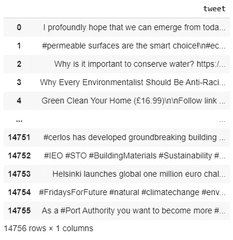
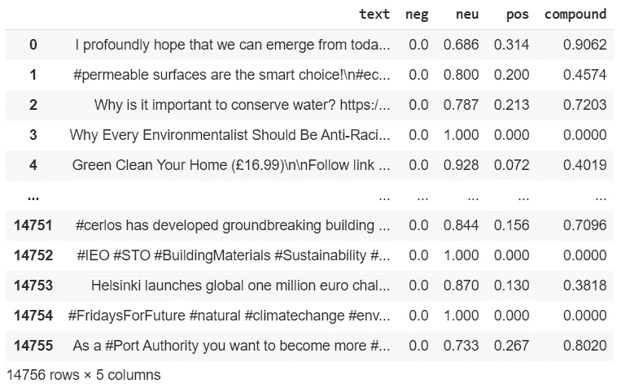

# AI，可持续发展推文:使用预先训练的模型进行情绪分析

> 原文：<https://pub.towardsai.net/ai-sustainability-tweets-sentiment-analysis-using-pre-trained-models-8669f8ba70ed?source=collection_archive---------0----------------------->

## [自然语言处理](https://towardsai.net/p/category/nlp)

## 完整的代码[可在我的 Github 回购](https://github.com/arditoibryan/Projects/tree/master/20200609_Sustainability_Sentiment_Analysis)


【https://gurushots.com/michelangiolo.mazzeschi/photos 

在过去的几天里，我一直在关注 NLP 的潜力，特别是进行情感分析:

*   [在推特上](https://medium.com/towards-artificial-intelligence/sentiment-analysis-on-tweets-with-nlp-achieving-96-accuracy-8b63f0bcee99)
*   [关于电影](https://medium.com/towards-artificial-intelligence/sentiment-analysis-on-movie-reviews-with-nlp-achieving-95-accuracy-91eef597e0f7)

到目前为止，我已经在我拥有的数据集的一部分上执行了模型的训练(基本上是为了标准实践)。然而，NLP 是如此庞大和复杂，以至于要在人类语言上表现良好，它需要在比 10k 标签样本更大的数据集上训练。

## 预训练模型

现代机器学习库不仅提供从头创建模型的工具。他们还为特定用途提供了大量的模型。在这个具体的例子中，我将挖掘包含以下标签的 15k 条推文:#sustainable 和#sustainability。

# 步伐

1.  采矿推特
2.  导入模块
3.  预处理
4.  预训练模型
5.  情感分析
6.  看看结果

# 1.采矿推特

## 特温特

twint 是 python 的官方模块，在时间和容量方面没有官方 Twitter API 的限制。

* * *使用该工具时要小心，因为你可能会违反 Twitter 服务条款。我会明智地使用它，在指定的时间限制内只下载最小量(仅 15，000 条推文)，以遵守服务条款。

```
!pip3 install twintimport twint#configure
c = twint.Config()
c.Search = '#sustainable', '#sustainability'
c.Store_csv = True
c.Limit = 10000 #appears not to be working
c.Output = "data.csv"
```

在设置了研究的主要参数之后，我可以调用配置并开始将 tweets 存储在 data.csv 数据集中。

```
# Run
twint.run.Search(c)
```

# 2.导入模块

## nltk

我现在需要为 NLP 选择一个库。由于它的灵活性和优点，我将使用 nltk。

```
!pip install nltk
import nltk
nltk.download('punkt')
```

# 3.预处理

## 推特数据集

* * *出于隐私原因，我从数据集中删除了推文、姓名和用户名的链接。默认情况下，您可以使用 twint 下载它们。

```
import pandas as pd
total = pd.read_csv('/content/data.csv')
total = pd.DataFrame(total['tweet'])
total
```



推特数据集的样本

# 4.预训练模型

有一个巨大的模型库，你可以通过这个链接下载特定的 NLP 问题。查列表，最适应我要解决的问题的模型叫做 **VADER 情感词典**，标识为**维德 _ 词典** id。

```
#nltk.download()
import nltk
nltk.download('vader_lexicon')from nltk.sentiment.vader import SentimentIntensityAnalyzer
sid = SentimentIntensityAnalyzer()
```

让我运行一个例子来展示情感分析的输出:

```
sid.polarity_scores('you are hateful')
{'compound': -0.4939, 'neg': 0.615, 'neu': 0.385, 'pos': 0.0}
```

‘你是可恨的’这句话被给了一个负值，分值为-.49。到目前为止，我已经评估了模型的有效性(可以这么说)。

```
def dict_converter(dict1):
  dictlist = list()
  for key, value in dict1.items():
    temp = [key,value]
    dictlist.append(temp)
  return dictlist#example
dict_converter({'neg': 0.0, 'neu': 1.0, 'pos': 0.0, 'compound': 0.0})
```

因为输出将是一个字典，我需要使用上面的函数将它转换成一个列表。

# 5.情感分析

我有我需要的一切:数据和一个训练有素的模型。对于数据集中的每条推文，我会在右边的栏中附上情感分析得分。然后，我将把结果列表转换成熊猫数据帧。

```
tweets = list()
for g in total['tweet']:
  dict_res = dict_converter(sid.polarity_scores(g))
  #nltk.sentiment.util.demo_vader_instance(_)
  tweets.append([g, dict_res[0][1], dict_res[1][1], dict_res[2][1], dict_res[3][1]])
import pandas as pd
tweets = pd.DataFrame(tweets)
tweets.columns = ['text', 'neg', 'neu', 'pos', 'compound']
tweets
```



完整数据集的样本

现在我已经执行了分析，不幸的是，我没有办法评估模型的性能，因为我的所有数据从一开始就没有标记。

```
tweets.shape
(14756, 5)
```

## 消除重复

```
tweets = tweets.drop_duplicates()
tweets.shape
(6582, 5)
```

我现在将从最积极到最消极对推文进行评分。我可以看到熊猫的结果，但我也可以下载我的数据集并用 Excel 打开它:

```
tweets = tweets.sort_values(['compound'], ascending=False)
tweets.to_csv('tweets.csv')
```

# 6.看看结果

我进行的情感分析无法让我了解人们是支持还是反对可持续发展(如果他们使用#可持续发展标签，我们可以假设发推文的人是支持它的)，但它让我们能够识别写推文时使用的语气。一些人可能会以积极的方式回应可持续发展的号召，而另一些人可能会觉得表达自己的愤怒是表达意见的最佳选择。

## 正面和负面的推文

数据的分数范围在[-.88，. 97]内，其中-1 表示非常负面，0 表示中性，+1 表示非常正面。


* * *鉴于一些推文的侮辱性质，我不希望使用图片。它们是随机选择的，因此我无法指责或控制我正在下载的内容。

该数据集总共统计了 6583 条推文:

*   3184 条正面推文
*   2938 条中性推文
*   461 条负面推文

我们可以推断，写可持续发展的人对它持积极态度。

# 例子

我选择了分布两端的两条推文向大家展示:

## 正面推文:. 96

希望倡导可持续发展协会全体成员祝您地球日快乐！多么美好的一天来庆祝我们这个美丽的星球。#可持续发展#地球日 2020 #可持续发展#户外#户外#地球日# HC _ Green @ hopephisplant @ HopeCollegeSAC '

## 负面推文:-.78

200 年来，我们一直在征服自然。现在我们要把它打死。——汤姆·麦克米兰