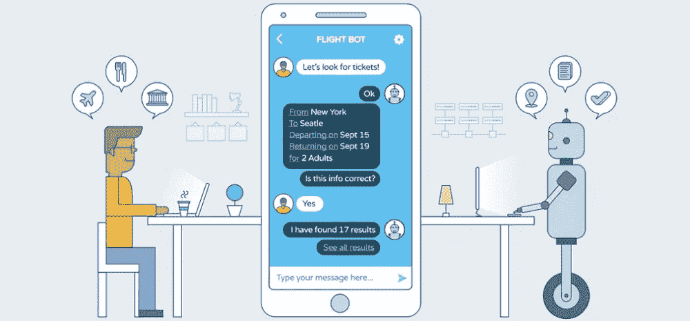
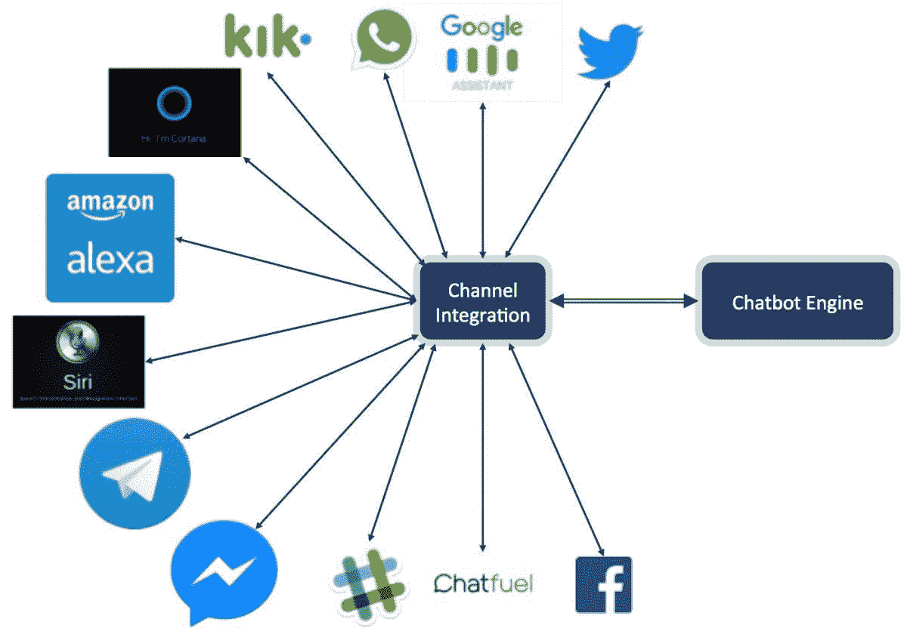

# AI 助教，一种可能还是一种必要？

> 原文：<https://pub.towardsai.net/ai-teaching-assistants-a-possibility-or-a-necessity-e0e2b1887ead?source=collection_archive---------0----------------------->

任何一个学生都可以告诉你一次(通常是几次)他们试图在办公时间找到一位讲师，但没有成功，或者是他们上学期发了一封电子邮件，其中有一个问题至今没有得到回复。

任何一位讲师都可以告诉你，他们的收件箱里塞满了关于课程材料或即将到来的考试的问题，或者学生们正在寻找一些考试提示。

随着近年来高等教育机构新生人数的增加(至少在爱尔兰)，这个问题变得越来越严重。很长一段时间以来，讲师们一直试图通过雇佣助教、导师和实验室演示人员来应对这种增长，但这种做法是不可扩展的。值得记住的是，这些人通常也是学生。那些不得不忙于自己的工作而不能全年全力以赴帮助学生的学生。

## 这有什么大不了的？

按照大多数学位的结构，学生通常每学期学习 6 个模块，或者每年 12 个模块。比方说，即使只有一半的学校的老师没有时间在课堂上回答最基本的问题，这也会让学生在课外的大部分时间都花在寻找如何布置作业等信息上，而不是实际做作业或学习。

## 那么我到底在暗示什么呢？

不会改变生活，我保证。但还是很有用。

在这一点上，我们都习惯了生活中的数字助理，聊天机器人无处不在。语音助手中有像 Alexa 和 Google Home 这样的大牌(Cortana 从未真正在 Windows 中脱颖而出)，几乎所有东西都有聊天机器人； [HealthTap](https://play.google.com/store/apps/details?id=com.healthtap.userhtexpress&hl=en) 回答用户的医疗问题， [Hipmunk](https://www.hipmunk.com/) 让人们通过 Messenger 预订航班、酒店等，然后还有 [InsomnoBot 3000](http://insomnobot3000.com/) 在失眠者晚上醒着的时候陪伴他们。那么，说我们可以用它来做助教是不是有点夸张？

想象一下对简单的学生问题的即时回复，这可以为每个相关人员节省时间。讲师可以花更多的时间来回答更难、更复杂的问题，而不会让其他人没有答案。学生可以完成更多的工作，因为他们不需要等待别人来帮助他们解决阻碍他们的小问题。

# 可行性

我能听到你说“听起来不错，Ryan，这很难做到吗？”

谢谢读者，不，这不会太难。实际上，这取决于你想让它变得多复杂。对于一个简单的聊天机器人来说，创建它足够简单。有了甲骨文的数字助理，你可以在一个小时内构建一个基本的数字助理，并在不长的时间内构建一个更复杂的数字助理。

你又开始问问题了，“但是你怎么让它工作呢？”

现在你会明白我提到甲骨文数字助理的原因；它专为简单灵活的集成而构建。它已经与消息应用程序兼容，所以你可以让你的机器人通过 Facebook Messenger(大多数学生已经有了)进行交互，完全没有麻烦。以及获取分配信息？大多数大学使用某种形式的虚拟教室给学生布置作业和做笔记。假设你的大学和我的一样，使用 [Moodle](http://bit.ly/moodleLink) ，它是完全开源的，所以你可以用它从所有在线信息中创建一个集成系统。如果你的学院使用谷歌教室怎么办？这还不成问题，谷歌教室有一个[公开可用的 API](http://bit.ly/classroomAPI) ，专门用于这种类型的集成和开发。

使用甲骨文数字助理的另一个巨大优势是它已经内置了自然语言处理(NLP)。这意味着您可以在虚拟教室中设置一些您希望被问到的基本问题，然后让 Oracle 处理理解学生实际使用的短语这一非常复杂的工作。NLP 允许系统理解单词和句子的意思，以获得所提问题的实际意思，这项任务对于计算机来说一直很难完成，但对于与人类互动来说非常重要，因为我们并不总是以完全相同的方式表达事物。

例如，带有聊天机器人的 NLP 在理想情况下能够告诉消息“我接下来有什么任务？”、“告诉我什么快到期了”和“我有任务吗？”应该都返回同样的东西:一份作业清单和它们的截止日期。

# 主观因素

我可以看到许多人对这种数字教学助手的一个问题是，它可能会夺走讲师对有需要的学生的个人关注。这是一种可以理解的担忧，因为缺乏与讲师和导师的个人关系是学生辍学的主要原因之一。尽管这是一种可以理解的担忧，但这种担忧是未经证实的。

通过消除讲师需要帮助学生解决的许多更小、更平凡的问题，你将腾出讲师的大量时间来与那些有风险的学生互动并帮助他们。不要试图分散他们的注意力，他们可以确保那些真正需要帮助和个人因素的人得到帮助。

## 总之——这是个好主意！

本质上，通过使用数字教学助手，第三级教育系统中的所有各方都受益。有简单查询的学生得到更快的(或者甚至仅仅是 *any* )响应；有更棘手问题的学生从讲师/导师那里得到更多的关注，他们有更多的时间给他们；导师可以帮助学生，用腾出的新时间平衡他们自己的工作；讲师可以致力于帮助学生解决更棘手的问题和他们的研究，而不是不断地回答平凡的，重复的问题；该机构本身受益于不必雇用越来越多的导师和他们的讲师有更好的工作满意度。一场真正的全面胜利。

如果你想尝试一下，或者你认为你可能已经得到了另一个伟大想法的灵感，看看甲骨文的免费试用[就在这里](https://bit.ly/OCI_Trial)。

**所有观点均为本人观点，不代表甲骨文**