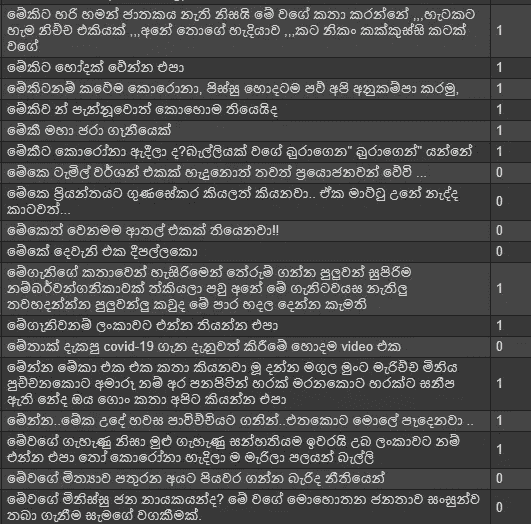
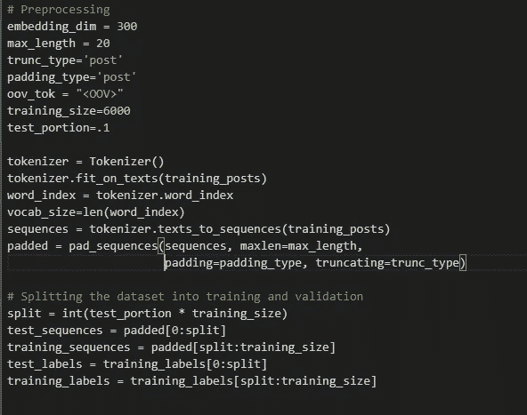
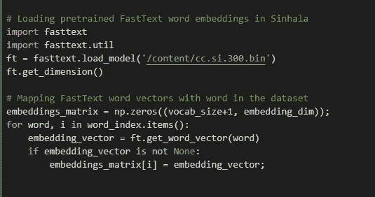
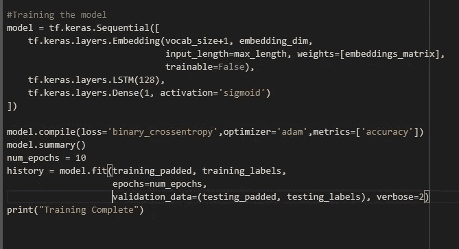
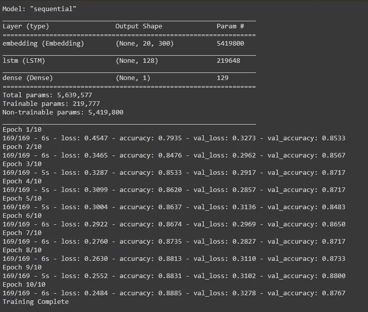
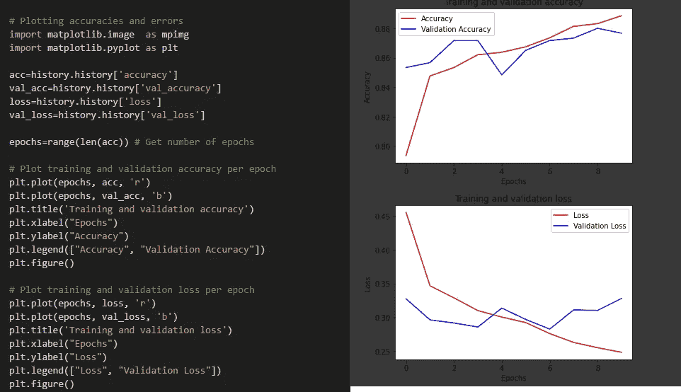
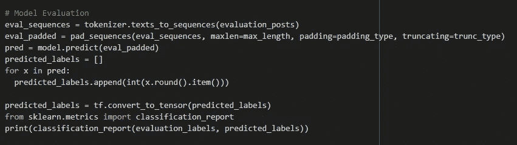
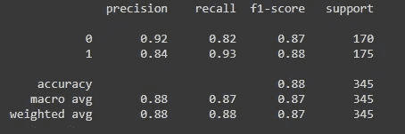
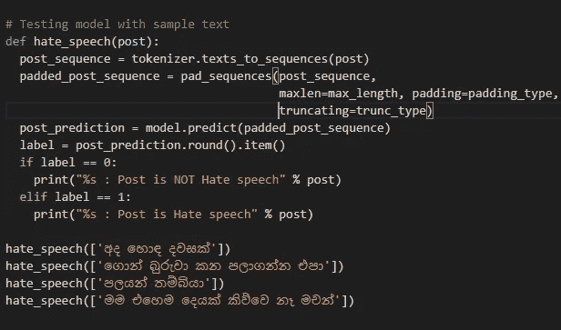
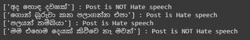

# 人工智能检测社交媒体上与仇恨言论相关的僧伽罗语评论

> 原文：<https://pub.towardsai.net/ai-to-detect-hate-speech-related-sinhala-comments-in-social-media-b94196744eec?source=collection_archive---------3----------------------->

## [深度学习](https://towardsai.net/p/category/machine-learning/deep-learning)

## 使用深度学习模型检测社交媒体上的僧伽罗语仇恨言论

社交媒体让我们能够实时分享信息。随着数字文化的兴起，社交媒体的使用不断增加。据统计，斯里兰卡的社交媒体用户约为 640 万，约占人口的 30%。社交媒体上的仇恨言论，如辱骂、侮辱和仇恨评论，导致了社会暴力的增加。因此，需要一种机制来检测社交媒体平台上的僧伽罗语仇恨言论。

来源:https://datareportal.com/reports/digital-2020-sri-lanka

深度学习是一种模仿人脑功能的人工智能(AI)功能。深度学习技术在解决复杂问题方面已经变得非常流行。在这些技术的帮助下，有可能检测社交媒体平台上的僧伽罗仇恨言论。像长短期记忆(LSTM)这样的深度学习技术可以用于自然语言处理(NLP)应用，如仇恨言论检测。LSTM 是一种专门的神经网络架构，可以捕捉文本等顺序数据中的长期依赖关系。LSTM 可以长时间记忆以前的输入。LSTM 单元中有 3 个门(输入、输出和遗忘门)。LSTM 的记忆操作是通过这些门完成的。长短期记忆(LSTM)利用门来控制递归网络记忆中的梯度传播。

社交媒体帖子的语义对于确定是否是仇恨言论相关评论非常重要。为了捕捉语义，可以使用像 FastText 这样的单词嵌入技术。当使用单词嵌入时，每个单词都表示在一个向量空间中。这些单词向量捕捉了关于一种语言的隐藏信息，比如单词类比或语义。因此，它可以用来提高文本分类器的性能。FateText 是脸书提出的 Word2Vec 的扩展。他们已经在僧伽罗语中发布了经过训练的 FastText 单词嵌入。(【https://fasttext.cc/docs/en/crawl-vectors.html】T4)。这些预训练的单词嵌入可以用于特征提取。

在本文中，我将展示如何使用带有僧伽罗语单词嵌入的 LSTM 算法来检测社交媒体平台上与僧伽罗语仇恨言论相关的评论。Tensorflow 用于实现深度学习模型。

## 步骤 1:加载和拆分数据集

作为训练深度学习模型的数据源，使用了 Kaggle 上发表的僧伽罗文 Unicode 仇恨言论数据集(6345 条脸书评论)。([https://www . ka ggle . com/sahanjayasuriya/Sinhala-unicode-hate-speech](https://www.kaggle.com/sahanjayasuriya/sinhala-unicode-hate-speech))

首先，数据集被加载并拆分为模型训练阶段的 6000 和模型评估阶段的 345。以下是数据集的示例。

数据集样本(1 =仇恨言论，0 =非仇恨言论)

## 第二步:预处理

在预处理阶段，使用标记化(将评论分成单词标记)和填充对僧伽罗语的 facebook 评论进行预处理。6000 条评论的数据集被进一步划分为训练和验证部分(90%用于训练，10%用于验证)。僧伽罗语词汇也是使用记号赋予器创建的。

## 步骤 3:快速文本单词向量(特征表示)

快速文本单词嵌入被用作特征提取技术。下一步是加载预先训练的嵌入僧伽罗语的 FastText 单词，并用单词向量映射创建的单词词汇表。预先训练的 FastText 僧伽罗语单词嵌入可以在以下位置找到:[https://dl . fbaipublicfiles . com/fast text/vectors-crawl/cc . si . 300 . vec . gz](https://dl.fbaipublicfiles.com/fasttext/vectors-crawl/cc.si.300.vec.gz)

## 步骤 4:使用 LSTM 算法训练模型

下一个阶段是建立深度学习模型。LSTM，这是一个专门的递归神经网络(RNN)架构，是用来建立模型。模型的第一层是单词嵌入层。对于该层，使用 300 维的预训练僧伽罗语单词嵌入。下一层是由 128 个细胞组成的 LSTM 层。作为最后一层，使用具有 s 形激活函数的致密层。使用二值交叉熵作为损失函数来训练模型。

该模型经过 10 个历元的训练，在训练结束时，达到了 88.9%的训练准确率和 87.7%的验证准确率。这意味着经过训练的深度学习模型能够准确检测僧伽罗语中的仇恨言论。

接下来，使用图表绘制训练阶段的精度和损耗。Matplotlib 用于此。

## 第五步:模型评估

接下来，使用 345 条脸书评论的评估数据集来评估该模型。使用精确度、召回率、F1 分数和准确度来评估模型的性能。经过训练的模型在评估数据集上准确地执行，准确率为 88%。

混淆矩阵

为了进一步评估模型的性能，使用样本文本对样本进行了测试。

上述代码的结果

经过训练的深度学习模型能够准确区分僧伽罗语中的仇恨言论评论。这意味着当确定复杂的分类边界时 LSTM 的效率，以及当捕获单词的语义时单词嵌入技术的效率。从结果可以得出结论，经过训练的深度学习模型是检测僧伽罗语中与仇恨言论相关的社交媒体评论的准确方法。

完整的源代码可在:[https://github.com/santhoopa/hate_speech_sinhala](https://github.com/santhoopa/hate_speech_sinhala)获得

## 参考

【https://www . ka ggle . com/sahanjayasuriya/Sinhala-unicode-hate-speech
https://fasttext.cc/docs/en/crawl-vectors.html
[https://www . research gate . net/publication/2562741 _ Long _ Short _ Term _ Memory _ in _ Recurrent _ Neural _ Networks](https://www.researchgate.net/publication/2562741_Long_Short-Term_Memory_in_Recurrent_Neural_Networks)[https://www.investopedia.com/terms/d/deep-learning.asp](https://www.investopedia.com/terms/d/deep-learning.asp)
[https://datareportal.com/reports/digital-2020-sri-lanka](https://datareportal.com/reports/digital-2020-sri-lanka)