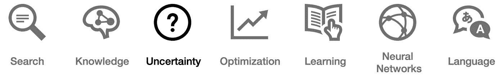

# 关于不确定性的 35 个词，每个精通人工智能的领导者都必须知道

> 原文：<https://pub.towardsai.net/ai-uncertainty-4ac6810899ac?source=collection_archive---------2----------------------->

## 人工智能

## 你能解释这些吗？检验你的知识！


*【这是* ***系列*** *的第 3 部。继续之前，请确保您阅读了关于* [*搜索*](https://medium.com/towards-artificial-intelligence/ai-search-e0cb610237f6) *和* [*知识*](https://medium.com/towards-artificial-intelligence/ai-knowledge-1020a00eb45d) *。未来课题包括* [*优化*](https://medium.com/towards-artificial-intelligence/ai-optimization-b8735dc09448)*[*机器学习*](https://medium.com/towards-artificial-intelligence/ai-learning-2eaea82ee6d)*[*神经网络*](https://medium.com/towards-artificial-intelligence/26-words-about-neural-networks-every-ai-neural-networks-1085bd972fd5) *，以及* [*语言*](https://medium.com/towards-artificial-intelligence/ai-language-1d266caa72c6) *。】***

****

*****围绕人工智能的不确定性是双重的*。****

*****首先*** ，对于如何实际应用 AI，我们还是知之甚少。*哪些技术最适合解决哪些问题？* *价值链的哪些部分从 AI 中受益最大？哪些技术技能在五年内是相关的？***

**为了获得这三个问题的潜在答案的初步想法，考虑跟随这个[麦肯锡资源](https://www.mckinsey.com/business-functions/organization/our-insights/the-organization-blog/embrace-the-uncertainty-of-ai)中的兔子洞。**

*****其次*** ，计算机经常要处理不完美、不完整、甚至不确定的信息。这种约束要求人工智能只能以一定的概率“相信”某事。这就是我们关心的 ***不确定性*** 的类型。为了让您入门，本文简要定义了 ***的主要概念和术语。*****

# **不确定**

**不确定性:涉及不完善或未知信息的情况**

**概率:对一个事件发生的可能性或一个命题为真的数值描述**

****可能世界:**给定一种情况下可能发生的事件，例如，掷骰子得到‘1’；用字母表示:**

```
**ω**
```

****所有可能世界的集合:**所有可能世界的组合，加起来等于一；例如，当掷骰子时得到‘1、2、3、4、5 或 6’；用字母表示:**

```
**Ω
P(ω)**
```

****可能性范围:**‘0’表示某事件肯定不会发生，而‘1’表示某事件绝对会发生，记为:**

```
**0 ≤ P(ω) ≤ 1**
```

****无条件概率:**在没有任何其他证据的情况下，对一个命题的相信程度**

****条件概率:**在给定一些已经揭示的证据的情况下，对一个命题的相信程度；给定“昨天下雨”的情况下，“今天下雨”的概率:**

```
**P(a|b) (probability of a given b), 
P(rain today|rain yesterday)P(a|b)     =   [P(a ∧ b)] / P(b)
P(a ∧ b)   =   P(b) P(a|b)
P(a ∧ b)   =   P(a) P(b|a)**
```

****随机变量:**概率理论中的一个变量，有一个可能取值的范围，例如:**

```
**Weather
{sun, cloud, rain, wind, snow}**
```

****概率分布:**提供不同可能结果发生概率的数学函数，例如:**

```
**P(Flight = on time)   =  0.6 
P(Flight = delayed)   =  0.3 
P(Flight = cancelled) =  0.1or:P(Flight) = ⟨0.6, 0.3, 0.1⟩**
```

****独立性:**知道一个事件发生并不影响另一个事件的概率**

```
**P(a ∧ b) = P(a)P(b|a) or
P(a ∧ b) = P(a)P(b)**
```

****贝叶斯法则:**(或称贝叶斯定理)概率论中最重要的法则之一，描述一个事件发生的概率，以可能相关的条件的先验知识为基础:**

```
**P(b|a) = [P(b) P(a|b)] / P(a)**
```

**因此，知道…**

```
**P(cloudy morning | rainy afternoon)**
```

**…我们可以计算:**

```
**P(rainy afternoon | cloudy morning)
P(rain|clouds) = [ P(clouds|rain)P(rain) ] / P(clouds)**
```

****联合概率:**两件事同时发生的可能性**

```
**P(a,b) = P(a) * P(9)**
```

****概率规则:**一些用于计算不同概率的代数运算，包括否定、包含-排斥、边缘化或条件作用**

****否定:**一个简便的概率规则，用来计算一个事件不发生的概率，例如:**

```
**P(¬cloud) = 1 − P(cloud)**
```

****包含-排除:**另一个概率规则，它排除了计算事件 a 或 b 的概率的重复计算:**

```
**P(a ∨ b) = P(a) + P(b) − P(a ∧ b)**
```

****边缘化:**一个非常有用的概率规则(更多细节[此处](https://towardsdatascience.com/probability-concepts-explained-marginalisation-2296846344fc)作者 [Jonny Brooks-Bartlett](https://medium.com/u/c6ab8048de41?source=post_page-----4ac6810899ac--------------------------------)**

```
**P(a) = P(a, b) + P(a, ¬b)**
```

****条件作用:**我们的最终概率规则，意味着如果我们有两个事件(a 和 b)，我们可以访问它们的条件概率，而不是它们的联合概率:**

```
**P(a) = P(a|b)P(b) + P(a|¬b)P(¬b)**
```

****贝叶斯网络:**一种表示随机变量之间依赖关系的数据结构**

****推断:**使用数据分析来推断潜在概率分布特性的过程**

****查询:**要计算其分布的变量**

****证据变量:**事件 e 的观察变量**

****隐藏变量:**非证据，非查询变量**

****枚举推理:**给定联合分布和条件概率，求解推理查询的过程**

****近似推断:**估计解的系统迭代方法，如蒙特卡罗模拟**

****抽样:**一种使用各种概率方法从大量人口中选择样本的技术**

****拒绝抽样:**(或接受-拒绝法)从给定的分布中产生观察值的基本技术**

****似然加权:**重要性抽样的一种形式，按照预先定义的顺序对各种变量进行抽样，并使用证据来更新权重**

****马尔可夫假设:**当前状态只依赖于有限固定数量的先前状态的假设**

****马尔可夫链:**随机变量序列，其中每个变量的分布遵循马尔可夫假设**

****隐马尔可夫模型:**一个系统的马尔可夫模型，该系统具有生成一些观察到的事件的隐藏状态**

****传感器马尔可夫假设:**假设证据变量只依赖于相应的状态**

****滤波:**概率信息的实际应用:给定从开始到现在的观测值，计算出*当前状态*的分布**

****预测:**概率信息的一个实际应用:给定从开始到现在的观测值，计算一个*未来状态*的分布**

****平滑:**概率信息的实际应用:给定从开始到现在的观测值，计算*过去状态*的分布**

****最可能的解释:**概率信息的一个实际应用:给定从开始到现在的观测值，计算最可能的状态序列**

> **"在掌握和应用人工智能的道路上，有一件事是肯定的:不确定性."**

**既然你已经能够解释最基本的*不确定性*相关术语，你就有希望更加自如地独自探索这些概念。**

**这使你进入了成为一名成熟的人工智能领导者的第三阶段。探索 ***类似 AI 相关话题*** ，包括 [*搜索*](https://medium.com/towards-artificial-intelligence/ai-search-e0cb610237f6)[*知识*](https://medium.com/towards-artificial-intelligence/ai-knowledge-1020a00eb45d)[*优化*](https://medium.com/towards-artificial-intelligence/ai-optimization-b8735dc09448)[*机器学习*](https://medium.com/towards-artificial-intelligence/ai-learning-2eaea82ee6d)[*神经网络*](https://medium.com/towards-artificial-intelligence/26-words-about-neural-networks-every-ai-neural-networks-1085bd972fd5)[*语言*](https://medium.com/towards-artificial-intelligence/ai-language-1d266caa72c6) 。**

****

*****喜欢读什么？*** ***渴望了解更多？*** *跟我上* [*中*](https://medium.com/@yannique) *或*[*LinkedIn*](https://www.linkedin.com/in/yannique/)*。***

*****关于作者:*** Yannique Hecht 作品在结合策略、客户洞察、数据、创新等领域。虽然他的职业生涯一直在航空、旅游、金融和技术行业，但他对管理充满热情。Yannique 专门开发 AI &机器学习产品商业化的策略。**