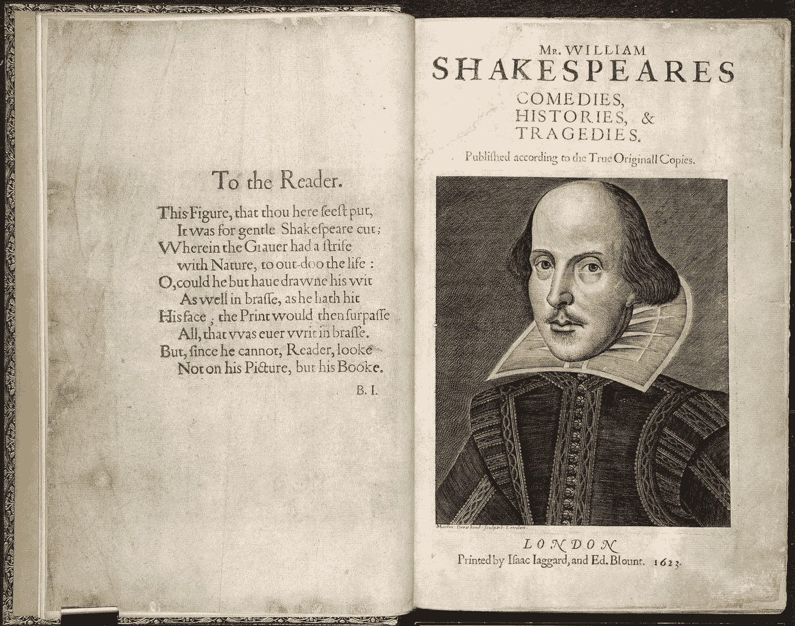
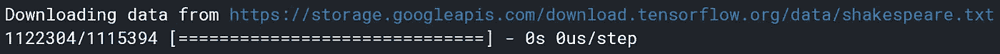
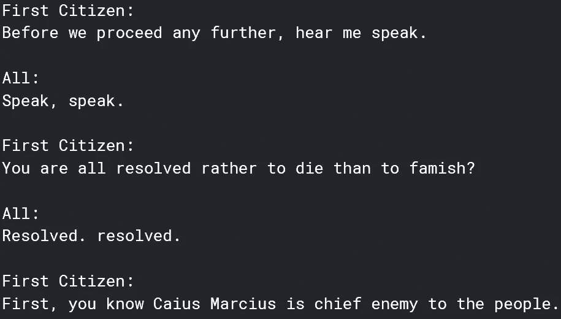
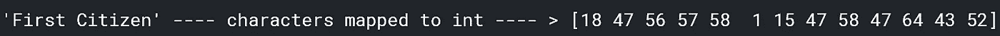

# 艾写莎士比亚的戏剧

> 原文：<https://pub.towardsai.net/ai-writes-shakespearean-plays-e0d5f30c16b2?source=collection_archive---------0----------------------->



[来源](https://vitadamuseo.files.wordpress.com/2016/03/shakespeare-fisrt-folio-1623-british-library.jpg)。图像免费共享和商业使用。

## 训练一个递归神经网络来模仿莎士比亚

> 弗洛里泽尔:
> 她应该跪下吗？
> 在不得泣受；把我
> 和不尊敬的问候比住在，你，
> 看着我，在天堂的儿子。

谁写的，莎士比亚还是机器学习模型？

如果你回答了前者就不会被指责了！上面这段话是一个用 TensorFlow 训练的递归神经网络的产物，经过 30 个历元的训练，给了一个‘flori zel:’的种子在这篇文章中，我将解释并给出代码，告诉你如何训练一个机器神经网络来写莎士比亚的戏剧或任何你想让它写的东西！

# 导入和数据

首先，导入一些基本库:

```
import tensorflow as tf
import numpy as np
import os
import time
```

TensorFlow 内置了莎士比亚戏剧的访问权限。如果你在 Kaggle 这样的在线环境中工作，请确保互联网已启用。

```
path_to_file = tf.keras.utils.get_file('shakespeare.txt', '[https://storage.googleapis.com/download.tensorflow.org/data/shakespeare.txt'](https://storage.googleapis.com/download.tensorflow.org/data/shakespeare.txt'))
```



数据需要和 utf-8 一起解码。

```
text = open(path_to_file, 'rb').read().decode(encoding='utf-8')
# length of text is the number of characters in it
print ('Length of text: {} characters'.format(len(text)))
```

[输出]:

```
Length of text: 1115394 characters
```

有大量的数据要处理！

查看文本前 250 个字符的数据:

```
print(text[:250])
```



# 矢量化

首先，让我们看看文件中有多少不同类型的字符:

```
vocab = sorted(set(text))
print ('{} unique characters'.format(len(vocab)))
```

[输出]:

```
65 unique characters
```

在训练之前，需要将字符串映射为数字表示。下面创建了两个表，一个将字符映射到数字，另一个将数字映射到字符。

```
char2idx = {u:i for i, u in enumerate(vocab)}
idx2char = np.array(vocab)
text_as_int = np.array([char2idx[c] for c in text])
```

查看矢量化词典:

```
print('{')
for char,_ in zip(char2idx, range(20)):
    print('  {:4s}: {:3d},'.format(repr(char), char2idx[char]))
print('  ...\n}')
```

[输出]:

```
{   
'\n':   0,   
' ' :   1,   
'!' :   2,   
'$' :   3,   
'&' :   4,   
"'" :   5,   
',' :   6,   
'-' :   7,   
'.' :   8,   
'3' :   9,   
':' :  10,   
';' :  11,   
'?' :  12,   
'A' :  13,   
'B' :  14,   
'C' :  15,   
'D' :  16,   
'E' :  17,   
'F' :  18,   
'G' :  19,   
... 
}
```

每个独特的字符都有自己的编号。

让我们看看矢量器如何处理该剧的前两个词“第一公民”。

```
print ('{} ---- characters mapped to int ---- > {}'.format(repr(text[:13]), text_as_int[:13]))
```



单词被转换成一个数字向量，这个向量可以很容易地用整数到字符的字典转换回文本。

# 创建培训数据

给定一个字符序列，模型将理想地找到最可能的下一个字符。文本将被分成几个句子，每个输入句子将包含一个来自文本的可变 seq_length 字符。任何输入句子的输出将是输入句子，向右移动一个字符。

例如，给定一个输入“Hell”，输出将是“ello”，形成单词“Hello”。

首先，我们可以使用 TensorFlow 的 handy。from_tensor_slices 函数将文本向量转换为字符索引。

```
# The maximum length sentence we want for a single input in characters
seq_length = 100
examples_per_epoch = len(text)//(seq_length+1)# Create training examples / targets
char_dataset = tf.data.Dataset.from_tensor_slices(text_as_int)for i in char_dataset.take(5):
  print(idx2char[i.numpy()])
```

[输出]:

```
F
i
r
s
t
```

批处理方法允许这些单个字符变成确定大小的序列，形成段落片段。

```
sequences = char_dataset.batch(seq_length+1, drop_remainder=True)for item in sequences.take(5):
  print(repr(''.join(idx2char[item.numpy()])))
```

[输出]:

```
'First Citizen:\nBefore we proceed any further, hear me speak.\n\nAll:\nSpeak, speak.\n\nFirst Citizen:\nYou ' 'are all resolved rather to die than to famish?\n\nAll:\nResolved. resolved.\n\nFirst Citizen:\nFirst, you k' "now Caius Marcius is chief enemy to the people.\n\nAll:\nWe know't, we know't.\n\nFirst Citizen:\nLet us ki" "ll him, and we'll have corn at our own price.\nIs't a verdict?\n\nAll:\nNo more talking on't; let it be d" 'one: away, away!\n\nSecond Citizen:\nOne word, good citizens.\n\nFirst Citizen:\nWe are accounted poor citi'
```

对于每个序列，我们将复制它，并使用 map 方法将其转换为输入和目标。

```
def split_input_target(chunk):
    input_text = chunk[:-1]
    target_text = chunk[1:]
    return input_text, target_textdataset = sequences.map(split_input_target)
```

现在，数据集有了所需的输入和输出:

```
**Input data: ** 'First Citizen:\nBefore we proceed any further, hear me speak.\n\nAll:\nSpeak, speak.\n\nFirst Citizen:\nYou' 
**Target data:** 'irst Citizen:\nBefore we proceed any further, hear me speak.\n\nAll:\nSpeak, speak.\n\nFirst Citizen:\nYou '
```

向量的每个索引被处理为一个一次性步骤；对于时间步长 0 处的输入，模型接收“F”的数字索引，并尝试将“I”预测为下一个字符。在下一个时间步，它做同样的事情，但是 RNN 不仅考虑前面的步骤，而且考虑它刚刚预测的字符。

```
for i, (input_idx, target_idx) in enumerate(zip(input_example[:5], target_example[:5])):
    print("Step {:4d}".format(i))
    print("  input: {} ({:s})".format(input_idx, repr(idx2char[input_idx])))
    print("  expected output: {} ({:s})".format(target_idx, repr(idx2char[target_idx])))
```

[输出]:

```
Step    0   
	input: 18 ('F')   
	expected output: 47 ('i') 
Step    1   
	input: 47 ('i')   
	expected output: 56 ('r') 
Step    2   
	input: 56 ('r')   
	expected output: 57 ('s') 
Step    3   
	input: 57 ('s')   
	expected output: 58 ('t') 
Step    4   
	input: 58 ('t')   
	expected output: 1 (' ')
```

Tensorflow 的 tf.data 可以用来将文本分割成更易于管理的序列——但首先，数据需要被打乱并打包成批。

```
# Batch size
BATCH_SIZE = 64# Buffer size to shuffle the dataset
BUFFER_SIZE = 10000dataset = dataset.shuffle(BUFFER_SIZE).batch(BATCH_SIZE, drop_remainder=True)dataset
```

[输出]:

```
<BatchDataset shapes: ((64, 100), (64, 100)), types: (tf.int64, tf.int64)>
```

# 构建模型

最后，我们可以建立模型。让我们首先设置一些重要的变量:

```
# Length of the vocabulary in chars
vocab_size = len(vocab)# The embedding dimension
embedding_dim = 256# Number of RNN units
rnn_units = 1024
```

该模型将有一个嵌入或输入层，它将每个字符的数量映射到一个具有可变 embedding_dim 维度的向量。它将有一个大小单位= rnn_units 的 GRU 图层(可替换为 LSTM 图层)。最后，输出图层将是标准的密集图层，具有 vocab_size 输出。

下面的函数帮助我们快速清晰地创建一个模型。

```
def build_model(vocab_size, embedding_dim, rnn_units, batch_size):
  model = tf.keras.Sequential([
    tf.keras.layers.Embedding(vocab_size, embedding_dim,
                              batch_input_shape=[batch_size, None]),
    tf.keras.layers.GRU(rnn_units,
                        return_sequences=True,
                        stateful=True,
                        recurrent_initializer='glorot_uniform'),
    tf.keras.layers.Dense(vocab_size)
  ])
  return model
```

通过调用函数来组合模型架构。

```
model = build_model(
  vocab_size = len(vocab),
  embedding_dim=embedding_dim,
  rnn_units=rnn_units,
  batch_size=BATCH_SIZE)
```

让我们总结一下我们的模型，看看有多少个参数。

```
Model: "sequential"
_________________________________________________________________
Layer (type)                 Output Shape              Param #   
=================================================================
embedding (Embedding)        (64, None, 256)           16640     
_________________________________________________________________
gru (GRU)                    (64, None, 1024)          3938304   
_________________________________________________________________
dense (Dense)                (64, None, 65)            66625     
=================================================================
Total params: 4,021,569
Trainable params: 4,021,569
Non-trainable params: 0
_________________________________________________________________
```

400 万参数！我们可以期待一个很长的训练时间。

# 收集

这个问题现在可以当作一个分类问题。给定前一个 RNN 状态和输入的时间步长，预测代表下一个字符的类。

因此，我们将附加一个稀疏分类交叉熵损失函数和 Adam 优化器。

```
def loss(labels, logits):
  return tf.keras.losses.sparse_categorical_crossentropy(labels, logits, from_logits=True)example_batch_loss  = loss(target_example_batch, example_batch_predictions)
print("Prediction shape: ", example_batch_predictions.shape, " # (batch_size, sequence_length, vocab_size)")
print("scalar_loss:      ", example_batch_loss.numpy().mean())
model.compile(optimizer='adam', loss=loss)
```

[输出]:

```
Prediction shape:  (64, 100, 65)  # (batch_size, sequence_length, vocab_size) 
scalar_loss:       4.1746616
```

# 配置检查点

模型训练，尤其是对于像莎士比亚戏剧这样的庞大数据集，需要*很长的*时间。理想情况下，我们不想为了预测而重复训练它。TF . keras . callbacks . model check point 有助于将训练期间特定检查点的权重保存到一个文件中，该文件可以在以后检索并在空白模型中实现。这在训练因任何原因中断的情况下也很方便。

```
# Directory where the checkpoints will be saved
checkpoint_dir = './training_checkpoints'
# Name of the checkpoint files
checkpoint_prefix = os.path.join(checkpoint_dir, "ckpt_{epoch}")checkpoint_callback=tf.keras.callbacks.ModelCheckpoint(
    filepath=checkpoint_prefix,
    save_weights_only=True)
```

# 最后，执行训练。

```
EPOCHS=30
history = model.fit(dataset, epochs=EPOCHS, callbacks=[checkpoint_callback])
```

这需要大约 6 个小时才能得到不太明显但更快的结果。纪元可以调整到 10(任何小于 5，这将是完全的垃圾)。

# 生成文本

从检查点恢复权重:

```
tf.train.latest_checkpoint(checkpoint_dir)
```

我们可以用权重重建模型:

```
model = build_model(vocab_size, embedding_dim, rnn_units, batch_size=1)model.load_weights(tf.train.latest_checkpoint(checkpoint_dir))model.build(tf.TensorShape([1, None]))
```

生成文本的游戏计划:

1.  首先选择一个种子字符串，初始化 RNN 状态，并设置要生成的字符数。
2.  使用起始字符串和 RNN 状态获得下一个字符的预测分布。
3.  使用分类分布计算预测字符的索引，将其用作模型的下一个输入。
4.  模型返回的 RNN 状态反馈到自身。
5.  重复步骤 2 和 4，直到生成文本。

```
def generate_text(model, start_string):
  # Evaluation step (generating text using the learned model) # Number of characters to generate
  num_generate = 1000 # Converting our start string to numbers (vectorizing)
  input_eval = [char2idx[s] for s in start_string]
  input_eval = tf.expand_dims(input_eval, 0) # Empty string to store our results
  text_generated = [] # Low temperatures results in more predictable text.
  # Higher temperatures results in more surprising text.
  # Experiment to find the best setting.
  temperature = 1.0 # Here batch size == 1
  model.reset_states()
  for i in range(num_generate):
      predictions = model(input_eval)
      # remove the batch dimension
      predictions = tf.squeeze(predictions, 0) # using a categorical distribution to predict the character returned by the model
      predictions = predictions / temperature
      predicted_id = tf.random.categorical(predictions, num_samples=1)[-1,0].numpy() # We pass the predicted character as the next input to the model
      # along with the previous hidden state
      input_eval = tf.expand_dims([predicted_id], 0) text_generated.append(idx2char[predicted_id]) return (start_string + ''.join(text_generated))
```

最后，给定一个起始字符串，我们可以生成一些有趣的文本。

而现在，欣赏两个 rnn 写的剧，一个是 10 个时代后训练出来的，一个是 30 个时代后训练出来的。

## 经过 10 个时期的训练后

```
print(generate_text(model, start_string=u"ROMEO: "))
```

> 罗密欧我是多么的不值得你拥有，但却是爱。
> 
> 朱丽叶:去吧，打吧，先生；我们说‘是’，就站着不去；把他带走。唉，我的年轻；一个男人从他的主人那里听到了你。
> 
> 国王理查德三世:来吧，停止。哦，兄弟，时光的变形！你会很安静。
> 
> 鲍莉娜:我想你说的是时间！啊，你公司的洞；但是，好我的主；我们有一个和平的国王？
> 
> 卡杜尔和瓦希他能吗！我可以勾引她。
> 
> 格洛斯特:有你在这里，就能磨炼出这样的脾气；或者他的高贵的提议和速度，看起来你的装饰在一个虚弱的 amidude 借此给 dother，dods 公民。
> 
> 第三个市民:
> 甜甜夫人给了奖赏，让他们造反的消息不胫而走！采摘屈服:这标志着所有十次争吵中 risess 的事情，简单地菜他的 finmers。
> 
> 朱丽叶:
> 先生们，上帝夏娃来了，就像它的妻子一样——凯旋的夜晚改变了你们的神，你们去了:
> 将分散和法兰西。

哇！仅仅过了 10 个时代，就有了令人印象深刻的理解水平。单词拼写的准确性令人怀疑，但有明显的情节/冲突。写作肯定可以改进。希望 30 历元模型表现更好。

## 经过 30 个时期的训练

享受这个完全由 RNN 写的角色对角色的游戏吧！

> 布鲁图斯:
> 你会怕他吗，我们的两个，
> 但是很害怕；为此我们在那不勒斯的树荫下。
> 这里没有增加假给 t，offorit 又是白给的战争。这是女王，她的头是当之无愧的。
> 但 cere 它是一个女巫，一些安慰。什么，奶妈，我说！
> 加油哈默尔。
> 
> 她应该跪下吗？
> 在不得哀哭受了；别忘了我
> 和不尊敬的问候，而不是住在，你，
> 看着我，在天上的儿子，
> 永远你是我的父亲，但很严格；
> 除非你想重新拥有他，否则你总是大声嚷嚷。真诚的，我可以像行为一样修复天堂狄尔斯
> 的脾气只要另一个少女在这里，他被禁止在春天；在你的窥视下，我没有惊雷；还有我的好反派！消除彼此的睡意。
> 傻瓜；如果这种公事公办的职责
> 确实让这些叛徒们其他的悲哀。
> 
> 告诉我，他们是可敬的。
> 
> 牧羊人:
> 我知道，大人，要去伦敦，而你我搬来加入他的麾下，
> 伟大的阿波罗·斯坦要作一本书，
> 两者都还没定，我父亲就朝科文特走去了。啧啧，你还是地球人的主 r 明智的你的母亲吗？
> 
> 去吧，威尔！
> 我们还没有集合，因为你不会:你在狂怒中在你的同伴中得了好疯，我要你这样战斗，他的眼睛每天都这样，
> 发誓这样的光束检测，
> 克拉伦斯死了来召唤你我感谢你的恩典，我的父亲和我的父亲，还有你的胜利
> 我的父亲，有一把剑在这里；也不是当你的心变得严肃。
> 
> 玛格丽特女王:
> 你是一个很好的住宿和感谢
> 与他在一起。
> 但是现在手头有了:
> 所以罗密欧死了也是可能的。
> 
> 米尼涅斯:
> 哈！小非常欢迎我女儿的剑，
> 也许我的祈祷者的腿，就像他一样。我是班克斯，先生，我会让你说‘不；因为这里现在这样更好，派它来:它是陌生的。

哇！引人入胜——在某些情况下，模特甚至学会了押韵(尤其是 Florizel 的台词)。想象一下 RNN 在 50 甚至 100 个纪元后会写下什么！

如果你想看更多 RNN 写的剧本，以及你可以派生、编辑和运行的内核，去我的 Kaggle 内核[这里](https://www.kaggle.com/washingtongold/creating-a-shakespearean-play-writer)。

# 嗯，我想我只是让作家失业了。

不完全是——但我可以想象未来人工智能会发表旨在传播的文章。这里有一个挑战——收集与某个主题相关的顶级文章，比如说，关于人体器官或另一个类似出版物的文章，并训练一个人工智能撰写趋势文章。一个字符一个字符地张贴 RNN 输出的内容，看看它是如何完成的！注意——我不建议在更专业的出版物上培训 RNN，如《走向数据科学》或《更好的编程》,因为这需要 RNN 在合理的时间内无法学习的技术知识。然而，在 RNN 目前的能力范围内，更多的哲学和非技术写作是正确的。

随着文本生成变得越来越先进，它将有可能比人类写得更好，因为它关注什么内容会像病毒一样传播，什么措辞会让读者感觉良好，等等。令人震惊和惊奇的是，有一天，机器可能会在可以说是最像人类的事情——写作——上打败人类。没错，它将无法真正理解它写的东西——但是它已经掌握了人类的交流方式。

我猜如果你不能打败他们，加入他们！

如果你喜欢这篇文章，请随意看看我的其他作品。
如果这篇文章对你来说有点太专业了，看看这篇关于模仿乔·拜登和伯尼·桑德斯言论的更简单的教程。