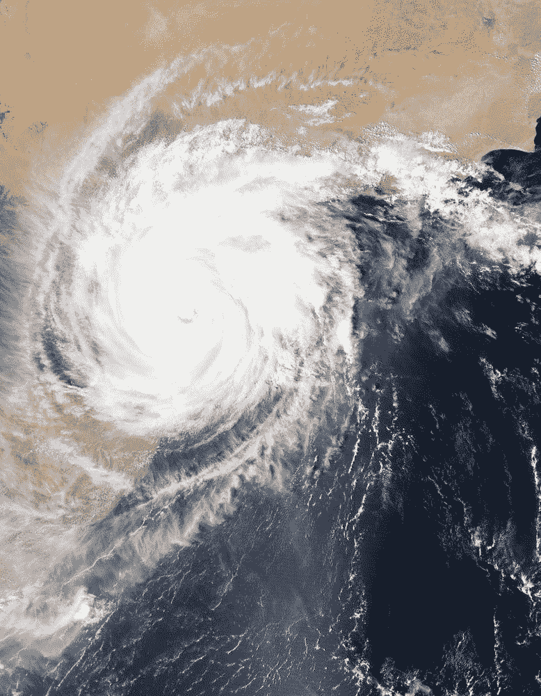
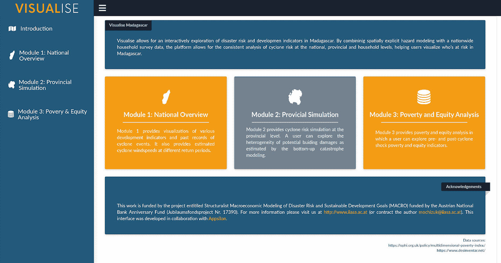
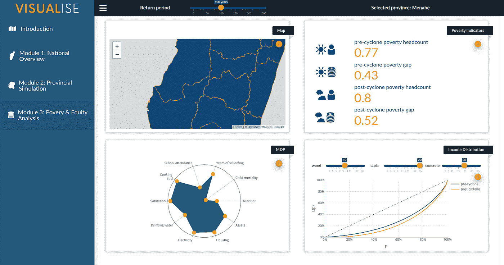

# 马达加斯加灾害风险管理决策支持系统

> 原文：<https://pub.towardsai.net/ai4g-a-decision-support-system-for-disaster-risk-management-in-madagascar-3f88f5a7adfe?source=collection_archive---------2----------------------->

# 作为数据科学咨询公司应对自然灾害风险

气候变化带来的挑战之一是灾难性自然事件的风险增加。这些[可能会不成比例地影响到世界上最脆弱的地区](https://www.imf.org/en/Publications/Policy-Papers/Issues/2016/12/31/Small-States-Resilience-to-Natural-Disasters-and-Climate-Change-Role-for-the-IMF-PP5079)，其中许多位于资源有限的低收入国家。国际发展努力可能会受到此类事件的严重破坏，因为放弃了本来可以用于扩大医疗保健、教育和基础设施投资的社会开支。

联合国可持续发展议程的签署国在 2015 年承诺到 2030 年实现 17 项雄心勃勃的可持续发展目标。因此，对发展中国家风险敏感的投资对于确保为实现这一愿景而实施的项目的长期复原力至关重要。

在私营部门提供服务的经验丰富的数据科学从业者可能会认为这是一个相对普通的问题。在 Appsilon，我们观察到了数据的变革力量，当我们的客户在其业务中实施决策支持系统以降低风险时，我们会利用数据的变革力量。人们可能会认为，可以采取类似的办法来加强政府和国际援助组织的决策能力，将自然灾害风险因素纳入稀缺资源的分配。

然而，这是国际发展中的一个反复出现的主题，即发达国家制定的解决方案在发展中国家实施时会失败，因为它们缺乏对各地区独特背景和挑战的适当理解。

尽管为收集、分析和传播关于自然灾害风险的数据做出了巨大努力，但这些国家在质量和数量方面仍有欠缺。此外，可能缺乏解释实地数据的技术能力。即使有这种专门知识，政治意愿和财政能力也可能不足以充分利用数据和投资于减少风险活动。

所有这些挑战都需要一种经过衡量的整体方法，并结合大量的实地经验和关系。因此，如果数据科学公司希望为解决这个问题做出贡献，显然需要与开发实践者进行更深入的合作。

[Junko Mochizuki](https://www.iiasa.ac.at/web/home/research/researchPrograms/RISK/Junko_Mochizuki.html)博士找到我们，她是[国际应用系统分析研究所](https://www.iiasa.ac.at/)风险和弹性项目团队的成员，为她旨在改善马达加斯加灾害风险管理政策的项目提供支持。

# 马达加斯加的案例

马达加斯加是一个位于印度洋的岛国，特别容易遭受自然灾害的风险，频繁的飓风摧毁了其薄弱的基础设施。例如，2018 年艾娃气旋引发的风暴、暴雨和强风造成了 1.3 亿美元的损失和 1.56 亿美元的损失，总计占其国内生产总值的 2.9%。在这种背景下，马达加斯加的年平均 GDP 增长率为 2.5%。

此外，大多数人口居住在农村地区，以农业为生。这些人不成比例地受到这种灾害的影响，这一细节不一定体现在总收入数字中。政府的支持非常有限，因为马达加斯加是世界上最贫穷的国家之一，人均国内生产总值为 460 美元。

Mochizuki 博士和她的团队着手了解如何支持马达加斯加制定适当的政策来减轻这种风险。她于 2015 年在马达加斯加参加了[关于灾害风险评估和优化公共投资以减少经济损失的培训项目](https://blog.iiasa.ac.at/2015/02/11/a-long-road-ahead-on-risk-sensitive-development-in-madagascar/)，期间提出了两个问题:

"我们如何能够同时加强应急资金和减少灾害风险的主流化？"

“当捐助者本身似乎没有根据一个国家自然灾害风险的实际需求来分配资金时，一个资金匮乏的政府能做些什么？”

# 可视化——自然灾害风险管理的决策支持工具

望月博士领导的可视化项目将回答这些问题。其主要交付成果是一个方便用户的分析和决策支持工具，该工具应能为宏观经济、预算和发展规划提供信息，并增强官员向国际援助组织更好地传达国家需求的能力。

visualise——为自然灾害风险管理的决策者提供的简单而全面的决策支持工具

由于两个主要因素，以前在马达加斯加进行的类似干预没有成功。首先，没有一致的深层次数据。各种国际组织正在收集灾害风险评估和普查类型的信息，这些数据既不可互操作，也不详尽。第二，已经部署的工具很复杂，政府官员和决策者无法使用。

**可视化**解决了这两个问题。它利用了全国范围的家庭调查，并将其与各种现有的和经过策划的多维贫困指标相结合。这些粒度数据然后被加载到一个全面的可视化工具的后端，该工具允许用户以无与伦比的详细程度了解自然灾害的影响。呈现给用户的不是数字列表、复杂的图表和统计数据，而是一种易于使用、一目了然的资源。

该工具迎合了决策者和其他非技术用户的需求，几乎不需要培训

该项目充分考虑了该国复杂的现实情况和最终用户的需求。该工具将与马达加斯加财政部密切合作部署。下一步是通过宏观经济建模增强其功能，根据资源分配模拟经济复苏。

我相信这是我们在发布我们的 [AI for Good](https://appsilon.com/ai-for-good/) 计划时描述的[探索性方法](https://appsilon.com/ai-for-good-our-approach-to-tackling-climate-change-with-data-science/?nabe=4634331497365504:0)(也可在 [Medium](https://medium.com/towards-artificial-intelligence/ai-for-good-an-exploratory-approach-to-tackling-climate-change-with-data-science-18bf0bd6c4ae) 上获得)的一个很好的例子。虽然我们可以想出许多方法，在发展中国家利用我们为商业客户开发的决策支持系统，但与拥有实地知识的系统分析所专家合作，可以确保我们的贡献产生积极影响。