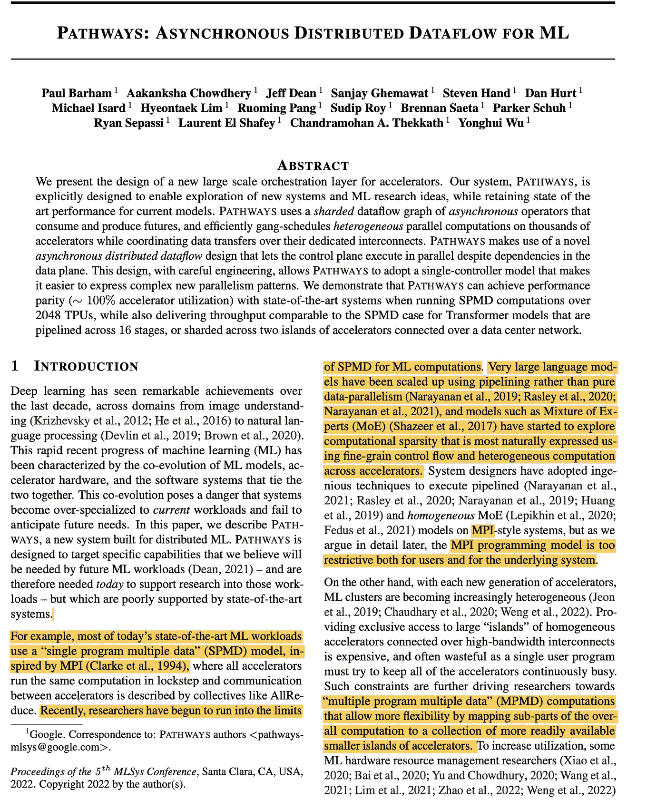
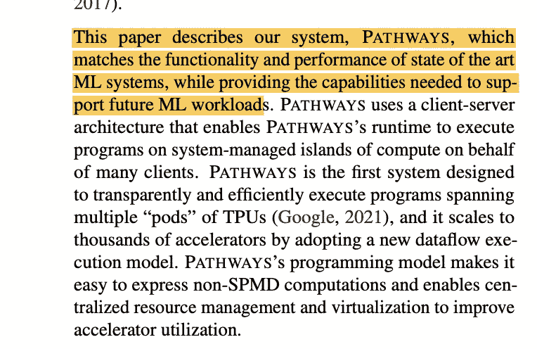
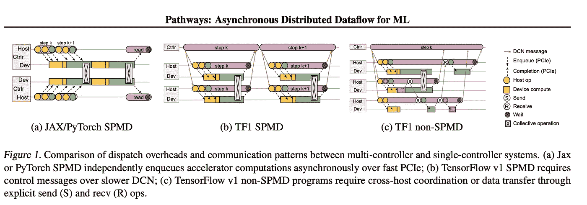
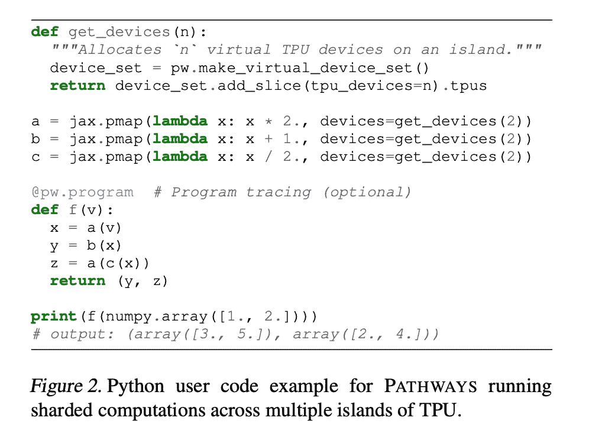
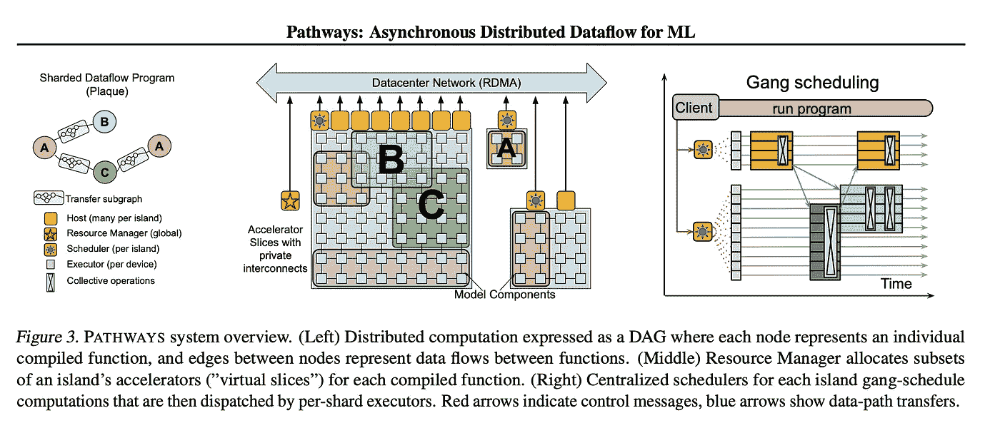
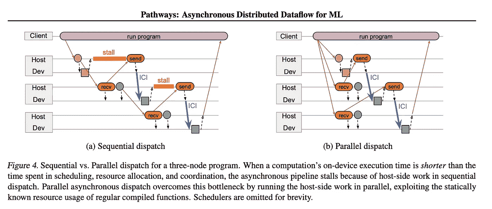

# 谷歌如何瞄准万亿参数模型(PaLM):一页一页的回顾

> 原文：<https://pub.towardsai.net/aiming-at-a-trillion-parameter-model-palm-page-by-page-review-59e4f21e51e8?source=collection_archive---------0----------------------->

## 路径:用于 ML 的异步分布式数据流和用路径扩展语言建模

这一次，我将从通常的 1 篇论文 1 篇综述的方法转向 2 篇论文 1 篇综述。原因是 Pathways [的论文](https://arxiv.org/abs/2203.12533) (Pathways:用于 ML 的异步分布式数据流)过于技术性，而[的论文](https://arxiv.org/abs/2204.02311)(PaLM:Scaling Language Modeling with Pathways)讨论了这种架构在实际语言模型中的应用。应用论文很好讨论，有很多有趣的信息。然而，在看到我的文章现在有 15 分钟长后，我决定将这两篇文章分成 1 篇评论。

## 摘要中的摘要

> **路径:用于 m1 的异步分布式数据流**
> 
> **我们提出了一种新的加速器大规模编排层的设计。我们的系统 PATHWAYS 利用了一种新颖的*异步分布式数据流*设计，让控制平面并行执行，而不管数据平面**中的依赖性。经过精心设计，这种设计允许 PATHWAYS **采用单控制器模型**，从而更容易表达复杂的新并行模式。我们证明，当在 2048 个 TPU 上运行 SPMD 计算时，路径可以实现与最先进的系统相当的性能(100%加速器利用率)，同时还可以为跨 16 级流水线或跨两个通过数据中心网络连接的加速器岛分割的变压器模型提供与 SPMD 案例相当的吞吐量。[**https://arxiv.org/abs/2203.12533**](https://arxiv.org/abs/2203.12533)

# 第一篇论文

## 要点

协调加速器(计算加速器，如 TPUs 张量处理单元和 GPU ),以提高可用 FLOPs(浮点运算)的利用率，从而降低总资源消耗(时间、金钱、电力等)。).PATHWAYS 是一个新的范例，它使用异步操作的共享数据流图，可以跨异构并行计算有效地协调数据和模型状态。

## 缩写和简要信息

**SPMD** :单程序多数据。这是大型语言模型训练架构的当前标准。一般来说，这种体系结构最终无法利用大型计算资源孤岛(即异构计算灵活性较低)。大规模超大规模计算的最新进展已经达到了 SPMD 的极限。

**MPI 编程模型**:是一个应用程序接口，定义了一个并行计算的模型，其中每个并行进程都有自己的本地内存，数据必须通过在进程之间传递消息来显式共享。与 SPMD 类似，该模型对用户和底层系统都有太多的限制。

**MoE 模式** : **(混合专家**)模型(Shazeer et al. 2017)使用计算稀疏性，这增加了跨加速器的异构计算需求。

MPMD:多程序多数据模型。使用通过高带宽互连连接的大型同质加速器岛既昂贵又浪费。MPMD 通过将子部分映射到可用的更小的加速器岛上，允许计算的灵活性。这提高了资源的利用率。(肖等，2020)

本文比较了 PATHWAYS 框架与最先进的(SOTA) ML 系统的性能，为未来的 ML 工作负载做准备。这个框架是专门为跨多个“pod”或 TPU 的程序的有效执行而开发的，Google 使用 TPU 进行 ML 加速。纸张流程如下—

1.  当前分布式 ML 系统的局限性
2.  灵活编程模型的路径支持
3.  路径架构
4.  最后，共享数据流和异步联合调度解决#1 中讨论的关键限制

要记住的另一个派别是基础模型的标准化趋势(Bommasani 等人，2021 年),这些模型是在大规模的大数据上训练的，但可以与多个下游任务/训练等共享模型的状态。因此允许有效的并行。

## 途径背后的动机

简单来说就是提高大型语言模型训练任务的计算效率和并行性。这里有一个例子，说明了 SPMD py torch 上的 JAX 如何允许在 PCIe 通道上进行通信，这比 DCN 连接要快几个联盟，而排队加速器计算是一个独立的过程。

## 路径中的编程模型

PATHWAYS 使用单控制器模型，这使得使用单独的控制平面来分离任务和协调变得更加容易。这些路径是在 TPU 上运行的，但是由于 XLA 数据共享的一些限制，今天的 JAX 不能扩展到单个 TPU pod 之外。然而，多控制器模型可以使用相同的代码在 TPU 上的 ICI(内核间互连链路)上运行。由于路径可以通过 ICI 和 DCN 进行通信，这使得 JAX 项目第一次可以扩展到包含数千个 TPU 核心的多个 TPU 吊舱。

## 示踪程序介绍

默认情况下，每个编译后的函数都被转换成一个独立的 PATHWAYS 程序，其中只包含一个(分片)计算，这意味着如果用户想要连续运行多个函数，那么每个函数都需要一个单独的 Python 调用和从客户端到协调器的 RPC。因此，一个名为 new *program tracer* (图 2)的新程序，用户可以包装调用许多编译函数的 Python 代码块。追踪器生成单路径程序，其中每个编译的函数由数据流图中的计算节点表示。

## 路径中的资源管理器

PATHWAY 的后端由一组加速器组成，这些加速器被分成紧密耦合的岛，这些岛依次通过 DCN 相互连接(图 3)。PATHWAYS 有一个“资源管理器”，负责集中管理所有孤岛上的设备。客户可能要求岛屿的“虚拟切片”,其具有适合其通信模式的特定 2D 或 3D 网格形状。每个虚拟片包含“虚拟设备”,允许客户端表达计算如何在网格上布置。资源管理器为满足期望的互连拓扑、存储器容量等的虚拟设备动态地分配物理设备。

我将跳过 PATHWAYS 的系统架构的更多细节，但它涉及到资源管理器、客户机、使用 PLAQUE 的协调实现以及团队调度的动态调度。在这幅图中，我们可以欣赏异步调度，它可以允许并行计算，从而节省大量的 FLOPs。

最后，从这张图中，我们可以看到，无论使用多少台主机(x 轴)，路径都优于单控制器系统。-O 表示 OpByOp，-C 表示链，-F 表示融合，其中用户代码分别包含单独的单元、跨所有节点执行的一系列单元或在单个节点中执行的一系列单元。此外，我们可以注意到，对于 16 台和 512 台路径主机配置，较小计算的每秒计算次数仍然明显较低。这意味着，对于具有 128TPUs 的 16 台主机，PATHWAYS 的计算时间超过 2.3 毫秒；对于具有 2048 TPUs 的 512 台主机，PATHWAYS 的计算时间超过 35 毫秒，PATHWAYS 与 JAX 吞吐量相当。

## 大比例模型性能

研究人员比较了测试的 T5 模型，并得出结论，在文本到文本的 NLP 任务中使用的编码器-解码器架构中，JAX 和通路的性能是相同的。这意味着路径的开销被计算规模/复杂性有效地掩盖了，我们可以从路径架构中受益，但不必为开销支付额外的成本。对于只有解码器的任务也是如此。系统的性能与 TPU 的数量成线性比例。

## 结论

PATHWAYS 与 SOTA 多控制器性能相当，但没有单租户 SPMDs 的限制。PATHWAYS 扩展了 JAX 计划的功能并改进了资源管理。PATHWAYS 允许在 pod 级别进行集群管理，从而支持多租户共享、虚拟化和针对工作负载定制的灵活性。PATHWAYS 在利用并发工作负载的资源方面是高效的，并且利用了高效的流水线执行，这为未来的研究奠定了坚实的基础。

我必须承认，这是最难阅读的论文之一，主要是因为我对设计如此庞大的培训工作的复杂性缺乏了解。我觉得我需要阅读这篇文章，以理解为什么具有 540B 参数的 PaLM 模型将成为 NLP 之旅中的一个重要里程碑。我每天都在学习——如果我有什么遗漏，请随时纠正我。如果你想跟我学点什么，那就留下你的赞，关注，等等(下面的链接)。

来支持我🔔 ***拍手*** | ***跟随|*** [***订阅***](https://ithinkbot.com/subscribe) **🔔**

使用我的链接成为会员:[https://ithinkbot.com/membership](https://ithinkbot.com/membership)

检查我的其他作品—

 [## 2022:chat GPT 年，未来如何？

### 看着水晶球

ithinkbot.com](https://ithinkbot.com/2022-year-of-chatgpt-what-is-the-future-979b034efdf9)  [## OpenAI 首次亮相 ChatGPT

### OpenAI 周三发布了一款名为 ChatGPT 的新模型。这个模型被训练成在一个…

pub.towardsai.net](/openai-debuts-chatgpt-50dd611278a4)  [## 什么是 GPT-4(什么时候？)

### GPT-4 是一个自然语言处理模型，由 openAI 作为 GPT-3 的继承者开发

pub.towardsai.net](/what-is-gpt-4-and-when-9f5073f25a6d) 

Denys Nevozhai 在 [Unsplash](https://unsplash.com?utm_source=medium&utm_medium=referral) 上拍摄的照片