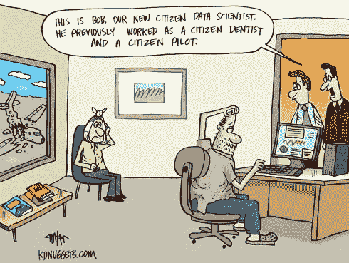

# 没有“公民数据科学家”这种东西

> 原文：<https://pub.towardsai.net/aint-no-thing-as-citizen-data-scientist-99d4fdc268e4?source=collection_archive---------2----------------------->

## [数据科学](https://towardsai.net/p/category/data-science)，[观点](https://towardsai.net/p/category/opinion)

## 降低数据科学难度的策略

演职员表:【https://unsplash.com/ 

亲爱的有抱负的数据科学家:

在您开始使用“低代码”或“拖放”数据科学工具之前，请学习基础知识。

当你能够真正成为“数据科学家”时，为什么还要渴望成为“公民数据科学家”

不要被“公民数据科学家”这样的花哨头衔所左右。有趣的是，数据科学领域发生了如此多的强行推销。

我的意思是，仅仅因为我们知道如何使用体温计或操作 BP 机，我们就应该开始称自己为‘公民医生’吗？

学分:Kdnuggets.com

## 策略——削弱做数据科学的难度！

降低数据科学的难度是不健康的。许多'*在一个月的课程中成为数据科学家'*卖家和'*低代码数据科学解决方案'*卖家使用这种策略。

“低代码/无代码解决方案”的卖家通常会说，人们可以通过“做”事情来获得直觉。对此的反驳是，使用低代码/无代码解决方案就像使用计算器一样。在操作计算器之前，一个人需要有算术技能。学习数据科学的基础知识就像获得算术技能一样。

鸣谢:[https://www . science news forstudents . org/article/animals-can-do-almost-math](https://www.sciencenewsforstudents.org/article/animals-can-do-almost-math)

## 为什么 85 %的数据科学项目会失败？(提示:游戏中没有皮肤)

85 %的数据科学项目在企业中失败，是因为人们认为做数据科学很容易，但却做错了。这种认识往往来得很晚。

许多人成为“*成为 1 个月/ 6 个月类型课程的数据科学家”*的受害者，并经常想知道为什么他们没有被聘用。

市场是最终的真相讲述者。

它以某种方式知道谁是好玩家，并运行一个优秀的过滤机制。原因在于，这个市场是由“利益相关”的公司组成的。

有“利益关系”的公司不赌博。他们雇佣真正的天才。一个人可以自己做的简单“游戏中的皮肤”测试是问一个简单的问题。 ***我会自己使用机器学习分类器吗？***

我偶然看到 Linkedin 的一个帖子，其中一个人使用其中一个低代码库建立了一个心脏病预测模型。真正的问题是，那个人是否会把这个模型用在他/她的亲友身上？

此外，心脏病预测或地震预测的真正用途不是预测它将以 x%的把握发生，而是预测它将在何时发生。

没有模型能够准确预测这种'时间'部分。

## 做数据科学很容易。或者是？

数据科学看起来“容易做”的原因之一是，许多算法可以放在 2-3 行代码中。根本没有智力上的痛苦。

把这比作编程。一个人必须考虑语法、设计模式和逻辑。当编程出错时，会有多个检查点以错误警报的形式出现，比如运行时错误、语法错误和编译器错误。一个人可以直接了解他/她是一个好还是坏的程序员。因此，人们不会去自称为“公民软件工程师”

另一方面，当涉及到数据科学时，没有运行时或语法错误的等价物。没有警告信号表明不能对数据应用特定的算法。签到数据科学没有立竿见影的现实。

这就是为什么主张“*学习基本面不重要”*的人逍遥法外的原因之一。这就是为什么像“公民数据科学家”这样花哨但有害的头衔会出现。

上述批评听起来可能很粗鲁/尖刻，但这一切都是为了希望有一天我们都能说 85%的数据科学项目成功了而不是失败了。

我也鼓励读者阅读下面的文章:

 [## 公民数据科学家的海市蜃楼——KD nuggets

### “公民数据科学家”这个词最近一直在激怒我。它于 2015 年开始出现，紧随 Gartner 之后…

www.kdnuggets.com](https://www.kdnuggets.com/2016/03/mirage-citizen-data-scientist.html)  [## “零堆栈数据科学家”——第一部分，开端

### 我们生活在一个不确定的时代。不确定新冠肺炎事件后经济会如何发展(快速/缓慢复苏…

medium.com](https://medium.com/@luis.moreira.matias/zero-stack-data-scientist-part-i-beginnings-1691afa2b510) 

欢迎您的评论和反馈。

你可以联系我

[领英](http://www.linkedin.com/in/venkat-raman-Analytics)

[推特](https://twitter.com/venksaiyan)