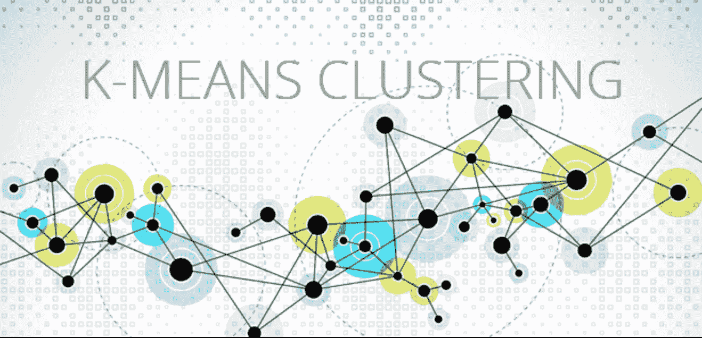
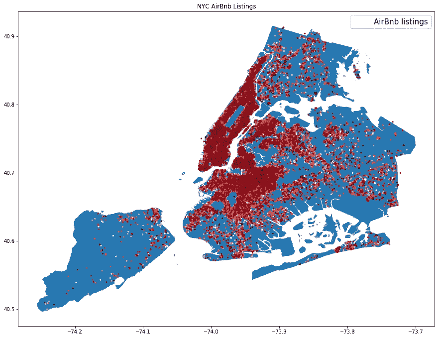
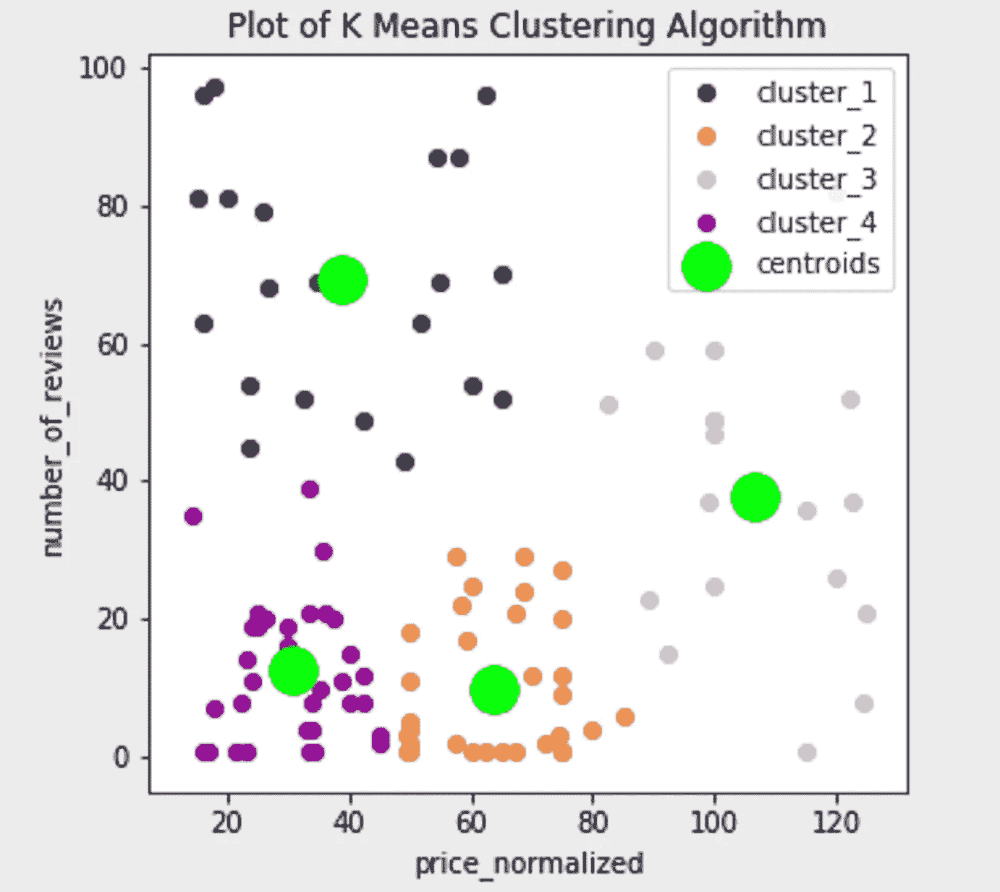
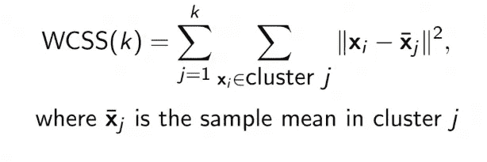
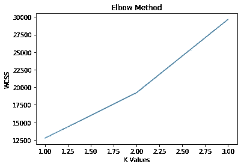

# 从零开始使用 K-Means 聚类的 Airbnb 数据探索

> 原文：<https://pub.towardsai.net/airbnb-data-exploration-with-k-means-clustering-from-scratch-cc2688476272?source=collection_archive---------2----------------------->

## [机器学习](https://towardsai.net/p/category/machine-learning)

# k-均值聚类——它是什么？



由[分组枢纽](https://hub.packtpub.com/wp-content/uploads/2018/03/164-Cover-Image.png)拍摄

在我们深入研究 Airbnb 数据集和我们的发现之前，让我们对 K-Means 聚类算法做一个深入的回顾。

一个*无监督学习器*接收未标记的训练数据，并对看不见的点进行预测。*聚类分析*属于无监督学习。*群集*是同一组中彼此相似(或相关)的数据对象的集合，*或*与其他组中的对象不相似(或不相关)。“好的”聚类将具有以下特征:高的类内相似性(在聚类内的内聚性*)和低的类间相似性(在*聚类之间的独特的*)。*

**K-Means 算法**是常见的一种聚类分析。它使用一种*分区方法*，其中各种分区被构建，然后通过某种标准进行评估，例如最小化误差平方和。

*分割方法* —将 n 个对象的数据点 D 的集合分割成一组 K 个簇，使得距离平方和最小化。换句话说，给定 K，找到优化所选划分标准的 K 个簇的划分。

在 K-Means(也称为劳埃德算法)中，每个聚类由该聚类的中心或*质心*来表示。让我们进入步骤:

**算法:**

1.  初始化群集质心
2.  随机选择 K 个点，并将其指定为质心
3.  在集群分配保持不变的情况下重复

*   使用距离度量将每个点分配到最近的质心
*   计算新分配中所有点的平均值作为新的聚类质心 *k*

**强项**:

*   容易理解
*   简单实现
*   效率
*   经常终止于局部最优
*   已经被证明在实践中工作良好

**弱点**:

*   需要预先指定 K(先验数据直觉可以帮助选择这个值)
*   对异常值和噪声数据敏感
*   仅适用于连续 n 维空间中的对象
*   仅对数字数据进行操作(通过使用欧几里德距离)

# 纽约 Airbnb 数据

来自 [Kaggle](https://www.kaggle.com/dgomonov/new-york-city-airbnb-open-data) 的这个数据集包含了 2019 年以来纽约市的数千个 Airbnb 房源。这是一个有趣的数据探索数据集——我们可以从中提取大量的想法和信息。我们可以了解哪些主人最受欢迎及其原因，哪些社区最贵，哪些房间类型最受欢迎，等等。

让我们从使用 Python 库可视化数据集(并下载 shapefile)开始:geopandas、descartes 和 shapely。



纽约 Airbnb 房源

# **K-意味着从零开始**

我们将从头开始构建算法。让我们从读入数据并过滤到所需的子集开始。在本例中，我们有兴趣探索更多关于斯塔滕岛附近的“全屋/公寓”房型的信息。我们希望探究评论的数量如何与列表的价格相关联。

```
import pandas as pddf = pd.read_csv('data/new-york-city-airbnb-open-data/AB_NYC_2019.csv')# Entire Home / Apartment - Listings for Staten Island
df = df[df['room_type'] == 'Entire home/apt']
df = df[df['neighbourhood_group'] == 'Staten Island']
df = df[['price_normalized', 'number_of_reviews']]
```

## **记得预处理！**

注意:在运行算法之前，记住对数据进行相应的预处理是很重要的，因为 K-Means 对异常值很敏感。筛选出异常值的一个简单方法是使用统计学中的分位数方法。

```
import pandas.api.types as ptypeslow = .10 #.05
    high = .90 #.95
    quant_df = df.quantile([low, high])
    for col_name in list(df.columns):
        if ptypes.is_numeric_dtype(df[col_name]):
             df = df[(df[col_name] > quant_df.loc[low, col_name]) &
\
             (df[col_name] < quant_df.loc[high, col_name])]
```

让我们把熊猫数据帧转换成一个矩阵。

```
data = df.values 
m = data.shape[0] # num training examples
n = data.shape[1] # num of features
```

现在让我们初始化我们的质心，并将它们存储在一个数组中:

```
temp_centroids = np.array([]).reshape(self.n, 0)
    for i in range(self.K):
        rand = rd.randint(0, self.m-1)
        temp_centroids = np.c_[temp_centroids, self.data[rand]]
```

接下来，我们将使用欧几里德距离度量开始迭代。我们将这些距离存储在一个数组中，并在每次迭代中更新它们。

```
EucDist = np.array([]).reshape(self.m, 0)
    for k in range(self.K):
        dist = np.sum((self.data - self.centroids[:,k])**2, axis=1)
        EucDist = np.c_[EucDist, dist]
```

## **结果**



正如我们所看到的，有各种各样的价格和评论。一般来说，斯塔滕岛价格在每晚 20-80 美元之间的“全屋/公寓”的房源评论数量最多。随着越贵的商品越不受欢迎，评论的数量也在减少。

## **使用肘法**

肘方法是一种我们可以用来确定 k 值的技术。当没有关于如何选择 k 的先验数据直觉时，这就很方便了。需要注意的是，如果数据不是非常聚类，肘方法不会产生好的结果。



照片由[纳夫乔特·辛格](https://medium.com/ai-in-plain-english/what-is-k-means-clustering-3060791cb589)拍摄

该方法将使用一系列的 *k* 值来测试哪一个是最佳的。对于每个 *k* 值，计算**类内平方和(WCSS)** 。该度量被定义为聚类中的每个点与其各自质心之间的平方距离之和。我们选择曲线弯曲处的 *k* 值作为最佳聚类数 K——这就是该方法的名称。对于下图，肘方法告诉我们最佳 K 值是 2。

```
wcss_vals = np.array([])
for k_val in range(1, self.K):
    results, centroids = self.predict()
    wcss=0
        for k in range(k_val):
            wcss += np.sum((results[k+1] - centroids[k,:])**2)
        wcss_vals = np.append(wcss_vals, wcss)
```



## 展望未来

K-Means 是一种常见的探索算法，用于识别数据中的潜在结构和模式。它用于几个不同的领域，包括文档分割、欺诈检测、异常值分析、营销/销售等。

同样明显的是，对于这个特定的数据子集，K-均值可能不会揭示强信号，因为聚类似乎没有高的类内相似性和低的类间相似性。你可能在第一次的时候没有发现任何突出的东西——这没关系！这就是数据探索(和数据科学)的意义所在。

改进算法的其他方法包括使用 K++和 K-Medoids。访问 my [GitHub](https://github.com/hsayedi/K-Means-Clustering-From-Scratch) 查看完整代码。