# 气流在云上| ELT 管道与气流和 AWS 的协调

> 原文：<https://pub.towardsai.net/airflow-is-on-the-cloud-elt-pipeline-orchestration-with-airflow-aws-4d4268e5321a?source=collection_archive---------1----------------------->

詹姆斯·惠勒摄影:[https://www . pexels . com/photo/symmetric-photography-of-clouds-covered-blue-sky-1486974/](https://www.pexels.com/photo/symmetrical-photography-of-clouds-covered-blue-sky-1486974/)

你会看到**带气流编排的 ELT 管道**。

您将学习直接从 **AWS S3** 向**PostgreSQL**数据库加载数据。你要用码头集装箱做所有的事情。

您将学习如何使用 **Airflow XCom** 在不同任务之间进行通信。

你将从 S3 AWS 下载文件。

您将上传文件到 **AWS S3** 。

您将使用 ***Bash 操作符*** ， ***Python 操作符*** ， ***任务装饰器*** ，以及其他 ***气流*** 功能。

您将获得数据，将其加载到 ***PostgreSQL*** 数据库，并在几分钟内通过 **pgAdmin** 查看。

我们开始吧。

# 内容

[**简介**](#96a6)

[**上传文件到 S3**](#6f43)

[**从 S3 下载文件**](#899b)

[**不同任务之间用气流 XCOM**](#7b69) 进行交流

[**将 PostgreSQL 连接到 AWS S3 & ELT 管道**](#ce32)

[**结论**](#1712)

# 介绍

" Airflow 是一个由社区创建的平台，用于以编程方式创作、调度和监控工作流."([https://airflow.apache.org/](https://airflow.apache.org/))

气流是最著名的工作编排工具之一。

[**在上一篇文章**](https://medium.com/towards-artificial-intelligence/lets-orchestrate-with-airflow-step-by-step-airflow-implementations-8100d8fe58b0) 中，我们讨论了循序渐进的**气流**实现。

在本教程中，我们将介绍云上的**气流**实现，尤其是在 **AWS** 上。

我们将使用 [**气流 Docker Lite 安装**](https://medium.com/towards-artificial-intelligence/you-can-install-airflow-with-docker-in-minutes-66a3de44374f) 。

✅:我们将从数据源获取数据，并将其放入一个 **AWS S3** 桶中。

✅:我们将从 AWS S3 桶中下载数据。

✅我们将学习用 **Airflow XCom** 在不同的任务之间进行交流。

✅我们将从 **AWS S3** 桶、中读取数据，将其加载到 ***PostgreSQL*** 数据库中，并用 ***pgAdmin*** 查看。

我们开始吧。

# 将文件上传到 AWS S3 —提取并加载到 DATALAKE

在本教程中，我们将使用 ***TLC 记录黄色出租车的行程*** 。

黄色和绿色出租车行程记录包括捕捉上下车日期/时间、上下车位置、行程距离、分项费用、费率类型、付款类型和驾驶员报告的乘客数量的字段([参考链接](https://www1.nyc.gov/site/tlc/about/tlc-trip-record-data.page))

我们将实现 **ELT 管线**的 **EL** 部分。

我们将获得 2022 年 1 月黄色出租车出行记录。

并将数据加载到 S3 自动气象站的数据湖。

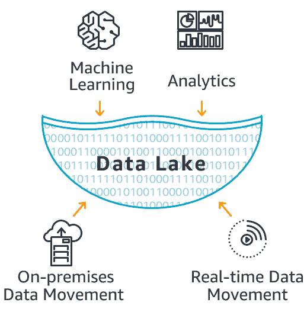

[https://aws.amazon.com/big-data/what-is-a-data-lake/](https://aws.amazon.com/big-data/what-is-a-data-lake/)

首先，我们将获得一个新的 S3 桶作为目的地。

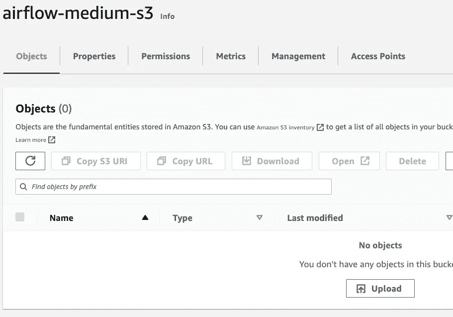

作者捕获的图像

我们将使用“气流-介质-s3”桶作为我们的数据湖点。

我们可以转到气流方面。

我假设您遵循了 [**Airflow Docker Lite 安装**](https://medium.com/towards-artificial-intelligence/you-can-install-airflow-with-docker-in-minutes-66a3de44374f) 并且 Airflow 容器正常运行。

我们需要为 S3 自动气象站添加一个新的连接。这样，气流可以连接到自动气象站 S3 桶。

作者捕获的图像

选择连接后，我们将提供以下信息。

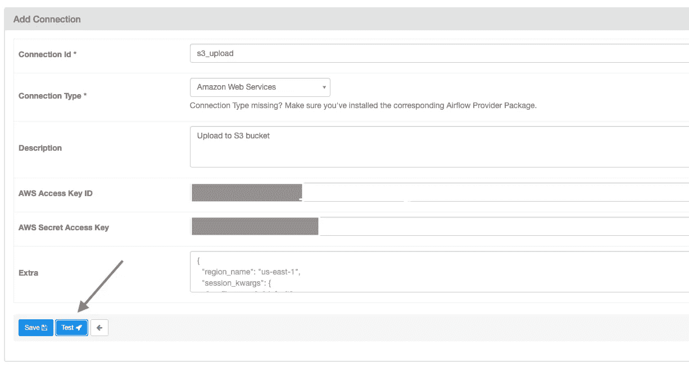

作者捕获的图像

我们将在 DAG 上使用连接 ID。
你需要提供你的 AWS 证书。

🛑在保存它之前，**测试你的连接**。在连接上获得绿灯后，保存您的连接。

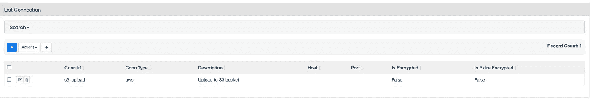

作者捕获的图像

好的。我们有 AWS 连接。

我们为 AWS S3 存储桶和文件名定义变量。

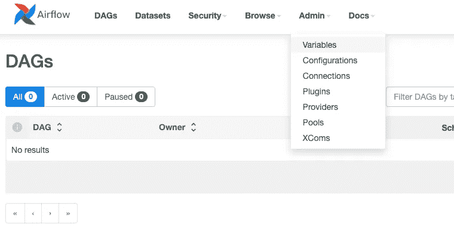

作者捕获的图像

单击变量后，我们将提供以下信息。

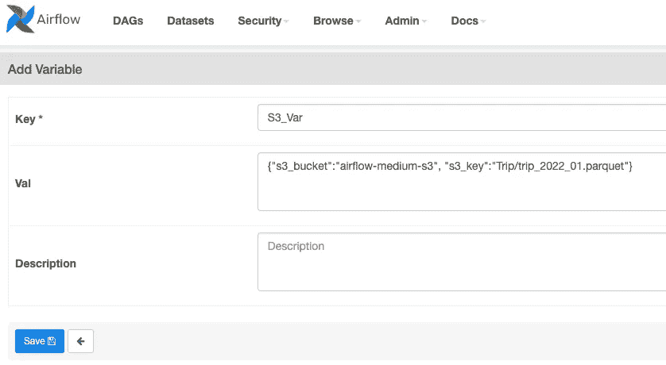

作者捕获的图像

我们将在 DAG 上使用密钥和存储段名称以及 S3 密钥。

🛑 **s3_key** :数据湖上的文件名。在我们的案例中，我们给出了'***Trip/Trip _ 2022 _ 01 . parquet***'。如果没有 Trip 文件夹，我们的 bucket 上也没有任何东西，首先，它会创建一个文件夹，然后将这个文件放入 trip_2022_01.parquet。

我们已经准备好编写 Python 函数来将数据加载到 AWS S3。

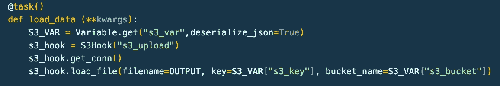

作者捕获的图像

✅ **S3_VAR** :我们会得到变量信息。

✅ **s3_hook** :连接 AWS S3。它将使用我们之前定义的“s3_upload”命名连接。

✅ **s3_hook.load_file** :我们本地文件夹的第一个文件名。然后 S3 桶上的文件名。最后还有 S3 斗名([参考链接](https://airflow.apache.org/docs/apache-airflow/1.10.6/_modules/airflow/hooks/S3_hook.html#S3Hook))。

让我们完成 DAG 并运行它。

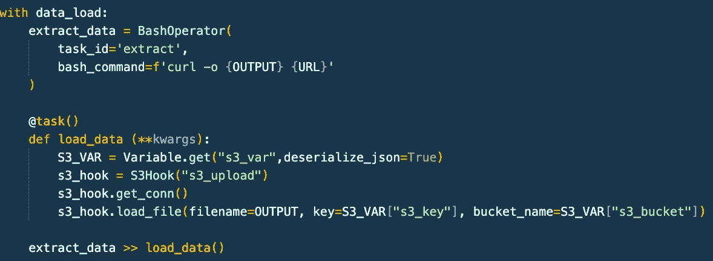

作者捕获的图像

让我们转到 Airflow GUI，查看 DAG 的操作。

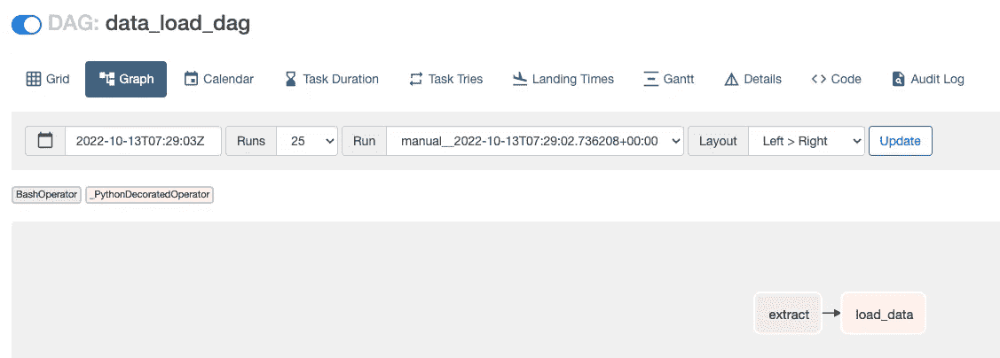

作者捕获的图像

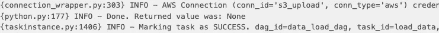

作者捕获的图像

根据日志，气流将任务标记为成功。

让我们看看自动气象站 S3 站的档案。

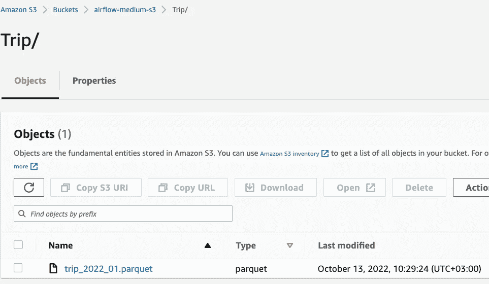

作者捕获的图像

正如我们之前所讨论的，我们有一个新的 **Trip** 文件夹，其中有 **trip_2022_01.parquet** 文件。

# 从 S3 自动气象站下载文件

让我们从 AWS S3 下载一个带有气流工作编排的文件。

如果容器上有拼花文件，请从容器中取出拼花文件。(作为复习，你可以看看 [**上一篇文章**](https://medium.com/towards-artificial-intelligence/lets-orchestrate-with-airflow-step-by-step-airflow-implementations-8100d8fe58b0) ，看看如何从气流容器中移除文件)

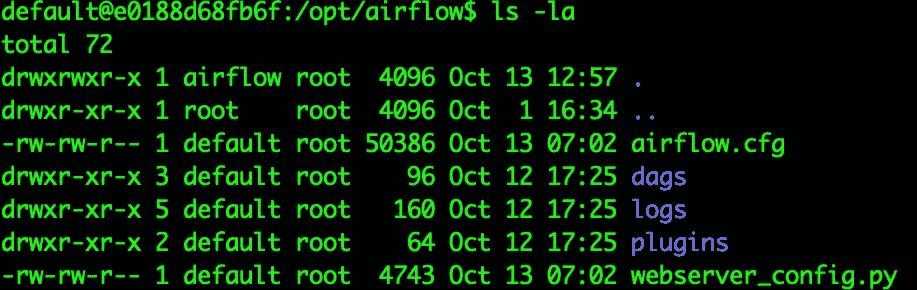

作者捕获的图像

我们删除了 parquet 文件，准备从 AWS S3 下载。

让我们编写 Python 任务装饰器。

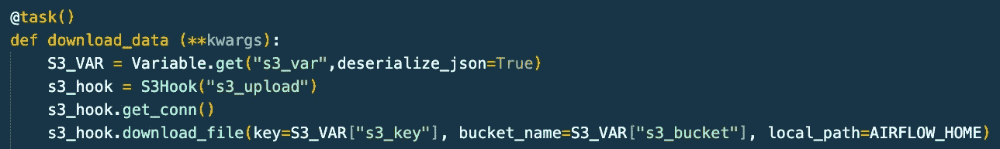

作者捕获的图像

✅**s3 _ hook . download _ file**:AWS S3 上的第一个文件名，然后是 S3 桶名，最后是容器上的本地路径([引用链接](https://airflow.apache.org/docs/apache-airflow/1.10.6/_modules/airflow/hooks/S3_hook.html#S3Hook))。

让我们启动 DAG，看看它的运行情况。

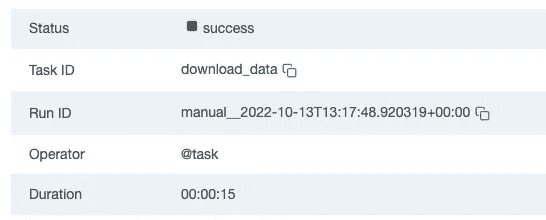

作者捕获的图像

我们成功了。

让我们转到终端，查看本地路径和下载的文件。

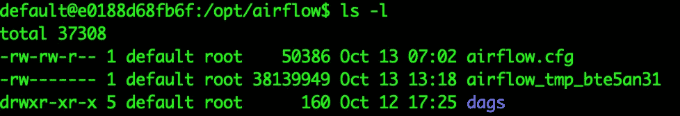

作者捕获的图像

我们已经下载了文件，但有些有趣的东西。

气流给了它一个随意的名字。

我们必须找到解决办法。

# 使用 Airflow XCom 在不同任务之间进行通信

在找到这个问题的解决方案之前，让我们先简单提一下 **XCom** 。

XComs(“交叉通信”的缩写)是一种机制，**让任务彼此对话**，默认情况下，任务是完全隔离的，可能运行在完全不同的机器上。

XCom 由一个`key`(本质上是它的名字)以及它来自的`task_id`和`dag_id`来标识。它们可以有任何(可序列化的)值，但它们只是为少量数据设计的；不要用它们来传递大值，比如 data frames”([参考链接](https://airflow.apache.org/docs/apache-airflow/stable/concepts/xcoms.html))。

好的。让我们在 XCom 的帮助下解决这个问题。

首先，让我们看看气流文档，以找到任何解决方案。

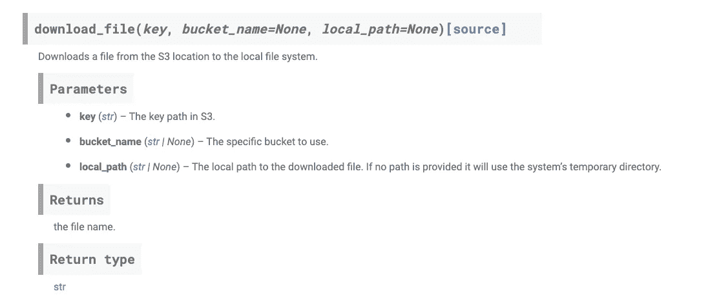

[https://air flow . Apache . org/docs/Apache-air flow/1 . 10 . 6/_ modules/air flow/hooks/S3 _ 胡克. html#S3Hook](https://airflow.apache.org/docs/apache-airflow/1.10.6/_modules/airflow/hooks/S3_hook.html#S3Hook)

没有关于重命名文件的内容。

我们必须找到解决办法。

让我们删除下载的文件并重新开始。

我们将使用 **Bash 操作符**来重命名下载的文件。

让我们编写 Bash 操作符任务。

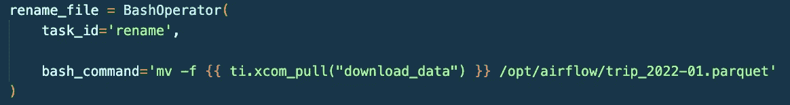

作者捕获的图像

我们将使用 **mv -f** 命令来重命名文件。

我们将用 **XCom** 从 Python 函数中获取下载的文件名。

最后，我们给文件起一个名字。

让我们一起来看两个任务。

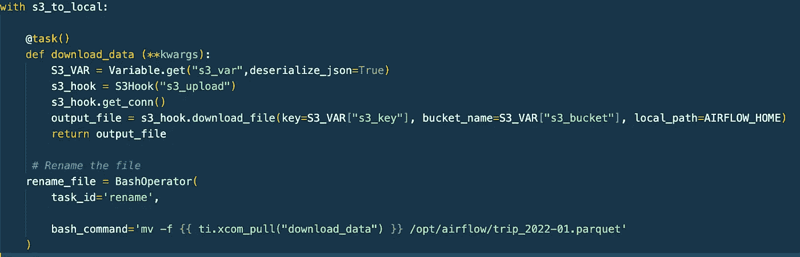

作者捕获的图像

让我们运行 DAG，看看它的运行情况。

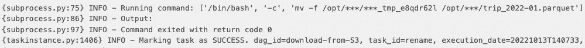

作者捕获的图像

我们成功了。

让我们看看集装箱上的文件。

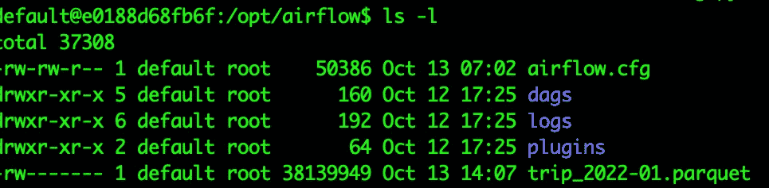

作者捕获的图像

恭喜你。我们有一个重命名的文件。

# 将 POSTGRESQL 连接到 AWS S3 存储桶和 ELT 管道

在本文的最后一部分，我们将完成 **ELT 管道**的最后一部分。

我们将从 AWS S3 获取数据，并将其转换和加载到 PostgreSQL 数据库。

我们已经完成了管道的 EL 部分。

使用 **Bash 操作符，**我们提取数据。

使用 **Python 任务装饰器**，我们将数据加载到**数据湖**、 **AWS S3** 。

是时候转换数据并将其加载到 PostgreSQL 数据库中，然后用 pgAdmin 查看它了。

让我们写最后的任务。

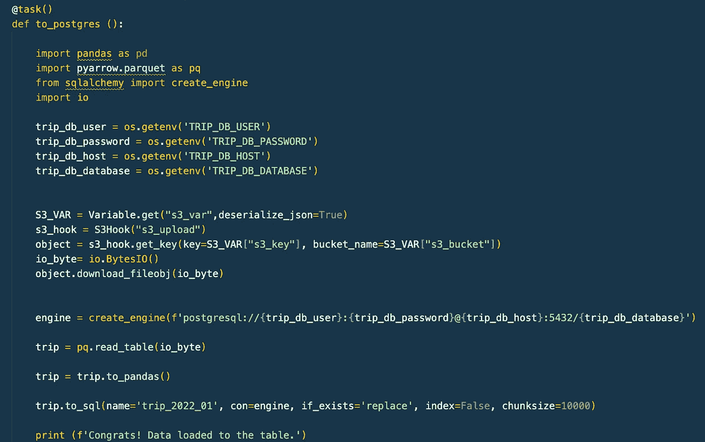

作者捕获的图像

我们已经在 [**前一篇**](https://medium.com/towards-artificial-intelligence/lets-orchestrate-with-airflow-step-by-step-airflow-implementations-8100d8fe58b0) 中讨论了 DAG 的某些部分。

我没有对数据进行任何更改/转换。您可以随意使用这些数据，并在将其放入 PostgreSQL 数据库之前进行相关的转换。

让我们看看 S3 连接部分。

我们有一个 S3 钩子，我们得到了带有 **s3_hook.get_key** 的 S3 对象。

它返回一个 **boto3.s3.Object** ( [引用链接](https://airflow.apache.org/docs/apache-airflow/1.10.6/_modules/airflow/hooks/S3_hook.html#S3Hook))。

**object.download_fileobj** :接受可写对象。文件对象必须以二进制模式打开，而不是文本模式([引用链接](https://boto3.amazonaws.com/v1/documentation/api/latest/guide/s3-example-download-file.html))。我们可以在 **Python IO 模块**的帮助下满足这个条件。

让我们来看看任务的运行情况。

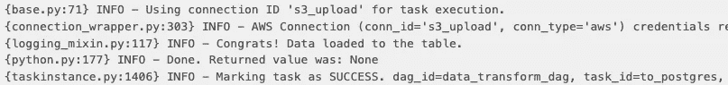

作者捕获的图像

我们成功了。

最后，让我们看看 **pgAdmin** 。

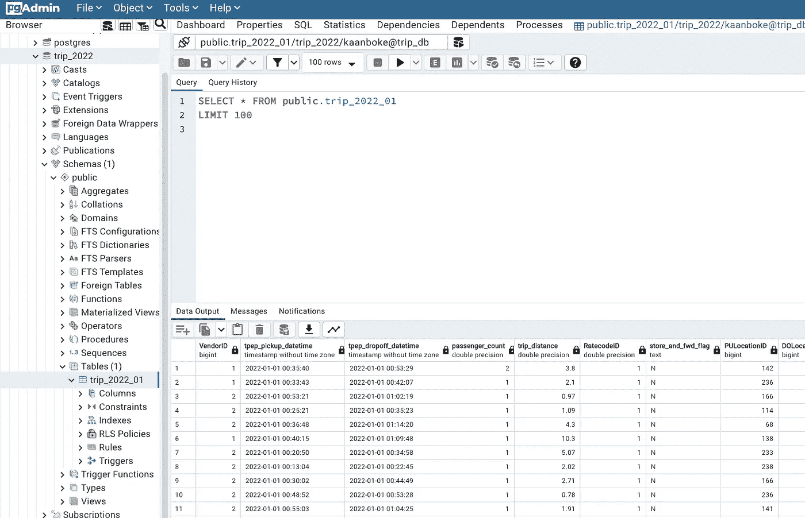

作者捕获的图像

干得好。

图片来源:[https://giphy.com/](https://giphy.com/)

# 结论

在本文中，我们讨论了 **ELT 管道**与**气流**和 **AWS** 的编排。

首先，我们从数据源获取数据，并将其放入 AWS S3 桶中。

此外，我们从 **AWS S3** 桶下载数据。

我们研究了如何使用 **Airflow XCom** 在不同任务之间进行通信。

最后，我们从 **AWS S3** 桶、中读取数据，加载到 ***PostgreSQL*** 数据库中，用 ***pgAdmin*** 查看。

我希望它有所帮助。

本文是 [**工作流工具列表**](https://medium.com/@kaanboke/list/workflow-tools-e3da3a530ea5) 的一部分。你可以在 这里找到 [**系列的其他文章。**](https://medium.com/@kaanboke/list/workflow-tools-e3da3a530ea5)

对了，喜欢题目的时候，**可以通过支持** **来表现👏**

欢迎发表评论。感谢您的宝贵时间。

# 万事如意🤘

**代码**可以从 [**这里**](https://github.com/kb1907/airflow-aws-elt) 下载。

如果你喜欢看我的内容， [*请考虑关注我*](https://medium.com/@kaanboke/membership) 。还有，你可以通过 [**订阅 Medium**](https://medium.com/@kaanboke/membership) 来支持其他作家和我。使用我的推荐链接不会额外花费你。