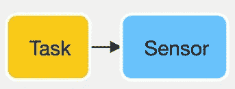

# 气流生成提示—分组故障和重试

> 原文：<https://pub.towardsai.net/airflow-production-tips-grouped-failures-and-retries-8f18df405364?source=collection_archive---------1----------------------->


照片由[杰克森煨](https://unsplash.com/@simmerdownjpg?utm_source=medium&utm_medium=referral)在 [Unsplash](https://unsplash.com?utm_source=medium&utm_medium=referral)

Apache Airflow 已经成为数据编排的事实标准*de**。然而，随着时间的推移和版本的变化，它积累了一系列的细微差别和错误，这可能会阻碍它在生产中的使用。*

*这一系列文章旨在引导 Apache Airflow 用户克服这些问题，也就是我所面临的问题。*

> *注意:像往常一样，所有的代码都可以在我的 GitHub 资源库中获得，这里的[](https://github.com/Guilherme-B/airflow-utils)*。**

# **分组失败和重试**

> ****TLDR** :在 Airflow 中，将多个任务视为一个任务是很常见的，常见的用例是运行操作符与其传感器操作符一起使用。如果传感器任务失败，那么从技术上讲，整个过程都失败了，应该重新启动。但是，默认情况下，Airflow 只会重试传感器任务，而不会重试运行运行任务。在这篇文章中，你会发现如何修复它。**
> 
> ****TLDR #2** :这里[可以直接跳到解决方案](#2f3d)**

# **问题陈述**

**通常情况下，我们都面临着创建任务集的需求，我们希望这些任务集要么失败(并重试)，要么整体成功。**

**考虑运行名为 *TaskRun* 的*AzureDataFactoryRunPipelineOperator、*azuredatafactorypeipelinerunstatussensor*名为 *TaskSensor* 的相应传感器来检索其状态的情况。***

**虽然 *TaskRun* 可以成功触发作业，但是 Azure 数据工厂运行实例总是有可能失败，在这种情况下, *TaskSensor* 将被标记为失败并等待重试。但是**、*任务运行*仍然会成功**，因此**不会被重试**。**

**换句话说，我们希望相关的任务要么失败，要么作为一个整体成功。**

## **为什么会这样？**

**在 Apache Airflow 中，尽管任务是通过依赖关系建立(通过 *< <、* > >依赖关系操作符或者 *set_downstream* 和 *set_upstream* 函数)来链接的，但是，这仅仅是帮助定义任务的流——或者直接非循环图——虽然它定义了单向依赖关系(下游任务),但是它并不传达关于上游依赖关系的信息。换句话说，如果我们使用适当的依赖操作符将 *TaskRun* 与 *TaskSensor* 结合起来:**

****

**一个任务操作符，后跟相应的传感器操作符**

```
**TaskRun = AzureDataFactoryRunPipelineOperator(...)
TaskSensor = AzureDataFactoryPipelineRunStatusSensor(...)
TaskRun >> TaskSensor**
```

**Apache Airflow 知道如果 *TaskRun* 失败， *TaskSensor* 将被跳过，因为它检查 TaskRun 的*下游*任务( *TaskSensor* )并跳过它们。然而，不能从相反的方面推断同样的情况，因为上游任务可能确实已经成功了，并且我们可能不想重复它。例如，如果不是 *TaskRun* 和 *TaskSensor，*我们会有一个 *TaskExtract* 和 *TaskTransform* 按上述顺序，并且 *TaskExtract* 成功，但是 *TaskTransform* 失败，我们不希望 TaskExtract 被重试，这是 Airflow 的默认行为，当然，这是正确的。**

# **解决方案**

**不像在我们之前的文章中，我们探索了使用 ORM 来提取 *DAGRun* 信息，我们的问题的解决方案直接围绕着任务，因为它们包含关于它们上游任务的知识，因此我们的问题的解决方案要简单得多。**

**我们问题的解决方案分为两个简单的步骤:**

1.  **提取指定*任务实例*的所有*上游*任务实例*的列表***
2.  **根据必要的行为，将*上游*任务实例标记为重试或失败**
3.  **向*任务*定义中添加适当的回调函数**

## **第一步:提取指定*任务实例*的所有*上游*任务实例*的列表***

**第一步可能是最复杂的，因为有两种不同的解决问题的方法:**

1.  **我们可以在指定的*上游*深度*内标记任务***
2.  **或者我们可以根据任务的*任务* ID 来标记任务**

**我们将探索和准备每种方法，并最终将它们结合起来实现扩展功能。**

**从第一个也是最简单的方法开始，包括四个步骤:**

1.  **根据名称获取要标记的*任务*的列表**
2.  **检索名称在提供的*任务*名称中的*任务实例*实例**

**第二种方法更加复杂和脆弱，并且只在特定的假设下工作:所有要标记的上游任务*只是线性依赖，意味着在指定的*扫描深度*内不涉及*分支*。***

1.  **对每个指定的*扫描深度* *级别*进行迭代，从较低级别向较高级别推进**
2.  **在指定的*扫描深度级别*检索并验证*任务*的*上游任务 id*的数量**
3.  **追加检索到的*上游任务 ID***
4.  **继续执行下一个*扫描深度级别*的任务循环的下一步**
5.  **循环完成后，检索与检索到的*任务 id 相关联的*任务实例*。***

**将这两种方法结合起来，并将其封装在一个可重用的函数中，这是我们的第一步，也是主要的一步:**

## **步骤 2:根据必要的行为，将*上游*任务实例标记为重试或失败。**

**第二步是一个简单的实现，它利用先前定义的*_ get _ upstream _ task _ instance _ list*，并简单地用期望的状态标记关联的 *TaskInstances* 。**

## **步骤 3:将适当的回调函数添加到*任务*定义中**

**既然我们已经添加了提取与给定 TaskInstance 相关联的所有上游 task instance 并将其标记为所需状态的可能性，我们必须让 Airflow 知道如何利用它们。**

**最后一步只是简单地将我们的函数与 *on_failure_callback* 和 *on_retry_callback* *任务*定义回调相关联:**

> **如果你觉得这些资源有用，请在评论中告诉我，像往常一样，你可以在我的 [GitHub 库](https://github.com/Guilherme-B/airflow-utils)中找到这些代码！**