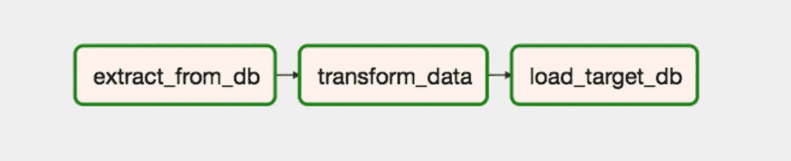

# 气流生成技巧—正确的任务(非 DAG)追赶

> 原文：<https://pub.towardsai.net/airflow-production-tips-proper-task-not-dag-catchup-c6c8ef1f6ba7?source=collection_archive---------0----------------------->


照片由[杰克森煨](https://unsplash.com/@simmerdownjpg?utm_source=medium&utm_medium=referral)在 [Unsplash](https://unsplash.com?utm_source=medium&utm_medium=referral)

Apache Airflow 已经成为数据编排的事实标准*de**。然而，随着时间的推移和版本的变化，它积累了一系列的细微差别和错误，这可能会阻碍它在生产中的使用。*

*这一系列文章旨在引导 Apache Airflow 用户克服这些问题，也就是我所面临的问题。*

> *注意:像往常一样，所有的代码都可以在我的 GitHub 资源库中获得，这里的[](https://github.com/Guilherme-B/airflow-utils)*。**

# **正确的任务(非 DAG)追赶**

> ****TLDR** : Airflow 获取上一个成功的 TaskInstance 的日期的能力并没有像预期的那样工作，而是返回上一个成功的 DAG 的运行日期，这使得您无法准确和正确地获取缺失/失败的信息。在这篇文章中，你会发现如何绕过它。[见原 bug 报告](https://github.com/apache/airflow/issues/18116)。**
> 
> ****TLDR #2** : [点击这里直接跳到解决方案](#7cbe)**

# **问题陈述**

**Apache Airflow 最有趣和最有帮助的特性之一是它能够在任务失败时跟踪过去的情况。不，我指的不是可以在 DAG 中定义的 *catchup* 参数，而是赋予任务包含之前失败的 TaskInstances(及其执行日期)的能力，使用**

```
**{{ prev_execution_date_success }}** 
```

**JINJA 模板，或者直接访问状态为成功的前一个 TaskInstance:**

**当您想要确保您的数据在摄取中保持最新，或者您的 ETL 消耗当前和失败的过去任务实例的所有信息时，这尤其有用，例如:**

**extract_from_db、transform_data 和 load_target_db 任务的任务配置**

**在一个更实际的例子中，考虑到下面的图像，您会期望如果在使用上述配置时任务 *transform_data* 的第一次运行失败，那么失败/丢失的数据将在下一个小时的 *transform_data* 的下一次运行中被捕获，对吗？**

****

**简单的类似 ETL 的 DAG 由三个线性相关的任务组成**

**预期的事件循环:**

*   **循环 1
    –运行任务*提取 _ 自 _ 数据库，*捕获**一个**小时的数据，*状态* : **成功**
    –运行任务*转换 _ 数据，*转换**一个**小时的数据，*状态* : **失败**
    –运行任务*加载 _ 目标 _ 数据库，*加载**一个【1****
*   **循环 2
    –运行任务 *extract_from_db，* capture **一个**小时的数据，*状态* : **成功**
    –运行任务*transform _ data，*转换**两个**小时的数据(当前和先前失败)，*状态* : **成功**
    –运行任务*load _ target _ data***

> **不幸的是，这是不正确的。虽然这是显而易见的预期行为，但 Airflow 的遗留代码阻止了这种情况的发生。[见原 bug 报告](https://github.com/apache/airflow/issues/18116)。**

**下面分别是任务 *transform_data* 第一次和第二次运行的相应渲染模板:**

**第一次运行 *transform_data* 任务时实际呈现的模板——失败的任务**

**第二次运行 *transform_data* 任务时实际呈现的模板——不选择失败任务的执行日期时间**

**请注意，第二个任务不会补偿前面的失败。而是只传递自己之前的执行日期 param，***20221013t 010000***而不包括之前的成功运行，全补***20221013t 000000***。**

## **为什么会这样？**

**当之前的执行日期成功时，Apache Airflow 的默认行为是查看之前 DAG 的成功执行日期，而不是 TaskInstance 的成功执行日期，这实际上使您的 DAG 无法自动跟上，除非整个 DAG 失败。**

**那么，我们期待会发生什么呢？我们希望第二次运行时呈现的模板是:**

> **你可以在 StackOverflow 上看到[关于问题的原始 bug 报告](https://github.com/apache/airflow/issues/18116)，可以追溯到 2021 年甚至更久。**

# **解决方案**

**像许多其他 Python 框架一样，Apache Airflow 使用 ORM(对象关系映射器)来抽象对其后端数据库的访问。具体来说，通常的 [SQL Alchemy](https://www.sqlalchemy.org/) 项目已经被用来加速 Apache 气流。这允许我们直接访问元数据数据库，并根据我们的需求操作它。**

**我们问题的解决方案分为四个简单的步骤:**

1.  **根据指定的状态检索 *TaskInstance* 对象**
2.  **为提供的*任务*检索最后一个成功的*任务实例*实例**
3.  **为所提供的任务检索与最后一个成功的 *TaskInstance* 实例相关联的 *DAGRun***
4.  **用使用这些信息的能力武装我们的 DAG！**

**最后，添加了一个实际的部分示例来说明目标！**

## **步骤 1:根据指定的状态检索 TaskInstance 对象**

**第一步对应于能够查询 ORM 以检索数据库，从而检索对应于特定状态的最后一次 *TaskInstance* 运行:**

> **注意:该函数是一个一般化的函数，允许您选择您可能需要的任何特定状态**

**该函数是不言自明的，查询 *TaskInstance* ORM 对象并通过两个参数对其进行过滤:所需的查找状态和 *TaskInstance* 实例。**

## **步骤 2:检索所提供任务的最后一个成功的 TaskInstance 实例**

**利用前面定义的泛化，我们现在可以查询 ORM，只检索状态为 Success 的最后一次运行。**

## **步骤 3:为所提供的任务检索与最后一个成功的 TaskInstance 实例关联的 DAGRun。**

**追踪到最后一个成功的 *TaskInstance* 实例后，我们现在可以检索与所述 *TaskInstance* 实例相关联的 [*DAGRun*](https://github.com/apache/airflow/blob/main/airflow/models/dagrun.py) 对象。 [*DAGRun*](https://github.com/apache/airflow/blob/main/airflow/models/dagrun.py) 模型包含关于 ran *TaskInstance* 实例的信息以及大量有用的信息:**

**有了这些知识，我们现在可以检索与我们检索到的最后一个成功的 *TaskInstance* 实例相关联的 *DAGRun* 实例，过程与前面类似:**

## **步骤 4:让我们的 DAG 具备使用这些信息的能力！**

**最后，我们必须确保 Apache Airflow 知道我们的新功能，并可以将它们注入到 JINJA 引擎中。**

**我们可以通过导入函数并将用户定义的函数直接传递给 DAG 的构造函数来实现这一点，在本例中，通过上下文管理器:**

**现在，您可以在 JINJA 中自由地直接调用该函数，并将其作为参数传递给您的提取、ETL 或任何其他进程！**

> **如果你觉得这些资源有用，请在评论中告诉我，像往常一样，你可以在我的 [GitHub 库](https://github.com/Guilherme-B/airflow-utils)中找到这些代码！**