# 用 Python 中的随机时间序列算法进行航班乘客预测

> 原文：<https://pub.towardsai.net/airline-passengers-prediction-using-my-stochastic-time-series-algorithm-from-scratch-in-python-378d22ae0cf?source=collection_archive---------0----------------------->

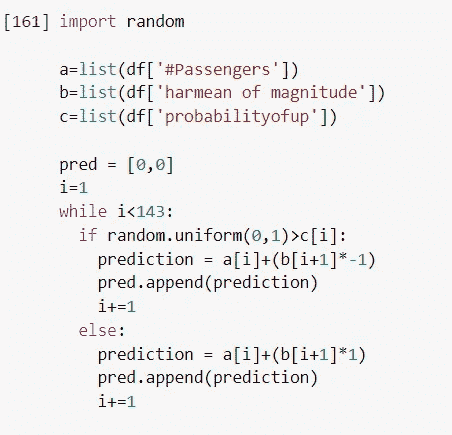

我的随机时间序列算法——Ashutosh Malgaonkar

[](https://medium.com/subscribe/@ashu.malgaonkar) [## 每当 Ashutosh Malgaonkar 发布时收到电子邮件。

### 每当 Ashutosh Malgaonkar 发布时收到电子邮件。通过注册，您将创建一个中等帐户，如果您没有…

medium.com](https://medium.com/subscribe/@ashu.malgaonkar) 

Github 链接到我的代码:

[https://github . com/ashm 212/random-Time-Series/blob/122 ef 2 e 5 ce 861d 3 a 97 db 6 be 633799317 be 91 e 892/random _ Time _ Series . ipynb](https://github.com/ashm212/Stochastic-Time-Series/blob/122ef2e5ce861d3a97db6be633799317be91e892/Stochastic_Time_Series.ipynb)

## I .使用 Kaggle API 从 Kaggle 访问数据

## 二。算法

> a.数据帧的输入
> 
> b.幅度编程
> 
> c.编程方向概率
> 
> d.随机预测编程

## 不及物动词制图(https://www . geeks forgeeks . org/how-to-plot-time series-based-charts-using-pandas/)

## 七。multidimensional assessment of philosophy of education 教育哲学的多维评价

## I .从 Kaggle 获取数据

我用 Kaggle API 访问了数据。这部分代码来自 StackOverflow，作者分享了访问 Kaggle 数据的一般步骤。我引用了他的代码的链接，但我也将在本文中详细介绍它。这些步骤对于任何数据集来说都很正常。

```
[https://colab.research.google.com/drive/1DofKEdQYaXmDWBzuResXWWvxhLgDeVyl](https://colab.research.google.com/drive/1DofKEdQYaXmDWBzuResXWWvxhLgDeVyl)
```

现在，让我们预演一下这个项目是如何发生的:

首先，去 kaggle.com，进入你的账户页面。向下滚动到 API 部分，如下图所示。单击“创建新的 API 令牌”。这会将一个名为 kaggle.json 的文件下载到您的计算机上。


接下来，转到您的协作笔记本:

```
from google.colab import files
files.upload()
```

运行上面的代码块。这里也有一张图片:


当你运行它时，你会得到一个选择文件的选项，通过它，你可以选择上面刚刚下载到你电脑上的 kaggle.json 文件。

一旦你这样做了，它就会像上图一样说 100%，现在你就连接上 kaggle 了。

接下来，运行这个代码块，看看是否有一个文件。

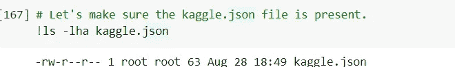

现在已经检测到 kaggle.json 文件，请在下一个块中键入:

```
!pip install -q kaggle
```

接下来，我们必须使用 mkdir 移动该文件，并按照引用的教程中所述进行权限更改:

```
# The Kaggle API client expects this file to be in ~/.kaggle,# so move it there.!mkdir -p ~/.kaggle!cp kaggle.json ~/.kaggle/# This permissions change avoids a warning on Kaggle tool startup.!chmod 600 ~/.kaggle/kaggle.json
```

现在你将被连接。现在，您可以使用下面的命令列出所有 kaggle 数据集，以便查看它们:

```
# List available datasets.!kaggle datasets list
```

它看起来会像这样:

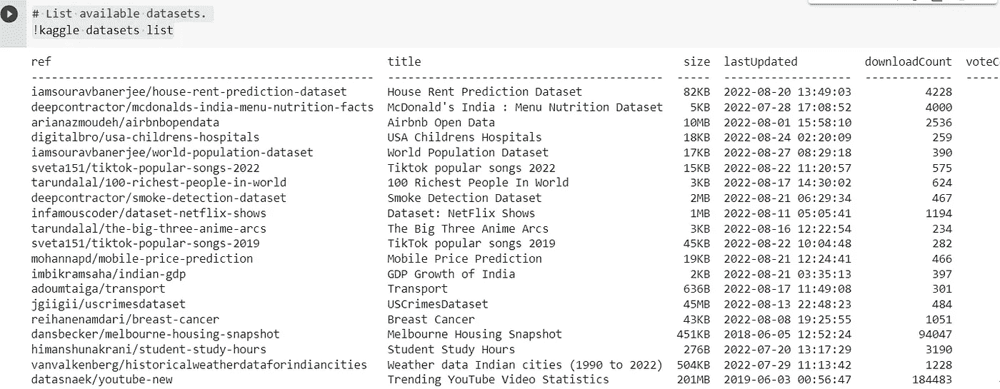

接下来进入[https://www . ka ggle . com/datasets/ternary realm/airlines-passenger-data](https://www.kaggle.com/datasets/ternaryrealm/airlines-passenger-data)

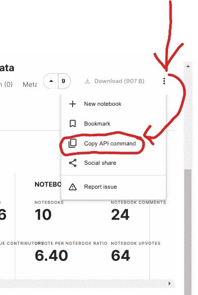

接下来，将其粘贴到:

```
!kaggle datasets download -d chirag19/air-passengers
```

运行后，我们可以使用！ls 列出文件:

```
!ls
```

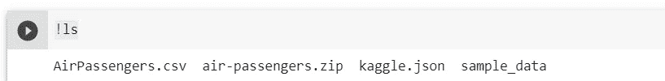

使用以下方法解压缩数据:

```
! unzip /content/air-passengers.zip -d /content/
```

现在，我们可以开始了…

## 二。

## a.数据帧的输入

现在，数据已经在 google collab 中，我们将把它放入一个数据框架中进行处理:

```
import pandas as pddf = pd.read_csv('AirPassengers.csv')
```

让我们来看看这些数据是否正确:

```
df.head()
```

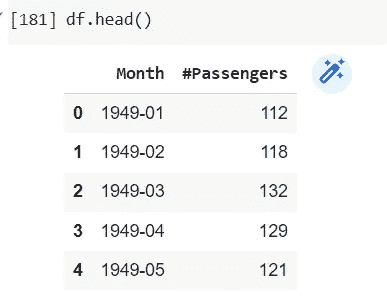

以上是前五行，看起来像我们想要的那样。

## b.编程幅度

穿越时间的东西有两个属性:

单向

2 级

在这种情况下，幅度是随着月份的变化而变化的步长。让我们对它进行编程:

首先，我将把第 2 列转换成如下所示的列表:

```
a = list(df['#Passengers'])print(a)
```

然后，我写了这个算法，通过数据计算步长:

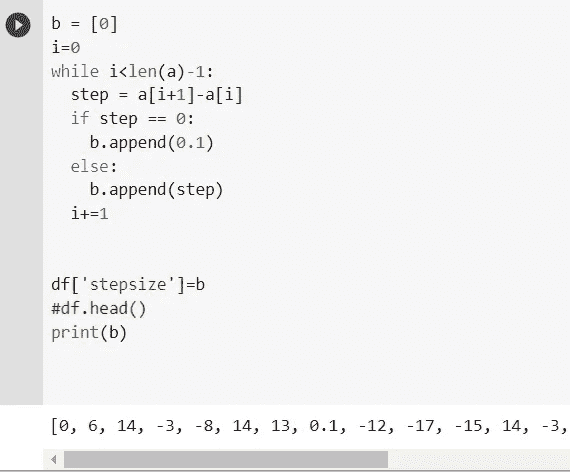

让我们浏览一下上面的代码来理解发生了什么。

> 首先，我初始化了一个值为 0 的列表。这是因为，底部的第一个单元格没有步长，**它是起始值，之前没有值，所以直到它的变化幅度为 0。**

接下来，我初始化了一个变量 i=0。这样做是为了在遍历列表时以索引值 0 开始循环。

然后，我开始一个 while 循环来计算列表中的步长，直到它到达 len(a)-1

在循环内部，我计算特定 I 指数的步长。步长就是下一个值减去循环当前的值。

```
step = a[i+1]-a[i]
```

下一部分，我陈述了一些逻辑，如果步长的值为 0，那么将它设置为 0.1。我这样做的原因是我在计算中使用了调和平均值。调和平均值不能使用 0 值，在这里，因为步长的大小通常远离 0，所以我可以将其设置为 0.1 这样的低值，而不会对算法产生太大影响。

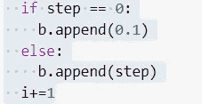

我在这里所做的基本上是将步骤添加到空列表 b 中，随着循环的进行，它会变得更长。最后是 i+=1，它将循环向前推到终点。

之后，让我们将它放回数据帧中，然后检查前几行:

```
df['stepsize']=bdf.head()
```

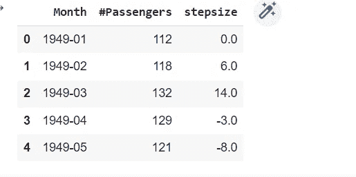

现在，我们可以在一列中看到步长。

接下来，我将把列表 b(步长列表)中的值转换成绝对值:

同样，这样做的原因是为了确保我可以计算调和平均值:

```
#make an absolute value list:
c=[]
for i in b:
     c.append(abs(i))
```

现在，我编写了另一个 while 循环算法，使调和平均值在序列中传播:

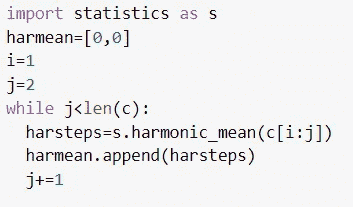

首先，我导入了统计包，然后用 0，0 创建了一个列表，以跳过数据集的第一行和第二行。然后我做了两个指针 I 和 j，我会保持在 1，j 会遍历这个序列，并把它添加到我用两个 0 初始化的 harmean 列表中。**为了向前移动循环，注意我只是向前移动 j 指针，保持 I 指针不动。**

> **为了向前移动循环，注意我只是向前移动 j 指针，保持 I 指针不动。**

让我们把它扔回到数据框架中:

```
df['harmean of magnitude'] = harmean
```

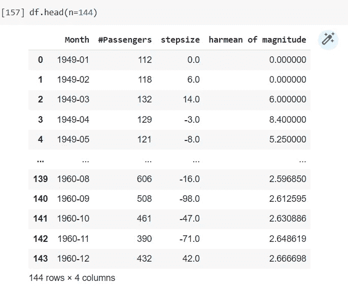

以上是看起来的样子。

## C.规划方向

现在，是时候通过计算先验概率来引入随机性了。然而，在这里我们将不得不再次编写一个向前传播的算法:

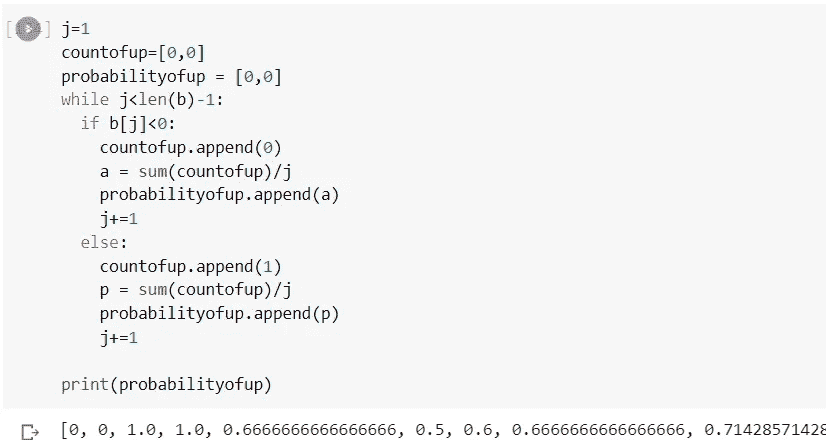

让我们看看我是如何通过实现上面的算法来解决这个挑战的。

首先，我通过初始化变量 j = 1 来设置一个指针。接下来，我建立了两个列表。第一个名为 countofup，当步长为正数(向上)时将被附加 1，当步长为负数时将被附加-1。我要开始的另一个列表是概率。这将在**前 n 步中附加上概率 up。**

```
df['probabilityofup'] = probabilityofup
```

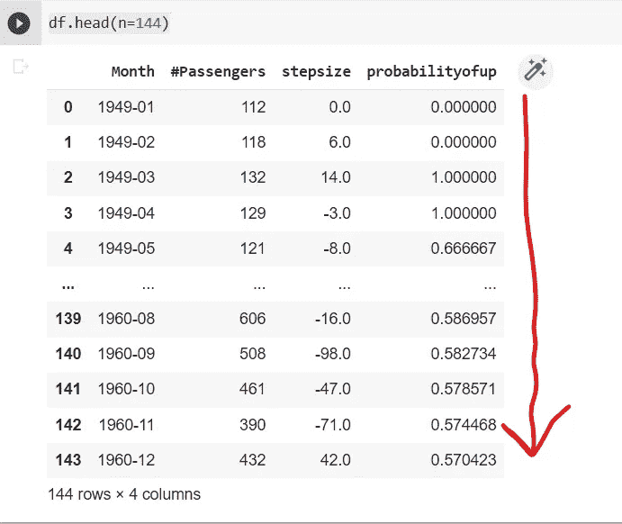

## d.随机预测编程

接下来，我创建了这个随机算法来输出预测:

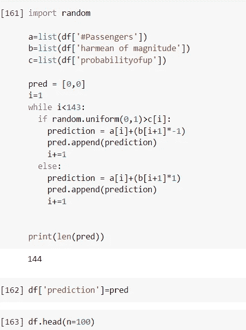

首先，我提取三列作为列表。我从 dataframe #passengers 中提取 actuals 列，并将其放入列表 a。然后，在列表 b 中，我存储幅度列的谐波平均值(前面显示的算法)。接下来，在列表 c 中，我放置 up 列的概率(前面显示的算法)。

然后我创建了一个有两个零的列表，叫做 pred。

我在 i = 1 处启动一个指针，这是预测输出中的第一个值。公式是:

```
**Prior actual value + (harmonic mean of previous magnitues * (if a random number between 0 and 1 is greater than the prior probability of up then -1 else 1))** 
```

while 循环算法将此公式传播到数据的最后一行。

一旦循环结束，我们将把它放入 pred，然后输出 df。

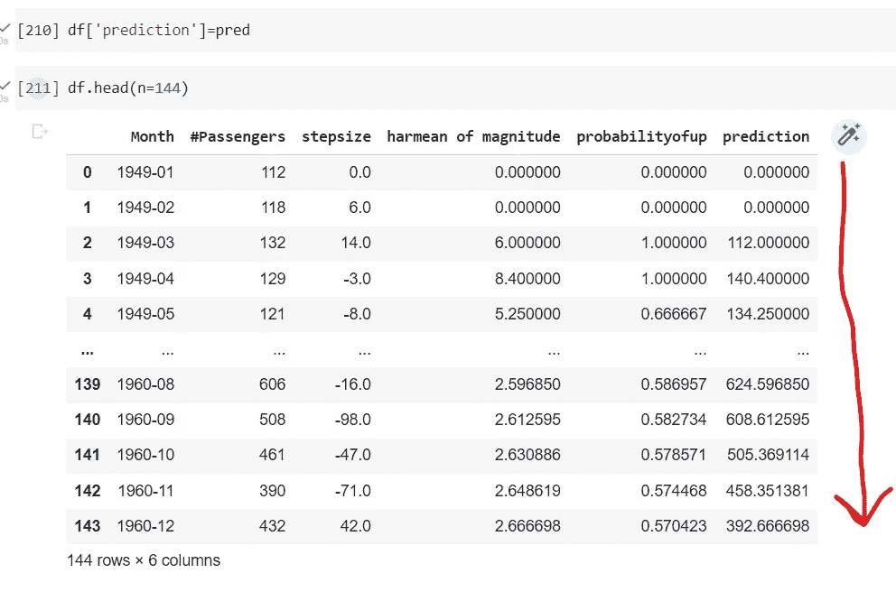

## 不及物动词制图([https://www . geeks forgeeks . org/how-to-plot-time series-based-charts-using-pandas/)](https://www.geeksforgeeks.org/how-to-plot-timeseries-based-charts-using-pandas/))

绘制预测和实际图表的代码基于 geeksforgeeks→[https://www . geeksforgeeks . org/how-to-plot-time series-based-charts-using-pandas/](https://www.geeksforgeeks.org/how-to-plot-timeseries-based-charts-using-pandas/)的这个页面

下面是我如何实现 geeksforgeeks 代码的:

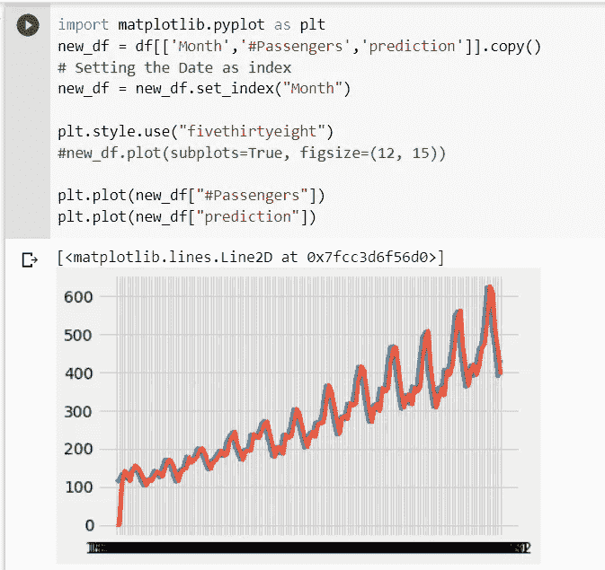

## 七。multidimensional assessment of philosophy of education 教育哲学的多维评价

接下来，我们将在每一行用这个来计算 MAPE。本质上，该公式计算实际值和预测值之间的绝对差值，然后除以实际值。将它乘以 100，我们得到每行的绝对百分比误差。MAPE 是每行误差百分比的平均值。

```
#MAPEnew_df['abspercent diff'] = (abs(new_df['#Passengers']-new_df['prediction'])/new_df['#Passengers']) * 100
```

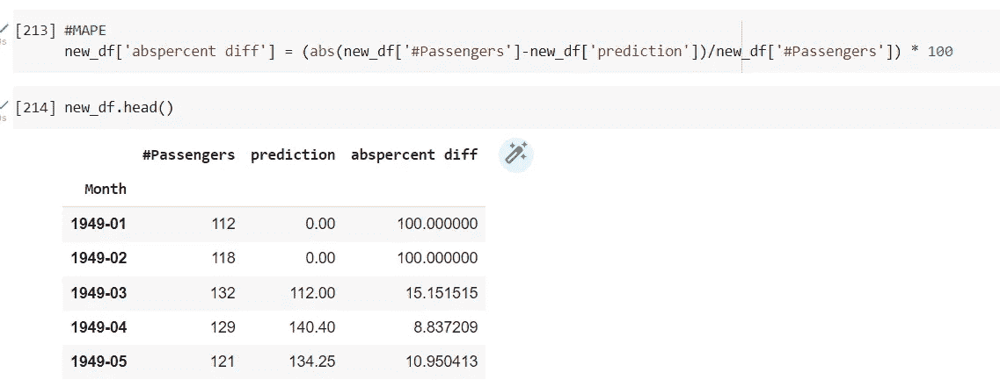

现在，我们将计算 MAPE，并使用以下代码将其打印出来:

```
mape = "The mape is"print("The mape is " + str(new_df['abspercent diff'].mean()) + " %")
```

运行这个程序后，我们看到 MAPE 大约为 10.48%。

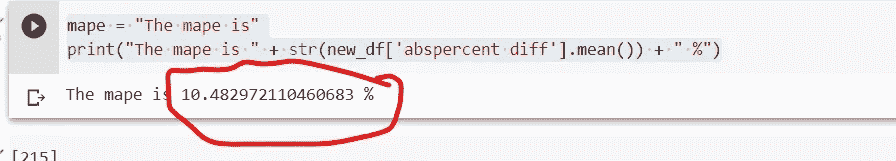

感谢您阅读我的作品。

引用:

1.  [https://colab . research . Google . com/drive/1 dofkedqyaxmdbzuresxwwvxhlgdevyl](https://colab.research.google.com/drive/1DofKEdQYaXmDWBzuResXWWvxhLgDeVyl)
2.  [https://www . geeks forgeeks . org/how-to-plot-time series-based-charts-using-pandas/](https://www.geeksforgeeks.org/how-to-plot-timeseries-based-charts-using-pandas/)
3.  [https://www . ka ggle . com/datasets/ternary realm/airlines-passenger-data](https://www.kaggle.com/datasets/ternaryrealm/airlines-passenger-data)

再次链接到我的 GitHub:

[https://github . com/ashm 212/random-Time-Series/blob/122 ef 2 e 5 ce 861d 3 a 97 db 6 be 633799317 be 91 e 892/random _ Time _ Series . ipynb](https://github.com/ashm212/Stochastic-Time-Series/blob/122ef2e5ce861d3a97db6be633799317be91e892/Stochastic_Time_Series.ipynb)