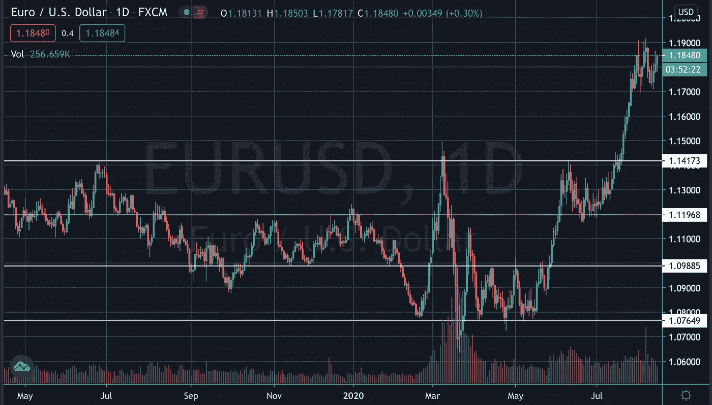
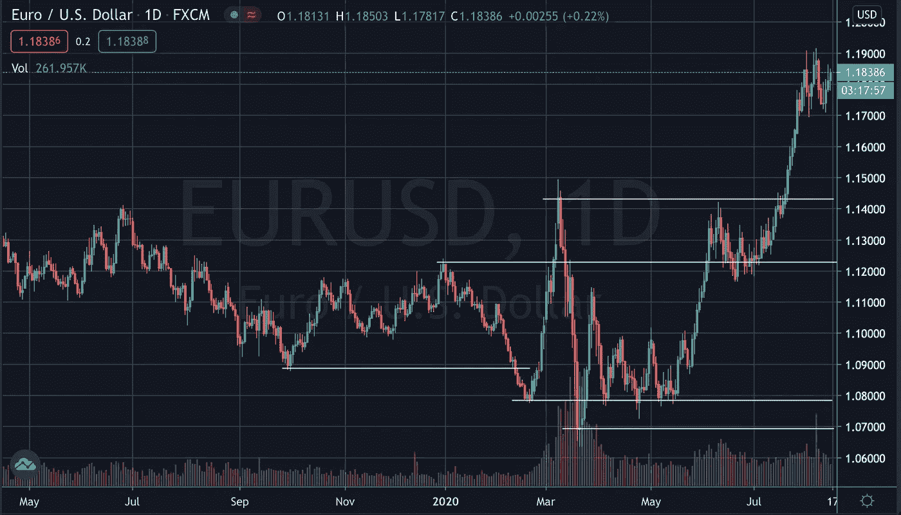
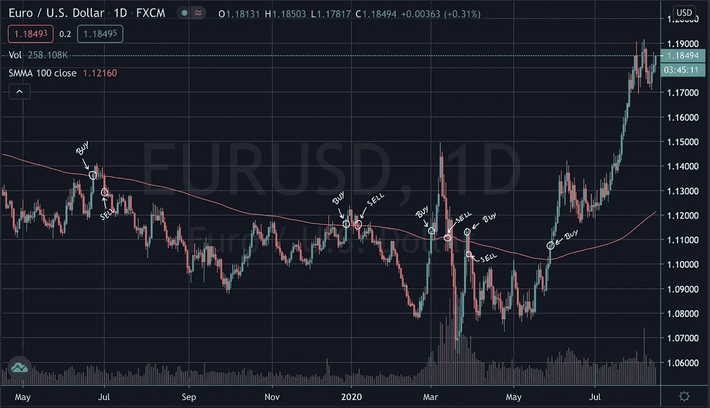
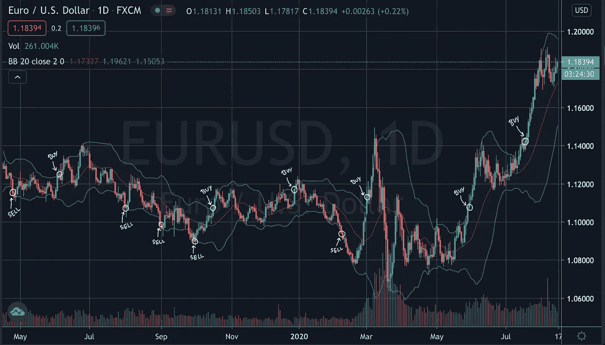

# 算法交易模型——突破

> 原文：<https://pub.towardsai.net/algorithmic-trading-models-breakouts-4f73c6aadde5?source=collection_archive---------1----------------------->

## [数据可视化](https://towardsai.net/p/category/data-visualization)，意见

## 这是一系列文章中的第一篇，将着眼于产生算法交易模型背后的理论

图 1 — 15 个月的欧元/美元价格行为，绘制在日线图上。

## 介绍

*在这个系列中，我将总结一系列常用的技术分析交易模型，这些模型的数学和计算复杂性会稳步增加。通常，这些模型可能对波动或周期性工具最有效，如外汇对或商品，这是我对它们进行回溯测试的结果。这些模型背后的目标是它们应该是客观的和系统的，也就是说，我们应该能够将它们转换成一个交易机器人，它将在每个时间段开始时检查一些条件，并决定是否应该发布买入或卖出订单，或者是否应该关闭已经打开的交易。*

*请注意，并非所有这些交易模式都是成功的。事实上，他们中的很大一部分是不成功的。这个总结系列的唯一目的是描述不同类型的交易模型背后的理论，而不是关于你应该如何交易的金融建议。然而，如果你确实从这些文章中获得了一些灵感，并决定建立一个自己的交易机器人，请确保你正确地对样本数据内外以及虚拟账户中的真实数据进行了回溯测试。我将在后面的文章中介绍这些定义和我的测试策略。*

如前所述，本文将对交易模型进行总结。在另一个系列中，我将描述我们如何在 MetaTrader 用于金融市场算法交易的修改后的 C++语言)中编写一个交易机器人。

突破模型是最常用和讨论最多的技术策略之一，因为它们建立在最基本的技术分析方法、支撑和阻力之上。他们的最终目标是从价格突破这些水平中获利，理论是一旦他们突破，他们将继续朝着这个方向前进。

从算法交易的角度来看，决定我们何时交易是相当简单的，因为我们只有有限的选择，每个选择都有其优点和问题。当价格收盘高于阻力位时，我们可以发出买入市价单；当价格收盘低于支撑位时，我们可以发出卖出市价单。为了避免市场订单可能出现的假突破或假突破(当价格在支撑线或阻力线之外收盘，但随后反转，表明突破实际上没有发生)，我们可以在低于或高于 S&R 水平的某个值下止损单，这样当我们进入时，我们就可以确定我们已经抓住了突破。很自然，这个问题是，当我们开始交易的时候，我们可能已经错过了很大一部分。在另一种情况下，我们可以在交易前等待第二根蜡烛线来确认突破，但这和止损单方法有同样的问题。我们也可以使用限价单，在这种情况下，我们预计价格会略微回落到低于之前的水平，然后继续朝着原来的方向发展。从情感的角度来看，这种策略有一些优点。所有的交易者都有支撑位和阻力位，许多机构交易者，如银行，可能会在这些价位下大的限价单，试图扭转行情。如果在突破继续之前发生了一个小的反转，那么我们在一个更好的价格开始交易，这对我们自己是有利的。然而，这种策略有两个明显的问题。首先，我们达到了一个很高的 S&R 水平，反弹后，价格继续反转，此时我们进入了亏损交易。第二，在这个价位推动反转的交易者数量不足以使价格回到我们的限价水平，留给我们的是一个未激活的限价订单和一个如果我们进入交易就可以获利的价格。

在这种情况下，更难决定的因素是确立支撑位和阻力位。网上有很多视频教你如何直观地观察和绘制这些水平。他们首先查看较长的时间图，然后转向较短的时间图，反复绘制价格至少在两个不同的场合接触或接近的线。然而，这不是我们可以在算法交易中使用的方法，因为我们想要一个纯粹客观的方法来确定这些水平。

图 2——在欧元/美元日线图上识别 S&R 水平的直观方法

有几种方法可以做到这一点。我们可以在最后的 x 线中把支撑位标为最低点，把阻力位标为最高点。虽然这只需要一次“触价”，但它可以被认为是一个稍弱的水平，表明突破更有可能。动态水平也可以使用，用移动平均线，我们希望价格会突破。第三种方法是创建上下波段，比如布林线。在这种情况下，当我们看到一根棒线突破了其中一个波段，我们就在这个方向交易。如果我们想特别尝试和模仿传统的绘制 S&R 水平的视觉方法，我们可以考虑一些机器学习方法。对价格水平进行分组的聚类算法可以很好地指示我们将线放在哪里(即，x 个最频繁的价格聚类被认为是关键水平)。

图 3——典型的 S&R 水平，当在最后的 x 柱中寻找最大/最小收盘值时可能被绘制出来

图 4-使用 100 周期简单移动平均线(SMA)作为突破水平的策略

图 5——使用布林线作为动态突破水平的策略

突破模型的变化比我在这里描述的要多得多，从上面的图表中我们看到的多种伪装来看，增加复杂性似乎是必要的，即使它是一个小样本量。然而，我们在这里所拥有的是一个可以继续发展的基础。突破模型的基本原则是定义支撑位和阻力位，当这些位被突破时交易。定义这些级别的方法，使用的交易入口的类型，以及设置的止损点都是由详尽的迭代、研究和测试决定的。我已经设计并回溯测试了大约 10 个突破模型，我将在接下来的文章中更详细地概述其中的几个，特别是在编码方面，这样您就可以清楚地看到如何自己制作这些模型。