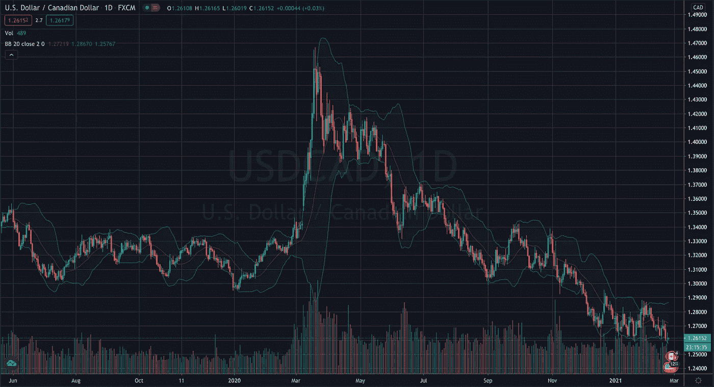
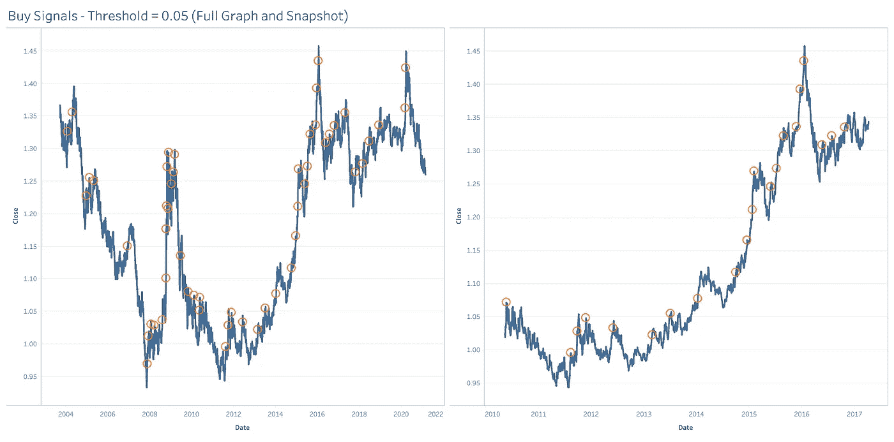
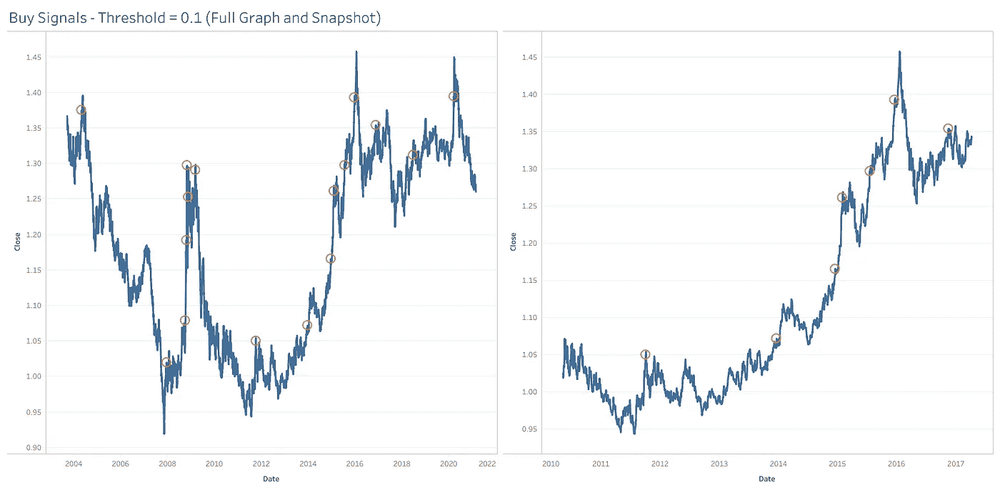
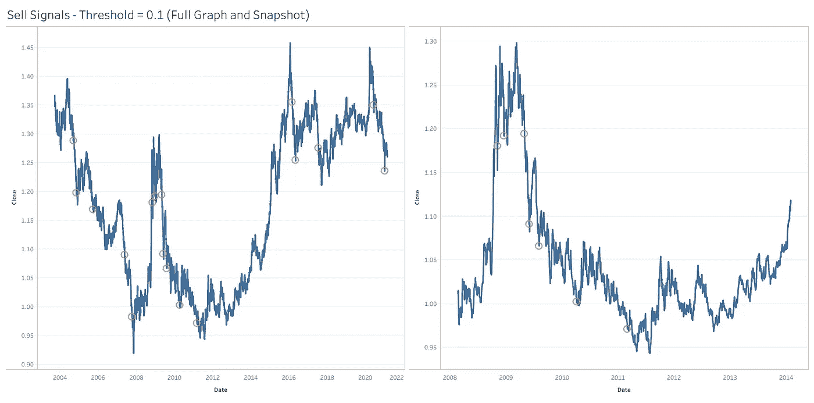

# 算法交易模型—累积和过滤器

> 原文：<https://pub.towardsai.net/algorithmic-trading-models-cumulative-sums-filter-e2200ff45ef1?source=collection_archive---------0----------------------->

## [数据可视化](https://towardsai.net/p/category/data-visualization)


由[德文·艾弗里](https://unsplash.com/@devintavery?utm_source=unsplash&utm_medium=referral&utm_content=creditCopyText)在 [Unsplash](https://unsplash.com/s/photos/filter?utm_source=unsplash&utm_medium=referral&utm_content=creditCopyText) 上拍摄的照片

在本系列的第六篇文章中，我们将继续总结一些常用的技术分析交易模型，这些模型的数学和计算复杂性将稳步增加。通常，这些模型可能对波动或周期性工具最有效，如外汇对或商品，这是我对它们进行回溯测试的结果。这些模型背后的目标是它们应该是客观的和系统的，即我们应该能够将它们转换成一个交易机器人，它将在每个时间段开始时检查一些条件，并决定是否应该发布买入或卖出订单，或者是否应该关闭已经开放的交易。
请注意，并非所有这些交易模式都是成功的。事实上，他们中的很大一部分是不成功的。这个总结系列的唯一目的是描述不同类型的交易模型背后的理论，而不是关于你应该如何交易的金融建议。然而，如果你确实从这些文章中获得了一些灵感，并决定建立一个自己的交易机器人，请确保你正确地回测了你的策略，包括样本数据的输入和输出，以及虚拟账户中的真实数据。我将在后面的文章中介绍这些定义和我的测试策略。

## 介绍

本文将继续我们对构建算法交易模型的研究，在接下来的段落中，我将详细介绍 CUSUM 过滤器，它使用价格或回报的累积和来检测我们的时间序列的平均值是否发生了变化。均值回归是金融分析中的一个常见话题，许多模型都建立在数据在偏离一段时间或特定距离后最终会回到平均值的前提下。通常，当市场波动时，这些策略会取得成功，但当它们形成趋势时，我们需要不同的方法。



1.5 年的美元兑加元价格

运行均值回归策略最常见的方法之一是使用布林线。该策略绘制了 3 条线，一条 20 周期移动平均线和前 20 个值的移动平均线+/- 2 标准差。因此，当价格变得更加不稳定时，波动幅度将会扩大，当价格变得更加稳定时，波动幅度将会缩小。上述 USDCAD 图表中 2019 年 6 月至 2020 年 3 月期间显示的是区间。布林线收缩，我们可以看到均值回归策略的潜力。当外汇汇率触及布林线顶部时，我们会卖出，反之亦然。

接下来的时间直观地解释了替代策略的必要性，因为利率开始趋势化，我们的均值回归策略失效了。该比率持续突破顶部波段。如你所见，达到了一个新的平均值，我们需要重新评估我们解读市场的方法。

## 方法学

为了识别我们的市场趋势，我们将设置一个阈值，如果我们的累计差额突破该阈值，我们将据此买入或卖出。它类似于布林线，但在这种情况下，我们专门寻找突破，而不是反转。我们试图抓住一个尽可能接近源头的趋势，乘着这个势头，直到我们决定结束。

我们将从计算价格差异开始。然后循环遍历数据集并创建两列，一列用于累积正值，另一列用于累积负值。在每次迭代中，当在肯定列表中时，我们将把每一行的值指定为 *(0，positive_sum[i-1] + diff[i])* 的最大值。

让我们进一步分析一下。在每个时间段，我们会计算当前收盘价与前一个时间段结束时的收盘价之间的差异。如果这是正数，我们将把它加到前一个时间段的累计价格总和中。如果这个值是负的，以至于我们的累计总和小于 0，那么我们将列值赋为 0。这是我们让我们的积极运行达到的最小值，本质上表示我们的势头“回到起点”，因为势头已经失去。这有助于我们区分区间市场和趋势市场。如果市场在波动，当它开始反转时，我们的累积和模型将重置。

我们用负值重复同样的过程，但是这次我们取 *min(0，negative_sum[i-1] + diff[i])* 。这里的原则是一样的，我们在寻找一个方向的持续运动期，这样我们就可以将市场归类为趋势。

一旦我们有了这些值，我们就设置了阈值。这将需要一些微调，因为不同的市场以不同的速度波动，没有硬性规定你设置的阈值。视觉测量在这里是最好的，你可以试着用不同的值，看看信号的准确性。在下面的结果中，我使用 USDCAD 价格包含了阈值为 0.1 和 0.05 的信号副本。当 positive_sum 变量超过正阈值或 negative_sum 变量低于负阈值时，就会产生信号。生成信号日期的代码改编自*金融机器学习进展(2018)* ，如下所示。

```
#Dataset should have columns [‘Date’,’Close’]
def getDates(dataset,treshold):
 posDates,negDates = [],[]
 pos_sum,neg_sum = 0,0
 dataset[‘Differences’] = dataset[‘Close’].diff()
 for i,r in diff[1:].iterrows():
  pos_sum = max(0,pos_sum + r[‘Difference’])
  neg_sum = min(0, neg_sum + r[‘Difference’])
  if pos_sum > threshold:
   pos_sum = 0 #Reset
   posDates.append(r[‘Date’])
  elif neg_sum < -h:
   neg_sum = 0 #Reset
   negDates.append(r[‘Date’])
 return posDates,negDates
```

## 结果

我用原始价格和退货数据运行了这个模型。在这篇文章中，我将展示原始的价格信号，并将很快发表另一篇文章，展示退货数据。这是因为我们需要对这个模型稍加修改，以包含退货数据，我将在那篇文章中对此进行更详细的解释。我认为在我们讨论适应性之前，理解这个算法的基本原理本身是很重要的。
下图显示了 4 种不同的场景，阈值为 0.1 和 0.05 的买入和卖出信号。



0.05 阈值买入信号


0.05 阈值的卖出信号



买入信号为 0.1 阈值



0.1 阈值的卖出信号

这些图表带来了一些令人惊讶的结论。这个模型自然不是完美的，我们也不应该期望它是完美的，因为它是为了在特定类型的市场表现中取得成功而设计的。
首先，0.05 的门槛似乎太低了。有太多时候，模型以令人难以置信的准确度识别出迷你顶部或迷你底部。有趣的是，低门槛实际上可能是一种调整市场的方法。当投资者两边平衡时(当市场波动时，他们会这样)，用 0.05 的阈值反转信号有可能盈利，因为我们可以利用这些小波动。
0.1 的阈值似乎是对我们正在寻找的信号类型的更好的估计。我们每个仪表盘中的第二张图显示了各自上升趋势和下降趋势期间的快照。当价格上涨时，我们的模型很早就发现了这种变化，我们可以从中获利。在下跌趋势中寻求卖出时，情况是一样的。为了把这变成一个合法的交易策略，我们可以增加一些条件来帮助识别一个时间序列何时离开它的范围阶段，但是最初的 EDA 显示了一些有希望的可能性。

我将在下一篇文章中包括使用回报来识别动量的结果，因为这需要对我们当前的模型进行一点调整，以便识别高于预期值的回报。

感谢您花时间阅读这篇文章。如果你喜欢这些内容，我将推出一份新的算法金融时事通讯，名为 Algo Fin，你可能会感兴趣。这篇时事通讯将探索数据科学和金融之间的联系，最初的重点是货币市场，但我希望在未来建立更多的途径。时事通讯目前是免费加入的，因为我仍计划为付费订户推出，所以如果这听起来像是你可能感兴趣的东西，它绝对值得查看[这里](https://algofin.substack.com/p/coming-soon)！。