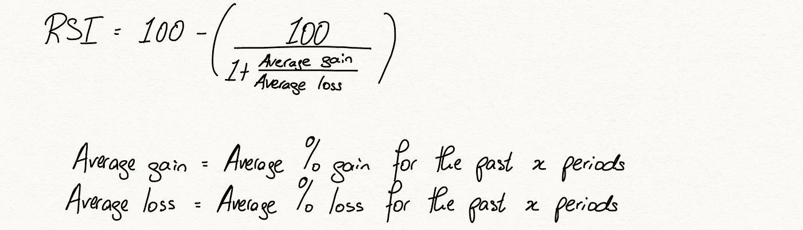
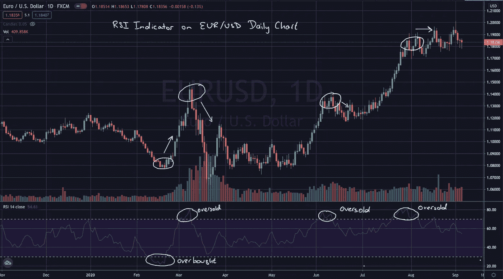
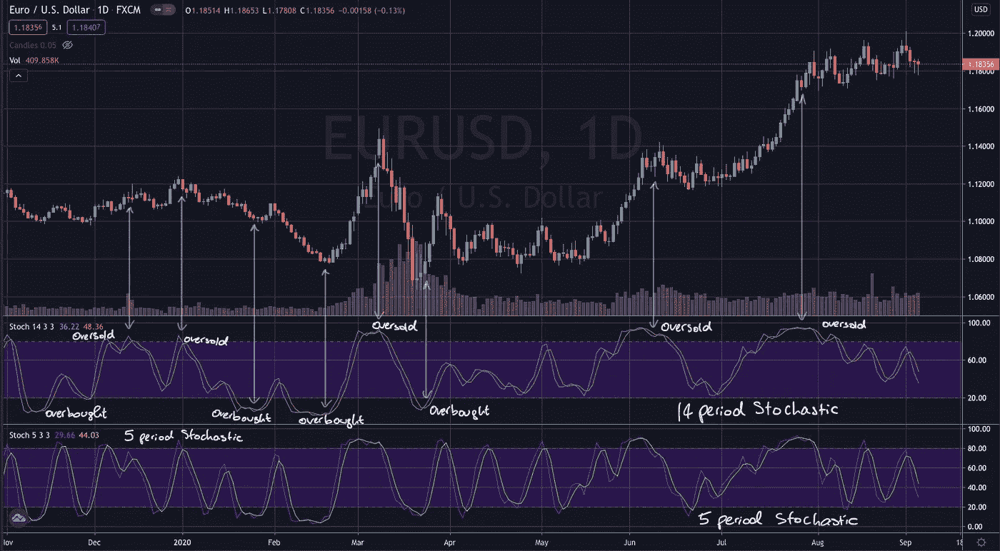
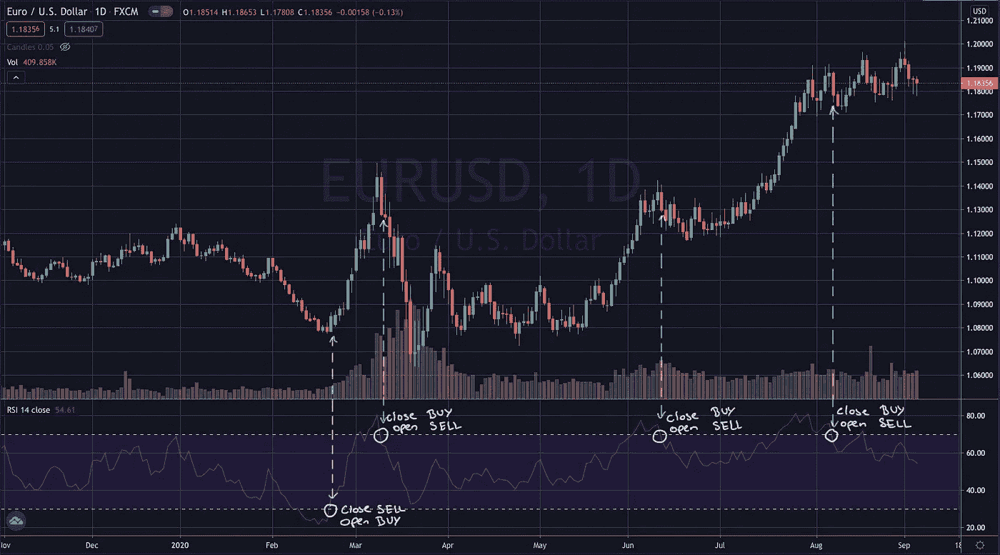
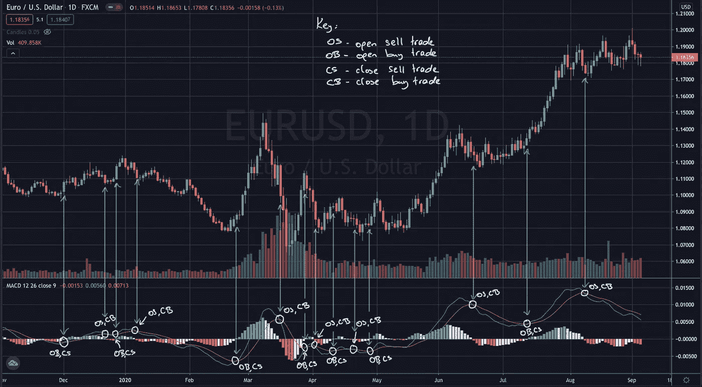

# 算法交易模型——振荡指标

> 原文：<https://pub.towardsai.net/algorithmic-trading-models-oscillators-d79e52300efa?source=collection_archive---------3----------------------->

## [数据可视化](https://towardsai.net/p/category/data-visualization)

欧元/美元日线图上的 MACD 指标

*在本系列的第三篇文章中，我们将继续总结一些常用的技术分析交易模型，这些模型的数学和计算复杂性将稳步增加。通常，这些模型可能对波动或周期性工具最有效，如外汇对或商品，这是我对它们进行回溯测试的结果。这些模型背后的目标是它们应该是客观的和系统的，即我们应该能够将它们转换成一个交易机器人，它将在每个时间段开始时检查一些条件，并决定是否应该发布买入或卖出订单，或者是否应该关闭已经开放的交易。*

*请注意，并非所有这些交易模式都是成功的。事实上，他们中的很大一部分是不成功的。这个总结系列的唯一目的是描述不同类型的交易模型背后的理论，而不是关于你应该如何交易的金融建议。然而，如果你从这些文章中获得了一些灵感，并决定建立一个自己的交易机器人，请确保你正确地回测了你的策略，包括样本数据的输入和输出，以及虚拟账户中的真实数据。我将在后面的文章中介绍这些定义和我的测试策略。*

当我们增加算法交易模型的复杂程度时，我们会把振荡指标加入我们的策略库。与我们以前的模型相比，振荡指标需要更多的数学来计算，但是大多数自动交易软件应该有内置的例子来帮你计算。

我们将从定义什么是振荡器，什么使它们有效，以及用来计算一些常用振荡器的公式开始这篇文章。然后，我们将查看交易策略的潜在设置，讨论我们退出交易的选项，并包括一些图表，以更好地说明这些策略如何形成实际的货币对。

# 定义振荡器

在传统物理学中，振荡器是产生连续波形的电路[1]。这个定义稍微适用于金融市场，在金融市场中，我们将振荡器定义为在固定范围内或特定值附近波动的指标，通常用于表示资产的强弱时刻。本质上，许多振荡指标的目的是表示当前价格相对于一组 x 个以前的价格，以确定是买方还是卖方在控制。振荡指标通常和超买超卖区间以及供求理论一起使用，试图预测未来的走势。现在让我们仔细看看。

举个例子，我们来看看相对强弱指数，或者说 RSI 指标。我稍后会解释这个指标的计算，但现在我们需要知道的是，这个指标在 0 到 100 之间波动，高于 70 的值传统上意味着资产处于超买状态，低于 30 的值意味着资产处于超卖状态，这两个值往往先于趋势反转。他们为什么这样做？

一个原因是价格行为。在持续一段时间的买入或卖出后，尤其是波动的市场，如外汇或大宗商品，会经历回调，有时回调的幅度足以启动趋势反转。振荡指标被设计成分别代表超买和超卖区域，这就是为什么当我们的指标到达这些区域时，通常会有很多交易与趋势相反。

第二个原因是交易者情绪。记住每个交易者都可以获得任何资产的振荡值，这一点很重要。当一个振荡指标进入我们的重要区域时，交易者会立即得到警告。许多机构可能在这些区域设置了触发器，一旦振荡指标返回期望值，就开始交易。

说了这么多，我们来看看一些常用的振荡器。

# 振荡器

## 相对强度振荡器(RSI)

相对强弱指标(RSI)是 J. Welles Wilder Jr 于 1978 年推出的一种振荡器[2]，它在 0 到 100 之间波动，以呈现看涨或看跌势头，并指示潜在的反转区。它使用以下公式计算:

相对强度指数计算

通常，我们对 RSI 使用 14 个周期的回顾。例如，如果在过去的 14 个周期中，我们有 10 个平均涨幅为 1.1%的上涨者和 4 个平均跌幅为 0.5%的下跌者，我们的 RSI 指标计算将返回 68.75。下图显示了 RSI 指标如何与市场高点和低点相匹配。

欧元/美元日线图上的 RSI 设置

## 随机振荡器

随机振荡器旨在查看最近一段时间的收盘价，并返回一个值，该值代表该价格相对于前 x 个价格的值。就像 RSI 一样，它用于生成超买和超卖信号，但它的不同之处在于，这些信号分别在 80 和 20 水平生成。随机振荡器的计算如下[4]:

随机振荡器公式

随机振荡器的典型回看值包括 14 和 5。使用 5°回看可能会产生一些非常不稳定的信号，因此一定要小心分析。有时，这两个振荡指标可以一起用来确认反转或动量，如下图所示。

在许多图表中，你可以看到随机振荡图上的两条线。第一条线叫做%K 线，用上面的公式计算。第二条线是%D 线，是%K 线的 3 周期移动平均线。稍后，我们将研究涉及这两条路线的策略。

欧元/美元日线图上的 14 和 5 周期随机设置

## 移动平均收敛发散指标(MACD)

MACD 振荡指标与 RSI 和随机指标略有不同，当它振荡时，它围绕一个值振荡，具体来说是 0，没有上限或下限。类似于随机振荡器，MACD 也有两条线，第二条是第一条的滞后移动平均线。所谓的 MACD 线是通过从 12 周期指数移动平均线中减去 26 周期指数移动平均线计算出来的。在上涨势头中，我们预计 12 均线会大于 26 均线，我们将得到正的 MACD 值，反之亦然。在一个区间市场(一个没有明确方向的市场)，我们将看到 MACD 接近 0 线。如前所述，增加了另一条线，称为 MACD 图的信号线，是 MACD 线的 9 周期移动平均线。

# 战略

我将描述我们可以使用振荡器的两个潜在策略:

1.  超买/超卖趋势反转策略
2.  移动平均交叉策略

第一个策略利用我们的超买和超卖区域。我们首先要注意的是，我们的 MACD 没有这些区域。我们可以使用某种形式的近期波动计算来创建临时区域。从分析的角度来看，这可能是一个有趣的策略，看看动态的超买和超卖水平是否会产生更好的回报。

由此，我认为这种策略有两种可能。

第一种是在我们的振荡指标进入我们的某个区域后，一离开这个区域就交易。这个概念很重要。例如，如果一种资产是看涨的，我们知道在典型的情况下，随着 RSI 上升到 70 以上，买入压力可能开始消失。然而，这纯粹是为我们的交易设置的，而不是实际的触发器。我们还没有得到任何价格实际开始下跌的迹象，换句话说，我们还没有得到卖方正在上涨的消息。我们的振荡指标很有可能在一个重要的区域停留很长一段时间，因此我们应该只在我们知道反转开始时做趋势。对于这种交易，我们可以用通常的平均真实范围计算止损，或者当振荡指标进入相反的区域时(在我们的例子中，30 以下的超卖区域)。

超买/超卖趋势反转策略

我们可以使用超买和超卖区域的第二种方法是当我们在这些区域时寻找蜡烛线反转指标。用这种方法，我们避免了等待振荡指标穿越回区域，确保我们在一个更好的点进入交易。我将起草一篇文章来描述未来有用的烛台模式，但给你一个想法，当 RSI 返回大于 70 的值时，我们将寻找看跌蜡烛线(看跌 harami，shooting star 或看跌吞没等)，之后我们将进行卖出交易。看看上面的图表，看看你是否能在超买和超卖区域找到任何烛台模式。粗略地看一下，我可以看到在第一次买入交易中有一根看涨的蜡烛吞没，在接下来的两次卖出交易中有两根看跌的蜡烛吞没。

第二种方法是利用信号线和振荡线，类似于上一篇文章中的移动平均线交叉。MACD 和随机指标已经有了这些线，通过取 RSI 的 3 周期移动平均线，我们就有了所有三个振荡指标的线。标准规则随后就会出台。当振荡线穿过信号线时，进行买入交易，当振荡线穿过信号线时，进行卖出交易。我们的标准止损将会生效，也就是说，止盈和止损水平是平均真实范围的倍数，或者如果振荡指标显示位置反转。

移动平均交叉策略

这些是振荡器模型的基本原理。在后面的文章中，我们将研究如何在 MetaTrader 用于金融市场算法交易的修改后的 C++语言)中编写其中一个模型。

# 参考

[1][https://www.electrical4u.com/what-is-an-oscillator/](https://www.electrical4u.com/what-is-an-oscillator/)

[2]https://www.investopedia.com/terms/r/rsi.asp

[3][https://www . investopedia . com/terms/s/stochasticsoscillator . ASP](https://www.investopedia.com/terms/s/stochasticoscillator.asp)

[4][https://corporate finance institute . com/resources/knowledge/trading-investing/random-oscillator/](https://corporatefinanceinstitute.com/resources/knowledge/trading-investing/stochastic-oscillator/)