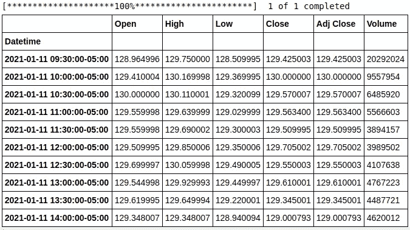
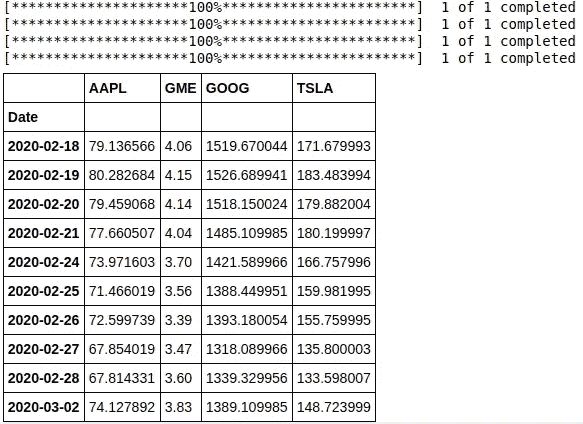
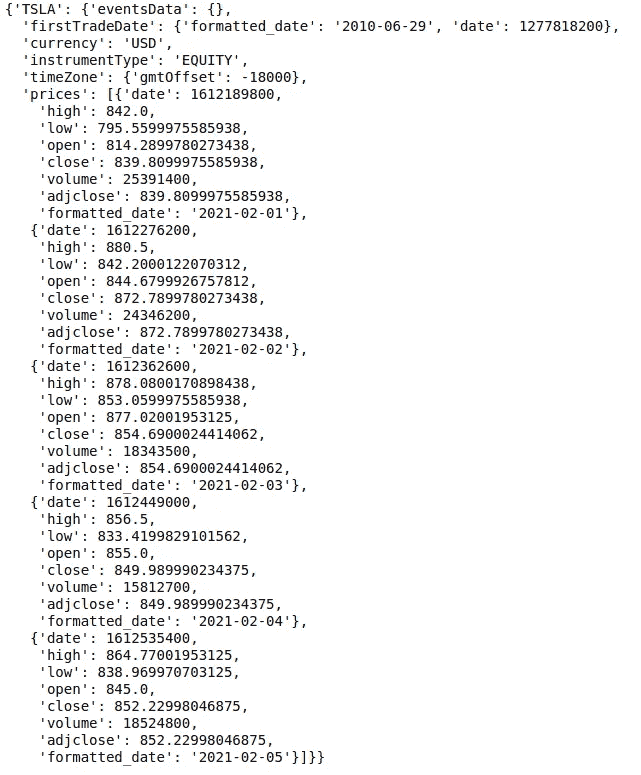
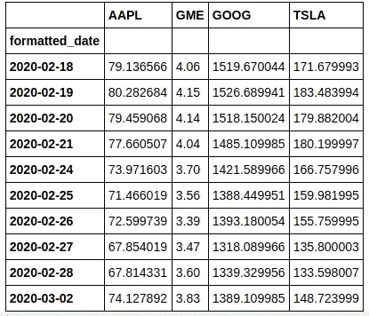
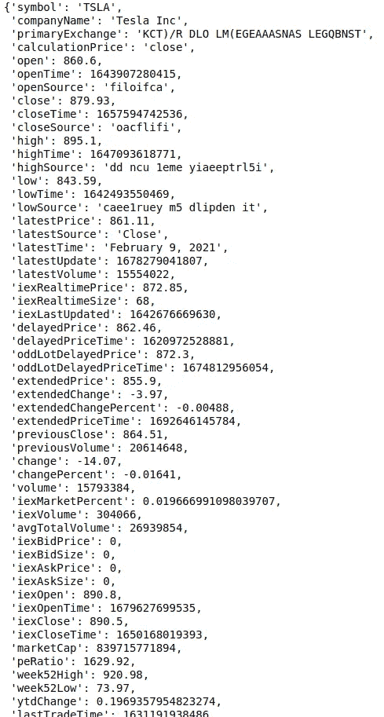

# 用 Python 和机器学习进行算法交易第 1 部分

> 原文：<https://pub.towardsai.net/algorithmic-trading-with-python-and-machine-learning-part-1-47c56706c182?source=collection_archive---------1----------------------->

## [机器学习](https://towardsai.net/p/category/machine-learning)，[编程](https://towardsai.net/p/category/programming)

## 什么是算法交易，如何获取交易数据


资料来源:unsplash.com

*** *注*** *:本文是系列的第一篇，以后还会有很多。开始这个系列背后的动机是将机器学习的知识与算法交易相结合，并为投资组合管理和交易构建健壮的应用程序。整个系列中提到的任何方法或策略都可能有不同的基本假设。作者不会对应用上述策略造成的财务损失承担任何责任，因为本系列的唯一目的是提供算法交易。此外，作者不属于任何提到的资源。* *

从柜台上的叫卖到移动应用，交易在过去的几十年里有了显著的进步。这一进步使得交易[股票](https://www.investopedia.com/terms/e/equity.asp)、[债券](https://www.investopedia.com/terms/b/bond.asp)、[ETF](https://www.investopedia.com/terms/e/etf.asp)、[CFD](https://www.investopedia.com/terms/c/contractfordifferences.asp#:~:text=A%20contract%20for%20differences%20(CFD)%20is%20an%20arrangement%20made%20in,goods%20or%20securities%20with%20CFDs.)等成为可能。，适用于所有人(取决于您居住的国家)。虽然经纪人提供的图形用户界面很容易使用，但在管理大型投资组合、参与日间交易、分析或跟踪大量金融工具等时，它会变得非常痛苦。这就是算法交易拯救我们的地方。

在这篇文章中，我们将讨论算法交易的基础知识和获取金融数据的不同方法。

**下面是我们要讲的内容:**

*   什么是算法交易
*   如何使用 Python 库和 API 获取金融数据

# 1.什么是算法交易

根据 Dorn 等人的观点，

> 金融市场交易是一项重要的经济活动。交易对于进出市场是必要的，把不需要的现金
> 投入市场，当需要钱的时候再兑换回现金。他们还需要在市场内转移资金，用一种资产交换另一种资产，管理风险，利用未来价格变动的信息。

算法交易没有统一的定义。尽管如此，它仍然可以被定义为不同金融工具的交易，如[股票](https://www.investopedia.com/terms/e/equity.asp)、[债券](https://www.investopedia.com/terms/b/bond.asp)、[ETF](https://www.investopedia.com/terms/e/etf.asp)、[差价合约](https://www.investopedia.com/terms/c/contractfordifferences.asp#:~:text=A%20contract%20for%20differences%20(CFD)%20is%20an%20arrangement%20made%20in,goods%20or%20securities%20with%20CFDs.)等。，用一些算法。在这种情况下，算法由数理逻辑和指令组成，用于分析金融数据并做出适当的交易决策。

算法交易背后的动机是在没有任何人工干预的情况下实现交易自动化。尽管算法交易需要持续的开发和回溯测试，但它可以大大减少人类交易的工作量。算法交易可以帮助管理任何数量的金融工具的投资组合，这对人类来说可能真的很难。它也没有人类的情感。尽管有这些优势，算法交易也有一些重要的风险，可能会导致真正的财务损失，我们将在本系列中详细探讨。

# 2.如何使用 Python 库和 API 获取金融数据

在这一节中，我们将探索许多获取分析和决策所需的财务数据的方法，这将在本系列文章中用到。

## 使用`[yfinance](https://github.com/ranaroussi/yfinance)`获取财务数据

安装`yfinance`库

```
pip install yfinance
```

让我们以 30 分钟为间隔获取 AAPL(苹果公司)过去一个月的数据



获取多只股票的调整后收盘价



## 使用 [yahoofinancials](https://github.com/JECSand/yahoofinancials) 获取财务数据

安装`yahoofinancials`库

```
pip install yahoofinancials
```

获取 TSLA (Tesla Inc .)的每日数据



获取多只股票的调整后收盘价



*注:以上两种获取数据的方法是免费的，足以获得[回溯测试](https://www.investopedia.com/terms/b/backtesting.asp)所需的基本财务数据。然而，算法交易依赖于实时数据来进行交易，这些库无法提供所需粒度级别的数据。此外，这些库由少数个人维护，就实时交易而言并不太可靠。因此，下一节将提到付费数据提供商。*

## 使用 [IEX 云](https://iexcloud.io/)获取财务数据

IEX 云提供了获取各种财务数据的 API。关于他们 API 的详细文档可以在[这里](https://iexcloud.io/docs/api/)找到。

要开始使用 IEX 云，请在此[页面](https://iexcloud.io/pricing/)的“开始”包下注册(免费开始)。注册后，按照此[页面](https://intercom.help/iexcloud/en/articles/2915433-testing-with-the-iex-cloud-sandbox)中提到的步骤设置沙盒环境，并获取 API 令牌以访问 IEX 云 API 获取数据。沙盒环境对于初始测试非常有用。它不提供实际数据，但是可以方便地测试我们获取数据的代码是否工作。此外，对于沙盒环境，API 调用的数量没有限制。

一旦你成功地设置了你的沙盒环境，如下所述将你的公共 API 令牌保存在`secret.cfg`文件中(记住，永远不要共享或发布你的`secret.cfg`文件。如果你将你的代码发布到 GitHub，那么将`secret.cfg`放在`.gitignore`中

建立`secret.cfg`文件后，按照下面的代码访问 TSLA(特斯拉公司)的数据(假的)



要访问真实数据，将`secret.cfg`文件中的令牌改为真实令牌，并使用上面代码片段中提到的基本 URL

```
https://cloud.iexapis.com/v1/
```

这就把我们带到了本文的结尾。你可以通过[这里](https://github.com/mayank311996/blog_code/tree/main/algo_trading_with_python_and_ml/part1)访问一个 Jupyter 笔记本中的所有代码片段。

总之，我们讨论了算法交易的定义和优势，并提供了不同的方法来获得金融数据。

**参考文献:**

*   多恩、安妮、丹尼尔·多恩和保罗·桑缪勒。2008."人们为什么要交易？"应用金融杂志(秋季/冬季):37–50。

更多文章关注我。请随时通过 LinkedIn 联系我。谢谢大家！