# 关于 Adaboost 的一切

> 原文：<https://pub.towardsai.net/all-about-adaboost-ba232b5521e9?source=collection_archive---------1----------------------->

本文将通过回答以下问题来探讨 Adaboost 的思想:

*   什么是 Adaboost？
*   我们为什么要学习 Adaboost？
*   Adaboost 是如何工作的？
*   随机森林和 Adaboost 有什么区别？
*   Adaboost 的优缺点是什么？
*   我们如何使用 python 实现 Adaboost？

# **什么是 Adaboost？**

Adaboost 是一种受监督的机器学习算法。该算法可以解决分类和回归两种问题陈述。它属于增强集成技术的范畴。该算法的基本思想是收集一些弱机器学习算法，并按顺序训练它们，其中每个弱学习者将某种有用的信息传递给下一个弱学习者，以便下一个弱学习者可以更好地学习。这就是为什么它被称为自适应增强，这是 Adaboost 的完整形式。最后一步是使用一些数学函数聚集训练过的学习者的输出。

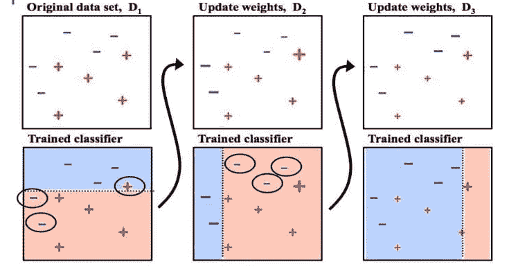

Adaboost 算法

我知道上面对 Adaboost 工作原理的解释不是很有帮助，所以不要担心，我们将在一段时间后深入研究本文中的工作。以上解释只是为了让我们熟悉 adaboost 算法的概念。

> 为了更好地理解助推和整体技术，请点击下面的链接

 [## 关于合奏技巧的一切

### 在本文中，我们将通过回答以下问题来尝试理解机器学习环境中的集成思想

pub.towardsai.net](/all-about-ensemble-techniques-821a8957fab2) 

# **我们为什么要学习 Adaboost？**

过去，adaboost 用于图像分类等非常复杂的问题。但是现在，我们引入深度学习，所以我们不使用 adaboost 来处理所有这些问题。那么我们为什么要学习这个呢？下面两个论点就说得通我们为什么要学习 adaboost 了。

*   Adaboost 将高偏差低方差模型转换为低偏差低方差模型，这有助于建立理想的机器学习模型，为我们提供非常准确的预测。
*   虽然 adaboost 已经过时，但像 Xgboost 和梯度增强算法这样的现代算法都是基于 adaboost 概念。这些现代算法在不同的计算中被大量使用

# **Adaboost 是如何工作的？**

在深入研究 adaboost 的工作机制之前，我们必须理解一些术语。

## **Adaboost 的先决条件:**

## **弱学习者:**

那些机器学习模型给出的准确率非常低。准确度范围必须在 50%到 60%之间。

## **决策树桩:**

它们只是深度或高度等于 1 的普通决策树。Adaboost 仅使用决策树桩作为其基本估计器。

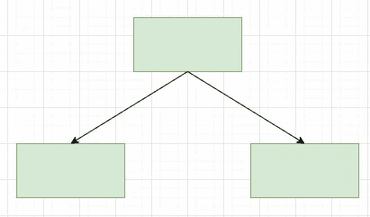

决策树桩

## **决策树桩的利弊:**

## **优点:**

*   计算可扩展性
*   处理缺失值
*   对异常值稳健

## **缺点:**

*   高方差
*   无法提取特征的线性组合。

## **上采样:**

这是 adaboost 中使用的一种技术，通过为行创建新的权重来更新数据集。通过使用下面的公式来生成新的权重:

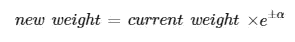

新权重的总和将不等于 1，因此，我们将执行归一化。

## **阿尔法:**

Alpha 是相应决策树桩的权重。这决定了决策树桩对最终结果的影响程度。如果模型是好的，那么阿尔法值将增加，反之亦然。

现在，我们已经准备好了解 adaboost 算法所涉及的步骤。

adaboost 算法的上图看起来非常复杂，很难理解。所以，我们会一步一步的解码上面的算法。

1.  向包含每行权重的数据集中添加一列。使用以下公式，通过为所有行分配相等的权重来计算初始权重:

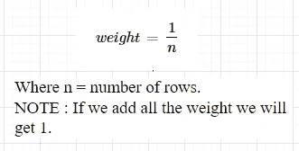

2.在数据集上训练决策树桩。

3.使用经过训练的决策树桩进行预测。

4.使用下面的公式计算决策树桩的 alpha。

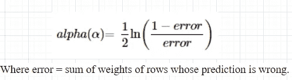

5.通过使用向上采样和更新数据集的技术来提高缺失预测值行的重要性。

6.我们将在新的决策树桩上再次重复所有步骤，但是使用更新的数据集。

7.现在最后一步，在运行 n 个估计量之后，我们将得到

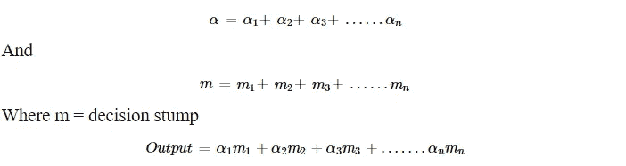

在从 0 到 1 的任何函数中传递这个“输出”

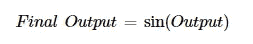

# **随机森林和 Adaboost 有什么区别？**

1.  随机森林和 adaboost 之间的第一个区别是随机森林属于 bagging 集成技术，而 adaboost 属于 boosting 集成技术。如果我们详细说明，random forest 并行运行一组机器学习模型，而 adaboost 依次运行一组机器学习模型。
2.  随机森林使用较浅或中等深度的决策树，而 adaboost 使用决策树桩。
3.  两种算法都生成低偏差和低方差模型，但是随机森林转换低偏差高方差模型，而 adaboost 转换高偏差低方差模型。
4.  在随机森林中，我们可以为模型分配权重，但它们对所有模型都是相同的，而在 adaboost 中，权重是根据每个模型的准确性和性能来分配的。

# **Adaboost 有什么优缺点？**

## **优点:**

*   它很容易使用，因为与其他算法相比，我们不必做许多超参数调整。
*   Adaboost 提高了弱机器学习模型的准确性。
*   Adaboost 不受数据过度拟合的影响，因为它按顺序运行每个模型，并具有与之相关联的权重。

## 缺点:

*   Adaboost 需要高质量的数据进行训练，因为它对噪声数据和异常值非常敏感。

# **我们如何使用 python 实现 Adaboost？**

我们将从头开始实现 Adaboost，并使用 Scikit-learn。那么，我们开始吧。

> 注意:下面是整个代码的片段，所以建议你检查笔记本本身，以便更好地理解。链接在下面。

首先，我们应该从 python 导入所需的包。

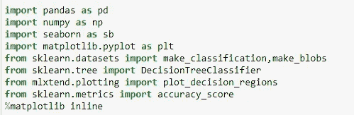

现在，创建虚拟数据。

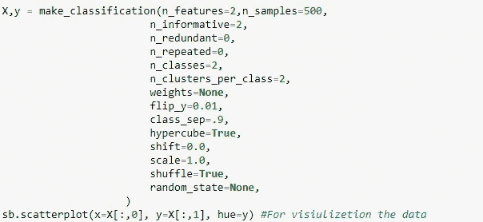

虚拟数据如下所示。

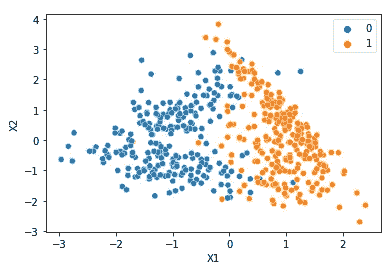

现在参考 adaboost 算法。第一步是添加一个新的权重列。

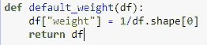

第二步是运行决策树桩。

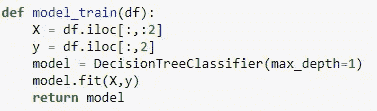

计算α，

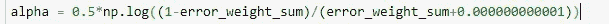

使用上采样创建新的数据框。

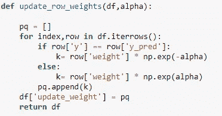

对 n 个估值器重复这些步骤。

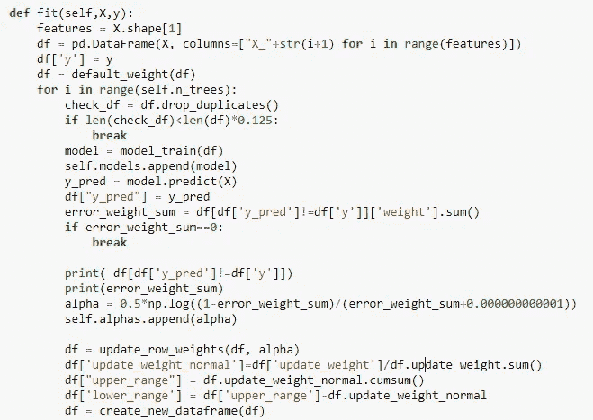

如果我们检查你的 adaboost 代码的准确性。那就是:

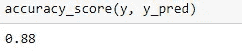

现在，如果我们使用 Scikit-learn，实现将变得非常容易。

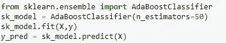

Scikit-learn adaboost 模型的精度将为:

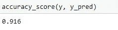

> 本文中使用的笔记本的链接:

[https://github . com/Akashdawari/Articles _ Blogs _ Content/blob/main/All _ About _ AdaBoost . ipynb](https://github.com/Akashdawari/Articles_Blogs_Content/blob/main/All_About_AdaBoost.ipynb)

喜欢并分享如果你觉得这篇文章有帮助。还有，关注我的 medium，了解更多机器学习和深度学习相关的内容。