# 关于决策树的一切

> 原文：<https://pub.towardsai.net/all-about-decision-tree-c252e0612812?source=collection_archive---------1----------------------->

在本文中，我们将通过回答以下问题来理解决策树:

*   什么是决策树？
*   决策树的核心概念是什么？
*   在分类的情况下，决策树中使用的术语有哪些？
*   回归情况下决策树中使用的术语是什么？
*   决策树的优点和缺点是什么？
*   如何用 Scikit-learn 实现决策树？

# **什么是决策树？**

决策树是监督机器学习中最强大和最重要的算法之一。该算法非常灵活，因为它可以解决回归和分类问题。此外，如果你有编程背景，决策树算法背后的核心概念非常容易理解。因为决策树模仿嵌套的 if-else 结构来创建树并预测结果。

在深入研究决策树算法之前，我们必须了解一些与树相关的基本术语。

## **在计算机科学领域，树是什么意思？**

树是计算机科学中使用的非线性数据结构，表示分层数据。它由保存数据的节点和连接这些节点的边组成。最上面的或开始的节点称为根节点。末端节点称为叶节点。具有从其到任何其他节点的分支的节点被称为父节点，并且父节点的直接子节点被称为子节点。看下面的图片可以更好的理解在计算机科学中树是什么样子的。

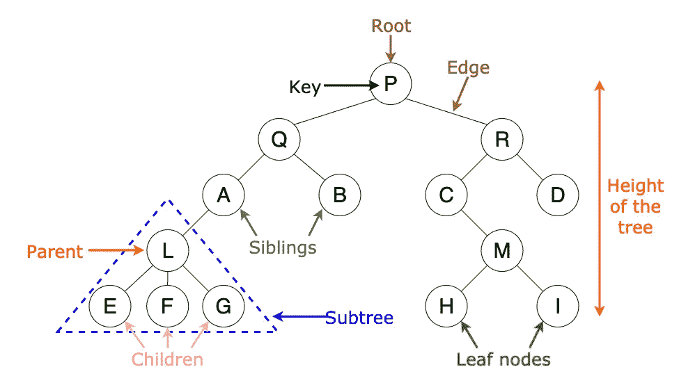

数据结构中的树

# **决策树的核心概念是什么？**

为了理解核心概念，让我们举个例子。考虑下表:

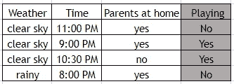

资料组

该表有一个相关特征，即儿童是否会在外面玩耍，用“玩耍”表示。和 3 个独立特征，即天气、时间和在家的父母。如果我们试着写一个程序来估计一个孩子是否在外面玩耍的结果，仅仅通过观察桌子。那么程序看起来会像这样:

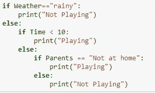

python 程序

现在，如果我们使用这个程序并尝试构建一个决策树，它看起来会像这样:

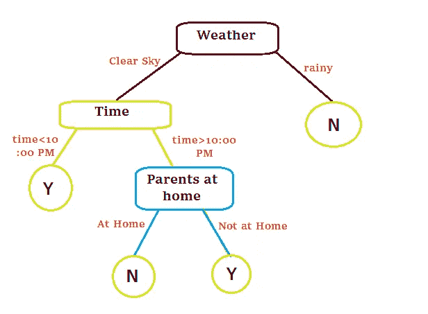

决策图表

我们可以观察到，决策树只是一个嵌套的 if-else 语句，以树的格式描述。

当我们理解决策树的核心概念时，我们偶然发现了一个新问题，即我们如何安排独立特征的顺序来生成决策树，就像在上面的例子中，我们如何知道我们必须首先采用“天气”特征，然后是“时间”，然后是“父母在家”特征。要回答这个问题，我们必须先了解一些统计术语，我们将在下面讨论。

# **决策树在分类的情况下使用了哪些术语？**

## **熵:**

熵是数据随机性的度量。换句话说，它给出了数据集中存在的杂质。它有助于计算决策树中的信息增益。

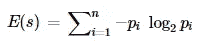

熵公式

## **基尼杂质:**

基尼系数也和熵一样用来衡量随机性。基尼系数的公式是:

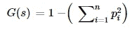

基尼杂质

> 唯一的区别是熵在 0 到 1 之间，基尼系数在 0 到 0.5 之间。

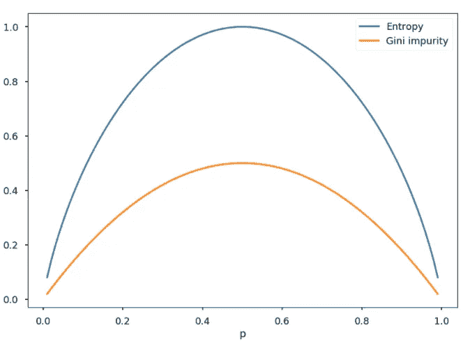

图置换基尼杂质和熵

## **信息增益:**

信息增益就是分割前后数据集的熵之差。获得的信息越多，去除的熵就越多。

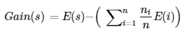

信息增益

具有最高信息增益的列将被分割。然后，决策树以自顶向下的方式应用递归贪婪搜索算法来寻找树的每一层的信息增益。一旦到达叶节点(熵=0)，就不再进行分裂。

## **在分类问题的情况下，决策树会发生什么？**

我们的主要任务是减少数据的杂质或随机性。在分类问题中，我们使用熵来测量杂质，然后应用分裂并查看信息增益。如果信息增益最高，那么我们将考虑分割。这个过程将递归进行，直到我们到达叶节点或者数据的熵变为零。

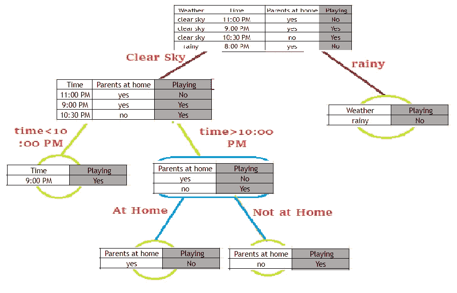

决策图表

# **在回归的情况下，决策树中使用了哪些术语？**

## **错误:**

就像在分类问题中，决策树通过计算熵或基尼杂质来衡量杂质。在回归中，我们计算方差误差。

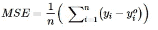

均方误差

## **方差减少:**

就像在分类问题中一样，决策树测量信息增益。在回归中，我们计算方差减少，它简单地意味着误差减少。我们找到了分割前后数据集误差之间的差异。

## **在回归问题的情况下，决策树会发生什么？**

在回归问题中，决策树试图识别一组点来绘制决策边界。决策树考虑每一个点，通过计算该点的误差来画出边界。对每个点都进行这个过程，然后从所有误差中考虑最低误差点来画边界。

这个过程在计算时间方面非常昂贵。因此，决策树选择贪婪方法，在给定的条件下将节点分成两部分。

# **决策树有什么优点和缺点？**

## **优点:**

*   决策树是理解和解释起来最简单的算法之一。此外，我们可以想象这棵树。
*   与其他算法相比，决策树需要更少的数据预处理时间。
*   使用决策树的成本是对数的
*   它可用于回归和分类问题。
*   它能够处理多输出问题。

## **缺点:**

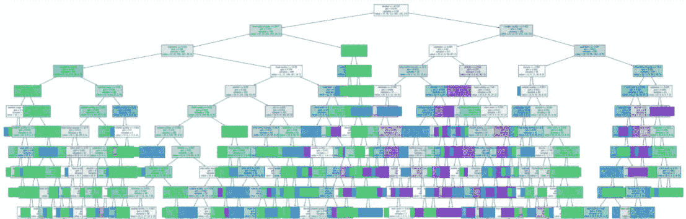

决策树的过拟合

*   决策树的主要缺点是过度拟合的问题。
*   通过引入新的数据点，决策树可能会不稳定，从而导致生成全新的树。
*   决策树的预测既不平滑也不连续，而是分段常数逼近，如上图所示。所以，他们不擅长外推法。

## **决策树的缺点有什么解决办法？**

1.  对于过拟合问题，我们可以通过超调模型来限制决策树的高度、节点或叶子。这个过程被称为树修剪。
2.  为了处理不稳定的决策树，我们可以使用集成技术，如最著名的“随机森林”。

# 如何用 Scikit-learn 实现决策树？

决策树的编码部分非常简单，因为我们使用的是 scikit-learn 包，我们只需从中导入决策树模块。

首先，我们将从 python 导入所需的模块。

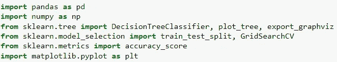

在这个例子中，我们使用了来自 GitHub 的关于葡萄酒质量的数据集。

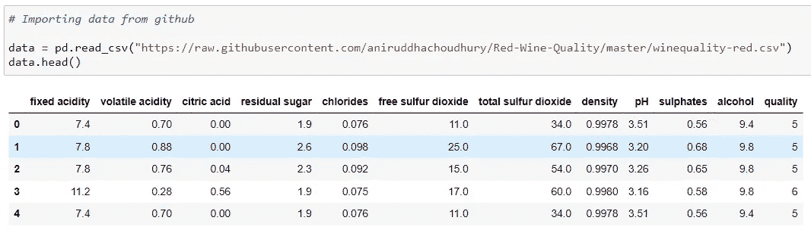

由于数据集没有空值，我们将简单地把它分成训练集和测试集。

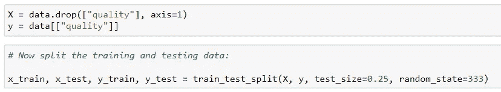

现在，只需训练模型。

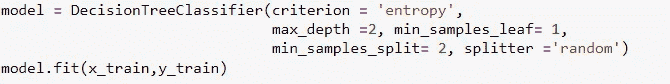

准确度分数:

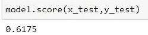

绘制图表:

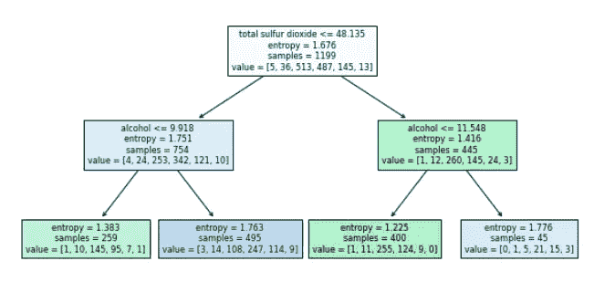

如果你想在编码部分探索更多，或者想知道我如何调优超参数。然后，请点击下面的 Github 资源库链接。

 [## Articles _ Blogs _ Content/All _ About _ Decision _ tree . ipynb at main Akashdawari/Articles _ Blogs _ Content

### 这个知识库包含了 jupyter 关于博客中发表的文章的笔记本。…

github.com](https://github.com/Akashdawari/Articles_Blogs_Content/blob/main/All_About_Decision_tree.ipynb) 

喜欢并分享如果你觉得这篇文章有帮助。还有，关注我的 medium，了解更多机器学习和深度学习相关的内容。