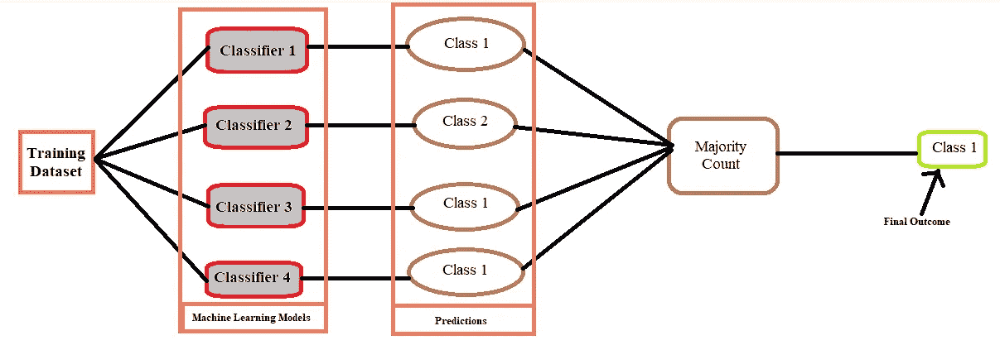
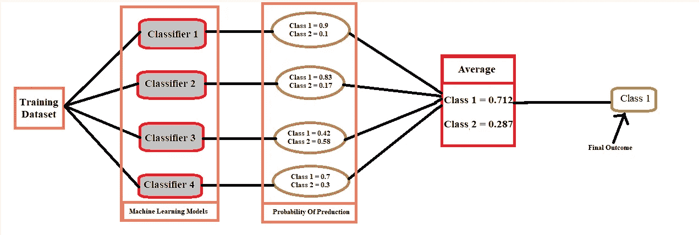
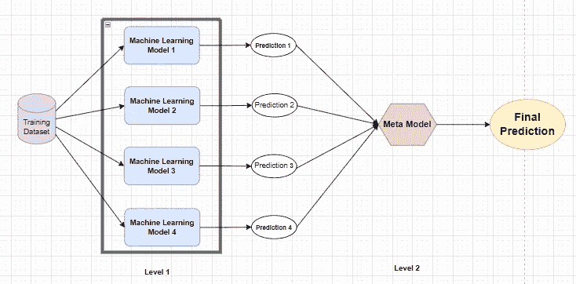
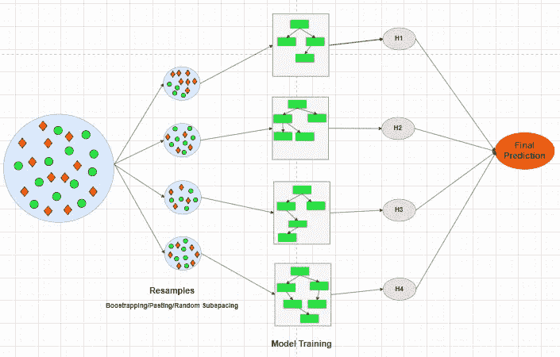
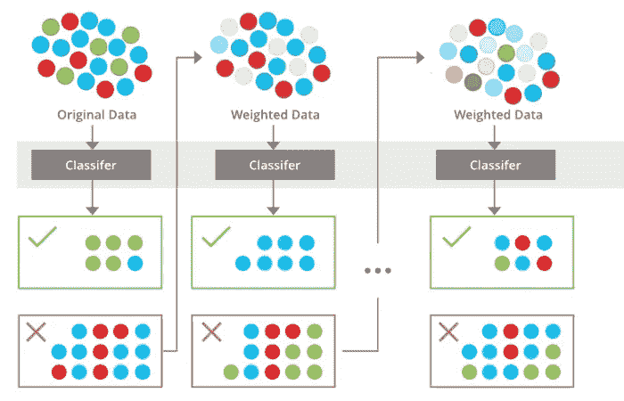
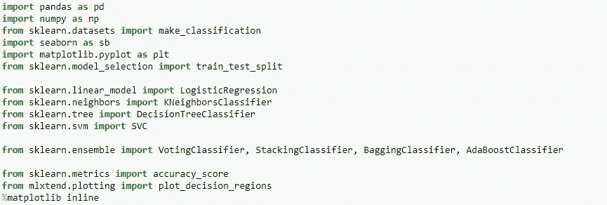
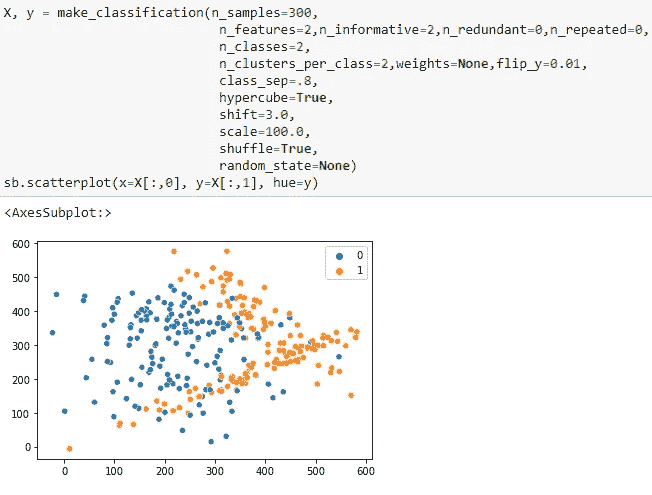
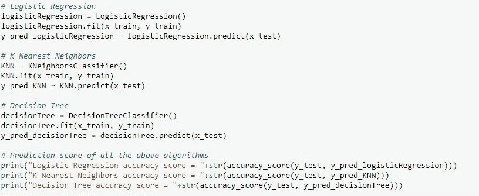
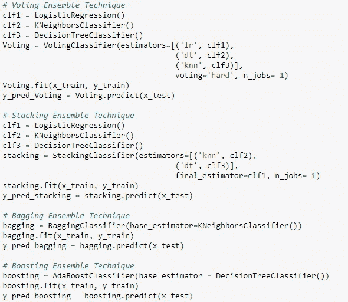
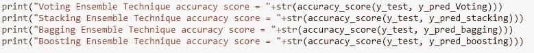

# 关于合奏技巧的一切

> 原文：<https://pub.towardsai.net/all-about-ensemble-techniques-821a8957fab2?source=collection_archive---------0----------------------->

在本文中，我们将通过回答以下问题来尝试理解机器学习环境中的集成思想:

*   什么是合奏技巧？
*   合奏技术有哪些不同的类型？
*   合奏技术的优缺点是什么？
*   如何实现不同的集成技术？

# 什么是合奏技术？

在我们回答这个问题之前，让我们举个例子，假设有两个小组(A 组和 B 组)正在参加一个测验。A 队只有一名队员，B 队有四名队员。所以，如果我们不得不在不知道团队成员知识的情况下打赌哪个团队会赢得智力竞赛。我们大多数人会选择 B 队。这是因为 B 队的总体知识肯定高于 A 队，因此 B 队获胜的机会是可以预期的。


机器学习中的集成技术遵循相同的规则，即聚合不同算法的结果将比单个算法给出更好的预测。因此，简而言之，集成技术是一种将不同或相同的机器学习算法排列在一起以获得更好预测的方法。使用集成技术背后的主要直觉是获得低偏差和低方差的模型，最终导致更好的预测。

# 合奏技术有哪些不同的类型？

集成技术可以根据我们如何安排不同或相同的机器学习模型来分类。基本上，它们被广泛分为四种类型:

*   投票
*   堆垛
*   制袋材料
*   助推

让我们来看看每一种合奏技巧并理解它们。

## 什么是投票集成技术？

在一个民主国家，人们投票选举不同的政党来组成一个职能政府。投票集合技术遵循相同的思想。

在投票集成技术中，我们采用不同的机器学习算法，并输入相同的训练数据进行训练。在回归问题中，最终结果将是不同机器学习模型预测的所有结果的平均值。在分类问题中，投票集成技术被进一步分成两个部分:

1.  硬投票
2.  软投票



硬投票

在硬投票分类器中，我们使用“多数计数”，这意味着我们寻求大多数机器学习模型预测的结果。



软投票

在软投票分类器中，我们取不同机器学习模型预测结果的概率的平均值，然后进行最终预测。

## 什么是叠加系综技术？

堆叠是另一种整体技术。它是投票集成技术的扩展，因为我们使用不同的学习模型，我们在堆叠中称之为基础模型。在此基础上，训练另一个模型，该模型使用基础模型的预测来获得最终结果。额外增加的学习模型被称为元模型。



堆垛

但是堆叠集成面临过拟合问题，因为我们使用相同的训练数据集来训练基本模型，并且还使用相同的训练数据集的预测来训练元模型。为了解决这个问题，叠加集成提出了两种方法。

1.  混合
2.  k 倍

## **混合**

在这种方法中，我们将训练数据集分成两部分。训练数据集的第一部分将用于训练基础模型，然后基础模型使用训练数据集的第二部分来预测元模型进一步使用的结果。

## **K 倍**

在这种方法中，我们将训练数据集分成 k 个部分/折叠，然后训练数据集的 k-1 个部分用于训练基本模型，剩下的一部分由基本模型用于预测元模型进一步使用的结果。

## 什么是装袋合奏技术？

装袋是另一种整体技术。bagging 背后的主要思想类似于投票集合技术。但是有两个主要的区别。第一个区别是，我们必须使用相同或单一的算法来构建一组预测器或机器学习模型，并聚合它们的结果。第二个区别是，我们创建训练数据集的随机子集来训练模型。



制袋材料

bagging 集成技术通过执行随机化和聚合操作，将低偏差高方差模型转换为低偏差低方差模型。

基于如何创建训练数据集的子集，我们可以将 bagging 集成技术分为三个子类别。

1.  拔靴带
2.  涂
3.  随机子空间

**Bootstrapping:** 在这种情况下，通过选择随机的行/元组来创建训练数据集的子集，替换意味着数据集的行可以重复。

**粘贴:**在这种情况下，通过挑选随机的行/元组来创建训练数据集的子集，而无需替换，这意味着数据集的行不能重复。

**随机子空间:**在这种情况下，通过挑选随机特征/列来创建训练数据集的子集。

## 什么是助推合奏技术？

Boosting 与我们上面看到的所有合奏技术有一点不同。在 boosting 中，我们将弱机器学习模型结合起来，以实现预测结果误差更小的强模型。但是模型的组合是按顺序进行的，因此每个模型都考虑了前一个模型的误差。这有助于模型在那些特定的错误点上表现更好。最后，我们通过根据它们的性能分配一些权重来组合所有这些模型，并通过使用一些数学函数来计算结果。



助推

Boosting 集成技术通过执行加法组合操作将高偏差低方差模型转换为低偏差低方差模型。

# 合奏技术的优缺点是什么？

## **优点:**

*   与单个模型相比，集合技术能够产生高度精确预测。
*   集成技术很好地处理了偏差和方差之间的权衡，并且能够产生具有低偏差和低方差的模型。
*   集成技术能够处理线性和非线性数据集，因为不同的模型被组合在一起，能够处理这些类型的数据。
*   集成技术产生稳定的模型，这意味着当暴露于新的数据点时，它们不会表现出不同的行为。

## **缺点:**

*   整体技术在时间复杂度、存储器消耗和处理能力方面是昂贵的。
*   集成技术不容易解释，因为不可能单独观察每个模型并计算它们的输出，然后将它们组合起来产生最终结果。
*   在集成技术中，不同模型的组合变得困难和棘手，因为单个错误的模型会降低整个集成模型的性能。

# 如何实现这些不同的集成技术？

Sklearn 提供了所有相应的包来实现这些集成技术。让我们看看编码部分。

首先从 python 导入重要的包



准备样本数据集



为了了解集成技术如何给我们带来优势，我们必须了解单个机器学习模型如何处理上述数据集。对于这个例子，我们将使用逻辑回归、K 最近邻和决策树算法。



```
Logistic Regression accuracy score = 0.8266666666666667
K Nearest Neighbors accuracy score = 0.9066666666666666
Decision Tree accuracy score = 0.8533333333333334
```

现在，我们将实现不同的集成技术



```
Voting Ensemble Technique accuracy score = 0.92
Stacking Ensemble Technique accuracy score = 0.9066666666666666
Bagging Ensemble Technique accuracy score = 0.92
Boosting Ensemble Technique accuracy score = 0.8533333333333334
```

正如我们可以观察到的，投票和 Bagging 集成技术表现得非常好。

如果您希望在编码部分进行更多探索，或者希望可视化不同算法如何适应数据集。然后，请点击下面的 Github 资源库链接。

[](https://github.com/Akashdawari/Articles_Blogs_Content/blob/main/All_About_Ensemble_Techniques.ipynb) [## articles _ Blogs _ Content/All _ About _ Ensemble _ techniques . ipynb at main…

### 这个知识库包含了 jupyter 关于博客中发表的文章的笔记本。…

github.com](https://github.com/Akashdawari/Articles_Blogs_Content/blob/main/All_About_Ensemble_Techniques.ipynb) 

喜欢并分享如果你觉得这篇文章有帮助。还有，关注我的 medium，了解更多机器学习和深度学习相关的内容。