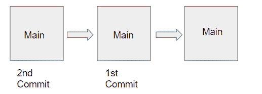
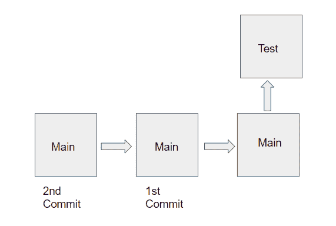
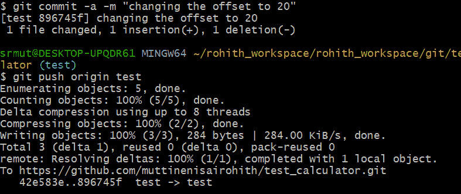
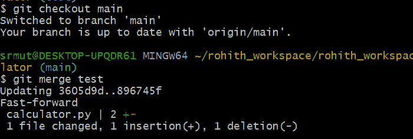
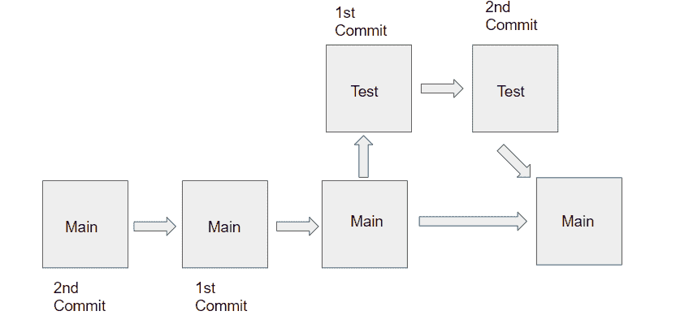
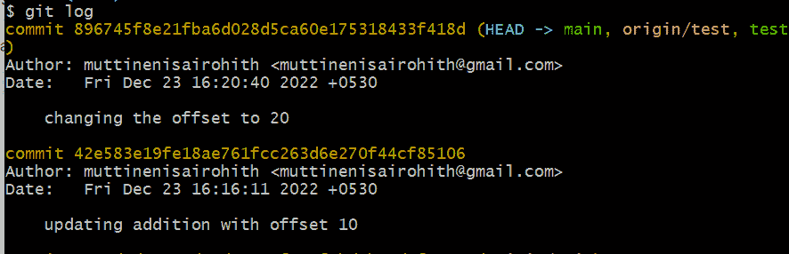
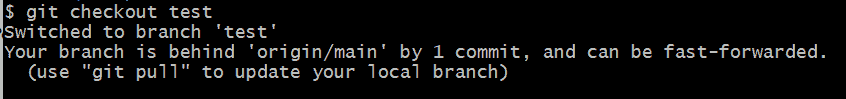
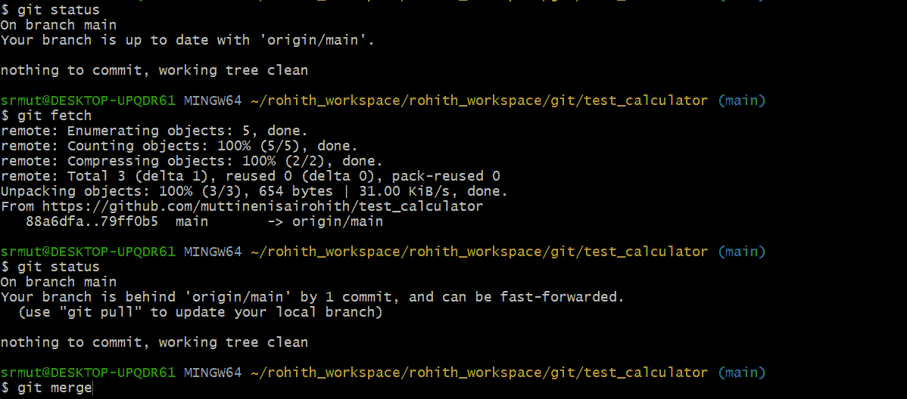

# 关于 Git 分支的所有内容...和 Git 拉与取

> 原文：<https://pub.towardsai.net/all-about-git-branches-and-git-pull-vs-fetch-5b961c13ead?source=collection_archive---------3----------------------->

> 使用 Git 中的分支，我们可以创建我们想要处理的文件的副本，而不会弄乱原始文件。稍后我们可以将它们合并到原始副本中。

这是 Git 系列文章的第二篇——完整的 Git 初学者教程，并附有示例。下面有链接—

[](https://muttinenisairohith.medium.com/complete-git-tutorial-for-beginners-with-examples-4ebd90e76bfc) [## 完整的 Git 初学者教程，带示例

### Git 是一个版本控制系统，它可以让我们跟踪随着时间的推移我们对文件所做的更改。

muttinenisairohith.medium.com](https://muttinenisairohith.medium.com/complete-git-tutorial-for-beginners-with-examples-4ebd90e76bfc) 

到目前为止，我们已经创建了主分支，将第一次提交推送到分支，然后是第二次提交。我们的回购看起来像这样—



支流

要克隆一个特定的分支，在 git bash 中使用这个命令

```
git clone -b <branchname> <remote-repo-url>
```

现在让我们创建一个测试分支，并将我们的新变更推送到该分支。我们可以使用下面的命令创建一个名为“test”的新分支-

```
git checkout -b test
```

在上面的命令中，checkout 让我们切换到一个分支，而-b 帮助我们创建分支。

现在让我们添加一些更改，然后将它们添加到我们的本地 repo commit 中，并通过测试分支将它们推送到远程 repo。

```
def add(a, b):
    return a+b+10
```

我们可以使用以下命令向远程回购添加、提交和推送更改—

```
git add .
git commit -m “Updating the add function with offset 10”
git push origin test
```

而不是 git add。和 git commit -m "message "我们可以使用下面的命令—

```
git commit -am "Updating the add function with offset 10"
git push origin test
```

现在我们的回购看起来像这样-



支流

现在，让我们通过将偏移量更改为 20 来进行另一个更改，并再次提交和推送到测试分支。

```
def add(a, b):
    return a+b+20
```

让我们添加、提交并推入远程回购

```
git commit -a -m "changing the offset to 20"
git push origin test
```



输出

现在，由于我们在测试分支中修改了一些代码，我觉得我的代码已经准备好了，让我们将代码与主分支合并。

这可以使用以下命令来完成-

```
git checkout main
git merge test
```



这里我们使用 checkout 来切换分支，我们不使用-b，因为它用于创建新的。然后使用 git merge 命令合并代码。

下面是我们回购的样子-



现在我们已经对主分支做了很多更改，让我们使用命令来查看提交历史记录

```
git log
```



我们可以按“q”来退出日志。

为了让我们的测试分支跟踪主分支，我们可以使用下面的命令-

```
git branch - set-upstream-to=origin/main test
```

**拉 git 回购分支**

现在，让我们在主分支中进行一些更改并提交它。

```
def add(a, b):
    return a+b
def sub(a, b):
    return a-b
def mul(a, b):
    return a * b
a = int(input())
b = int(input())
print(add(a, b))
print(sub(a, b))
print(mul(a, b))
```

现在让我们提交这个并将它推送到主分支。

```
git add .
git commit -m "adding multiplication code"
git push origin main
```

现在在主分支中，我们已经进行了更改。

现在让我们假设我们需要在主分支中添加另一个变更，但是由于它是在生产中，我们必须确保测试不会导致任何问题。因此，让我们在测试分支中实现这个变更，然后创建一个 pull 请求来合并主分支中的变更。

但在此之前，我们先检查一下测试分支中的代码。因此，让我们使用命令切换回测试分支-

```
git checkout test
```

这里我们可以看到代码没有更新。我们的测试分支比主分支落后一个提交。



要从主分支更新代码，我们需要发出以下命令-

```
git pull origin main
```

或者

```
git pull
```

Pull 命令有助于从我们自己的分支或远程分支获取最新的变更。

每当我们在分支中工作时，定期提取我们的变更是一个很好的实践。

**获取 Git 与获取 Git**

Git pull 将检查任何滞后的代码提交，如果我们的本地 repo 滞后于任何提交，那么使用 Git pull，我们可以检索更新的更改并将其合并。同时，git fetch 将只在滞后的提交中检索更新的更改。然后，我们应该使用 git merge 将它们合并到我们的 repo 中。



正如我们所看到的，提交后，使用 git 状态的本地 repo 中没有更新，但是当我们使用 git fetch 时，我们得到的信息是本地 repo 比主 repo 落后 1 个提交。因此，我们应该使用 git merge 命令来合并更改。

但是所有这些都可以用一个命令来实现-

```
git pull
```

它将获取更改，然后从远程/原始回购中合并本地回购中的更改。

```
git pull = git fetch + git merge
```

这就是本文中关于 git 分支的全部内容...但是 Git rebase、Stash、revert 和 reset 还有更多的内容要介绍。这些将在下一篇文章中讨论——

[](https://muttinenisairohith.medium.com/git-rebase-merge-and-stash-763fcf3ec060) [## Git Rebase、Merge 和 Stash

### Git rebase 是 Git 中的一个高级特性，当我们处理多个分支时，它可以帮助我们。

muttinenisairohith.medium.com](https://muttinenisairohith.medium.com/git-rebase-merge-and-stash-763fcf3ec060) 

快乐学习…敬请期待…