# 关于 K 均值聚类的所有内容

> 原文：<https://pub.towardsai.net/all-about-k-means-clustering-b6529efac76a?source=collection_archive---------4----------------------->

在本文中，我们将通过回答以下问题来理解聚类算法:

1.  什么是集群？
2.  集群的实际应用有哪些？
3.  K-means 聚类是如何工作的？
4.  怎样才能求 K 的值？
5.  K-Means 聚类的优缺点是什么？
6.  如何实现 K-Means 聚类？

# **什么是聚类？**

经典的定义是:

> 聚类是一种无监督的机器学习技术，它在未标记的数据中找到某些模式/结构，根据它们的属性将它们分成不同的组

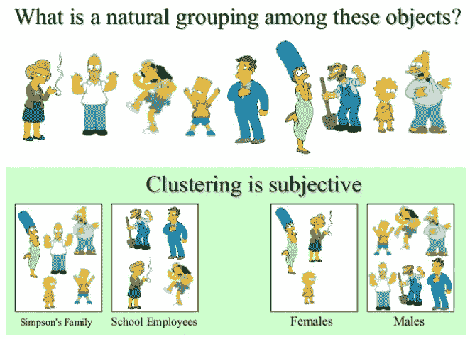

为了理解这个定义，让我们举个例子:在图书馆里，书是以一种特殊的方式组织起来的，这样当一个人寻找某本书时，他/她就能找到它。所以，为了组织这些书，它们被按照它们相似的属性组合在一起。这种通过相似的属性和行为将不同元素分组的技术称为聚类。

# **集群的实际应用是什么？**

不同的聚类技术用于解决日常生活中面临的现实挑战。一些应用如下:

*   **对于客户细分:**你可以根据客户的购买行为、他们在你网站上的活跃程度等等来对他们进行分类。这有助于了解你的客户是谁，他们需要什么，这样你就可以针对每个细分市场调整你的产品和营销活动。例如，在推荐系统中，这对于推荐同一个集群中的其他用户喜欢的内容非常有用。
*   **对于数据分析:**当分析一个新的数据集时，首先发现相似实例的聚类通常是有用的，因为单独分析聚类通常更容易。
*   **作为一种降维技术:**一旦数据集被聚类，通常可以测量每个实例与每个聚类的相似性(相似性是一个实例与一个聚类匹配程度的任何度量)。然后，每个实例的特征向量 x 可以替换为其聚类相似性的向量。如果有 k 个簇，那么这个向量是 k 维的。这通常比原始特征向量的维数低得多，但它可以为进一步处理保留足够的信息。
*   **对于异常检测(也称为离群点检测):**对所有聚类都具有低亲和力的任何实例都可能是异常。例如，如果您已经根据网站用户的行为对他们进行了分类，那么您可以检测到具有异常行为的用户，例如每秒异常的请求数等等。异常检测在检测制造中的缺陷或欺诈检测中特别有用。
*   **对于半监督学习:**如果你只有几个标签，你可以执行聚类并将标签传播到同一个聚类中的所有实例。这可以大大增加后续监督学习算法可用的标签数量，从而提高其性能。
*   **对于搜索引擎:**例如，一些搜索引擎让你搜索与参考图片相似的图片。要构建这样一个系统，首先要对数据库中的所有图像应用聚类算法:相似的图像将出现在同一个聚类中。然后，当用户提供参考图像时，您需要做的就是使用训练好的聚类模型找到该图像的聚类，然后您可以简单地返回该聚类中的所有图像。
*   **分割图像:**通过根据颜色对像素进行聚类，然后用聚类的平均颜色替换每个像素的颜色，可以大大减少图像中不同颜色的数量。这种技术被用在许多物体检测和跟踪系统中，因为它使得检测每个物体的轮廓变得更容易。

# K-means 聚类是如何工作的？

K-Means 是一种聚类方法，其中根据数据与 K 个中心的距离，将数据分组为 K 个不同的非重叠聚类。首先需要指定 **K** 的值，然后算法将这些点准确地分配给一个聚类。

## 算法:

1.  随机分配 K 个中心。
2.  计算所有点与所有 K 个中心的距离，并根据最短距离将这些点分配给聚类。模型的*惯性*是每个实例与其最近质心之间的均方距离。目标是拥有一个惯性最低的模型。
3.  一旦所有的点都被分配到集群，重新计算质心。
4.  重复步骤 2 和 3，直到质心的位置停止变化，并且点的簇分配变得恒定。

K-Means 聚类的算法非常简单。现在，让我们把我们在算法中讨论过的东西形象化，以便更好地理解它。

第一步是分配 k 的值。k 的值表示我们想要分离数据的组的数量。

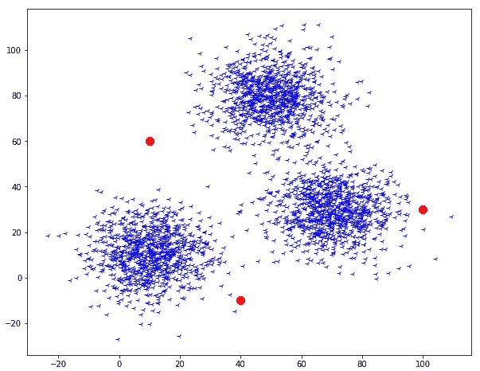

静止点是 k 形质心

这里我们指定了 k = 3 的值。这意味着我们已经生成了三个随机质心，基于这些质心我们可以分离我们的数据。

第二步现在我们必须计算每个数据点相对于每个质心的距离，我们已经介绍过了。然后选择最近的质心并指定一个组。

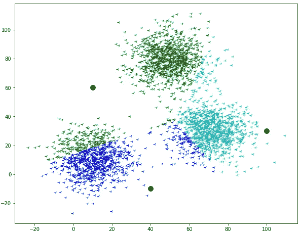

第三步是重新计算我们引入的质心的坐标。这个步骤可以通过计算分配给各个质心的点的平均值来完成。

第四步是重复第二步和第三步，直到质心的坐标停止移动。

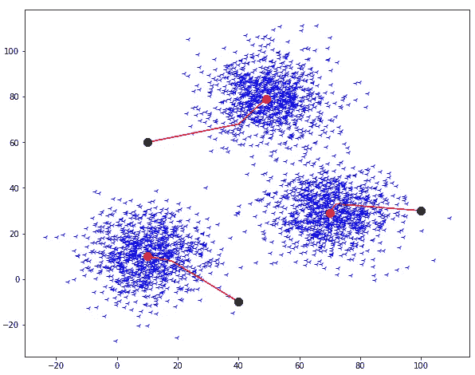

因此，最终输出将如下所示:

所以，我们也可视化了 k-means 聚类的核心直觉。但是还有一个问题我们必须回答，我们如何决定 k 的值，让我们看看如何决定？

# 怎样才能求出 K 的值？

借助于一种方法可以求出 K 的值，这种方法就是 T2 肘法。让我们看看这个肘法是怎么回事。

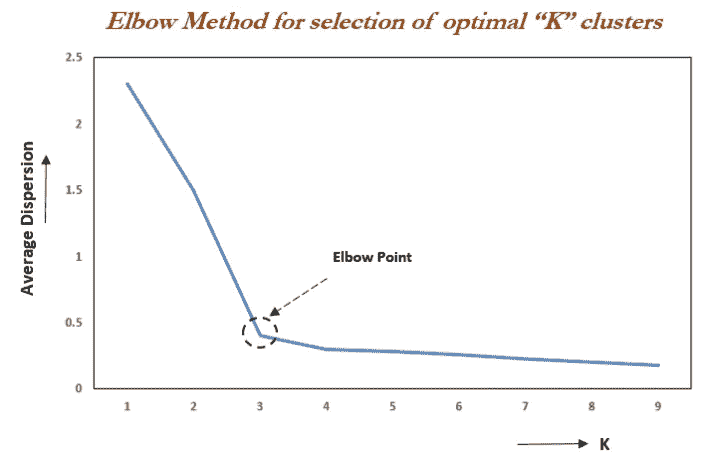

该方法基于类内距离平方和(WCSS 或惯性)与类数量之间的关系。观察到，首先随着集群数量的增加，WCSS 急剧下降，然后在一定数量的集群之后，WCSS 的下降不那么显著。在 WCSS 和聚类数之间的图变得相对模糊之后的点被称为拐点，并且在该点的聚类数是最优聚类数，因为即使在该点之后增加聚类数，变化也不会减少太多。

# K-Means 聚类的优缺点是什么？

## 优势:

1.  这个算法非常容易理解和实现。
2.  该算法高效、稳健、灵活
3.  如果数据集是不同的球形聚类，则给出最佳结果

## **缺点:**

1.  该算法需要预先指定聚类中心的数量，即 k 的值。
2.  它不能处理异常值和噪声数据，因为质心会发生偏转
3.  它不能很好地处理非常大的数据集，因为它需要大量的计算时间。

# 如何实现 K-Means 聚类？

K-Means 聚类的实现非常简单，只需遵循我们上面讨论的算法。

> **注:**下面的 k-means 代码是从零开始的。我没有使用 scikit-learn 库来构建代码。

首先，让我们从 python 导入导入包开始。

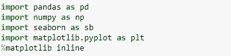

现在，创建一个玩具数据集。

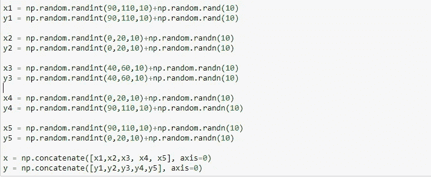

可视化我们的玩具数据集

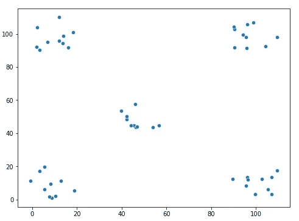

步骤 1:初始化 K 的值，即创建 5 个随机质心

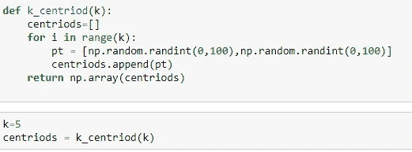

想象质心。

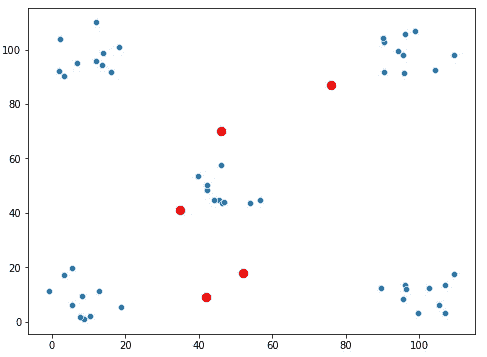

步骤 2:计算每个数据点到质心的距离，并指定最近的质心。

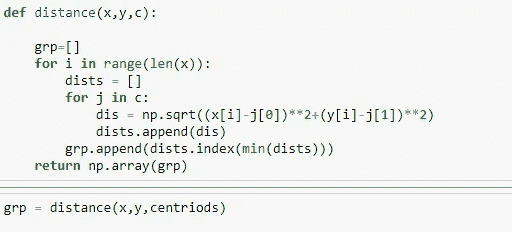

可视化数据以及它们如何与质心组合在一起。

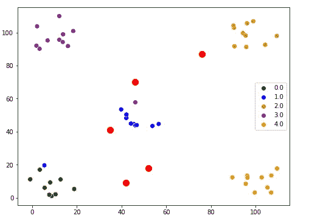

步骤 3:计算每个组的平均值，并将其分配给质心，以创建新的质心。

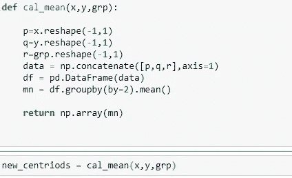

可视化新的质心。

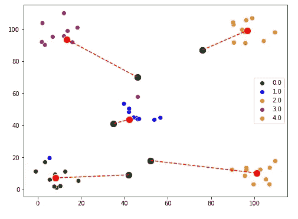

第四步:现在重复第二步和第三步，直到质心停止变化。

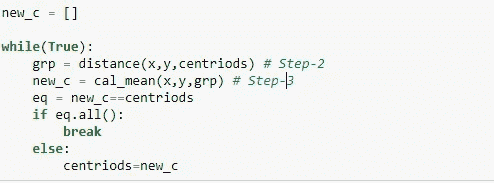

可视化最终聚类。

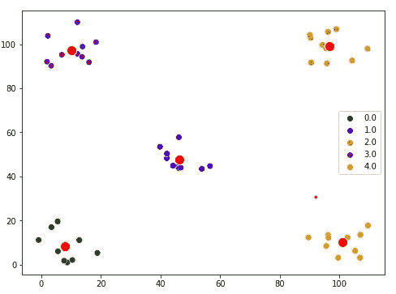

> *本文使用的笔记本链接:*

 [## Articles _ Blogs _ Content/K-Means clustering . ipynb at main Akashdawari/Articles _ Blogs _ Content

### 这个知识库包含了 jupyter 关于发表在博客上的文章的笔记本。…

github.com](https://github.com/Akashdawari/Articles_Blogs_Content/blob/main/K-Means%20Clustering.ipynb) 

喜欢并分享如果你觉得这篇文章有帮助。还有，关注我的 medium，了解更多机器学习和深度学习相关的内容。