# 关于逻辑回归的一切

> 原文：<https://pub.towardsai.net/all-about-logistic-regression-f7d961ebb9ad?source=collection_archive---------2----------------------->

在本文中，我们将了解逻辑回归并尝试回答以下问题:

*   什么是逻辑回归？
*   为什么不是线性回归？
*   为什么是逻辑回归？
*   什么时候逻辑回归？
*   如何进行逻辑回归？

# **什么是逻辑回归？**

逻辑回归是一种受监督的机器学习算法，用于分类问题，其中我们必须通过使用自变量来区分两个或更多类别或类之间的因变量。

例如:

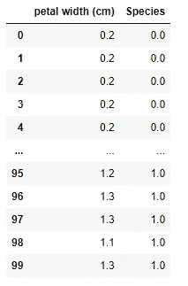

鸢尾花数据集

考虑上表，其中因变量是“物种”，自变量是“花瓣宽度”。物种分为两类,“0”代表鸢尾花,“1”代表杂色鸢尾花。

逻辑回归将使用花的花瓣宽度给出相应类别的概率。

# 为什么不是线性回归？

主要有两个原因:

1.  线性回归处理连续或定量值，而在分类问题中，我们处理离散或概率值。
2.  如果我们以某种方式将线性回归线拟合到数据集，如下所示:

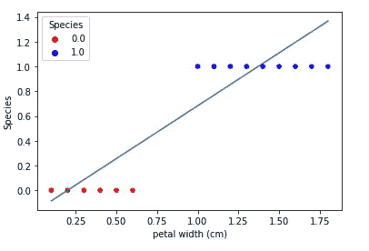

具有线性回归的虹膜数据集图表

如果我们取阈值 0.5，在这种情况下，线性线似乎做得很好，但如果我们在数据集中引入一些异常值。

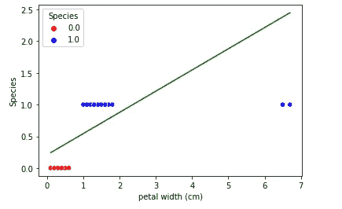

具有线性回归的 Iris 数据集(具有异常值)的图表

您可以看到线条斜率从原始位置波动了多少。因此，当引入新的数据点时，我们无法承受这种给出不同答案的模型。另一个需要注意的小点是，结果的范围不在我们想要的范围内，这是预测概率在 0 到 1 的范围之外。

要了解更多关于线性回归的信息，请点击下面的链接:

 [## 关于线性回归的一切

### 在本文中，我们将探讨线性回归，并尝试回答以下问题:

medium.com](https://medium.com/@akashdawari202/all-about-linear-regression-358ee3a11d86) 

**为什么是逻辑回归？**

*   正如我们在上面的问题中讨论的，当引入新的数据点时，线性回归会波动。逻辑回归通过引入额外的函数将最佳拟合直线弯曲成如下所示的曲线来解决这个问题。

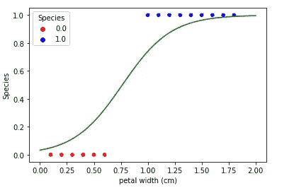

使用逻辑回归的 Iris 数据集图表

*   逻辑回归易于理解、实现，并且训练起来非常有效。
*   逻辑回归在小数据集上工作良好，并且在对未知记录进行分类时非常快。
*   逻辑回归的核心概念进一步用于人工神经网络。

# **什么时候的逻辑回归？**

当逻辑回归满足以下要求时:

*   因变量必须是分类数据，要么是二进制数据类，要么是有序数据类。
*   独立变量的观察不得重复或匹配，因为逻辑回归对过度拟合敏感。
*   独立变量之间不应存在多重共线性
*   逻辑回归通常需要大样本量。

> **注:**以上几点也被称为“逻辑回归的假设”。

# **如何进行逻辑回归？**

理解逻辑回归有两种方法。

1.  概率直觉
2.  几何直觉

在这篇文章中，我们将去概率直觉，因为几何直觉将再次涵盖在 SVM(支持向量机)。

正如我们上面讨论的，逻辑回归使用一个函数来挤压或弯曲线性线，该函数可以是任何数学函数，如 tan、Sigmoid、ReLu 等

## **s 形函数**

逻辑回归大多使用 sigmoid 函数，因为-

1.  sigmoid 函数返回 0 到 1 范围内的结果，这非常适合逻辑回归，因为我们正在预测结果的概率。
2.  与梯度下降过程中使用的其他函数相比，Sigmoid 函数导数更容易计算。

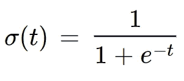

Sigmoid 函数

让我们看看结果概率和线性直线方程之间的一些关系，以便更好地理解线性回归和逻辑回归之间的关系:

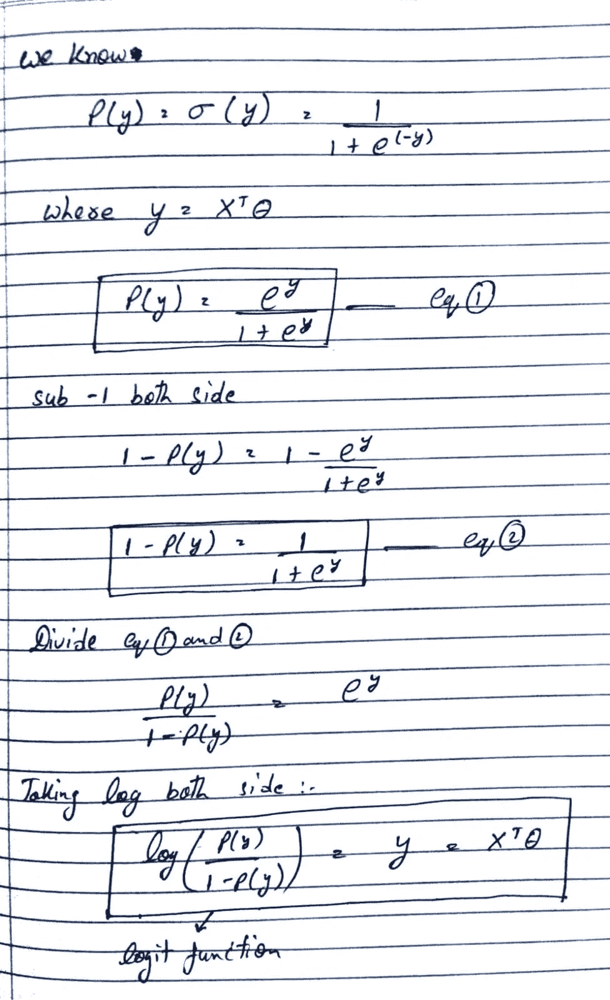

逻辑回归中的 Logit 函数

现在，作为大多数监督机器学习算法，逻辑回归也有三个主要步骤:假设，成本函数，一种优化技术。

假设:在这里，我们假设自变量和因变量之间存在某种数学关系。在逻辑回归中，我们使用 Sigmoid 函数来建立关系。

**成本函数:**该函数用于找出我们预测值的误差。在逻辑回归中，我们使用对数损失函数。

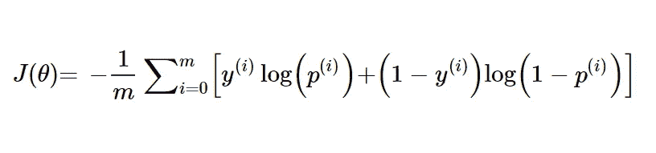

对数损失函数

**优化技术**:在这一步，我们试图使用一些数学技术来减少误差。在逻辑回归中，我们将使用梯度下降来实现。

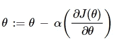

梯度下降

其中，对数损失函数的导数为:

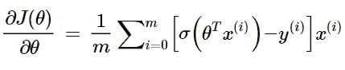

## 从头开始使用 Python 编写逻辑回归的代码示例:

步骤 1:准备数据集

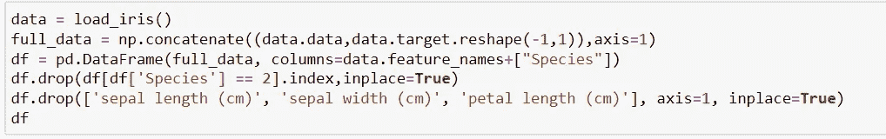

步骤 2:创建一个函数，该函数执行梯度下降并返回与每个独立变量相关联的权重值。

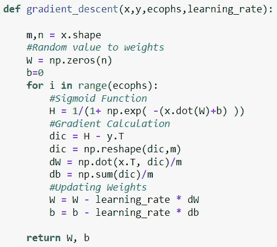

步骤 4:创建一个使用权重预测结果的函数。

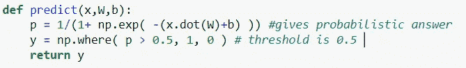

第五步:调用函数并预测结果。

## 我们如何知道预测的得分或准确性？

在分类问题中，我们使用混淆矩阵、准确度分数、精确度、召回率或 F1 分数来衡量模型的准确度。

**混淆矩阵**:

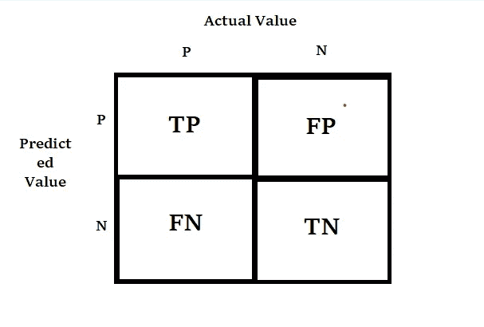

混淆矩阵

其中，
**真阳性(TP)** :被分类模型预测为阳性且也为阳性的结果
**真阴性(TN):** 被分类模型预测为阴性且也为阴性的结果
**假阳性(FP):** 被分类模型预测为阳性但实际为阴性的结果
**假阴性(FN):** 被分类模型预测为阴性但实际为阳性的结果。
模型的可信度取决于模型做出了多少正确的预测。

**准确率:T** 正确分类总数除以分类总数。

精度:这是对所有正面预测中，有多少是真实的正面预测的一种度量

**回想一下**:这是一个衡量标准:从阳性结果的总数中，有多少阳性结果被模型正确预测。

**F1 得分**:定义为精确度和召回率的调和平均值。

> 本文中使用的笔记本的链接:

 [## articles _ Blogs _ Content/All _ About _ Logistic _ regression . ipynb at main…

### 这个知识库包含了 jupyter 关于发表在博客上的文章的笔记本。…

github.com](https://github.com/Akashdawari/Articles_Blogs_Content/blob/main/All_About_Logistic_Regression.ipynb) 

喜欢并分享如果你觉得这篇文章有帮助。还有，关注我的 medium，了解更多机器学习和深度学习相关的内容。