# 关于随机森林的一切

> 原文：<https://pub.towardsai.net/all-about-random-forest-84daf291eb04?source=collection_archive---------1----------------------->

在本文中，我们将通过回答以下问题来理解随机森林:

1.  什么是随机森林？
2.  为什么我们使用随机森林？
3.  随机森林是如何工作的？
4.  随机森林的优缺点是什么？
5.  如何使用 python 实现随机森林？

# **什么是随机森林？**

随机森林是一种有监督的机器学习算法。这种算法非常流行，因为它既可以处理分类问题，也可以处理回归问题。该算法的主要思想是训练多个决策树，收集它们的预测，并根据预测的最终输出，在分类的情况下使用多数计数或在回归的情况下取平均值。

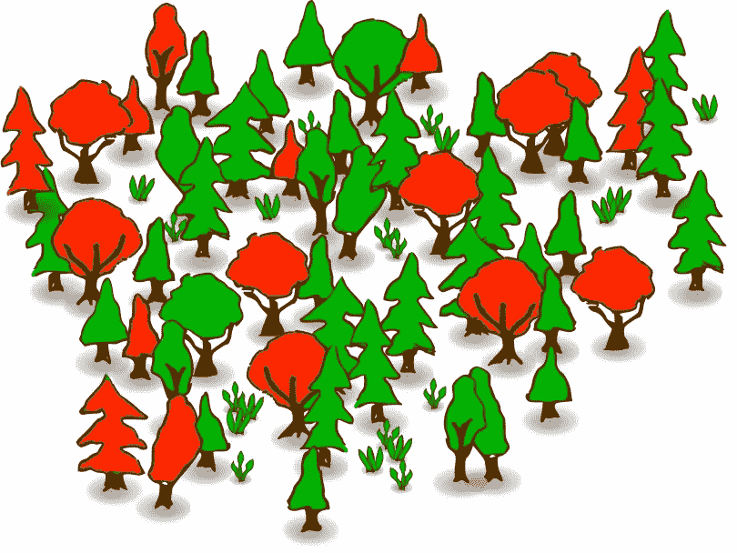

随机森林可能看起来非常类似于 Bagging Ensemble 技术，但是在随机森林中存在两个主要区别。第一个区别是，与 bagging 技术不同，random forest 只使用一个决策树作为它的基本算法。第二个区别是随机森林在将数据输入基本模型之前增加了数据的随机性。

# **为什么我们使用随机森林？**

要回答上述问题，首先，我们必须了解决策树的缺点。正如我们所知，决策树本身是一种非常强大的监督机器学习算法。但是它有在训练数据集上过度拟合的趋势，这导致对新数据点的不良预测。简而言之，一个完全成长的决策树通常提供一个低偏差和高方差的模型。这里随机森林进入画面。随机森林通过同时训练多个决策树，将低偏差、高方差模型转换为低偏差、低方差模型。随机森林中的每个决策树获得训练数据集的子集，并相应地预测结果。之后，随机森林收集这些结果，并执行不同的操作，最终得出最终预测。

> 要了解决策树，请单击下面的链接

 [## 关于决策树的一切

### 在本文中，我们将通过回答以下问题来理解决策树:

pub.towardsai.net](/all-about-decision-tree-c252e0612812) 

但是这个过程也可以通过 bagging 系综技术来完成。所以，问题又来了，为什么是随机森林？

使用随机森林而不是 bagging 的主要原因是随机森林给训练数据增加了更多的随机性。在随机森林中，每当决策树中的节点分裂时，都会对训练数据进行采样，但在 bagging 中，采样发生在树形成的开始。

# **随机森林是如何工作的？**

随机森林的工作可以分为三个主要步骤。第一步是对随机森林中每个决策树的数据集进行采样。取样大致有三种方式，即:

*   拔靴带
*   涂
*   随机子空间

**Bootstrapping:** 在这种情况下，通过选择随机的行/元组来创建训练数据集的子集，替换意味着数据集的行可以重复。

**粘贴:**在这种情况下，通过挑选随机的行/元组来创建训练数据集的子集，而无需替换，这意味着数据集的行不能重复。

**随机子空间:**在这里，通过挑选随机特征/列来创建训练数据集的子集。

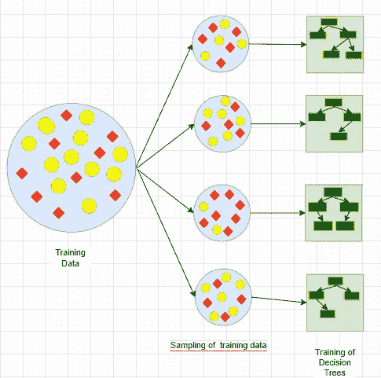

并行训练决策树

采样之后，第二步是并行训练各个决策树模型，而不相互依赖。现在，随机森林已经训练好了，我们可以输入数据了。每棵树都将根据提供的样本数据得出自己的预测。

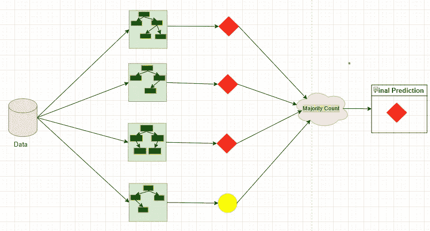

随机森林分类

现在，第三步也是最后一步是聚合每个决策树模型的预测，并根据问题陈述执行数学运算。对于回归问题陈述，我们通常取预测的平均值，给出最终输出。对于分类问题语句，我们通常采用多数计数并给出最终输出。

> 要了解合奏技巧，请点击下面的链接

 [## 关于合奏技巧的一切

### 在本文中，我们将通过回答以下问题来尝试理解机器学习环境中的集成思想

pub.towardsai.net](/all-about-ensemble-techniques-821a8957fab2) 

# **随机森林有什么优缺点？**

## 优势:

*   使用随机森林的主要优点是它减少了模型的方差，而不影响偏差。简而言之，它将低偏差高方差模型转换为低偏差低方差模型。
*   随机森林可用于分类和回归问题。
*   与单一决策树相比，随机森林更加稳定。
*   随机森林可以处理缺失值，并且对异常值具有鲁棒性。

## 缺点:

*   与决策树相比，随机森林需要更多的计算能力，因为随机森林中有 100 到 500 棵树在并行训练。
*   我们可以可视化单个决策树，但是我们不能监控随机的森林，因为树的数量太多了。

# 如何使用 python 实现随机森林？

用 python 实现随机森林非常简单，我们只需导入 scikit learn 模块。所以让我们来看看如何实现它。

首先，我们将从 python 导入重要的库。

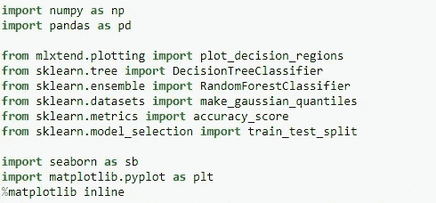

现在，我们将创建一个虚拟数据集，看看算法是如何工作的。

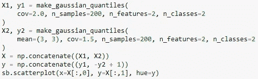

让我们使用 seaborn 库来可视化数据集。

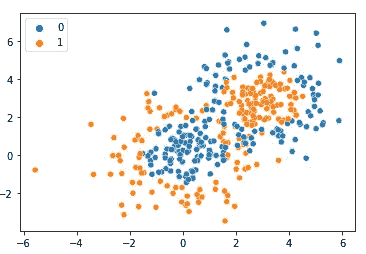

我们可以观察到有两类“橙色”和“蓝色”。我们必须对此进行分类。现在下一步是将数据分成训练集和测试集。

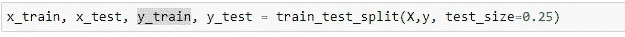

首先，我们将尝试使用决策树进行分类，以比较随机森林如何比决策树更好地工作。

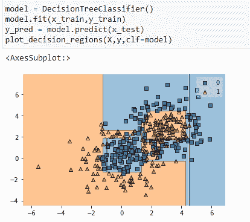

我们可以观察到决策树过度拟合数据，这导致了高方差并降低了准确性。我们来计算一下决策树的准确率。

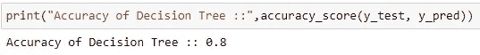

准确率 80%。现在，我们将训练随机森林算法。

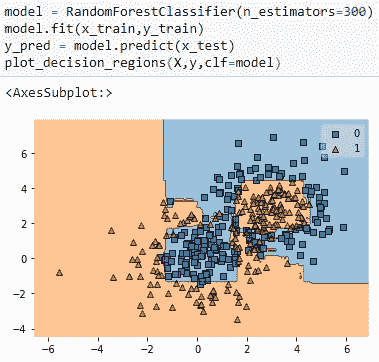

如果我们比较两种算法的决策边界，我们将观察到随机森林的决策边界具有平滑的轮廓，并且它减少了过拟合问题。

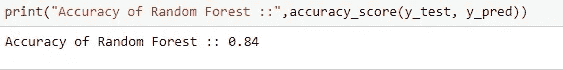

此外，准确率提高了 4%,总共提高了 84%。

如果您想在编码部分进行更多探索，或者想直观地了解随机森林算法如何适应数据集。然后，请点击下面的 Github 资源库链接。

 [## Articles _ Blogs _ Content/All About Random forest . ipynb at main Akashdawari/Articles _ Blogs _ Content

### 这个知识库包含了 jupyter 关于发表在博客上的文章的笔记本。-文章 _ 博客 _ 内容/全部…

github.com](https://github.com/Akashdawari/Articles_Blogs_Content/blob/main/All%20About%20Random%20Forest.ipynb) 

喜欢并分享如果你觉得这篇文章有帮助。还有，关注我的 medium，了解更多机器学习和深度学习相关的内容。