# 关于支持向量机的一切

> 原文：<https://pub.towardsai.net/all-about-support-vector-machine-cfd9320315e2?source=collection_archive---------0----------------------->

本文将探讨支持向量机并尝试回答以下问题:

*   什么是支持向量机？
*   支持向量机中使用的术语有哪些？
*   支持向量机如何解决分类问题？
*   支持向量机对于回归问题是如何工作的？
*   支持向量机的优缺点是什么？
*   如何用 Scikit-learn 实现支持向量机？

# **什么是支持向量机？**

支持向量机是一种有监督的机器学习算法。这种算法广泛用于数据科学/机器学习问题，因为这种算法非常强大和通用。支持向量机可用于线性和非线性分类、回归，甚至离群点检测。尽管它在具有复杂的小型或中型数据集的分类问题中被大量使用。支持向量机是一种非概率线性分类器，它使用几何方法来区分数据集中的不同类别。

# **支持向量机中使用的术语有哪些？**

我们知道什么是支持向量机。现在，我们将深入研究支持向量机中使用的核心概念和术语。

## **支持向量**

向量是 n 维图上表示的数据点。例如，我们在像这样的 2D 图上表示一个点(x，y ),在像这样的 3D 图中表示一个点(x，y，z ),其中 x，y，z 是图的轴。


支持向量

因此，支持向量是 n 维图上最接近超平面的点的向量，并且影响超平面的方向。通过这个支持向量，我们传递了超平面的正负边界。

## **超平面**

超平面只不过是一个具有(n-1)维的决策边界，其中 n 是数据集中的列数。超平面分离不同类别的点/向量。
例-1:在 2D 图形表示中，我们使用如下所示的线来分隔点。

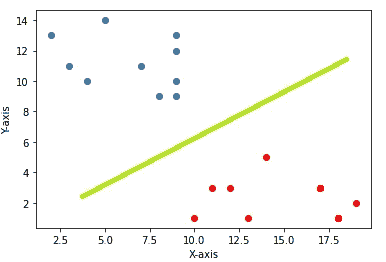

2D 的超平面

图中表示的绿线充当超平面，这个超平面的方程将等于

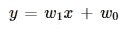

我们可以把它重写为

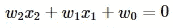

示例 2:在 3D 图形表示中，我们使用如下所示的平面来分隔点。

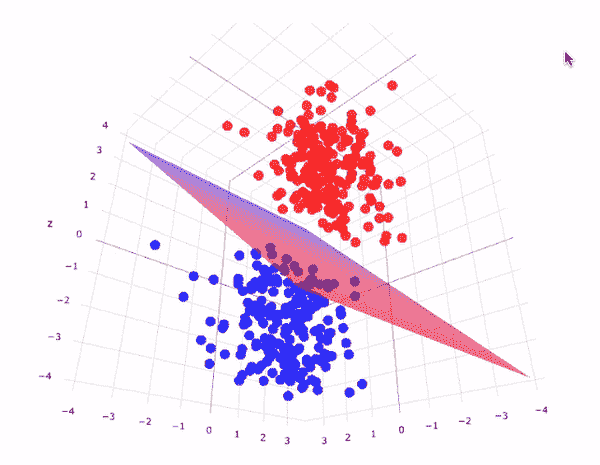

三维超平面

图中所表示的薄板作为超平面，这个超平面的方程将等于这个薄板的方程

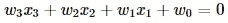

类似地，对于 n 维数据集，超平面方程将是:

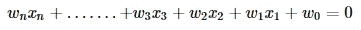

如果我们用向量的形式重写这个:

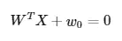

超平面的向量形式

## **内核**

核是 SVM 使用的一种数学函数，用于将非线性数据转换为更高维的数据集，以便 SVM 可以通过使用超平面来分离数据的类别。在 Scikit-learn 中，SVM 支持各种类型的内核，如*‘线性’，‘多边形’，‘RBF’，‘sigmoid’。此外，我们可以创建自己的内核，并在 s* cikit-learn *SVM 中传递它。* 现在让我们看一个例子来更好的理解内核的作用:
下图代表了两种类型的数据点。


非线性数据点

现在，如果我们想创建一个超平面，它会像这样。

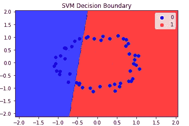

线性超平面

我们可以观察到它不能正确地分离所有的点。但是如果我们考虑径向基函数核。

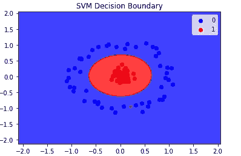

RBF 核超平面

它能够正确地分离所有的点。但问题是怎么做？实际上径向基函数核变换数据集如下图所示。

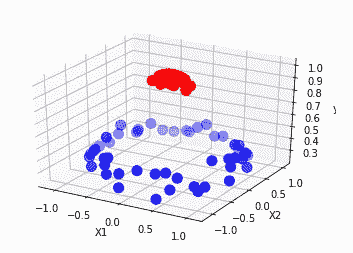

我们可以观察到，在 3D 中，我们可以绘制一个超平面来分隔这些点。这就是如何借助正确的内核 SVM 分类数据点。

## 边缘

边距是穿过支持向量的线，它们总是平行于超平面。

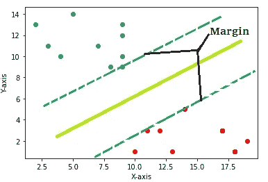

# **支持向量机如何处理分类问题？**

SVM 的主要任务是最大化边距之间的距离，使得没有点穿过边距。这也被称为“硬边际 SVM”。
在理想世界中，上述条件永远不会违反，距离可以计算为:

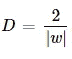

边距之间的距离

但是在现实世界中，我们总是得到带有一些异常值的不纯数据，如果我们遵循硬边界概念，那么我们将无法创建任何超平面。因此，引入了一个新概念，即“软边际 SVM”。在这里，我们引入一个新元素，即“铰链损耗”。

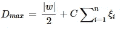

在软裕度中，SVM 铰链函数是异常点和裕度之间距离的总和，然后乘以超参数“C”。

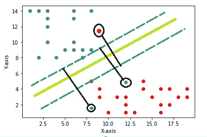

使用铰链函数处理异常值

# 支持向量机对于回归问题是如何工作的？

在回归分析中，SVM 采取了一种稍微不同的方法。这种方法可以用三行来解释。第一条线是最佳拟合回归线，另外两条线是表示误差范围的边界线。

换句话说，最佳拟合线(或超平面)将是穿过最大数量的数据点的线，并且选择误差边界以确保最大包含。

# **支持向量机的优缺点是什么？**

## **优点:**

1.  SVM 在高维空间是有效的。
2.  它在维数大于样本数的情况下仍然有效
3.  SVM 的记忆效率很高。

## **缺点:**

1.  如果特征的数量远大于样本的数量，那么它避免了在选择核函数时的过拟合。
2.  SVM 不像逻辑回归那样直接提供概率估计。

# **如何用** Scikit-learn **实现支持向量机？**

SVM 的实现非常简单和容易。我们只需要导入 sklearn 包。对于这个例子，我们使用一个已经存在于 sklearn 包中的玩具数据集，这个例子是一个分类问题。此外，我们将从 python 导入一些必要的包。

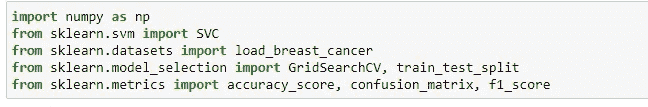

现在，提取数据

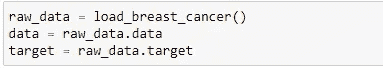

我们正在使用乳腺癌威斯康星州(诊断)数据集。

```
Data Set Characteristics:

    :Number of Instances: 569

    :Number of Attributes: 30 numeric, predictive attributes and the class

    :Attribute Information:
        - radius (mean of distances from center to points on the perimeter)
        - texture (standard deviation of gray-scale values)
        - perimeter
        - area
        - smoothness (local variation in radius lengths)
        - compactness (perimeter^2 / area - 1.0)
        - concavity (severity of concave portions of the contour)
        - concave points (number of concave portions of the contour)
        - symmetry
        - fractal dimension ("coastline approximation" - 1)
- class:
        - WDBC-Malignant
        - WDBC-Benign
```

将数据集分成训练集和测试集。

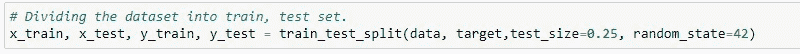

现在使用训练数据训练模型，然后预测测试数据的结果

> 注意:SVC 有许多超参数，我们可以调整它们以获得更好的结果。

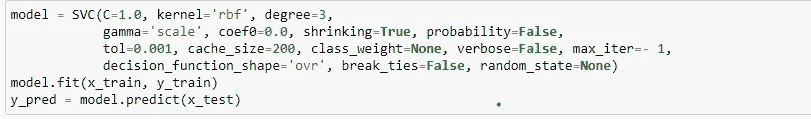

最后使用混淆矩阵、准确度分数和 F1 分数来测量准确度

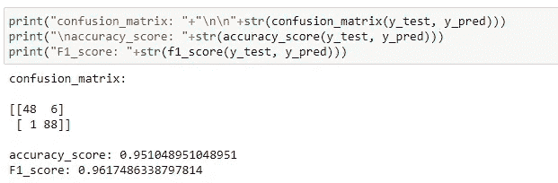

> *本文使用的笔记本链接:*

[](https://github.com/Akashdawari/Articles_Blogs_Content/blob/main/All%20About%20Support%20Vector%20Machine%20.ipynb) [## 关于支持向量机的文章 _ 博客 _ 内容/全部。ipynb 在主…

### 这个知识库包含了 jupyter 关于博客中发表的文章的笔记本。-文章 _ 博客 _ 内容/全部…

github.com](https://github.com/Akashdawari/Articles_Blogs_Content/blob/main/All%20About%20Support%20Vector%20Machine%20.ipynb) 

喜欢并分享如果你觉得这篇文章有帮助。还有，关注我的 medium，了解更多机器学习和深度学习相关的内容。