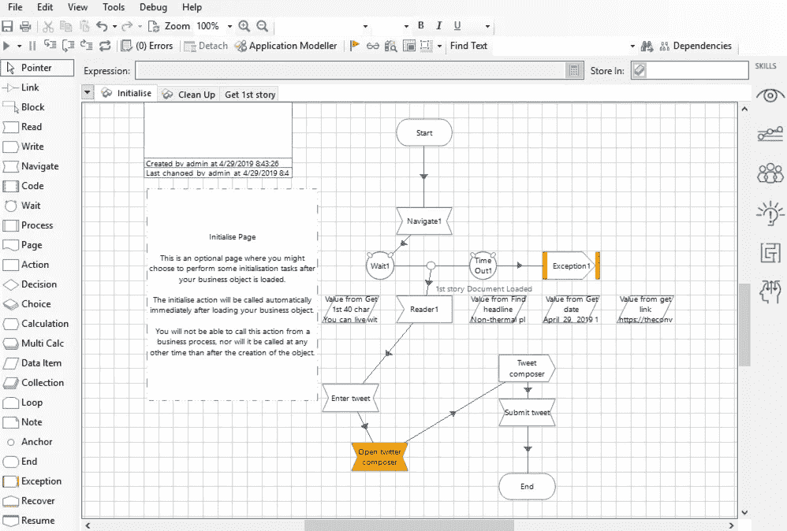

# 到 2034 年，90%的故事将由人工智能撰写——自动化和讲故事——这是机器人写的吗？

> 原文：<https://pub.towardsai.net/am-i-a-robot-ad72ee58fc82?source=collection_archive---------5----------------------->

## 到 2034 年，90%的故事将由人工智能编写——我是一个机器人吗，看看现在正在发生的事情，我们是否可以判断我们现在阅读的故事是否是由机器人编写的| [走向人工智能](https://towardsai.net)

自动化和讲故事——到 2034 年，90%的故事将由机器人编写:

自动化和个性化的新闻 Gif (Wilshaw，2019)

你怎么知道什么是真的，什么是假的，什么是机器人(一个用来描述自动化内容的亲切的通用术语)或者不是？内容生成机器人被给予一组参数和数据输入，以将有趣和相关的新闻输出到你最喜欢的信息网关中不断膨胀的新闻提要中。

我们 90%的新闻是自动化新闻——至少到 2034 年是这样。巨型媒体集团已经在自动化大量数据(Levy 等人，2019)。算法已经在编写成千上万的故事，事实上，一家通讯社去年发布了约 40，000 篇自动化新闻故事(Delcker，2019)。为了保持相关性，传统媒体公司正在进行数字化转型，将员工队伍从模拟报纸转型为尖端数字公司。记者再也无法跟上不断增长的数字人口所产生的“大数据”海啸(Mayer-schn Berger 和 Cukier，2013 年)。

在数据世界中，人类每秒钟都会创建数百万甚至更多的数据点。我们钟爱的令人上瘾的技术正在捕捉我们的一举一动和互动，并将这些设备和应用程序的制造商发送给它。像 Apple Watch、Fitbit 或 Amazon Echo 这样的东西知道我们在哪里，我们在做什么，可能比我们自己更清楚。这些随时可用的数据是道德、隐私和安全的雷区。从积极的一面来看，这对于我们人类来说是无法理解的，如果使用得当，它可以帮助我们的生活——从早期报告健康问题，激励我们更多地锻炼，监测我们的心脏——帮助我们活得更久更健康。这些数据形成模式，其中大部分很难筛选，除非我们是像闪电侠一样的超能力者。有些数据比其他数据更容易自动化。像金融、体育、技术发布和科学新闻这样的故事有易于阅读的数据，因此更容易转换成自然语言和标准化的叙事结构——以苹果发布会的主题演讲为例；在某些方面都不同，但他们都有共同的叙事结构(德尔克尔，2019)。一些资深人士站在舞台上，建立预期，并宣布新的软件功能或硬件。展示一些他们新产品的性感图片，宣称它比以前的版本有了多大的改进——观众欣喜若狂地鼓掌，惊奇地等待着，直到他们可以购买它。就像一本小说一样，这次产品发布会有一个开始，设定场景并介绍主角。一个中间，引入兴奋和期待，一个结尾——对前面所发生的事情的总结。

新闻业的人工智能(AI)不是要取代工作；它更多的是做我们人类非常不擅长的事情——比如处理来自数百万来源的数据并验证它们。人类会感到无聊，会犯错，不得不吃饭、睡觉和社交(或者与成千上万的其他在线玩家一起玩堡垒之夜)——所有这些都让我们很难处理哪怕是极少量的数据来创建值得信赖的新闻。也许把人工智能新闻想象成钢铁侠的盔甲更好，让故事讲述者成为数据处理超级英雄。

钢铁侠 Gif(威尔肖，2019)

围绕新闻报道的个性化有很多“烟雾和镜子”,其中大部分是通过监控用户的喜欢、观点，甚至长时间的目光，然后将这些信息转化为更定制的新闻提要，这些信息是使用所谓的机器学习(ML)和自然语言处理(NLP)创建的。我们教一个程序我们喜欢什么和不喜欢什么。根据叙事科学创始人 Robbie Allen 的说法，人工智能不仅可以让用户定制他们的内容和本地化，还可以定制如何讲述——为单个观众成员编写个性化的相关故事。以前，这种方式成本过高且不可行(Levy 等人，2019 年)，并被视为传统的一对多新闻，在无处不在的在线智能手机出现之前已经存在了数百年。

自动化打开和导航到我指定的网站的基本任务(Wilshaw，2019)

为了测试向社交媒体平台发布故事的自动化程度，我用蓝色棱镜(Blue Prism)创建了一个自动化程序，这是一个 RPA(机器人流程自动化)客户端——我是 UX 和 UI 的负责人(为了透明起见)。我的目标是从一个网站“搜集”故事(在这个例子中是[https://theconversation.com/uk](https://theconversation.com/uk))并通过无代码但复杂的界面在我的 Twitter feed 中重新利用它；我已经在一定程度上使用 IFTTT、[、https://ifttt.com](https://ifttt.com)来做这件事，这是一种在网站、设备和平台之间创建交互的服务，但我发现它仅限于发布预先提议的小程序。我想更多地推动自动化，通过融合我选择的不同来源来创建一个在我选择的时间发布的“超级”推文。Blue Prism 的这一部分通过“监视”任何网站或程序来工作，然后可以通过收集数据或输入数据，点击按钮，导航到不同的页面，然后以新的格式重复使用这些数据，并酌情引用我的来源。

我的实验部分成功了；我仍然需要做更多的配置、改进和测试，但它是可行的，通过更多的合成，我可以开始在我的推文中添加自然语言处理技能和情感分析，然后自动参与并为我的观众定制内容。

绘制我的自动化流程，导航，找到相关数据并处理它。(威尔肖，2019 年)

自动化目前正处于起步阶段，通常需要复杂的交互和高度熟练的开发知识来创造任何有价值的东西，并被视为熟练的人类说书人。势头越来越猛，入门水平越来越低——那么我是机器人吗？

**不！**

我挥汗如雨，研究和珍惜我输入的每一个字，重新输入，删除，然后迅速按下⌘z.

我有机器人的帮助吗？没错——叫我**铁人**！

科学通信机器人 2000(威尔肖，2019 年)

# 参考

Delcker，J. (2019)。*这个故事不是机器人*写的。[在线]政治。可在:[https://www . politico . eu/article/robot-reporters-news room-algorithms-artificial-intelligence/](https://www.politico.eu/article/robot-reporters-newsroom-algorithms-artificial-intelligence/)【2019 年 4 月 30 日获取】。

Levy，s .，Lapowsky，I .，Simon，m .，Martineau，p .，Baker-Whitcomb，a .和 Oberhaus，D. (2019)。算法能写出比人类记者更好的新闻故事吗？。[在线]连线。可从以下网址获取:[https://www . wired . com/2012/04/can-an-algorithm-write-a-better-news-story-than-a-human-reporter/](https://www.wired.com/2012/04/can-an-algorithm-write-a-better-news-story-than-a-human-reporter/)【2019 年 4 月 30 日获取】。

Mayer-schn Berger，v .，Cukier，k .和 Iriarte，A. (2013 年)。*大数据*。马德里:特纳。

Wilshaw，P. (2019 年)。*蓝色棱镜*。索尔福德:蓝色棱镜。

Wilshaw，P. (2019 年)。*钢铁侠 Gif* 。[图片]可在:[https://www.paulwilshaw.co.uk](https://www.paulwilshaw.co.uk)【2019 年 4 月 30 日获取】。

Wilshaw，P. (2019 年)。*个性化新闻 Gif* 。[图片]可在:[https://www.paulwilshaw.co.uk](https://www.paulwilshaw.co.uk)[2019 年 4 月 30 日访问]。

Wilshaw，P. (2019 年)。 *Sci-Comms Bot Gif* 。[图片]可在:[https://www.paulwilshaw.co.uk](https://www.paulwilshaw.co.uk)【2019 年 4 月 30 日获取】。