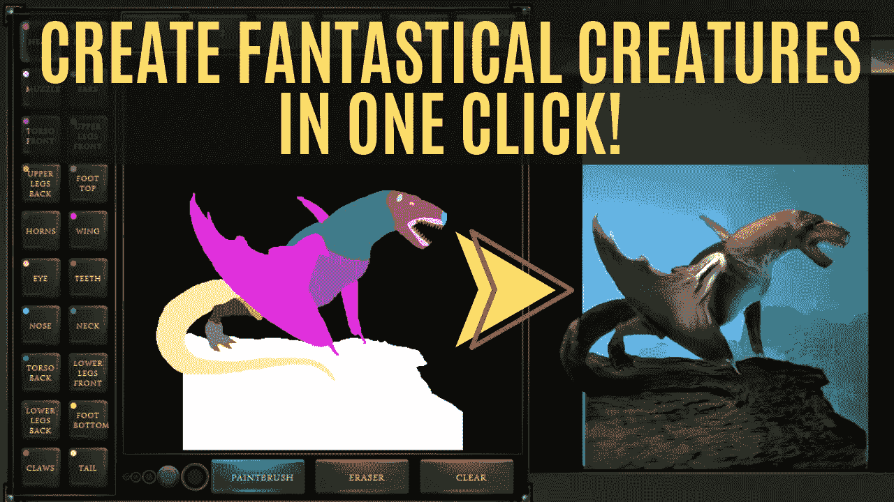
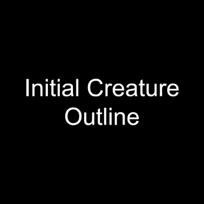
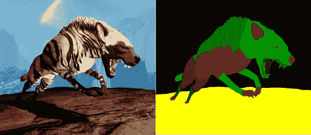
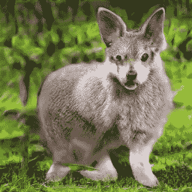

# 一个专为艺术家打造的人工智能——使用 Chimera Painter 一键创建梦幻生物

> 原文：<https://pub.towardsai.net/an-ai-made-for-artists-create-fantastical-creatures-in-one-click-with-chimera-painter-4548004ce4d2?source=collection_archive---------3----------------------->

## [深度学习](https://towardsai.net/p/category/machine-learning/deep-learning)

## 这个工具非常适合艺术家或视频游戏设计师，他们必须制作同一生物的许多资产，并在想法之间快速迭代，以找到可能的最佳生物。

图片来自奇美拉[画师演示](https://storage.googleapis.com/chimera-painter/index.html) [1]

好了，现在只需按一个按钮就可以做到这一点，而且已经可以自己尝试了！这个人工智能使用 GANs 来创造多种风格的奇异生物！让我们看看它是如何工作的，以及如何使用它。

## 什么是奇美拉画师？

奇美拉画家。视频演示通过[奇美拉画家谷歌的博客](https://ai.googleblog.com/2020/11/using-gans-to-create-fantastical.html)【2】

有了谷歌的奇美拉画师[1]，你只需要画出一个生物轮廓，就像你在这些例子中看到的那样，它就会自动生成一个奇幻的生物！这个轮廓仅仅是你需要绘制的生物的身体部分，比如“头”或者“翅膀”，用特定的颜色并用他们的工具来标注。不需要添加任何逼真的纹理或精确的细节，人工智能会为你做！然后，只需按下“转换！”按钮，模型将根据给定的轮廓生成一个新的生物。您总是可以添加简单的细节或身体部位，并迭代地改进或更改结果。使得该工具对于任何需要创建许多资产的艺术家来说都非常简单和有用。你可以把它看作是一个助手，帮助你把你的想法形象化，而不用花太多时间画出来。

这个人工智能使用了一个生成性的对抗性网络架构。生成性对抗网络，我们称之为 GAN，是网络的基础架构。

## 什么是甘？

GANs 是一种训练生成模型的聪明方法，在这种情况下，该模型通过将问题框架化为具有两个子模型的监督学习问题来生成幻想生物的图像。我们训练的生成器模型基于艺术家创建的图像生成新的示例，而鉴别器模型试图将示例分类为真实的(来自艺术家创建的训练数据集)或虚假的(由生成器网络创建)。

这两个模型在一个零和游戏中以对抗的方式一起训练，直到鉴别器模型被愚弄了大约一半的时间，这意味着生成器模型正在生成看似合理的生物例子。在这种情况下，零和意味着当鉴别器成功识别真实和虚假样本时，它被奖励，或者不需要改变模型参数，而生成器由于模型参数的大量更新而被惩罚。或者，当生成器欺骗鉴别器时，它被奖励，或者不需要改变模型参数，但是鉴别器被惩罚并且它的模型参数被更新。

GAN 培训流程。图片 via[Packt—GANs 原理](https://subscription.packtpub.com/book/big_data_and_business_intelligence/9781788629416/4/ch04lvl1sec24/principles-of-gans)

我们可以把发生器想象成一个伪造者，试图制造假币，而鉴别器就像警察，试图允许合法货币进入，并抓住假币。为了在这场游戏中取得成功，伪造者必须学会制造与真钱没有区别的钱，并且生成器网络必须学会创建从与训练数据相同的分布中抽取的样本。

## 更多关于奇美拉画家模型的信息

他们使用这种 GAN 训练方法训练了多个发电机模型，并将表现最好的一个合并到 Chimera Painter 的演示中，您现在可以尝试，这是描述中的第一个链接。在这里，你可以看到一些使用不同模型生成的生物。这个最佳模型是根据艺术家的反馈决定的。他们能够通过改变生成器模型的超参数来生成许多不同的模型，超参数是决定所生成图像的一般风格的参数。这个过程称为“微调”，使用相同的架构和相同的训练数据集，迭代地更改这些参数以改善结果。这意味着随着时间的推移，他们总是可以通过简单地上传更好的模型来改进工具，而且它只会越来越好。
但这不是一项简单的任务。

训练数据示例。图片来自[奇美拉画家谷歌的博客](https://ai.googleblog.com/2020/11/using-gans-to-create-fantastical.html)

为了创建这样一个真实而准确的发电机模型，他们需要一个巨大的艺术家创建的数据集，其中包含牙齿、耳朵、眼睛、角、翅膀等的完整分割，以便对其进行训练。简而言之，数据集中 10 000 多个训练示例中的每一个都由两个图像组成，一个是由艺术家制作的幻想生物结果，这是预期的输出，见左侧，另一个图像是每个身体部位的特定颜色，我们称之为计算机视觉中的“分割图”，见右侧，这是我们模型的输入。

如果我们希望我们的结果是真实的，如果我们希望它遵循生物的比例，形状和纹理，这些分割对于 GAN 训练的生成器是必不可少的。

失败的图像生成示例。图片来自奇美拉画家谷歌的博客

否则，它可能只是合并许多身体部位，只是创建一些完全怪异的东西，就像你可能在互联网上的某个地方看到的一样，就像这张照片中不匹配的身体部位。

经过训练的模型现在可以在 Chimera Painter 演示[1]中找到，链接如下。我邀请你来测试一下，玩起来真的很有趣！特别是如果你自己是一个艺术家，不要害怕它，因为它是一个“高科技工具”，它非常容易使用，非常友好的用户设计。您可以轻松地创建同一种生物的许多变体，并通过简单的点击来可视化结果。如果你更喜欢自己的工具，他们甚至可以上传你在外部程序如 Photoshop 中创建的生物轮廓。

让我知道你对它的看法！

这是我做的一个关于奇美拉的视频，有更多的例子:

还不明白 gan 是如何工作的？这里有一个更深入的解释:

如果你喜欢我的工作并想支持我，我会非常感谢你在我的社交媒体频道上关注我:

*   支持我的最好方式就是跟随我上**。**
*   **订阅我 [**YouTube 频道**](https://www.youtube.com/channel/UCUzGQrN-lyyc0BWTYoJM_Sg) 。**
*   **在 [**LinkedIn**](https://www.linkedin.com/company/what-is-artificial-intelligence) 上关注我的项目**
*   **一起学 AI，加入我们的 [**Discord 社区**](https://discord.gg/SVse4Sr) ，*分享你的项目、论文、最佳课程，寻找 Kaggle 队友，等等！***

## **参考**

**[1] [奇美拉画家演示](https://storage.googleapis.com/chimera-painter/index.html) (2020)，作者 a .辛格·图尔，谷歌，[https://storage.googleapis.com/chimera-painter/index.html](https://storage.googleapis.com/chimera-painter/index.html)**

**[2] [奇美拉画家谷歌的博文](https://ai.googleblog.com/2020/11/using-gans-to-create-fantastical.html) (2020)，作者 A. Singh Toor，谷歌，[https://ai . Google blog . com/2020/11/using-gans-to-create-fantastic . html](https://ai.googleblog.com/2020/11/using-gans-to-create-fantastical.html)**