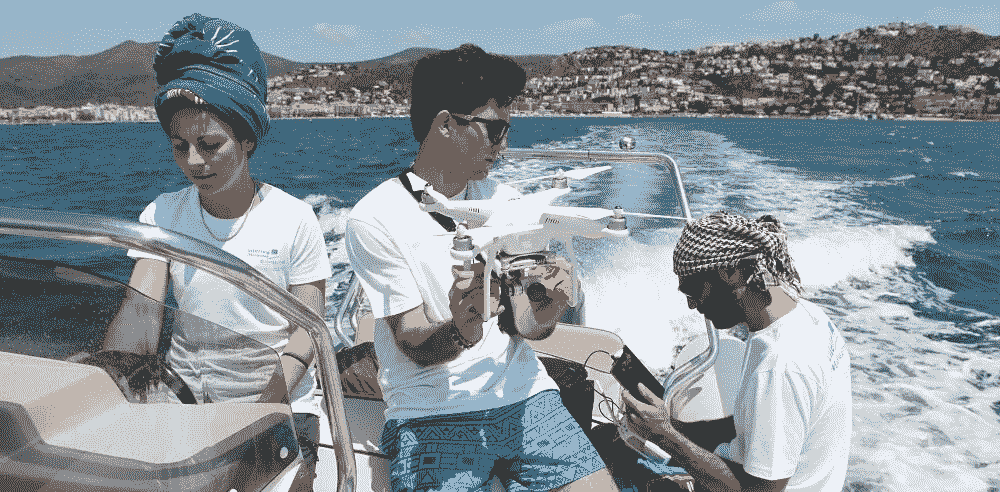
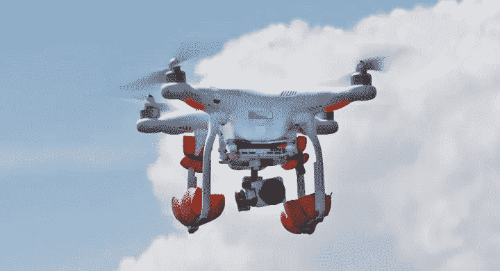
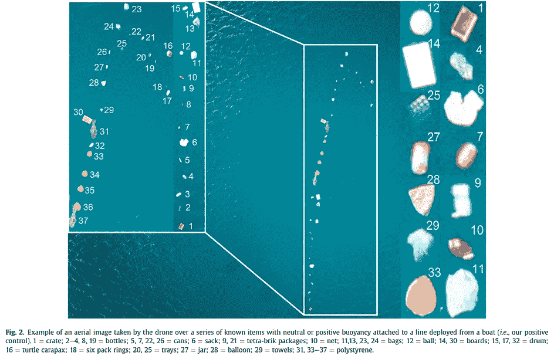
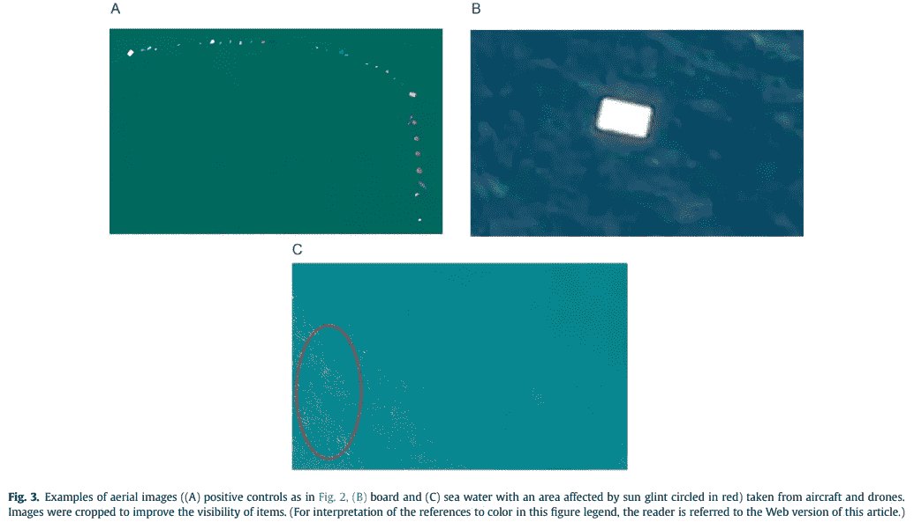
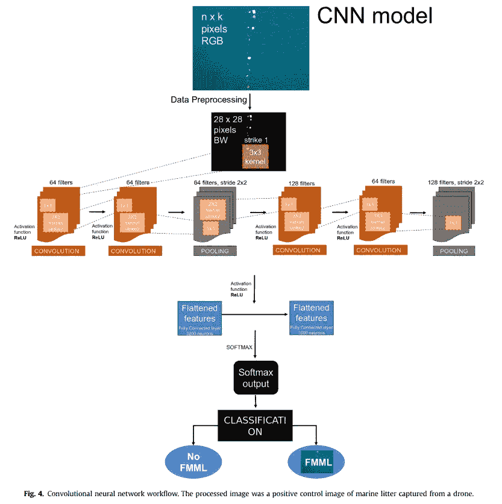
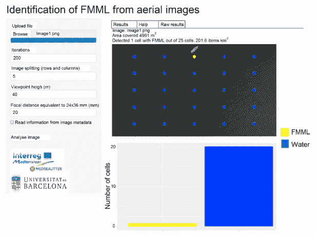

# 一个人工智能软件能够检测和计算海洋中的塑料垃圾

> 原文：<https://pub.towardsai.net/an-ai-software-able-to-detect-and-count-plastic-waste-in-the-ocean-7211aa0baf89?source=collection_archive---------2----------------------->

## [人工智能](https://towardsai.net/p/category/artificial-intelligence)，[创新](https://towardsai.net/p/category/innovation)

## 它既聪明又简单，你可以在许多图像分类应用中使用相同的模型。

fmls[1]

## FMMLs

来自巴塞罗纳大学的奥代·加西亚-加林等人开发了一种基于深度学习的算法，能够从航空图像中检测和量化漂浮的垃圾。他们还开发了一个面向网络的应用程序，允许用户在海面图像中识别这些垃圾，称为浮动海洋宏观垃圾，或 FMML。漂浮的海洋大垃圾是在海洋舱室中丢失或遗弃的任何持久性、人造或加工过的固体物质。你肯定知道，这些塑料垃圾对鱼、海龟和海洋哺乳动物来说是危险的，因为它们可能会吞食它们，或者被缠住而受伤。

## 如何摆脱 FMMLs？

检测 FML 的传统方法[1]

检测这些 FML 的传统方法是基于观测器的方法。这意味着他们需要有人在船上或飞机上寻找他们，屈服于精确的识别，但极其昂贵和耗时的劳动。幸运的是，这种检测可以使用飞行器上的摄像机或传感器来完成。但这也需要训练有素的科学家手动查看收集到的数据，这同样非常耗时。这里需要自动化，自动化可以帮助我们更有效地提高全球海运舱室的质量。

## 他们使用深度学习的方法

这就是机器学习和深度学习发挥作用的地方。深度学习一次又一次地证明了它是一种非常强大的自动化工具，尤其是在计算机视觉行业，众所周知，它可以在没有任何人工监督的情况下自动识别图像的重要特征，这使得这种方法比其前辈更省时。你可能会怀疑，他们使用卷积神经网络来解决这个问题。这种类型的神经网络是计算机视觉中最常用的深度学习架构。这种深层神经网络架构背后的想法是模仿人类的视觉系统。如果你想了解更多关于卷积神经网络(CNN)的基础，我会推荐你看这个视频，在这里我会更深入地解释它们:

左图:FMML 航拍图像示例。右:水的差异[1]

他们用无人机和飞机拍摄的空中图像来训练他们的算法，这些图像由通常手动分析它们的专业人员进行注释。这是一项具有挑战性的任务，即使对于深度学习来说也是如此，因为颜色和阳光反射都有可能发生变化。

模型[1]

简而言之，他们的模型是一个常规的二进制分类器 CNN 架构，由卷积和池组成，这些术语我在前面提到的视频中解释过，它输出二进制响应，告诉我们输入图像中是否存在 FMMLs。网络的深度是由于这些卷积层压缩图像并创建许多特征图，这些特征图是过滤器的输出，以图像的一般表示结束，使我们能够“大体”了解图像包含的内容，如本例中的 FMML。请注意，这种相同的架构可以用于任何其他计算机视觉应用程序，这些应用程序的任务是对图像中是否有物体进行分类，例如发现制造零件上的缺陷或判断是否有狗。他们所做的不同使其对 FMML 检测变得强大的是，他们有想法将图像分成 25 个更小的单元，每个单元输出一个分类结果，FMML 与否，从而产生更好的整体准确性。

## 一个基于网络的应用程序！

基于 R [2]的网络应用

然后，他们使用闪亮的 R 包来开发他们的应用程序。他们的算法可以检测和量化 FMML，并为监测和评估这种环境威胁提供支持。然而，它仍然没有完全自动化，需要人在回路中。截至目前，他们仍在寻找更多带注释的航空图像，以使他们的算法也能识别 FMML 的大小、颜色和类型，这些都是规划目标明确的政策和缓解措施的相关信息。

这仍然是深度学习的一个惊人应用，有一个伟大的用例，将使每个人受益。

当然，这只是对这篇新论文的介绍，如果你想了解更多或者甚至尝试一下，我在下面的参考文献中链接了论文[1]和他们的代码[2]及其应用。

## 观看视频:

如果你喜欢我的工作，并想了解最新的人工智能技术，你绝对应该在我的社交媒体频道上关注我。

*   订阅我的 [**YouTube 频道**](https://www.youtube.com/channel/UCUzGQrN-lyyc0BWTYoJM_Sg) 。
*   关注我的项目上 [**LinkedIn**](https://www.linkedin.com/in/whats-ai/) 和这里上[**中**](https://whats-ai.medium.com/) **。**
*   一起学习 AI，加入我们的 [**不和谐社区**](https://discord.gg/learnaitogether) ，*分享你的项目、论文、最佳课程，寻找 Kaggle 队友，等等！*

## 参考

[1]奥代·加西亚-加林等，航拍图像中漂浮海洋大型垃圾的自动检测和量化:介绍一种连接到网络应用的新型深度学习方法，载于 R，环境污染，[https://doi.org/10.1016/j.envpol.2021.116490](https://doi.org/10.1016/j.envpol.2021.116490)。

[2]代码与 web app:【https://github.com/amonleong/MARLIT 