# 一种构建新冠肺炎检测应用的方法

> 原文：<https://pub.towardsai.net/an-approach-towards-building-a-covid-19-detection-application-5c6169370f2a?source=collection_archive---------3----------------------->


马库斯·斯皮斯克在 [Unsplash](https://unsplash.com/s/photos/virus?utm_source=unsplash&utm_medium=referral&utm_content=creditCopyText) 上的照片

## [计算机视觉](https://towardsai.net/p/category/computer-vision)，[深度学习](https://towardsai.net/p/category/machine-learning/deep-learning)

## 我们能用科技探测到新冠肺炎吗？

新型冠状病毒疫情的传播已经影响了世界上的几个国家。死亡和受影响的人数正在以非常快的速度上升。我们知道传播背后的主要原因是，它通过接触传播。因此，我们必须隔离已经受影响的人，以阻止传播。但是检测这种疾病的过程是一个非常艰难和耗时的过程。所有这些因素都需要处理，以达到阻止疫情扩散的条件。

另一方面，最近，人们发现新冠肺炎对所有患者的影响并不相同。一些患者症状轻微，风险低得多，而另一些患者风险巨大，需要立即就医。目前，由于巨大的病人量，医院无法执行。因此，如果我们能检测出与患者相关的危险因素，那就太好了。

在本文中，我们将讨论实现这一任务的方法。

## 这个想法

为了检测患者是否真的感染了冠状病毒，我们将使用卷积神经网络，并对他/她的胸部 x 光图像进行分类。如果 CNN 分类器预测患者是 covid 阳性，我们将预测风险，否则一切正常，我们终止我们的申请。

在这一步，正确预测风险非常重要，因为我们正在应对一种威胁生命的疾病。因此，对于这一步，我们将使用两个模型。

第一个模型是 XGBoost 模型，它通过我们的 CNN 模型、患者的年龄和性别来获取胸部 X 射线的预测概率。我们也可以使用 CNN 根据 X 射线创建的扁平特征空间，但我认为，如果我们使用完全连接的层给出的预测百分比，它将成为更好的特征。

第二个模型是梯度推进模型。该模型将根据患者的症状、年龄和性别来预测疾病的风险。我们已经知道，冠状病毒攻击有各种症状，如肺炎、感冒、喉咙痛和呼吸系统问题。所有这些症状信息以及患者的年龄和性别可用于预测患者的风险因素。

我们的最终结果将是两个模型预测的平均值。使用两种模型的原因是，它提供了一种双向检查来提供预测，既使用了医学 X 射线扫描，又使用了年龄、性别和症状等因素。

> 注意:实验是在一小组图像的基础上完成的，只是为了研究的目的。尚未对该方法进行临床研究。所以，从结果中什么也推断不出来。

## 数据集

**为卷积神经网络训练**

我在这里使用了两个数据集。第一个数据集是由 [**约瑟夫·保罗·寇恩**](https://josephpcohen.com/w/) **博士维护的开源数据库。**数据库可以在[这里](https://github.com/ieee8023/covid-chestxray-dataset)找到。我也使用过 [Kaggle 的胸部 x 光数据集](https://www.kaggle.com/paultimothymooney/chest-xray-pneumonia)。第一个数据集包含患有**新冠肺炎的患者的胸部 x 光图像。**也有其他疾病如 SARS 的胸部 x 光图像。我只考虑并选择了新冠肺炎病人的 x 光片。

**用于 XGBoost 模型训练**

我使用了一个由约瑟夫·保罗·寇恩博士维护的开源数据库。数据库可以在这里找到[。](https://github.com/ieee8023/covid-chestxray-dataset)

**用于梯度推进模型训练**

我使用了从一场卡格尔比赛中获得的数据集。数据可以在这里[找到。](https://www.kaggle.com/edhenrivi/covid19-age-gender-symptoms-exploration?select=COVID19-age-gender-symptoms-outcome.csv)

应用程序的 GitHub 源代码中提供了所有数据。我将提供下面的链接。

## 应用

我们已经讨论了应用程序的目标和想法。所以让我们直接开始吧。

## 卷积神经网络

我们先来看看 CNN 的训练和表现。

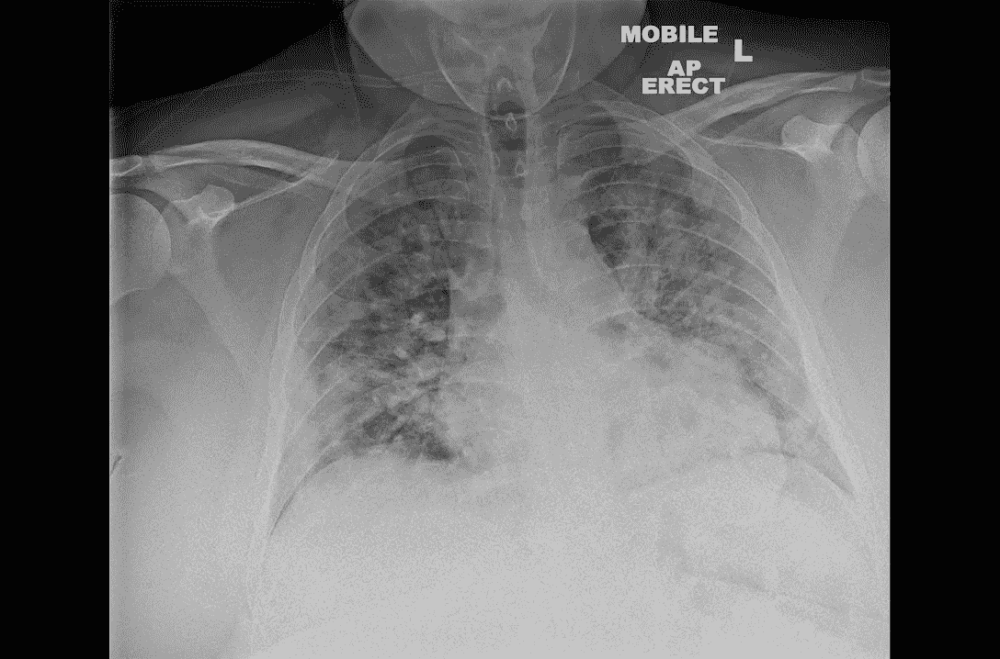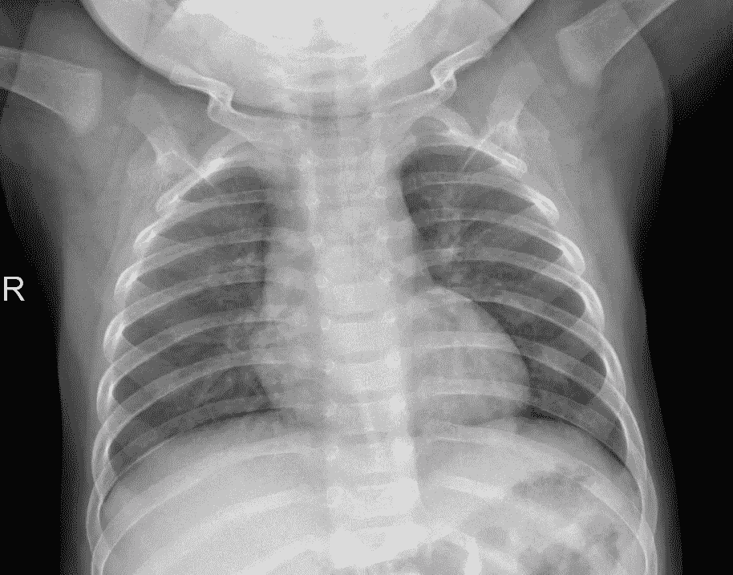

(1)受影响人的 x 光片(2)正常人的 x 光片。

让我们看看数据集的分布。

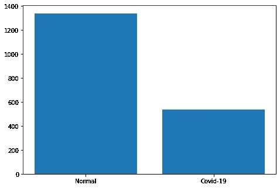

与新冠肺炎患者相比，健康人的数量相当大。我用了每个类的 200 张图片来保持布景的平衡。

```
images=[]
labels=[]
for fle in files:
  files_ac=os.listdir(fldr+'/'+fle)
    j=0
    if 'NORMAL' in fle:
      label=0
    if 'Covid' in fle:
      label=1
    for fle_2 in files_ac:
      if j>=200:
        break
      image_p=fldr+'/'+fle+'/'+fle_2
      print(image_p)
      image=cv2.imread(image_p)
      image = cv2.cvtColor(image, cv2.COLOR_BGR2RGB)
      image = cv2.resize(image, (224, 224))
      images.append(image)
      labels.append(label)
      j+=1
```

我对标签进行了硬编码，以避免一次性编码。我将使用大小为(224 x 224 x 3)的调整后的图像。对应于新冠肺炎患者的标签保持为 1。

“图像”列表包含所有 X 射线图像,“标签”列表包含相应的标签，0 代表健康，1 代表受影响的新冠肺炎。

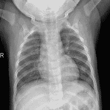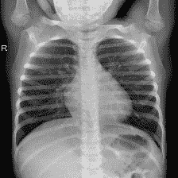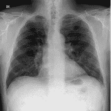

这是我们的 x 光经过预处理后的样子。第三张图片属于一名新冠肺炎患者。为了创建我们的训练集和测试集，我们需要缩放我们的“图像”集并将它们转换为数组。

```
import numpy as np
images_final=np.array(images)/255  ## Standardized
labels_final=np.array(labels)
from sklearn.model_selection import train_test_split
X_train, X_test, Y_train, Y_test = train_test_split(images_final, labels_final,test_size=0.25, random_state=42)
```

我们将使用 75%和 25%的列车测试分割。

接下来，让我们初始化我们的扩充数据生成器。

```
from tensorflow.keras.preprocessing.image import ImageDataGenerator
data_generator = ImageDataGenerator(shear_range = 0.2,zoom_range = 0.2, horizontal_flip = True, rotation_range=30,vertical_flip = True)
```

ImageDataGenerator 将通过应用剪切、放大图像以及裁剪、旋转、水平或垂直翻转，从我们的批处理中生成随机增强的图像。这将有助于我们的模型更好地学习列车组。

## 模型

我们现在准备继续我们的模型，我们将使用进行分类。

```
from tensorflow.keras.layers import Dropout
from tensorflow.keras.layers import Flatten,BatchNormalization
from tensorflow.keras.layers import Dense, MaxPooling2D,Conv2D
from tensorflow.keras.layers import Input,Activation,Add
from tensorflow.keras.models import Model
from tensorflow.keras.regularizers import l2
from tensorflow.keras.optimizers import Adamdef Convolution(input_tensor,filters):

    x = Conv2D(filters=filters,kernel_size=(3, 3),padding = 'same',strides=(1, 1),kernel_regularizer=l2(0.001))(input_tensor)
    x = Dropout(0.2)(x)
    x= Activation('relu')(x)return x
def model(input_shape):
  inputs = Input((input_shape))

  conv_1= Convolution(inputs,32)
  maxp_1 = MaxPooling2D(pool_size = (2,2)) (conv_1)
  conv_2 = Convolution(maxp_1,64)
  maxp_2 = MaxPooling2D(pool_size = (2, 2)) (conv_2)
  conv_3 = Convolution(maxp_2,128)
  maxp_3 = MaxPooling2D(pool_size = (2, 2)) (conv_3)
  conv_4 = Convolution(maxp_3,256)
  maxp_4 = MaxPooling2D(pool_size = (2, 2)) (conv_4)
  flatten= Flatten() (maxp_4)
  dense_1= Dense(64,activation='relu')(flatten)
  drop_1=Dropout(0.2)(dense_1)
  output= Dense(1,activation="sigmoid")(drop_1)model = Model(inputs=[inputs], outputs=[output])model.compile(loss="binary_crossentropy", optimizer="Adam",
 metrics=["accuracy"])
  return model
```

我们将使用 4 层模型，二元交叉熵作为我们的损失函数。我用了亚当的优化程序。

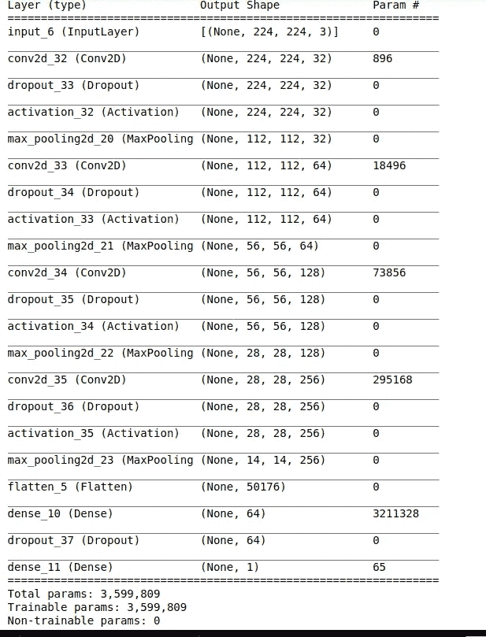

该模型具有 3M 个可训练参数。我使用了正则和辍学层，以避免过度拟合。

```
import tensorflow as tf
logdir = os.path.join("logs", datetime.datetime.now().strftime("%Y%m%d-%H%M%S"))
tensorboard_callback = tf.keras.callbacks.TensorBoard(logdir, histogram_freq=1)
fle_s='Covid_19_detection.h5'
checkpointer = ModelCheckpoint(fle_s, monitor='loss',verbose=1,save_best_only=True,save_weights_only=False, mode='auto',save_freq='epoch')
callback_list=[checkpointer,tensorboard_callback]History=Model.fit_generator(data_generator.flow(X_train,Y_train,batch_size=32),validation_data=(X_test,Y_test),epochs=25,callbacks=[callback_list])
```

上面的片段可以用来训练我们的模型。我已经使用了 32 的批量大小和扩充的数据生成器，我们已经在这篇文章中看到了。

```
pred=Model.predict(X_test)
score=Model.evaluate(X_test,Y_test)
print(score)
>>> [0.25777390599250793, 0.9599999785423279]
```

我们的模型给出了 96%的测试准确度。

## 结果评估

让我们看看我们的学习曲线。

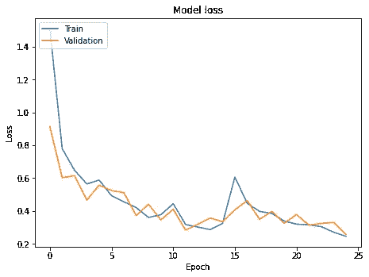

上面的曲线显示了我们的损失函数随时间的减少。橙色曲线表示验证集，蓝色曲线表示训练集。

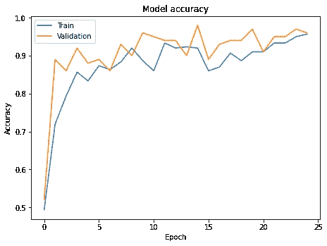

我们来看看获得的混淆矩阵。

```
results = confusion_matrix(Y_test, pred_np)
import seaborn as snssns.heatmap(results, annot=True)
```

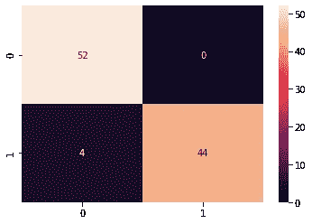

这是我们得到的混淆矩阵。

## XGBoost 模型

我们现在来看看 XGBoost 模型的训练。

[数据集](https://github.com/ieee8023/covid-chestxray-dataset)包含一个名为 metadata.csv 的文件。该文件包含每个患者的详细信息，包括其 x 光片的相应文件名。

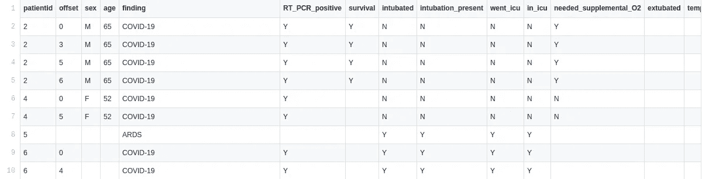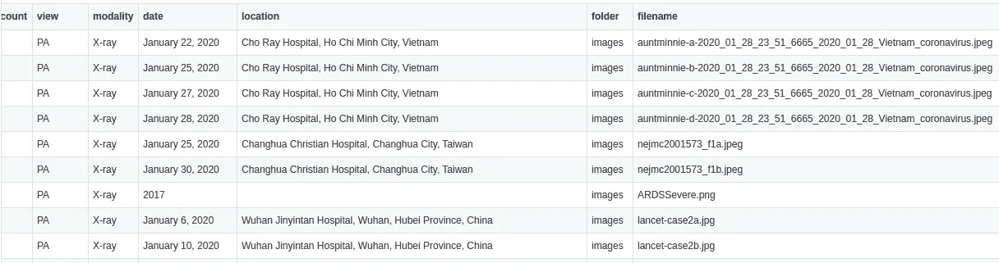

上面的图像显示了文件的结构。我已经选择了关于“性别”、“年龄”、“存活”、“插管”、“插管 _ 存在”、“去了 _ 重症监护室”、“在 _ 重症监护室”和“文件名”字段的信息片段，仅用于发现新冠肺炎的患者。

在预处理数据时，我删除了“年龄”或“性别”列中所有空值的条目。接下来，如果‘插管’，‘插管 _ 存在’，‘去了 _ 重症监护室’，‘在 _ 重症监护室’中的任何字段具有值‘Y’或者‘存活’列具有值‘N’，则我已经标记该患者具有严重状况，否则没有。

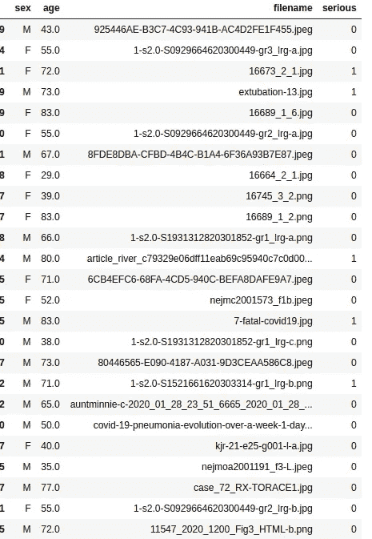

上图显示了初级预处理后的数据。接下来，我们相应地选择文件名，并使用我们的 CNN 模型来获得 X 射线扫描的预测百分比。

```
import cv2
import numpy as np
def prediction(model,df):
    i=0
    pred=[]
    while i<len(df):

        file_ext=fldr+'/'+files[1]+'/'
        name=df.iloc[i]['filename']
        file=file_ext+name
        image=cv2.imread(file)
        image = cv2.cvtColor(image, cv2.COLOR_BGR2RGB)
        image = cv2.resize(image, (224, 224))
        images_final=np.array(image)/255
        pred_1=model.predict(np.array([images_final]))
        #print(pred_1[0][0])
        pred.append(pred_1[0][0])

        i+=1
    return pred
```

上面这段代码用于获得预测百分比。

对数据进行充分预处理后，获得的数据集如下所示:

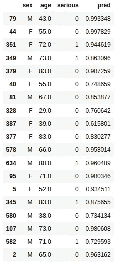

## 模型和培训

我们准备初始化 XGBoost 模型。

```
from sklearn.model_selection import train_test_split
from sklearn.metrics import accuracy_score
import xgboost as xgbX_train, X_test, y_train, y_test = train_test_split(X, Y, random_state=0)
xgb_model = xgb.XGBClassifier(objective="binary:logistic", random_state=42)
xgb_model.fit(X_train, y_train)
y_pred=xgb_model.predict(X_test)
acc=accuracy_score(y_pred,y_test)
```

上面的代码片段用于初始化 XGBoost 分类器来预测风险。

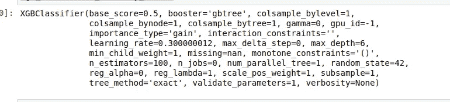

该图显示了所使用的 XGBoost 模型。

该模型给出了 77%的准确度分数。

得到的混淆矩阵和分类得分为:

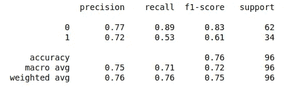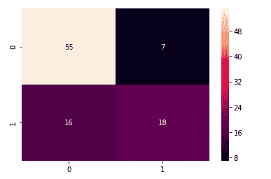

(1)分类报告和(2)混淆矩阵

## 梯度推进模型

对于梯度增强模型，我们的训练数据呈现在[这里](https://www.kaggle.com/edhenrivi/covid19-age-gender-symptoms-exploration?select=COVID19-age-gender-symptoms-outcome.csv)。

数据的结构如下所示:

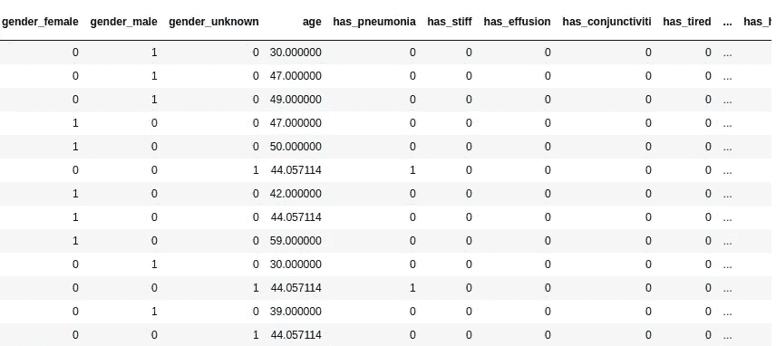

实际文件有几列:

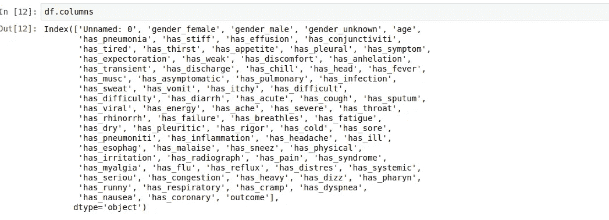

“结果”列有三个结果:“未知”、“高风险”、“低风险”。我们将只使用“高风险”和“低风险”结果，我们将使用的列有:

```
[[‘gender_male’,’age’,’has_pneumonia’, ‘has_stiff’, ‘has_effusion’,’has_tired’, ‘has_thirst’, ‘has_appetite’, ‘has_pleural’, ‘has_symptom’,’has_weak’, ‘has_discomfort’,’has_cough’,’has_ache’, ‘has_rigor’, ‘has_cold’, ‘has_sore’,’has_pharyn’,
 ‘has_runny’, ‘has_respiratory’,’has_viral’,’outcome’]]
```

因此，我们使用前 20 列作为我们的训练集，使用结果列作为我们的目标集。

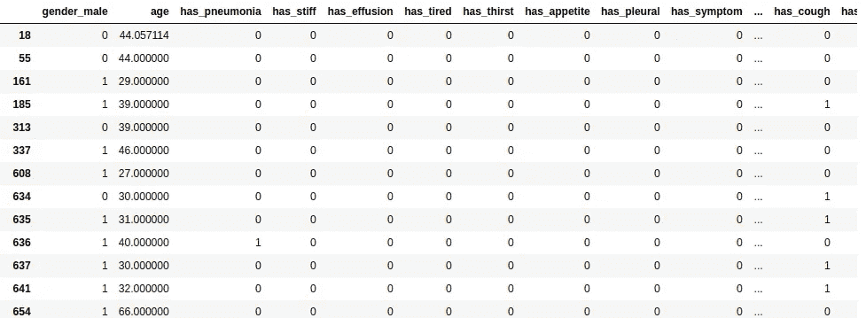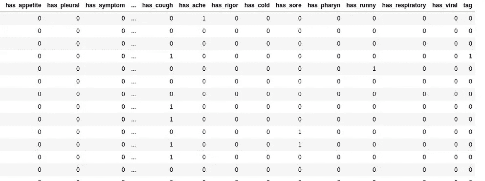

上图显示了经过处理的数据集。

现在，需要注意的是，我们的数据严重不平衡。

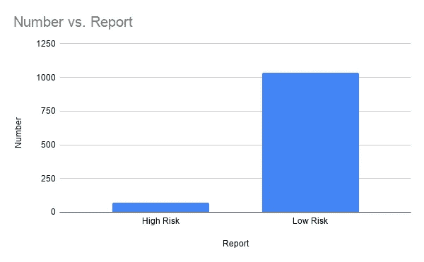

所以，我用重采样的方法将每个类的数据均衡到 500。

```
df_majority = df[df.tag==0]
df_minority = df[df.tag==1]
df_minority_upsampled = resample(df_minority, 
                                 replace=True,     
                                 n_samples=500,    
                                 random_state=32)
df_majority_downsampled = resample(df_majority, 
                                 replace=False,   
                                 n_samples=500,    
                                 random_state=32)
df_final=pd.concat([df_minority_upsampled,df_majority_downsampled],axis=0)
```

现在，我们的数据是平衡的。

让我们检查一下数据的分布。为了做到这一点，我使用了主成分分析来可视化数据。

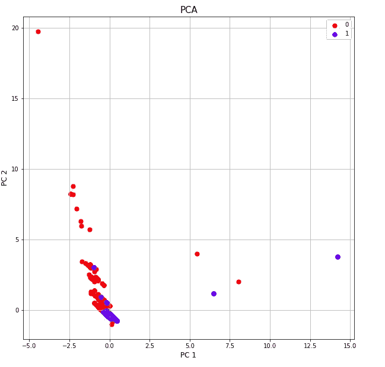

上图显示了 PCA。我们可以看到没有线性分离。因此，我们将需要使用决策树或集成学习算法。因此，我们使用梯度推进。

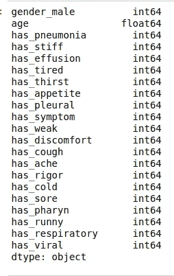

上图显示了我们的训练数据集的细节。

## 模型和培训

我们来看看模型和评测。

```
from sklearn.model_selection import train_test_split
from sklearn.ensemble import GradientBoostingClassifier
from sklearn.metrics import accuracy_scoremodel_gb=GradientBoostingClassifier()
model_gb.fit(X_train,y_train)
y_pred=model_gb.predict(X_test)
acc=accuracy_score(y_pred,y_test)
```

上面的代码用于训练模型。获得的准确率为 82%

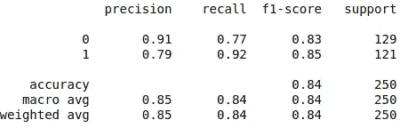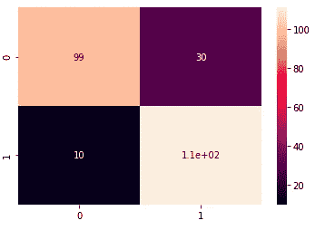

上图分别给出了分类报告和混淆矩阵。

## 部署

我使用 Flask 和 Docker 进行项目的部署。

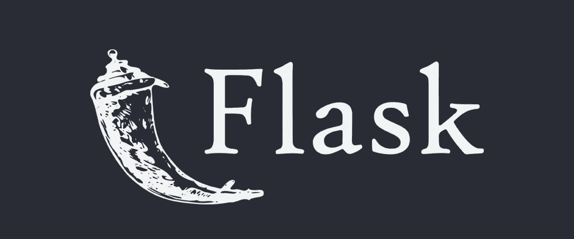

> Flask 是一个用 Python 编写的微型 web 框架。它被归类为微框架，因为它不需要特殊的工具或库。
> 
> Docker 是一组平台即服务产品，使用操作系统级虚拟化来交付称为容器的软件包中的软件。容器是相互隔离的，捆绑了它们自己的软件、库和配置文件；他们可以通过明确定义的渠道相互交流。

上面的代码用于使用 Flask 部署模型。

*第 10- 55 行:*该部分涉及上传患者的 x 光片并预测患者是否受到冠状病毒的影响。

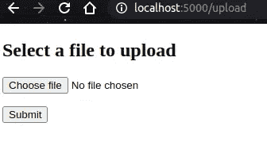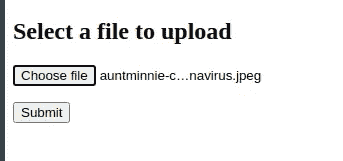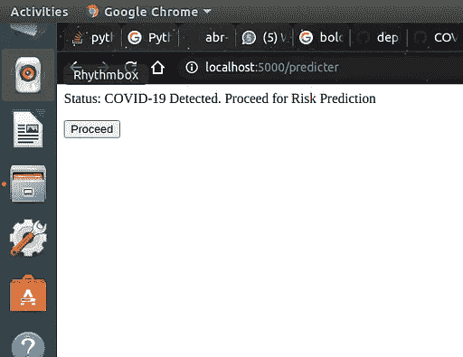

以上图像显示了该部分的工作情况。

```
<!doctype html>
<title>Covid-19-Detector</title>
<h2>Select a file to upload</h2><form method="post" action="/predicter" enctype="multipart/form-data">
    <dl>
 <p>
  <input type="file" name="file" autocomplete="off" required>
 </p>
    </dl>
    <p>
 <input type="submit" value="Submit">
    </p>
</form>
```

以上是上传页面的 HTML 模板代码。

现在，如果患者被发现冠状动脉阳性，他/她将进行风险预测。

*第 57–133 行:*该部分处理表单数据的收集和风险预测最终结果的交付。

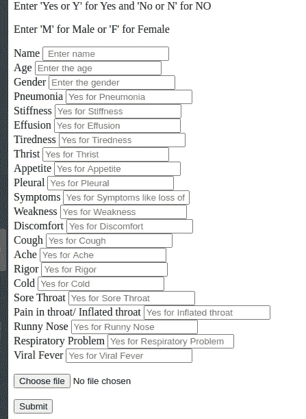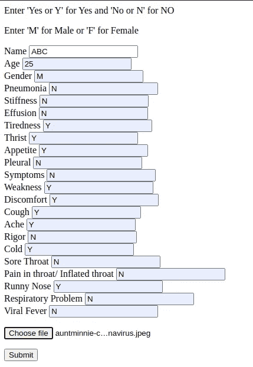

以上图像显示了该部分的工作情况，最终结果如下:

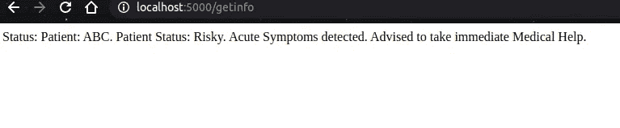

```
<html>  
<head>  
<title>Form</title>  
</head>  
<body>  
<p>Enter 'Yes or Y' for Yes and 'No or N' for NO</p> 
<p>Enter 'M' for Male or 'F' for Female</p>  
</body> 
<form action="/getinfo" method="POST", enctype="multipart/form-data"><label>Name</label>
         <input type="text" id="name" name="name" placeholder=" Enter name">
         <br>
         <label>Age</label>
         <input type="text" id="age" name="age" placeholder="Enter the age">
         <br>
         <label>Gender</label>
         <input type="text" id="gender" name="gender" placeholder="Enter the gender">
         <br>
         <label>Pneumonia</label>
         <input type="text" id="has_pneumonia" name="has_pneumonia" placeholder="Yes for Pneumonia">
         <br>
         <label>Stiffness</label>
         <input type="text" id="has_stiff" name="has_stiff" placeholder="Yes for Stiffness">
         <br>
         <label>Effusion</label>
         <input type="text" id="has_effusion" name="has_effusion" placeholder="Yes for Effusion">
         <br>
         <label>Tiredness</label>
         <input type="text" id="has_tired" name="has_tired" placeholder="Yes for Tiredness">
         <br>
         <label>Thrist</label>
         <input type="text" id="has_thirst" name="has_thirst" placeholder="Yes for Thrist">
         <br>
         <label>Appetite</label>
         <input type="text" id="has_appetite" name="has_appetite" placeholder="Yes for Appetite">
         <br>
         <label>Pleural</label>
         <input type="text" id="has_pleural" name="has_pleural" placeholder="Yes for Pleural">
         <br>
         <label>Symptoms</label>
         <input type="text" id="has_symptom" name="has_symptom" placeholder="Yes for Symptoms like loss of smell and taste">
         <br>
         <label>Weakness</label>
         <input type="text" id="has_weak" name="has_weak" placeholder="Yes for Weakness">
         <br>
         <label>Discomfort</label>
         <input type="text" id="has_discomfort" name="has_discomfort" placeholder="Yes for Discomfort">
         <br>
         <label>Cough</label>
         <input type="text" id="has_cough" name="has_cough" placeholder="Yes for Cough">
         <br>
         <label>Ache</label>
         <input type="text" id="has_ache" name="has_ache" placeholder="Yes for Ache">
         <br>
         <label>Rigor</label>
         <input type="text" id="has_rigor" name="has_rigor" placeholder="Yes for Rigor">
         <br>
         <label>Cold</label>
         <input type="text" id="has_cold" name="has_cold" placeholder="Yes for Cold">
         <br>
         <label>Sore Throat</label>
         <input type="text" id="has_sore" name="has_sore" placeholder="Yes for Sore Throat">
         <br>
         <label>Pain in throat/ Inflated throat</label>
         <input type="text" id="has_pharyn" name="has_pharyn" placeholder="Yes for Inflated throat">
         <br>
         <label>Runny Nose</label>
         <input type="text" id="has_runny" name="has_runny" placeholder="Yes for Runny Nose">
         <br>
         <label>Respiratory Problem</label>
         <input type="text" id="has_respiratory" name="has_respiratory" placeholder="Yes for Respiratory Problem">
         <br>
         <label>Viral Fever</label>
         <input type="text" id="has_viral" name="has_viral" placeholder="Yes for Viral Fever">
         <br>
         <dl>
         <p>
  <input type="file" name="file" autocomplete="off" required>
  </p>
      </dl><button type="submit">Submit</button></form> 
</html>
```

上面的代码给出了表单模板。

我已经使用 Docker 来容器化上述项目。以下是该准则的要求。

```
numpy==1.18.5
matplotlib
opencv-python-headless
DateTime
sklearn
scikit-learn
pandas
seaborn
tensorflow
Werkzeug==0.14.1
Flask-WTF
WTForms
xgboost
```

docker 文件如下所示:

```
FROM ubuntu:latest
MAINTAINER Abhijit RoyRUN apt-get update -yRUN apt-get install -y python3-pip python3-dev build-essentialCOPY . /appWORKDIR /appRUN pip3 install --default-timeout=200 futureRUN pip3 install -r requirements.txtEXPOSE 5000CMD python3 deployer.py
```

现在，我们可以使用以下指令来构建映像:

```
sudo docker build -t covid_detector_image .docker images
```

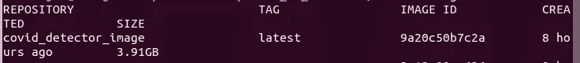

该图像显示了创建的 docker 图像。

## 结论

在本文中，我们看到了一个构建新冠肺炎探测器应用程序的想法。

Github 库在这里是。

我希望这有所帮助。