# 机器学习的端到端综合总结

> 原文：<https://pub.towardsai.net/an-end-to-end-comprehensive-summary-of-machine-learning-df30fa149c94?source=collection_archive---------0----------------------->

照片由 [Unsplash](https://unsplash.com/s/photos/machine-learning?utm_source=unsplash&utm_medium=referral&utm_content=creditCopyText) 上的 [h heyerlein](https://unsplash.com/@heyerlein?utm_source=unsplash&utm_medium=referral&utm_content=creditCopyText) 拍摄

## 机器学习

## 机器学习概念和实际实现技巧的备忘单

# 介绍

如果你是机器学习领域的新手，并且希望快速熟悉机器学习的所有概念，而不会被背景中复杂的数学知识所淹没，那么请阅读这篇文章。

这篇文章包含了机器学习的关键概念，这些概念是基于我从多种来源获得的知识，特别是从[吴恩达教授的](https://en.wikipedia.org/wiki/Andrew_Ng)机器学习在线课程和课堂讲座中获得的知识，这些课程和讲座带有链接，可供感兴趣的人进一步阅读。

我希望这可以作为新机器学习爱好者的一个去处，也可以作为那些想用一些关键的实现技巧刷新他们对什么是机器学习的想法的人的一个去处。

请原谅我这篇文章有点长，但它是可以理解的，值得你花时间，因为它几乎触及了机器学习的每个主要概念。

这篇文章被分成几天，只是为了那些喜欢慢慢来的人。你可以阅读一天的重点，然后尝试进一步研究，并根据这些概念实施一个项目。这给了它结构。

所以不用浪费你太多时间，让我们开始吧。

# 第一天亮点

图片来自 Coursera

# 什么是机器学习？

机器学习是人工智能的一个分支，它为计算机系统提供了自动学习和根据经验改进的能力，而无需显式编程。

它大致分为两大类:**有监督的和无监督的。**此外，我们还遇到了**异常检测**问题，这些问题结合了监督和非监督技术。

# 监督学习。

在监督学习中，学习算法(模型)是用标记数据训练的。机器学习算法(模型)通过迭代过程从这些标记的数据中学习，然后使其能够对新的未知数据进行预测。

监督学习进一步分为**回归和分类问题。**

## 线性回归分析。

在回归问题中，模型预测的输出变量是一个数值。例如，预测纽约市的房价，或者预测某个州的能源消耗量。

## 线性回归的目的。

在线性回归中，目标非常简单。

给定一个标有训练集的 m-training 例子，目的是***找到使代价函数*** *最小的模型参数。这将很快变得非常清楚。*

回归可以是**单变量或多变量。**

## 一元线性回归。

单变量简单地说就是单个变量(特征)。用于训练线性回归模型的输入示例 X(i)是单值或一维向量的回归问题是单变量线性回归问题。

这是一个带有单个变量(年龄)和相应输出(体重)的带标签训练数据集的示例。仅给出个体的年龄，该模型旨在预测个体的体重。

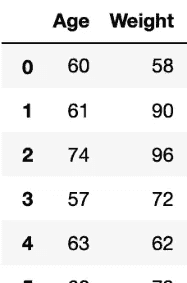

图像单变量数据集

从技术上讲，下图总结了一个线性回归模型。在这种情况下，它是一个单变量模型，因为 X 是一个值，而不是一个向量。

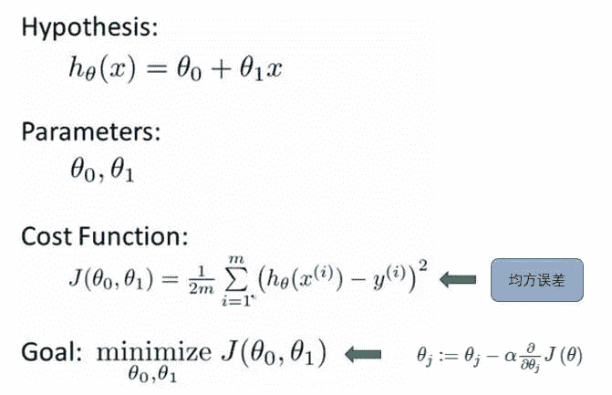

来源:程序员搜索

出现的问题是，

> 我们如何找到产生成本函数最小值的模型参数(θ)的值？

幸运的是，梯度下降的出现让我们不再头疼。

## 梯度下降

梯度下降是一种通用算法，用于最小化不同类型的函数。在线性回归中，我们使用梯度下降算法来自动地和同时地更新模型参数。

这是一种迭代算法。对于每次迭代，评估成本函数的导数并更新模型参数。这样做，直到达到成本函数的有希望的收敛，即找到全局最优。

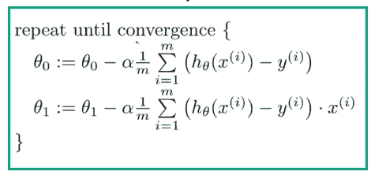

梯度下降算法

构成梯度下降算法的两个基本要素是 ***学习速率*** 和 ***成本函数的偏导数。***

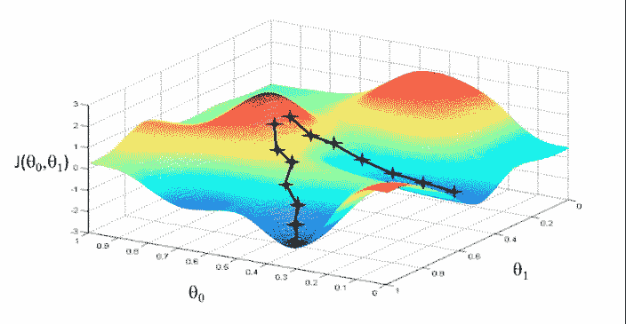

梯度下降图解:来源:Coursera

学习率(alpha)也决定了在更新模型参数*时，我们采用**的多少步长**。*上面 ***求和项表示的偏导数项给出了最陡斜率的方向。***

注意:记住，函数在某一点的导数是与通过该点的函数相切的直线的斜率。

**梯度下降的关键注释**

如果 alpha 超参数太小，梯度下降会变得太慢，因为收敛到局部最小值需要很多时间。这是因为更新的θ参数是通过下山的小步增加的。

如果阿尔法太大，我们可能会超调，甚至发散。也就是说，我们可能会跳过最小值，永远不会收敛。

这里解释的这种梯度下降算法又称为 ***【批量梯度下降】，*** 为算法在每次模型参数的更新迭代过程中使用所有的训练样本。

这里有一些文章的链接，包括我的文章，可以拓宽你对基本概念的理解

> [*线性回归*](https://towardsdatascience.com/linear-regression-detailed-view-ea73175f6e86) 详细查看文章中由 [Saishruthi](https://towardsdatascience.com/@saishruthi.tn?source=post_page-----ea73175f6e86----------------------)
> 
> [针对每个人的监督和非监督学习](https://towardsdatascience.com/supervised-and-unsupervised-learning-for-everyone-526f9b746dd5?source=your_stories_page---------------------------)

> 第一天结束了！！

# **第二天亮点**

## 多特征线性回归

当我们在每个训练示例的训练数据中有多个特征用于预测时，每个训练示例现在都变成一个向量，而不是单个值。具体而言，在这种情况下，每个训练示例变成 n 维特征向量，其中 n =训练集中的特征数量。

这就是所谓的**多元线性回归。**多元简单来说就是多个变量或特征。下面显示了一个数据集示例，其中每个训练示例的特征数 n 为四(4)，带标签的输出为工资增长。

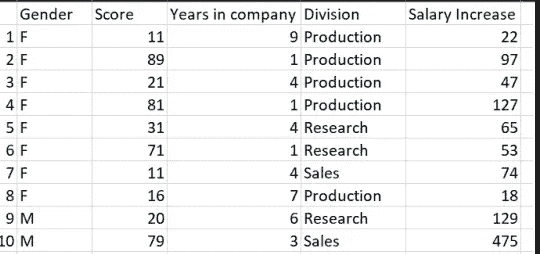

具有多个特征的训练数据集的图像

多元线性回归的假设是一元线性回归的扩展，如下所示，其中 n =要素数。

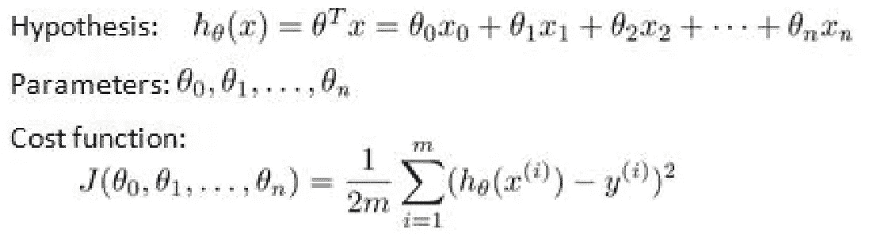

多元线性回归假设和成本函数

这意味着特征 **i** 的单位变化对应于假设中的变化 bi。例如房价。

在多元线性回归的梯度下降中，成本函数 J 简单地随着模型参数(θ)的数量而变化，如上图所示。

在回归中，我们经常在成本函数中添加一个正则项，这有助于我们避免过度拟合我们的模型，如下所示。关于这一点的更多信息可以在我将在最后分享的附加链接中找到。

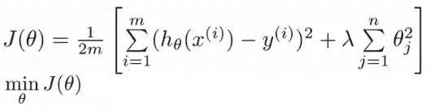

带有正则项的代价函数。

## 特征缩放

这是两种常见技术之一，旨在将所有特征的范围调整为相同或彼此接近。

特征缩放有助于梯度下降算法 ***收敛得更快，迭代次数更少，也更正确。*** 如果数值范围太小，则放大或缩小。

## 均值归一化

这是另一种主要用于特征缩放的技术。

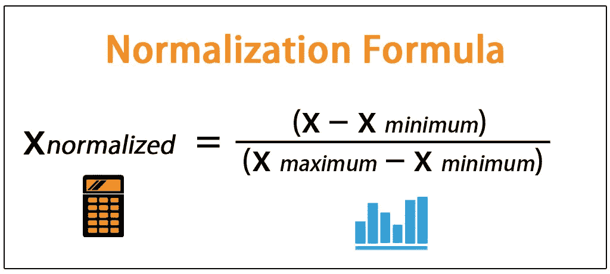

图片由 wallstreetmojo.com 拍摄

## 确定梯度何时收敛。

绘制成本函数 J(θ)与梯度下降算法执行的迭代次数的关系图是确定梯度下降是否收敛的一种很好的实用方法。

学习率 的 ***小值导致 ***非常缓慢的收敛*** ，即，达到成本函数的全局最优需要很长时间。
另一方面，如果 ***学习率过大，*** 代价函数 ***可能不会在每次迭代中减少*** ，甚至会***

## *正规方程技术*

*这是一种用于求解模型参数值的技术，其在分析上最小化成本函数。它不像梯度下降那样执行迭代过程，我们不选择任何学习速率。*

*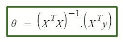*

*正规方程公式*

*对于非常大量的特征，即 n = 10000+而言，正规方程在计算上变得昂贵，因为我们需要 ***计算矩阵逆*** ，这对于大型矩阵来说是相当昂贵的过程。在这种情况下，梯度下降是最好的选择。*

## *关键音符*

> *如果正规方程的 X . TX 矩阵是不可逆的，即它是奇异的或退化的，那么这意味着两件主要的事情*
> 
> **冗余特征—线性相关特征
> *特征过多*

*[这里](https://towardsdatascience.com/all-about-feature-scaling-bcc0ad75cb35)是一篇关于特征缩放的好文章。*

> *第二天结束了！！*

# ***第三天亮点***

# *分类*

**

*来源:[https://www . wkrg . com/northwestern-Florida/new-penalty-for-animal-breakers-take-effect-Monday-in-Florida/](https://www.wkrg.com/northwest-florida/new-penalties-for-animal-abusers-take-effect-monday-in-florida/)*

*在分类中，目标是识别一个对象(输入)属于哪个类别。例如，我们可能有兴趣确定图像是否包含**狗或猫**，颜色**红色或黑色**，电子邮件**垃圾邮件，或真正的**，患者是否携带**艾滋病毒**。*

*用于解决机器学习中的分类问题的一个非常常见的模型是逻辑回归。*

## *逻辑回归*

*这是一种基于 sigmoid 或逻辑函数的分类算法，其值压缩在 0 和 1 之间。*

*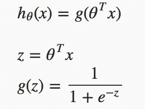**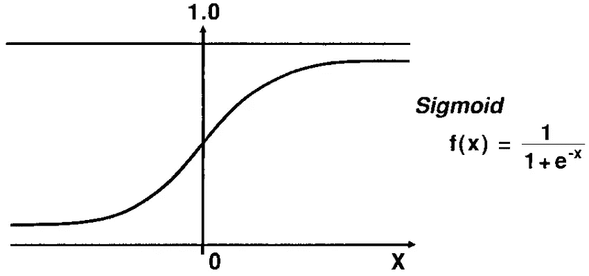*

*资料来源:Researchgate.net*

*如上图所示，h(x) = g(z)是用于计算 0 到 1 范围内的输出值或概率的假设函数或 sigmoid 函数。*

*我们的逻辑函数的行为方式是，当其输入 z 大于或等于零时，其输出 g(z)大于或等于 0.5:*

## *二元分类*

*在二元分类中，输出为 0 或 1，因此与线性回归的情况相反，假设也必须在 0 和 1 的范围内。这就是我们使用逻辑函数或 sigmoid 函数进行假设的原因。*

*它通常被解释为一种概率。*

*例如，假设假设的输出值 h(x)为垃圾邮件分类问题的 h(x) = 0.7，其中 0 代表垃圾邮件，1 代表垃圾邮件。这仅仅意味着该电子邮件是垃圾邮件的概率为 0.7。*

## *决策界限*

*它是将数据集分成不同类的界限。在二元分类问题中，决策边界是将数据集中的正例与反例分开的线。*

*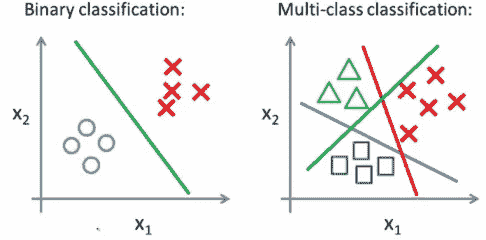*

*媒体图像*

***非线性决策边界**也可用于分类任务，以获得更好的模型。*

## *逻辑回归的成本函数*

*逻辑回归的成本函数与我们在线性回归中看到的不同。这是因为如果我们使用线性回归的代价函数来评估逻辑回归模型，它将导致具有许多局部最优值的波动和不规则形式，即它不是凸函数。*

**

*逻辑回归的成本函数*

## *多类分类*

*我们使用 [**一对一**](https://utkuufuk.com/2018/06/03/one-vs-all-classification/) **(或一对其余)**分类技术，由此我们为数据集中的 n 个不同类训练 n 个二元逻辑分类器。*

*这是通过在训练期间将单个类的类标签设置为正，然后将属于其余类的其他训练样本的标签设置为负来实现的。这依次进行，直到我们为数据集中的 n 个类训练了 n 个二元分类器。*

*在预测期间，输入在所有 n 分类器中运行。输入属于其模型输出概率最高的类。*

## *解决过拟合问题。*

***欠拟合**也称为**高偏差**发生在我们只有非常少的训练数据的时候。
**过拟合**，也称为**高方差**经常发生在我们的数据集中有太多特征的时候。*

*有两个主要选项可以解决过度拟合问题:*

1.  ***减少特征的数量:**
    我们可以用两种方法减少特征的数量*

> **通过手动选择要保留的功能。
> *通过使用模型选择算法。*

*[**2。正规化**](https://towardsdatascience.com/regularization-an-important-concept-in-machine-learning-5891628907ea)*

*当我们有很多稍微有用的特性时，正则化工作得很好。*

# ***第 4 天亮点***

# *神经网络和表示。*

*神经网络是作为大脑中的模拟神经元或神经元网络而开发的。下图显示了人工神经网络的基本结构。*

*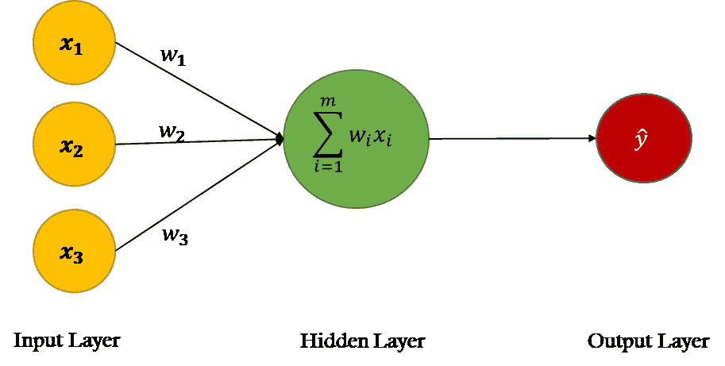*

*单个人工神经元的图像*

*每个圆称为一个节点。黄色节点被称为输入节点(特征)。绿色的**节点**被称为隐藏节点，最后红色的**输出节点**。这些隐藏节点(单元)通常被称为激活单元，因为它们计算的函数被称为激活函数。最常见的激活函数是 sigmoid 和 Relu(整流线性单元)*

*通过以结构化的方式堆叠这些节点，我们可以创建非常强大的模型，能够以高精度执行复杂的任务。下图是一个**三(3)层神经网络**(输入层不算)。*

*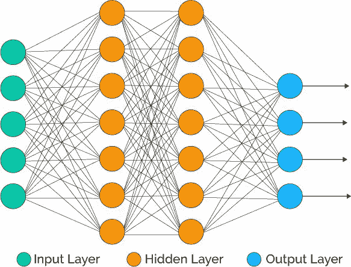*

*从走向数据科学的两层神经网络图像*

# *神经网络的应用*

*神经网络是多用途的，因此可以用于许多不同的应用。它们用于二元分类以及多类分类任务。神经网络也用于解决回归问题。*

*这里有一些实际的使用案例:字符识别、图像压缩、股票市场价格等预测问题、签名识别等等。*

**第 5 天结束时提供了有关神经网络的更多信息的链接。继续走。**

> *第四天结束了！！*

# ***第 5 天亮点***

# *神经网络:学习*

*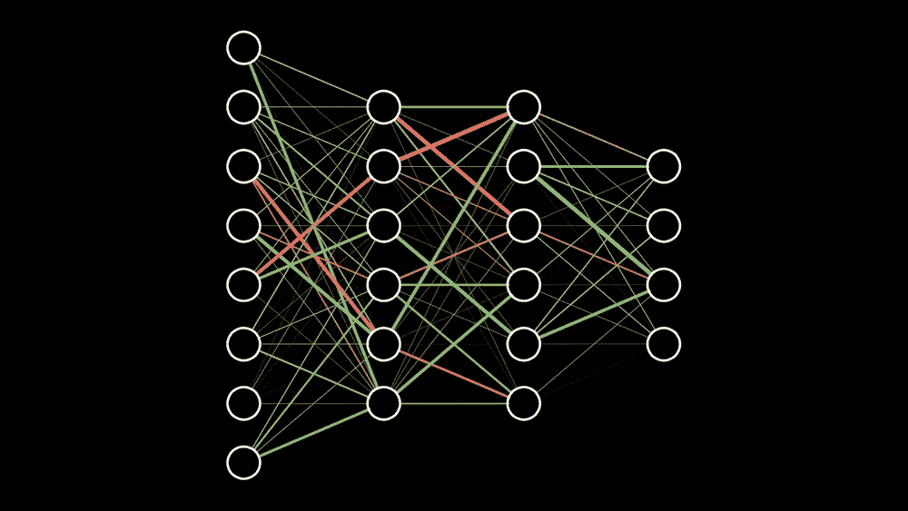*

*图片来自 3blueOneBrown youtube*

*神经网络是最强大的监督学习算法之一。在机器学习问题中，当线性分类器不起作用时，训练神经网络分类器通常是一种好的做法。*

## *训练神经网络*

*训练神经网络是一个迭代且计算量大的过程，包括寻找最佳模型参数——使误差最小化的权重和偏差。*

*寻找最佳模型参数的驱动机制基于一种称为反向传播的算法。*

> *旁注:神经网络实际上非常复杂，非常数学化，所以我不会在这里深入探讨。*

## *反向传播算法。*

*反向传播是一种算法，用于根据训练数据以迭代方式找到最佳模型参数，即神经网络的权重和偏差。*

*这是通过计算成本函数 J 相对于权重和偏差值的偏导数来实现的。*

***梯度下降算法**使用反向传播和成本函数来评估最佳模型参数。这是神经网络的训练阶段，它产生最佳的模型参数。*

*[**梯度检查**](https://towardsdatascience.com/how-to-debug-a-neural-network-with-gradient-checking-41deec0357a9) 是一种用于验证反向传播的实现是否正常工作的方法。*

## *偏差与方差*

*在训练神经网络时，我们需要首先决定**网络架构**。网络结构简单来说就是神经元之间的连接模式，也就是选择要使用的隐藏层数。*

*注意，神经网络的输入单元的数量等于训练样本的特征的维数。如果你正在处理一个分类问题，输出单元的数量由类的数量决定。*

*在神经网络的每个隐藏层中使用相同数量的单元也是很好的实践。隐藏单元越大，模型的性能越好，但是计算复杂度增加，*

## *训练神经网络的步骤*

*1.随机初始化权重
2。实现正向传播以获取每个定型示例的输出值。
3。计算成本函数
4。实施反向传播以计算偏导数
5。使用梯度检查来确认您的反向传播工作。然后禁用梯度检查。
6。使用梯度下降或任何内置优化函数，通过迭代更新权重和偏差来最小化成本函数。*

> *注意:当实现神经网络时，我们不用零初始化模型参数，因为模型在训练后不会学习任何有趣的特征。这被称为**对称重量问题。**执行模型参数的随机初始化以避免这一缺点。这被称为**对称性破缺。***

*关于神经网络的更多信息，这里有一些重要的链接。*

*   *饶彤彤的文章对神经网络背后的过程给出了直观的解释(见[此处](https://towardsdatascience.com/understanding-neural-networks-19020b758230))。*
*   *如果你想更进一步，理解神经网络背后的数学，请点击这里查看这本免费的在线书籍。*
*   *如果你是一名视觉/音频学习者，3Blue1Brown 在 YouTube 上有一个关于神经网络和深度学习的惊人系列[这里](https://www.youtube.com/watch?v=aircAruvnKk)。*

> *第五天结束了！！*

# ***第 6 天亮点***

## *调试学习算法*

*如果你训练的机器学习模型在测试数据上表现不佳，这里有一些通用步骤，你可以尝试提高模型的性能。*

> **获取更多训练示例
> *尝试更小的特征集
> *尝试获取更多附加特征
> *尝试多项式特征
> *减少或增加正则项的λ*

## *评估假设*

*传统上，为了评估模型的性能，我们将数据分为训练和测试两部分。然后，我们使用训练分割来训练模型，以获得优化的模型参数(θ)。*

*使用训练的模型参数，我们仅使用测试分割示例来评估测试集误差。这让我们对你的模型在看不见的数据上的表现有所了解。这种技术经常应用于回归问题*

***误分类误差**是另一个常用于评估假设在分类情况下表现如何的指标。*

*一般来说，将数据分成**训练、交叉验证和测试集是一个很好的实践。**这有助于在调整模型超参数时，对训练数据集上的模型拟合提供无偏评估。*

*使用训练集计算模型参数，然后使用交叉验证集评估模型性能，即模型是否可能欠拟合或过拟合。然后可以进行超参数调整或其他更改，并使用验证集重新训练和测试模型。*

## *重击规则。*

*选择具有最小交叉验证误差的模型，然后使用测试集，计算测试误差(J_test)以选择具有最小测试误差的模型。*

## *偏差与方差*

*如果你训练过的模型性能很低，可能是由于 ***【欠拟合】*** *或者* ***高方差(过拟合)*** *。**

*要识别您的模型遇到的问题，请检查训练和交叉验证集的*错误。**

*如果训练误差和验证误差都是*高，则暗示模型是 ***欠拟合(高偏差)*** 。如果训练误差为 ***低*** 而验证误差为 ***高，*** 则表示模型为 ***过拟合(高方差)。*****

## **学习曲线**

**使用学习曲线来诊断您的学习算法是否存在偏差或方差问题，**

**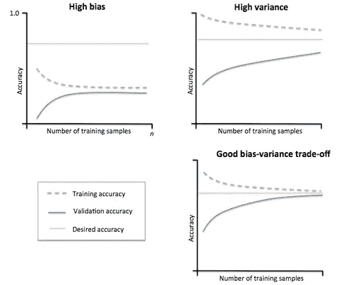**

**图像 if 高偏差(低方差)、高方差(低偏差)和良好的偏差-方差权衡**

**如果你的算法正遭受**高偏差**，增加训练样本无助于减少训练和交叉验证误差值。**

**相反，如果你的学习算法正遭受**高方差**，获得更多的训练样本可能有助于提高其性能，因为交叉验证成本误差将随着更多的训练样本而不断降低。**

## **机器学习模型的最终决策过程**

**我们的决策过程可以细分如下:**

> **1.获得更多的训练例子:修正高方差
> 2。尝试更小的功能集:修复高方差
> 3。增加功能:修正高偏差
> 4。增加多项式特性:修复高偏差
> 5。减小λ(正则化超参数):修复高偏差
> 6。增加λ:修复高方差。**

# **分类模型的评价标准。**

****精度**和**召回**是分类模型的良好评估指标，因为它可以帮助查明**倾斜数据集**的影响。**

**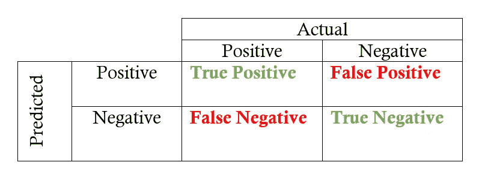**

**图片来自走向数据科学**

## **精确**

**这是一个分类指标，用于评估相对于我们的模型做出的正面预测总数(TP + FP)而言，真实正面预测(TP)的比例。**

**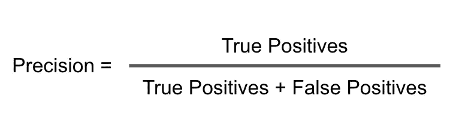**

## **回忆**

**它评估了由我们的模型做出的真实正面预测(TP)相对于最初在我们的训练数据集中的正面示例的实际数量(TP + FN)的比例。**

**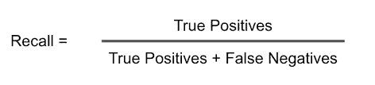**

**很明显，具有更多负面例子的数据集可能导致非常低的召回率。**

**通过改变逻辑分类器的假设函数的阈值。即 ***假设>阈值*** ，我们可以在交叉验证集上获得不同的查准率和查全率值。**

***精度和召回率高*意味着学习算法性能好**

## **哪个分类器比较好？**

**为了选择最好的分类器，基于精度和召回值，我们通常评估精度和召回的平均值，即(P + R) / 2。然而，这并不是决定哪个模型最好的好方法，因为特定模型的 ***高精度和低召回率或者低精度和高召回率*** 会导致**高平均值，**而该模型不好。**

## **f1-分数**

**为了解决平均评估的这一缺点，我们使用了***F1-得分评估指标*** ，其计算如下:**

**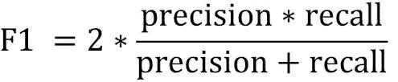**

**因此，如果精度或召回率非常低，F1 值将会很低。只有通过相对较高的精确度和召回率才能获得较高的 F1 分数。最佳车型的 F1 得分最高。**

> **第六天结束了！！**

# ****第 7 天亮点****

# **支持向量机。**

**SVM 是另一种有趣的分类器，就其成本函数而言，类似于逻辑回归。SVM 的不遭受局部极小问题，因为它的成本函数是纯凸的。**

**SVM 假设和成本函数如下所示:**

**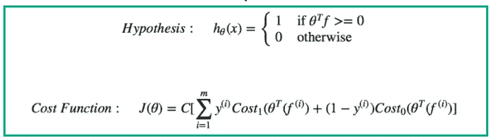**

**SVM 的目标是计算使成本函数 J(θ)最小的模型参数(θ)的最佳值。**

**成本函数中的**超参数，C** ，在线性回归正则化成本函数的情况下起到**C = 1/λ**的作用。**

**这意味着，**如果 C 很大**，则λ很小，因此，模型参数受到的惩罚较少，导致**高复杂度**，因此**过拟合**。如果 **C 小，则**λ变大，导致**模型参数**的高惩罚，这降低了模型复杂性**，导致欠拟合。****

**SVM 的假设直接为正类输出 1，为负类输出 0。这与输出概率(0 到 1)的逻辑回归相反。**

## **开发复杂的非线性 SVM 模型**

****相似性函数**也称为**内核**可以与支持向量机一起使用，以开发复杂的非线性 SVM 模型。**

**例如，**高斯核**是一种非常常见的核，它基于在我们的训练数据集上选择称为界标的随机点，然后基于高斯分布方程生成新的特征 k。**

****

**高斯核函数**

****y =** 随机地标向量， **x** =训练样本。基于地标的数量，对于每个训练示例，我们评估 k，然后在我们的假设中使用它来训练和预测我们的模型。**

**使用内核的想法只是使用我们的原始训练样本来创建新的特征，然后使用这些新的特征而不是原始训练数据集特征来训练 SVM 分类器。**

**通常在与训练样本相同的位置选择标志。因此，如果您的训练集有 m 个示例，那么您就有 m 个地标。**

**这导致长度为 m + 1 的新特征向量 k，因此，您的模型将具有与 k 相同大小的模型参数(θ),即 m + 1。这包括截距项(θ-零)。**

**新的假设变成了:**

****预测，y = 1，如果(Theta * K > 0)** 而非形式(Theta * X > 0)**

**核可以和线性回归一起使用，但是这在计算上很昂贵，除非绝对需要，否则不应该使用。**

**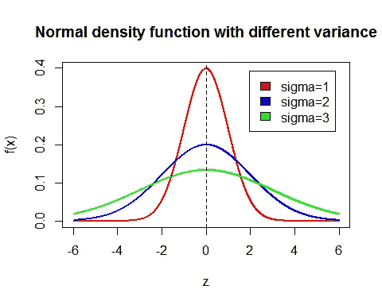**

**图片由 VRC 学院提供**

**SVMs 的另一个**超参数是高斯核函数中的 sigma** 。随着特征 **k** 平滑变化，**大 sigma** 导致对应于**低方差**和**高偏差**的平缓倾斜高斯曲线。**小 sigma** ，导致更陡的高斯函数，导致**高方差，**因此，**低偏差**随着特征 k 急剧变化。**

**对非常大的数据集使用支持向量机**计算开销很大**，因为使用内核创建的新特征的数量等于数据集样本的大小。**

**对于使用 SVM 的**多分类，我们使用**一对一**方法来区分不同的类别。如果我们有 K 个类，我们简单地通过将相应的类设置为 y = 1，将所有其他类设置为 y = 0 来为每个类训练 K 个 SVM 分类器。****

**通过选择具有最高假设值的 SVM 来完成对示例的预测。**

## **重点说明。**

****何时使用 SVM 或逻辑回归分类器。**
如果特征的数量，n 相对大于训练样本的数量，比如 m，n = 10000，m = 10–1000，使用无核的 logistic 回归或 SVM。**

**如果特征数量 n 很小，m 是中间值，例如(n = 1–1000，m = 10–10000)，使用**高斯核 SVM。****

**如果 n 很小而 m 很大，例如(n = 1 -1000，m = 50000+)，使用**逻辑回归或线性核的 SVM**是明智的。**

**对于上述所有情况，神经网络往往工作良好。只是稍微慢一点。**

***如果你想了解更多细节，Savan 写了一篇关于支持向量机的文章* [*这里*](https://medium.com/machine-learning-101/chapter-2-svm-support-vector-machine-theory-f0812effc72) *。***

> **第七天结束了！！**

# ****第 8 天亮点****

# **无监督学习。**

**在[无监督机器学习](https://beltus.github.io/vision/ml/2020-03-05-supervised-unsupervised-learning/)中，模型被输入 ***未标记数据*。**在数据中寻找隐藏的结构、模式或关系是由算法决定的。**

**聚类算法通常用于无监督的机器学习任务。**

**[**K-means 聚类**](https://towardsdatascience.com/k-means-clustering-algorithm-applications-evaluation-methods-and-drawbacks-aa03e644b48a) **算法**是使用最多的聚类算法。它用于获得关于数据结构的直觉。**

**该算法是迭代的，基于两个主要步骤。**

1.  ****聚类分配步骤**，其基于训练样本与聚类质心的接近度将训练样本分配给每个聚类。**

**2.**移动聚类质心步骤**，将每个质心重新定位到其聚类子集的平均值。**

## **K 均值算法的步骤**

**K-means 算法的工作方式如下:**

> **1.指定集群数量 *K* 。**
> 
> **2.通过首先混洗数据集，然后为质心随机选择 *K* 个数据点来初始化质心，而无需替换。**
> 
> **3.继续迭代，直到质心没有变化。也就是说，数据点到聚类的分配没有改变。**
> 
> **4.计算数据点和所有质心之间距离的平方和。**
> 
> **5.将每个数据点分配给最近的聚类(质心)。**
> 
> **6.通过取属于每个聚类的所有数据点的平均值来计算聚类的质心。**

**通过将 k 个聚类质心分配给随机选择的 k 个训练样本来完成聚类质心的初始化。**

## **降维**

**这是另一种无监督学习算法。最常见的降维算法是 [**【主成分分析】**](https://en.wikipedia.org/wiki/Principal_component_analysis)**

**PCA 旨在找到一个较低的 k 维特征超平面(表面),以最小化平方投影误差(从每个训练样本到投影表面的距离)的方式将较高维的训练样本投影到该超平面上**

**在为 PCA 选择主成分 k 的数量时，选择 k 的最小值是一个好的实践，对于该最小值，保留了 99%的方差。**

**我们还将 PCA 应用于具有大量特征的监督学习问题。这仅适用于数据集的输入定型集，而不适用于数据集的交叉验证或测试集。**

**PCA 找到从训练示例 x(i)到 z(i)的映射，其中 z(i)是在运行 PCA 之后获得的新特征向量。因此，PCA 可以被认为是监督学习算法的预处理步骤。**

## **主成分分析的主要应用**

****1。压缩:**减少用于存储数据的内存/磁盘空间，加快学习算法。**

**2.**可视化应用**其中主成分 k 的数量可以是 1、2 或 3，以便于可视化。**

***这里有关于*[*geekforgeks*](https://www.geeksforgeeks.org/dimensionality-reduction/)更深入的降维信息**

> **第八天结束了！！**

# ****第 9 天亮点****

**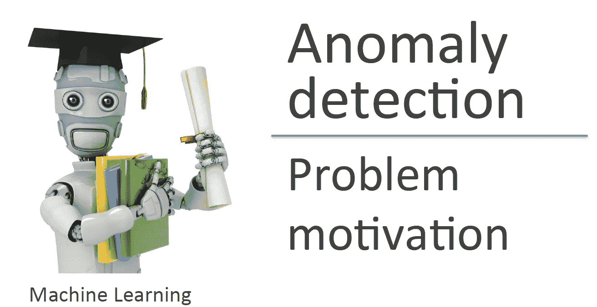**

**图片来自 Coursera**

## **构建异常检测系统**

**[机器学习中的异常检测](https://www.wikiwand.com/en/Anomaly_detection)用于预测我们数据集中与大多数数据显著不同的罕见事件。**

**它的主要应用是在**欺诈检测**中，我们使用未标记的数据集来建立一个概率模型。然后使用它来检测任何异常或欺诈活动。**

****制造**也使用异常检测来确定他们的产品是否有缺陷。**监控数据中心的计算机**或服务器也是我们看到异常检测应用的另一个领域。**

**[**高斯分布**](https://www.wikiwand.com/en/Normal_distribution) 用于异常检测，我们使用训练集数据估计
分布的均值和方差。**

**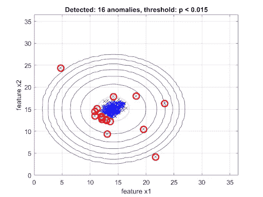**

**由 SpLabs 生成的图像**

**通常，在异常检测算法中，我们估计训练数据集中各个特征的平均值(均值)和方差，这成为模型参数。**

**给定一个新的例子 x，我们简单地使用在训练期间获得的高斯分布参数的估计均值和方差来计算概率 p(x)。**

**如果 p(x)< epsilon, then the example, x, is anomalous, otherwise, it is a normal condition.**

**The probability, p(x) is calculated based on the assumption of the independence of features. i.e p(x) is the product of the probability of each feature in the feature vector.**

**P(x) = P(x1)*P(x2)*P(x3)……..P(xn)**

**In building Anomaly detection systems, the dataset is often skewed as we usually have far more negative examples than positive. So, we recline from using classification accuracy as a performance metric which can be very high and misleading. It's preferable to use**F1-得分度量。****

## **何时使用异常检测技术。**

**当我们有非常少的正例(异常)和大量的负例(正常)时，我们使用异常检测而不是监督学习算法。这是因为监督学习将使学习算法从如此小的样本子集学习变得更具挑战性。**

**当对捕捉特征之间的一些相关性感兴趣时，我们
可以使用**多元高斯模型**来估计参数(均值向量和协方差矩阵)。**

## **推荐系统**

**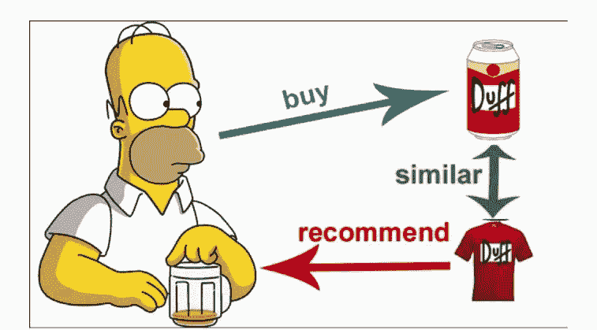**

**图片来自走向数据科学**

**推荐系统的目的是向用户推荐相关的项目。**

**推荐系统主要有两大类: ***基于内容和协同过滤的推荐系统。*****

## **基于内容的推荐系统**

**比方说，我们收集了用户在网站上观看某些电影后给出的评级信息。推荐系统获取这些信息，并试图预测用户可能对他尚未观看的电影给出的评级值。**

**基于估计的分级值，系统决定向您推荐这部电影。所以在基于内容的推荐系统中，我们使用 ***关于我们的用户和/或项目的附加信息。*****

## **协同过滤推荐系统**

**该方法用于自动学习推荐系统的相关特征。**

**协同过滤算法的目标是使用每个客户(用户)的评级，并学习一组特征 X，然后使用这些特征来学习每个用户的模型参数。有了这些参数。基于这些学习到的特征 X 和参数θ，推荐器可以预测产品的评级，例如没有任何评级的电影。**

**此外，学习到的参数可用于比较不同电影的特征，并基于差异向其用户推荐新电影。**

**这里有一篇[文章](https://sandipanweb.wordpress.com/2016/07/02/using-low-rank-matrix-factorization-for-collaborative-filtering-recommender-system/)关于协同过滤算法的更多信息。**

****关键注释****

**在推荐系统中，每个用户都有自己独特的模型参数集。所以用户的数量等于需要训练的线性回归模型的数量。**

****均值归一化**有时用于增强模型的性能，尤其是当存在对产品没有评级的用户时。**

***更多信息，h*[*ere*](https://towardsdatascience.com/introduction-to-recommender-systems-6c66cf15ada)*是 Baptiste Rocca 写的一篇关于推荐系统的文章***

> **第九天结束了！！**

# ****第 10 天重点****

## **大规模机器学习**

**随着训练数据集的大小增加到数百万个示例，用于寻找最佳模型参数的梯度下降(即批量梯度下降)算法由于所涉及的高计算时间而变得非常低效。**

****随机梯度下降(SGD)** 算法在这种情况下是首选，因为它快得多。在 SGD 算法中，我们首先混洗训练数据，然后对于每个训练样本，我们更新模型参数。**

**这与批量梯度下降相反，在批量梯度下降中，模型参数的单次更新涉及使用所有训练样本。**

****小批量梯度下降**在每次迭代中使用我们的小批量训练数据集来更新模型参数。与在每次更新迭代中使用单个示例的 SGD 相反。**

## **Map Reduce —数据并行方法**

**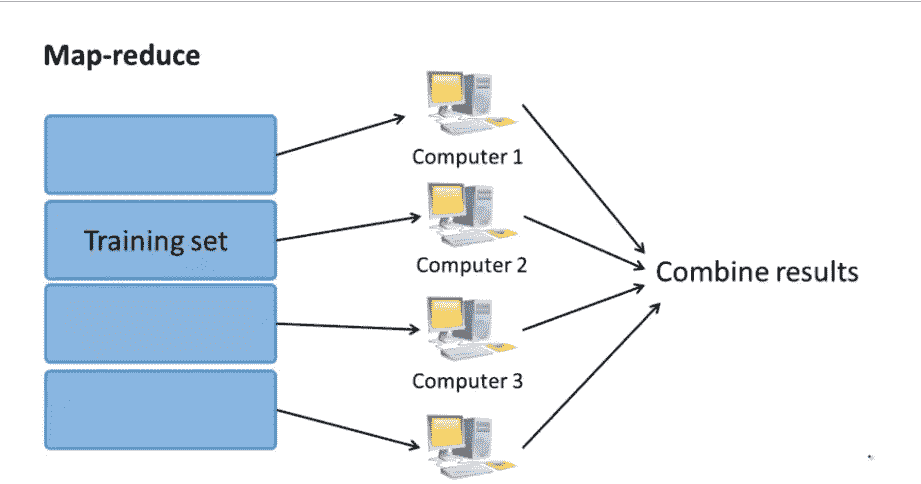**

**在 map-reduce 方法中，包含数亿个示例的非常大的训练数据集被分成大小相等的子集，然后这些子集可以被提供给不同的机器。**

**这允许在子集上同时计算部分和。然后，集中的机器组合来自这些多台计算机的结果，然后执行模型参数更新。**

**这减少了学习模型参数所花费的时间。Map-reduce 对于多核机器也是可行的，其中数据并行是在不同的核上完成的。**

***关于 MapReduce* [*的更多信息，请看这里*](https://www.wikiwand.com/en/MapReduce)**

> **第 10 天结束了！！**

# ****第 11 天亮点****

## **机器学习管道**

**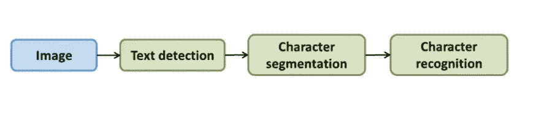**

**典型的机器学习管道**

**机器学习问题的应用通常遵循流水线，例如上面所示的照片 OCR(光学字符识别)的例子。每个模块的输出成为下一个模块的输入。**

**通过**人工合成方法获得大量数据是一种**技术，只有当模型具有**低偏差**时才能帮助提高你的模型的性能。通过**绘制学习曲线**可以看到低偏差。**

## **关键音符**

**对于机器学习问题，重要的是首先使用学习
曲线检查您的模型是否存在**低偏差。**其次，问这样一个问题，*要获得比你现有数据多 10 倍的数据，需要什么？然后你就可以生成新的数据集了。***

## **上限分析**

**它是手动覆盖系统中每个组件的过程，以提供该组件 100%准确的预测。此后，您可以逐个组件地观察您的机器学习系统的整体改进。这有助于确定您需要花时间改进管道的哪个组件。**

***更多关于天花板分析的信息可以在* [*这里*](https://medium.com/@rossbulat/ceiling-analysis-in-deep-learning-and-software-development-8bc41e59364a) 找到**

> **第 11 天终于结束了！！**

# **结论**

**在这篇文章中，我以结构化和时间顺序的方式介绍了机器学习的主要思想、概念和最佳实践。**

**它强调了所有 11 天中每天最重要的概念，同时最小化了机器学习中涉及的线性和多元微积分的技术细节。**

**我知道这篇文章并不详尽，不可能深入涵盖这些概念中的大部分，所以我在文章中提供了一些链接，供有兴趣的读者进一步阅读。**

**如果你有兴趣学习更多关于机器学习的知识，我鼓励你注册安德鲁的机器学习课程。这值得你花费时间和精力。这里是 [**Coursera**](https://www.coursera.org/learn/machine-learning) **上的课程链接。**该课程帮助我构建了这篇文章。**

# **感谢阅读！**

**如果你觉得这篇文章有帮助，请随时联系我。**

1.  **可以在**中**这里关注我。**
2.  **在 **LinkedIn** 上关注我[这里](https://www.linkedin.com/in/beltus/)。**
3.  **访问我的网站；[**beltus . github . io**](https://beltus.github.io/vision/blog/)查看更多有趣的帖子。**
4.  **关注我[**推特**](https://twitter.com/beltusnkwawir)**