# Rasa 的强化成员化政策如何运作的图解说明

> 原文：<https://pub.towardsai.net/an-illustrated-explanation-of-how-rasas-augmentedmemoization-policy-works-da436aa20cff?source=collection_archive---------2----------------------->

## [自然语言处理](https://towardsai.net/p/category/nlp)

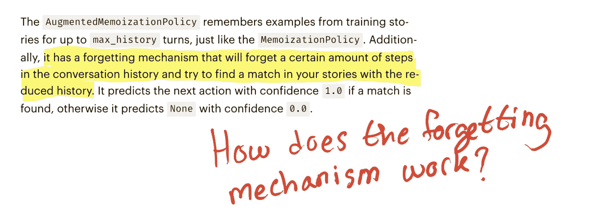

# 介绍

在这篇文章中，我将解释 Rasa 的[增强记忆](https://rasa.com/docs/rasa/policies/#augmented-memoization-policy)政策是如何运作的。重点将放在理解“遗忘机制”是如何实现的。

我假设读者熟悉使用 Rasa 构建聊天机器人以及[记忆化](https://en.wikipedia.org/wiki/Memoization)的概念。如果不是这样，那么[在 youtube 上观看这些系列视频](https://www.youtube.com/playlist?list=PL75e0qA87dlEjGAc9j9v3a5h1mxI2Z9fi)来快速跟上进度。

重现本文所述结果的代码可以在[这里](https://github.com/hsm207/rasa_moodbot/tree/memo)找到。

# 设置

让我们首先回顾一下与增强的成员化策略相关的 bot 实现细节。

## 发展环境

这个机器人是用这个版本的 Rasa 构建的:

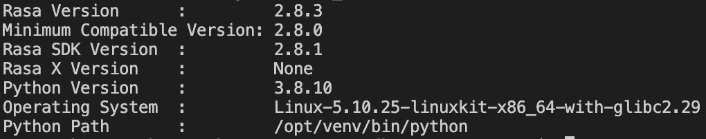

图 1:用于构建机器人的 Rasa 版本

## 核心网模型

该机器人的策略配置非常简单:

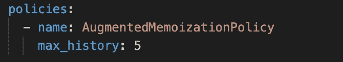

图 config.yml 中的策略部分

## 培训故事

我们将根据这两个故事训练机器人:

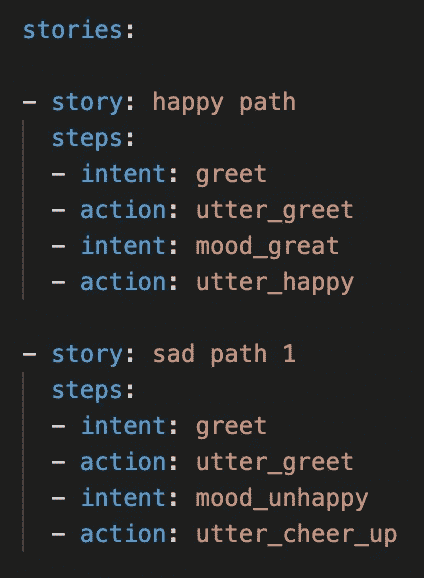

图 3:培训故事

## 测试故事

这些是我们将用来评估对话管理模式的测试案例:

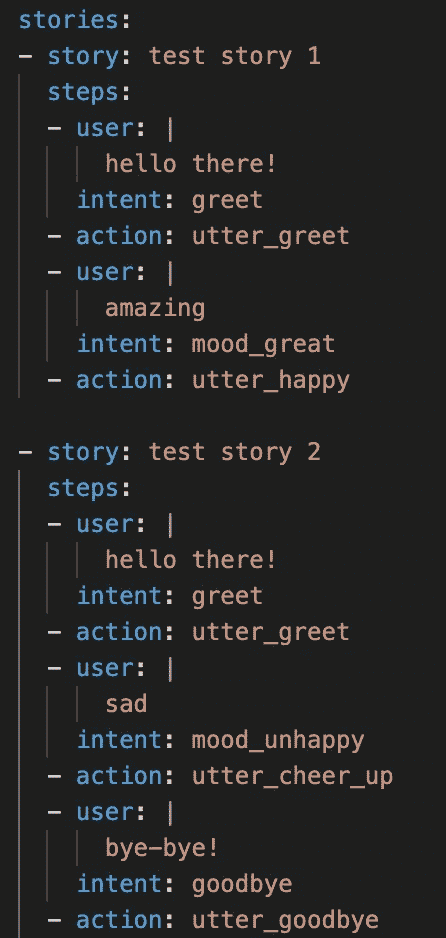

图 4:测试案例

请注意，`test story 1`与图 3 中的故事`happy path`相同。

`test story 2`与`sad path 1`故事相同，除了最后一个回合，即`test story 2`是`sad path 1`的扩展，用户通过发出`bye-bye!`继续对话，机器人预计会用`utter_goodbye`回应。

# 记忆是如何工作的

我们需要先了解记忆是如何工作的，然后才能理解遗忘机制是如何工作的。

## 代表一个故事

鉴于这个故事:

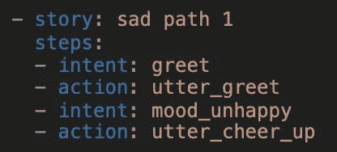

图 5:演示记忆化过程的 yaml 格式的故事

Rasa 将在其[追踪器](https://rasa.com/docs/rasa/tracker-stores)中将其转换为以下事件序列:

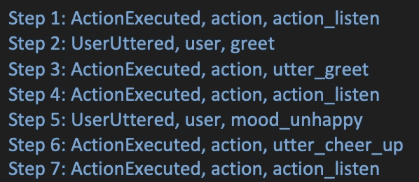

图 6:图 5 中故事的跟踪器表示

请注意，图 5 中的故事有 4 个步骤，但追踪器中的相同故事有 7 个步骤，因为在故事的开始、意图之前和最后一个动作之后添加了`action_listen`“步骤”。

## 根据故事构建要素和标签

一个[策略](https://rasa.com/docs/rasa/policies/)的目标是预测机器人应该采取的下一步行动，给定到目前为止在对话中发生的事情。

在训练期间，每当在故事的跟踪器表示中发现一个`ActionExecuted`事件时，将要求一个策略进行预测。这意味着对于图 6 中的故事，策略将被要求在步骤 1、步骤 3、步骤 4、步骤 6 和步骤 7 进行预测。

策略将用于在相应步骤进行预测的特征是到该点为止的事件序列。标签是要执行的操作的名称。

这些是将用于为每个步骤训练策略的功能和标签:

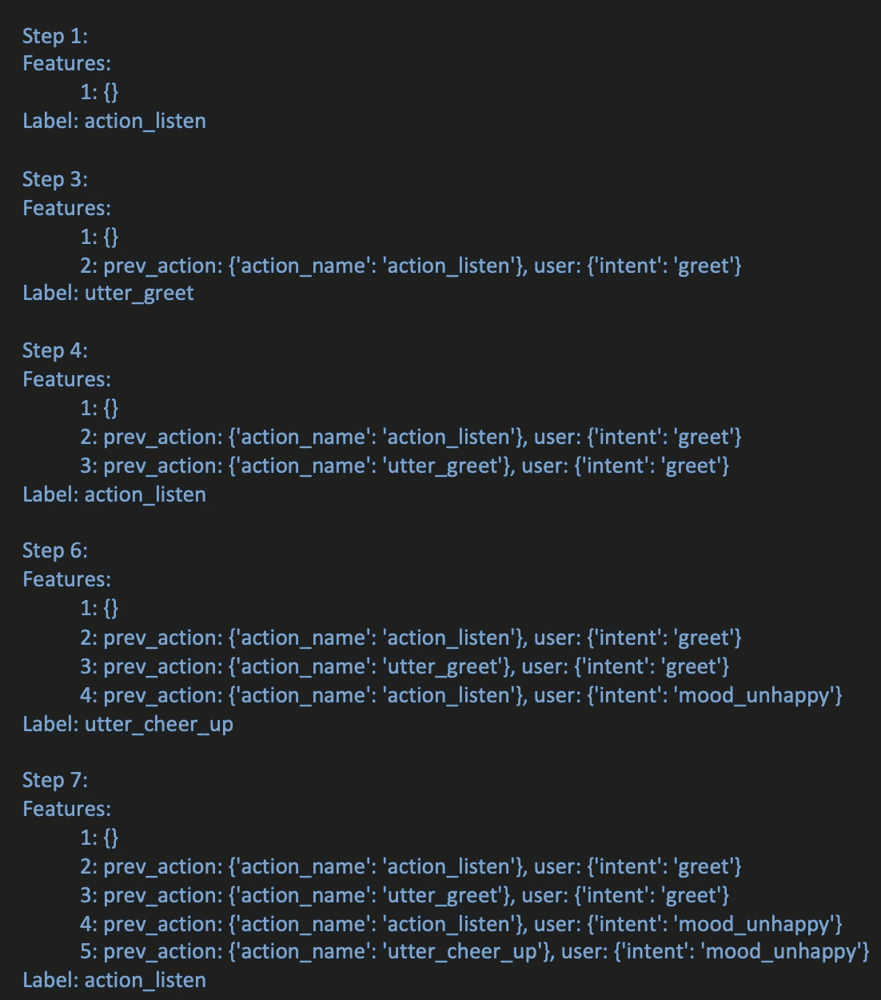

图 7:使用图 6 中的故事来训练策略的特性和标签

在步骤 1 中，对话刚刚开始，因此还没有交互。这就是为什么特征是空的，即`{}`。

构成一个步骤的特征是在最后一次预测中使用的特征，以及在紧接它之前的步骤中添加的最新动作和意图。

例如，考虑步骤 6 中用于预测`utter_cheer_up`的特性。

步骤 5 是紧接在它之前的步骤。在这一步，机器人的最新动作和用户的最新意图分别是`action_listen`和`mood_unhappy`。

需要预测的最后一步是步骤 4。

因此，用于在步骤 6 预测`utter_cheer_up`的特征将是步骤 4 中使用的特征和我们从步骤 5 中导出的特征。

注意:图 5 中的故事非常简单。请参考附录 I，了解如何突出带有位置和实体的故事。附录 II 显示了`max_history`参数如何影响特征化。

## “培训”记忆策略

记忆策略上下文中的训练意味着散列步骤 1、3、4、6 和 7 中的特征序列，并将其用作存储在字典中的密钥。键的值是标签。

让我们把这本字典叫做查找表。

下面是根据图 3 中的故事训练后的查找表:

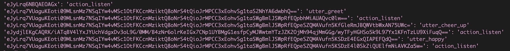

图 8:基于图 3 中训练故事的查找表

## 推理时的记忆策略

在推理时，如果需要预测，记忆策略将散列当前跟踪器的状态，并尝试将其与查找表匹配。

如果找到匹配，则返回对应于该散列键的值作为预测的下一个动作。

例如，考虑机器人预计预测`utter_cheer_up`时的`test story 2`:

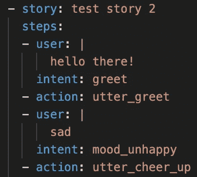

图 9:测试故事 2 片段

在对话的这一点上，跟踪器的当前状态如下所示(通过在调试模式下运行 rasa shell 获得):

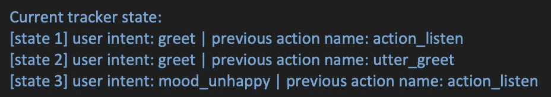

图 10:当机器人将要预测“欢呼雀跃”时的对话状态

不难看出，图 10 中当前的跟踪器状态与为`sad path 1`故事的步骤 6 创建的特性是相同的(参见图 7)。因此，记忆策略将预测`utter_cheer_up`，因为这是分配给该特定特征序列的标签。

# 遗忘机制是如何工作的

现在让我们考虑当用户的意图是`test story 2`中的`goodbye`之后，机器人被要求做出预测时会发生什么。为了方便起见，下面是整个故事:

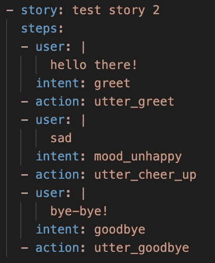

图 11:整个测试故事 2

机器人应该预测`utter_goodbye`时的对话状态如下所示:

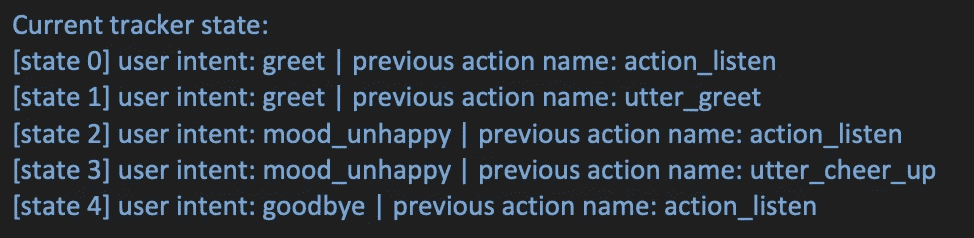

图 12:当机器人被期望预测“绝对再见”时的对话状态

图 12 中的会话状态与查找表中存储的任何状态都不匹配。这意味着机器人将不得不“忘记”跟踪器中的一些元素，以便在查找表中找到匹配。

## 概观

遗忘机制分两个阶段发生。

在第一阶段:

1.  从当前跟踪器产生一个[应用事件](https://github.com/RasaHQ/rasa/blob/44c23484c2187b6f88cc1c733dcc59f48e291525/rasa/shared/core/trackers.py#L467)的列表
2.  从第一个`ActionExecuted`事件开始减少列表
3.  基于步骤 2 中的事件列表生成新的对话状态
4.  将步骤 2 中创建的会话状态与查找表匹配
5.  如果找不到匹配，则进入第 2 阶段

阶段 2 与阶段 1 相同，除了事件列表从第二次出现`ActionExecuted`事件开始减少。我们重复阶段 2 的过程，直到事件列表为空。

## 细节

回到`test story 2`的例子，在机器人需要预测`utter_goodbye`的时候应用的事件是:

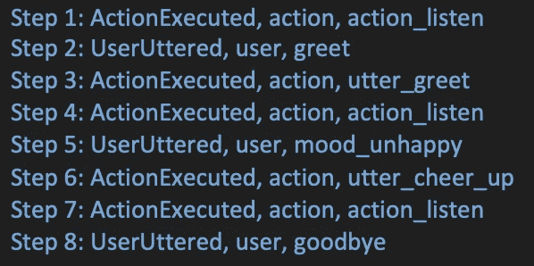

按照阶段 1 的程序，我们从第一次出现`ActionExecuted`事件开始，通过选择截断来缩短列表。这对应的是`Step 1: ActionExecuted, action, action_listen`。新的事件列表现在看起来像这样(是的，事件列表仍然是相同的，但这通常不是真的):

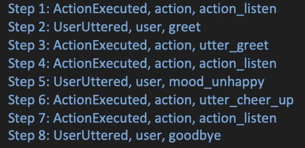

图 13:在阶段 1 结束时更新的应用事件列表

新列表将生成以下对话状态:

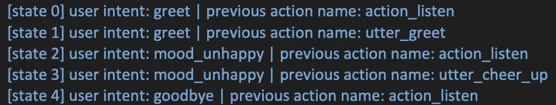

这与图 12 中的对话状态相同，我们已经知道它与查找表不匹配。所以我们进入了第二阶段。

现在，我们需要从第二次出现的`ActionExecuted`事件开始截断当前应用的事件列表。参见图 13，这对应于`Step 3: ActionExecuted, action, utter_greet`，因此新列表为:

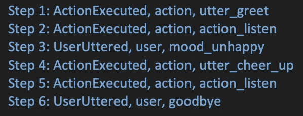

图 14:在阶段 2 的第一次迭代结束时更新的列表

这会产生以下对话状态:

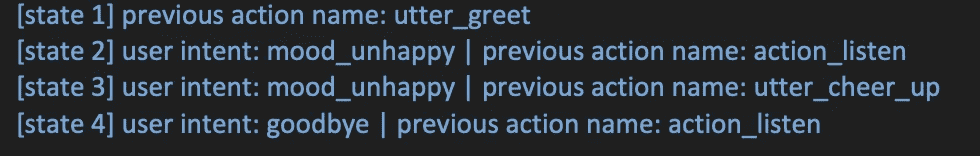

这仍然与查找表不匹配。

因此，我们基于图 14 中的列表再次重复阶段 2。这给出了:

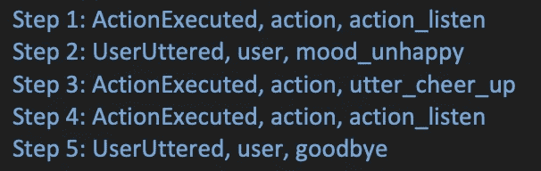

图 15:在阶段 2 的第二次迭代中更新的列表

这会产生以下对话状态:

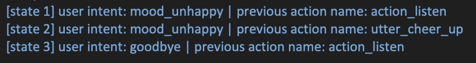

这仍然与查找表不匹配。

所以我们继续按照同样的模式重复第二阶段。

最终，应用事件的列表将缩短为:

图 16:在阶段 2 的最后一次迭代中更新的列表

这会产生以下对话状态:

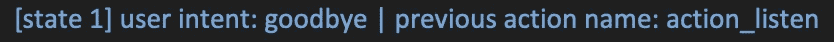

如果此对话状态不匹配，则 AugmentedMemoizationPolicy 将无法做出预测，因为没有第二次出现`ActionExecuted`事件，从而产生一个更短的列表来继续阶段 2 过程。

# 解决方案

有没有不修改 bot 的 config.yml 就能通过`test story 2`的方法？

是的，只需将以下故事添加到培训故事中即可:

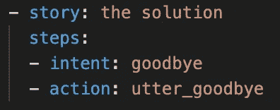

图 17:将通过测试故事 2 的故事

注意，下面的故事虽然与图 17 相似，但不会通过`test story 2`:

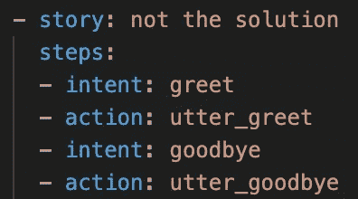

图 18:不能通过测试的故事故事 2

乍一看，这看起来很奇怪，因为人们会认为图 18 中的故事会让机器人记住意图`goodbye`后面应该跟着响应`utter_goodbye`。然而，思考一下这两个故事是如何成为特色的，就会发现观察到的行为一点也不奇怪。

# 结论

这篇文章描述了 Rasa 的强化记忆策略中的遗忘机制是如何工作的。

该机制的工作原理是丢弃过去的事件，直到某个事件可以与查找表相匹配。

我希望你已经发现这是有用的。

# 附录

## 附录 I:有槽和实体的故事

这个故事:

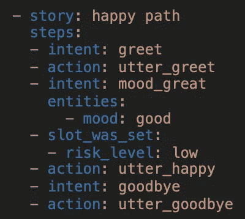

在跟踪器中具有以下表示形式:

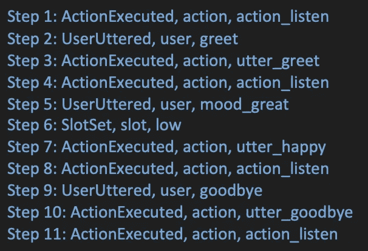

其特点如下:

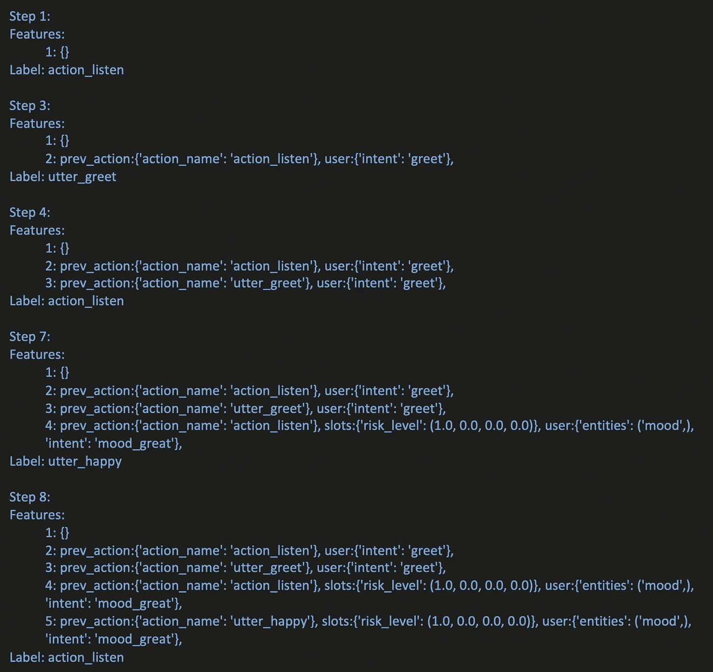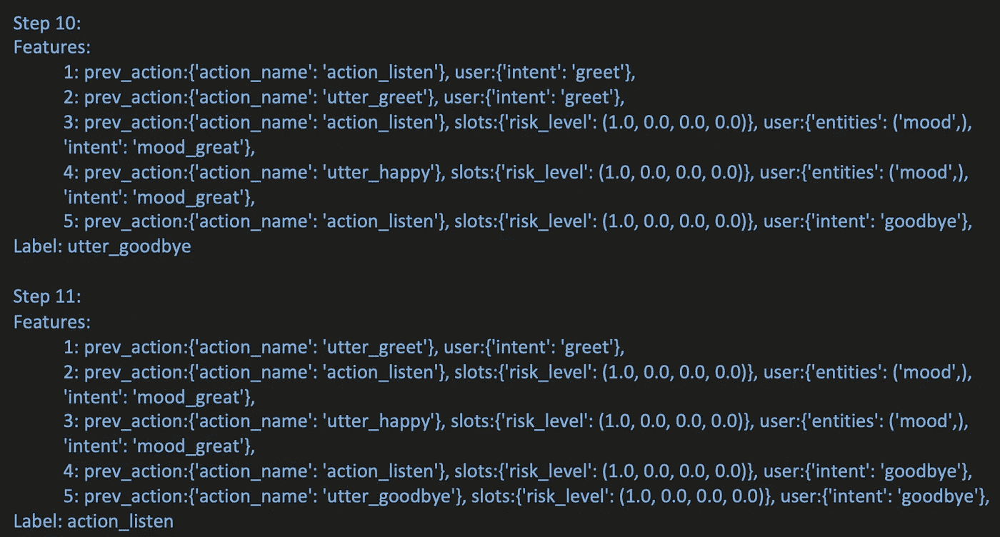

注意，当一个槽在一个特定的步骤被设置时，它的值被带到下一个步骤。实体就不是这样了。

## 附录二:当 max_history 不为 5 时

下表比较了当参数`max_history`设置为 5 和 2 时`sad path 1`故事的特征:

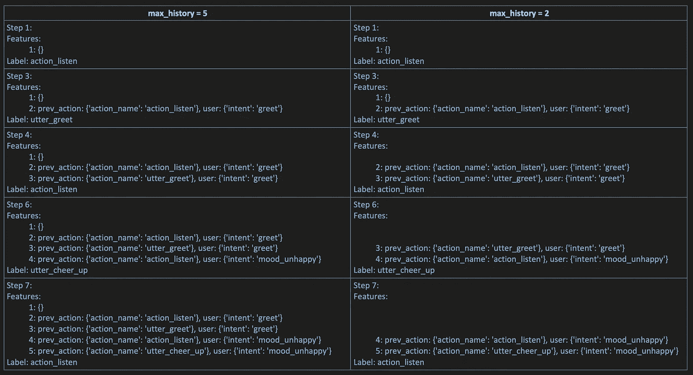

我们看到将`max_history`设置为`n`意味着用于在给定步骤进行预测的特征将是最后的`n`交互。