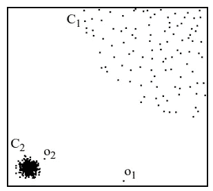
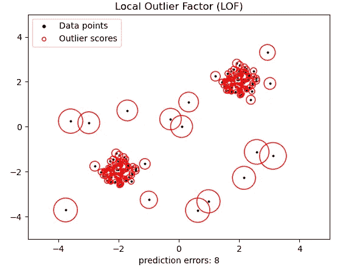
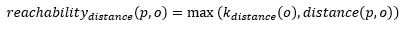
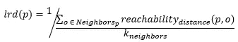
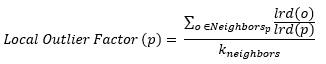
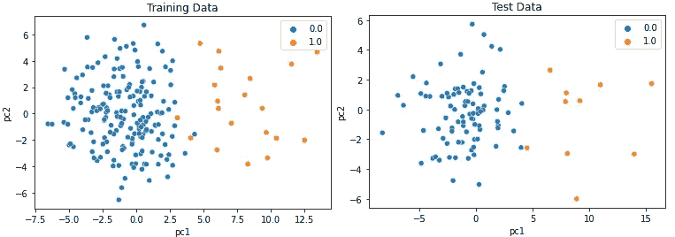
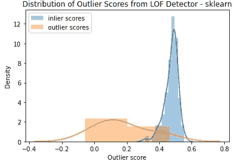

# Python 中离群点检测的局部离群点因子(LOF)深度指南

> 原文：<https://pub.towardsai.net/an-in-depth-guide-to-local-outlier-factor-lof-for-outlier-detection-in-python-5a6f128e5871?source=collection_archive---------0----------------------->

## [机器学习](https://towardsai.net/p/category/machine-learning)

## 理论直觉、数学定义和实际代码示例

图片来自托马斯·卡斯特拉佐的[维基共享资源](https://commons.wikimedia.org/wiki/File:Hot_air_balloons_in_leon.jpg)

O utlier detection 是一项机器学习任务，旨在识别偏离给定数据的“常态”或一般分布的罕见项目、事件或观察值。

这篇文章是对异常值检测的局部异常值因子(LOF)算法的理论和应用的深入指导。我们将介绍 LOF 分数，考虑直觉，深入研究数学定义，并学习如何在 python 中使用 LOF。

关于离群点检测的介绍、常见挑战和用于离群点检测的`pyod` python 库，请查看最后的**延伸阅读**部分。

# 引入局部异常因子

**局部异常值因子(LOF)测量每个观测值相对于其邻居的“局部密度偏差”。**LOF 使用 k 个最近邻点的平均局部密度与数据点的局部密度之比来测量数据点的密度与其 k 个最近邻点的密度有何不同。一个数据点的*局部* *密度*简单来说就是它的 k 个最近邻居平均有多近(或多远)。*假设非均匀分布，每个数据点的局部密度对于每个点是不同的。*

相对于它们最近的邻居，更“孤立”的观察值得分更高。相反，位于相对密集的空间区域的观测值，例如在一个星团的中间，会得到较低的 LOF 分数。

LOF 的一个优点是它同时考虑了数据集的局部和全局属性。离群值不是以绝对的术语来识别的，而是相对于它们的局部邻域来识别的。当数据集中存在不同密度的不同聚类时，该算法表现良好。

LOF 适用于适度高维的数据集。

## 图形示例

相对于两个不同密度聚类的局部异常值的图示。来源:原始论文[1]

在上图中，C1 聚类包含 400 个点，C2 聚类包含 100 个点。C2 星团的密度比 C1 大得多。点 o1 和 o2 是“局部”异常值。点 o1 与所有其他点完全隔离，是一个“明显的”异常值。点 o2 也是一个*局部*异常值，因为尽管 o2 和它最近的邻居之间的距离类似于 C1 集群中的点之间的距离，但是这个距离比附近的 C2 集群中的点之间的距离大得多。

来源:[使用本地异常值因子的异常值检测(LOF) — scikit-learn 1.0.1 文档](https://scikit-learn.org/stable/auto_examples/neighbors/plot_lof_outlier_detection.html)

在上面的例子中，数据点被标为黑点。每个点周围红色圆圈的大小表示异常值，圆圈越大表示异常值越大。该图表明，距离较近的数据点具有较小的异常值。距离其邻居较远的点具有较大的异常值分数。

# 工作原理:数学

为了从数学上定义 LOF，我将首先提供几个定义。为了使方程更直观，数学符号是非正式的。

数据点 *p* 和 *o* 之间的**可达性距离**要么是 *p* 和 *o* 之间的距离，要么是 *o* 的 k 距离，以较大者为准*。****k*-距离(o)** 是距离 *o* 的距离，使得 *k* 邻居正好是距离 *o* 的这个距离或者更近。

数据点 *p* 和 o 的可达距离

一个观察值 *p* 的**局部可达性*密度*密度**是*k*-p 的最近邻居的平均可达性距离的倒数。

观察 p 的局部可达性密度。

**局部离群因子**是观测值 *p* 的局部可达性密度与 *p* 的 *k-* 最近邻的局部可达性密度之比的平均值。

计算观测值 p 的局部异常因子的方程。

从 LOF 方程中，我们可以推出一些东西。

1.  **当 *p* 相对于其邻居更加孤立时，**即局部可达性密度远低于 *p* 的*k*-最近邻居的局部可达性密度，**LOF 值更高**。
2.  **当 *p* 在一个簇**内，即 *p* 与其邻居**的局部可达性密度相似时，则 LOF 值接近 1** 。

# 蟒蛇皮 LOF

LOF 在`scikit-learn`和`pyod` python 包中都有实现；不过，**我推荐用** `**pyod**`。

`scikit-learn`的实现侧重于新颖性检测，对于异常值检测来说，这种用法是次优的。

`pyod`实现包装了`scikit-learn`模型并做了改进。PyOD 修正了异常分数，使得离群值被赋予较大的异常分数，而内联值具有较小的异常分数。它还将新奇和异常检测选项集成到一个更易于使用的统一界面中。

## 超参数

这两个包都实现了用于调整 LOF 中最近邻计算的参数-使用多少个近邻、使用哪种近邻算法以及如何计算数据点之间的距离。此外，还有一个`contamination`参数允许模型选择阈值，将离群值分数与内联值分数分开。

最重要的参数是邻居的数量(`n_neighbors`)。**在实践中，默认的 n_neighbors=20 往往效果很好。**当异常值的比例预计较高时(例如大于 10%)，从 20 增加 n_neighbors。

有关更多详细信息，请参考文档( [PyOD](https://pyod.readthedocs.io/en/latest/pyod.models.html#module-pyod.models.lof) 、 [scikit-learn](https://scikit-learn.org/stable/modules/generated/sklearn.neighbors.LocalOutlierFactor.html) )。

## 示例数据

对于`pyod`和`scikit-learn`示例，我将使用以下合成数据集。

上面我使用 PyOD 的`generate_data`函数来生成一个包含 200 个训练样本和 100 个测试样本的合成数据集。正态样本由多元高斯分布生成；异常样本是使用均匀分布生成的。

训练和测试数据集都有 5 个特征，10%的行被标记为异常。我在数据中加入了一点随机噪声，使得完美区分正常点和异常点变得稍微困难一些。

下面，我绘制了训练和测试数据集，使用 [PCA](https://scikit-learn.org/stable/modules/decomposition.html#pca) 投影到二维空间。

合成的训练和测试数据集，通过 PCA 降低到 2 维。

## PyOD 示例

在下面的代码示例中，我在综合训练数据上拟合了 LOF 模型，并将其应用于综合测试数据。*因为 LOF 是一个无监督的模型，所以它不需要标签来拟合。*

运行`fit`和`decision_function`方法的时间不到 1 秒。

我们还可以看看 LOF 模型中决策得分的分布。在下图中，我们看到正常数据(蓝色)的分数集中在 1.0 左右。这是意料之中的，因为 LOF 是数据点的局部密度与其相邻点的平均局部密度之比。异常数据点(橙色)的分数都大于 1.0，并且通常高于正常数据。

使用 PyOD 库生成的内层和外层数据的 LOF 外层分数分布。

生成异常值分数分布图的代码

在 PyOD 中，拟合的异常值检测器有两个关键功能:`decision_function`和`predict`。

*   `decision_function`返回每行的异常值。
*   `predict`返回一个由 0 和 1 组成的数组，指示每一行被预测为正常(0)还是异常值(1)。`predict`函数只是对`decision_function`返回的异常分数应用一个阈值。初始化探测器时，阈值会根据指定的`contamination`速率参数设置自动校准。

LOF 模型*必须*适合某些训练数据，以便用`decision_function`生成分数。

## sci kit-学习示例

在`scikit-learn`中应用 LOF 进行异常检测时，有两种选择:异常检测模式(`novelty=False`或新奇检测模式(`novelty=True`)。

在异常值检测模式下，只有用于生成异常值预测的`fit_predict`方法可用。可以使用`negative_outlier_factor_`属性检索训练数据的异常值分数，但是不能为看不见的数据生成分数。在引擎盖下，模型根据`contamination`参数(默认值为 0.1)自动选择异常值分数的阈值。

使用 sklearn 的 LOF

在新颖性检测模式下，只有用于生成异常值分数的`decision_function`可用。`fit_predict`方法不可用，但`predict`方法可用于生成异常值预测。

如下图所示，sklearn LOF 模型中的异常值得分是反向的-异常值得分低于内部值。这是违反直觉的，因为异常值检测器通常应该给更不寻常的数据点更高的异常值。

使用 sklearn 库生成的内层和外层数据的 LOF 外层分数分布。

# 进一步阅读

如果您有兴趣了解更多关于离群点检测的知识，如果您喜欢这篇文章，您可能也会喜欢这些相关的帖子。

 [## 为什么异常值检测很难

### 异常检测机器学习任务的考虑因素

pub.towardsai.net](/why-outlier-detection-is-hard-94386578be6c)  [## PyOD:用于异常检测的统一 Python 库

towardsdatascience.com](https://towardsdatascience.com/pyod-a-unified-python-library-for-anomaly-detection-3608ec1fe321)  [## 基于 COPOD 的快速准确异常检测

towardsdatascience.com](https://towardsdatascience.com/fast-accurate-anomaly-detection-based-on-copulas-copod-3133ce9041fa)  [## 用 ECOD 简单统计取代异常值检测

### 一种新的基于 python 的、简单的、无参数的、可解释的无监督异常检测方法

medium.com](https://medium.com/geekculture/replace-outlier-detection-by-simple-statistics-with-ecod-f95a7d982f79) 

# 不是中等会员？今天就加入！

 [## 通过我的推荐链接加入媒体-亚历山德拉·阿米登

### 作为一个媒体会员，你的会员费的一部分会给你阅读的作家，你可以完全接触到每一个故事…

alexandra-amidon.medium.com](http://alexandra-amidon.medium.com/membership) 

# 参考

[1] Breunig、Kriegel、Ng 和 Sander (2000) [LOF:识别基于密度的局部异常值。](http://www.dbs.ifi.lmu.de/Publikationen/Papers/LOF.pdf) Proc。ACM SIGMOD

[2] [2.7。新奇和异常检测— scikit-learn 1.0.1 文档](https://scikit-learn.org/stable/modules/outlier_detection.html)

[3] [使用局部异常值因子的异常值检测(LOF) — scikit-learn 1.0.1 文档](https://scikit-learn.org/stable/auto_examples/neighbors/plot_lof_outlier_detection.html)

[4][pyod . models . lof—pyod 0 . 9 . 5 文档](https://pyod.readthedocs.io/en/latest/_modules/pyod/models/lof.html)