# 深入了解 Rasa 如何通过用户输入进行对话预测

> 原文：<https://pub.towardsai.net/an-in-depth-look-at-how-rasa-featurizes-user-input-for-dialogue-prediction-f153da550382?source=collection_archive---------2----------------------->

## [自然语言处理](https://towardsai.net/p/category/nlp)

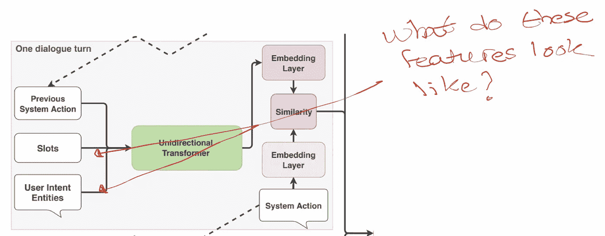

# 介绍

在本文中，我们将看看 Rasa 的 [TED 策略](https://arxiv.org/abs/1910.00486)如何特征化提取的[意图](https://rasa.com/docs/rasa/training-data-format#training-examples)、[实体](https://rasa.com/docs/rasa/nlu-training-data/#entities)和[槽位](https://rasa.com/docs/rasa/domain/#slots)，以预测机器人接下来应该做什么。

复制本文中描述的结果的代码是这里的[和](https://github.com/hsm207/rasa_tracker_feat)。

# 目的

假设我们在 domain.yml 中定义了以下意图:

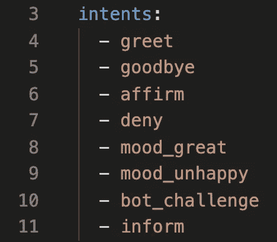

图 1:在 domain.yml 文件中定义的意图

图 1 中定义的意图将在内部表示为一个查找表，如下所示:

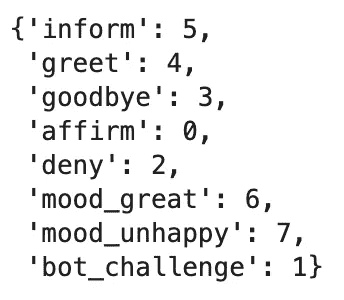

图 2:图 1 中定义的意图的查找表

请注意，我们已经在 bot 的 domain.yml 中定义了 8 个意图。

因此，假设 Rasa 的 NLU 模型将“我感到幸福”这一话语归类为`mood_great`:

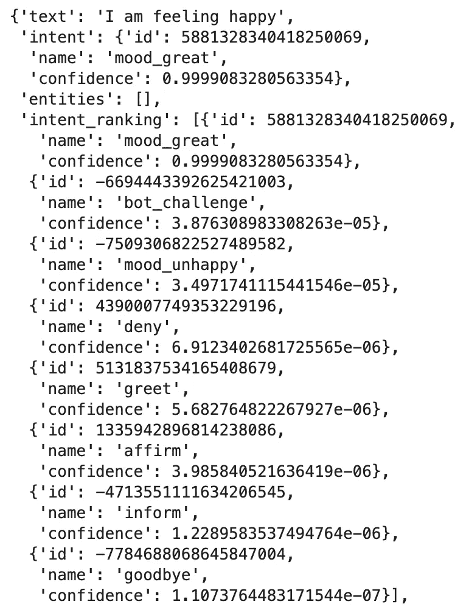

图 Rasa 的 NLU 模型如何对“我感到快乐”这一话语进行分类

TED 策略将获取字符串`mood_great`并将其转换为 8 维二进制向量，如下所示:

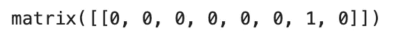

图 4:表示意图 mood_great 的二进制向量

注意，图 4 中二进制向量的所有元素都是 0，除了第 6 个元素(**从 0 开始计数**)。该位置的值为 1，因为根据图 2，第 6 个元素对应于 intent `mood_great`的值。

因此，我们可以得出结论，意图被表示为一个独热编码向量。

# 实体

## 概观

假设我们已经在 domain.yml 中定义了以下实体:

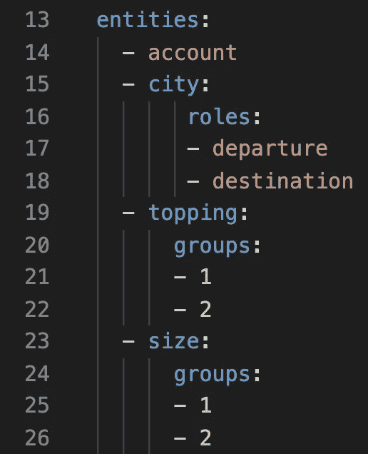

图 5:在 domain.yml 中定义的实体

这将被转换成以下内部查找表:

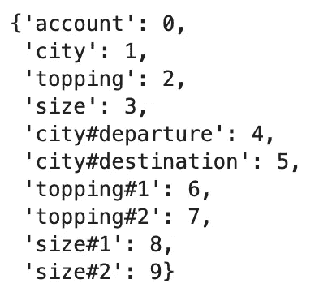

图 6:用于特征化实体的内部查找表

注意，我们只定义了 4 个实体，但是查找表有 10 个条目。

原因是具有[角色和组](https://rasa.com/docs/rasa/nlu-training-data/#entities-roles-and-groups)的实体被视为独立的实体，因此为其角色和组中定义的每个值提供了额外的条目。

## 只有一个实体的话语

给定话语“我想开一个支票账户”，NLU 模型将提取具有值“支票账户”的实体“账户”:

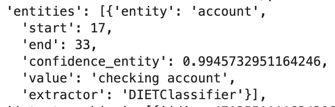

图 7:从话语“我想开一个支票账户”中提取的实体

TED 策略将使用此信息构建以下向量:

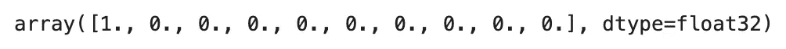

图 8:图 8 中提取的实体的向量表示

应该清楚的是，图 8 中的值 1 对应于基于图 6 的实体“账户”。

## 具有重复实体的话语

当一个话语包含相同实体类型的多次提及时会发生什么？

例如，语句“我想把钱从我的支票账户转到我的储蓄账户”包含以下实体:

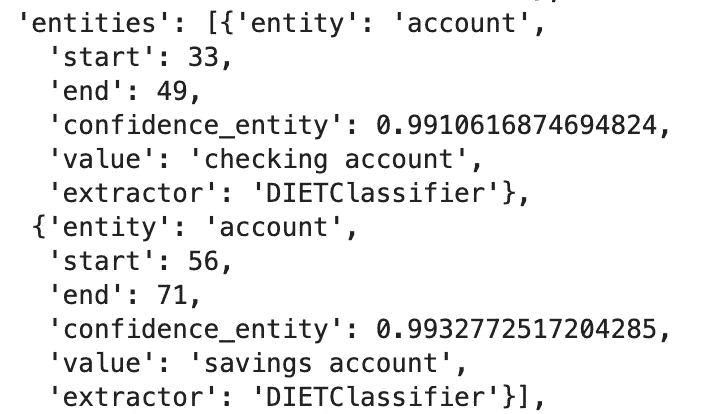

图 9:具有多个相同类型实体的结果

图 9 显示，我们有两个类型相同的实体，即“帐户”，但值不同，即“支票帐户”和“储蓄帐户”。

TED 策略将使用此信息生成以下矢量表示:

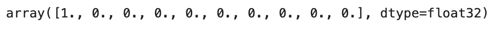

图 10:图 9 中提取的实体的向量表示

注意，这与图 8 中的向量表示相同。

因此，我们得出结论，我们不能根据提及的实体数量来影响对话。

## 不同实体的话语

话语“我想开一个储蓄账户并去柏林旅行”将提取以下实体:

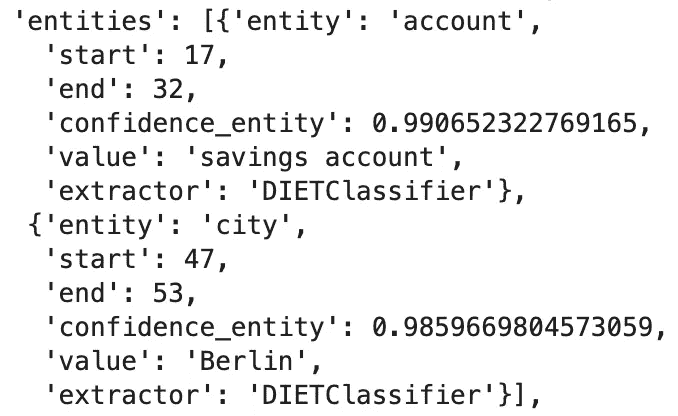

图 11:具有不同类型的多个实体的结果

在这种情况下，TED 策略将生成以下特征向量:

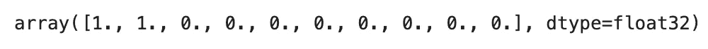

图 12:图 12 中结果的向量表示

因此，我们可以得出结论，提取的实体的向量表示是二进制向量，其中 1 仅指示根据内部查找表映射到该位置的实体的存在。

## 具有角色和组的实体

包含具有角色和组的实体的话语的情况是有趣的。

考虑角色为“我想从柏林旅行到旧金山”的实体的情况。这些是由 NLU 模型提取的实体:

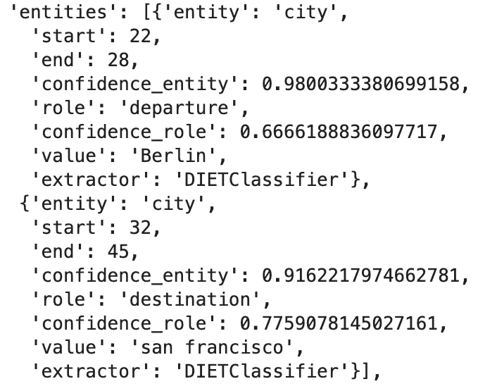

图 13:包含带有组的实体的结果

TED 政策将图 13 中的结果特征化为以下向量:

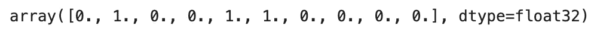

图 14:图 13 中结果的向量表示

正如所料，我们在第 4 和第 5 个元素中看到 1，因为这些元素对应于“城市”实体类型的“出发”和“目的地”角色。

可能没有预料到的是，第一个元素中也有一个 1，因为该元素只对应于“city”实体类型，没有任何角色。

同样的观察适用于具有组的实体和具有角色和组的实体。

# 时间

## 概观

插槽将有自己的查找表，就像意图和实体的情况一样。

如果我们在 domain.yml 文件中定义了以下插槽:

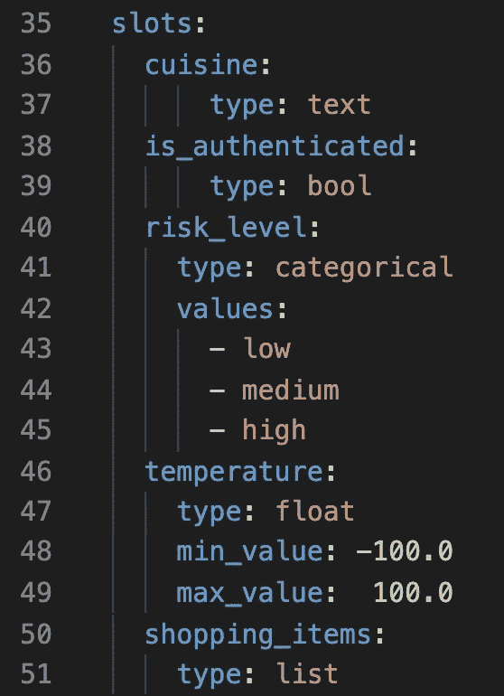

图 15:在 domain.yml 中定义的插槽

内部查找表看起来是这样的:

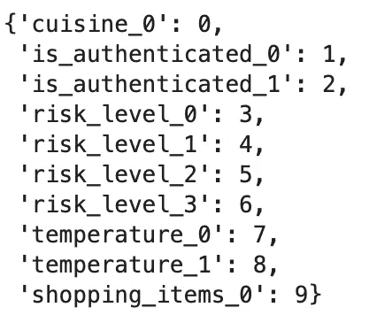

图 16:用于特征化图 15 中定义的插槽的内部查找表

让我们来看看每种插槽类型是如何被特征化的。

## 文本槽

将“cuisine”槽的值设置为任何值(除了`None`)将产生以下特征向量:

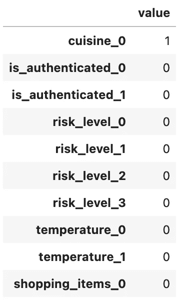

图 17:填充文本槽的向量表示

因此，尽管槽的类型是文本，Rasa 实际上并不检查传递给文本槽的值的类型是字符串。

## 布尔插槽

将“is_authenticated”槽设置为 False 将产生以下特征向量:

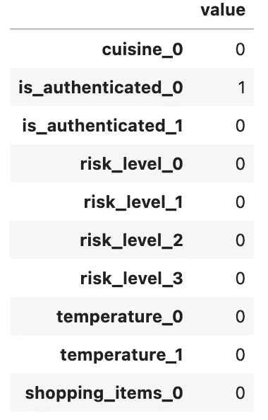

图 18:布尔槽设置为假时的特征向量

这是向量表示的样子，然后槽被设置为真:

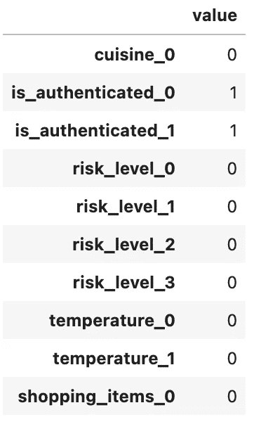

图 19:布尔槽设置为真时的特征向量

请注意，布尔插槽使用二维向量表示，其中 True 和 False 分别表示为(1，1)和(1，0)(与(0，1)和(1，0)相对)。

## 分类槽

“risk_level”槽是一个具有 3 个级别(低、中、高)的分类槽。

请注意，查找表已经为该时隙分配了 4 个位置。前 3 个对应于在 domain.yml 中定义的 3 个级别，最后一个对应于分配给预定义级别之外的该槽的值。

例如，如果插槽被赋值为“中”，则特征向量如下所示:

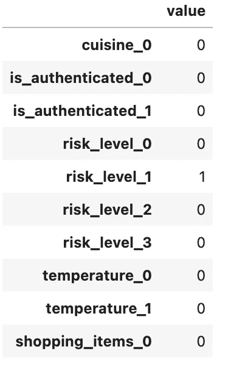

图 20:当 risk_level 槽被设置为“中等”时的向量表示

另一方面，如果该值既不是“低”、“中”也不是“高”，那么将使用第四个位置。例如，当插槽被赋值为“超高”时，这是矢量表示:

图 21:当 risk_level 槽被设置为“超高”(在预定义值之外)时的向量表示

## 浮动插槽

“温度”槽被定义为浮点槽，最小值为-100，最大值为 100。

这是“温度”设置为 0 时的特征向量:

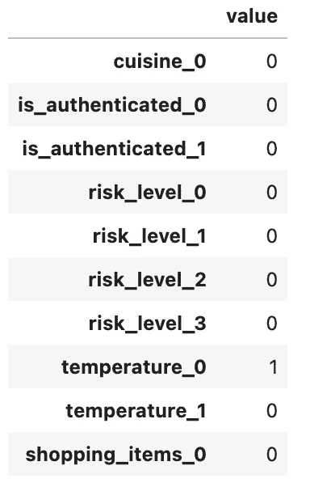

图 22:温度槽设置为 0 时的矢量表示(在界限内)

这是“温度”设置为-200 时的特征向量:

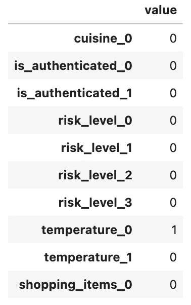

图 23:温度槽设置为-200 时的矢量表示(低于下限)

这是“温度”设置为 200 时的特征向量:

图 24:温度槽设置为 200(超出上限)时的矢量表示

根据图 22、23 和 24 中的结果，很明显，我们可以使用浮动槽来构建故事，当分配的值超出最大值而不是小于最小值时，这些故事将分支不同，因为当它的值在预定义的界限内时，它共享相同的向量表示。

## 列出插槽

列表槽与文本槽相似，传递给它的任何值(除了`None`)都将被视为特征化的有效输入。

例如，将这些值中的任何一个分配给“shopping_items”槽:

*   `[“eggs”, “milk”]`
*   `200`
*   `“eggs”`
*   `[None]`

将给出相同的特征向量，即:

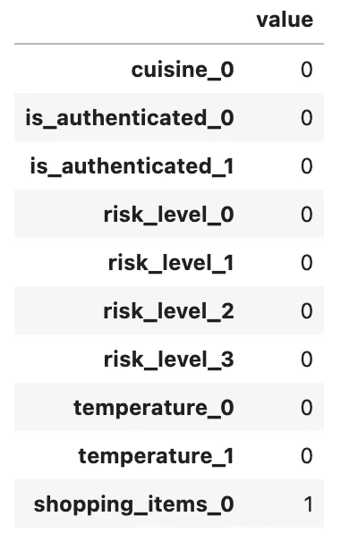

图 25:当列表槽被分配了除“None”之外的任何内容时的向量表示

# 结论

本文解释了在使用 TED 策略进行对话预测时，意图、实体和槽是如何特征化的。它还确定了某些类型的一些特质。这些特质可能看起来微不足道，但值得永远记住，因为它们确实会影响您可以编写什么样的故事，例如，您不能编写基于提取的实体数量分支的故事(不编写自定义代码)。

我希望这对您有所帮助。