# 关于 NER 分数的深度教程

> 原文：<https://pub.towardsai.net/an-in-depth-tutorial-on-the-f-score-for-ner-55e944bd28ce?source=collection_archive---------3----------------------->

## 以及推理的有效实现

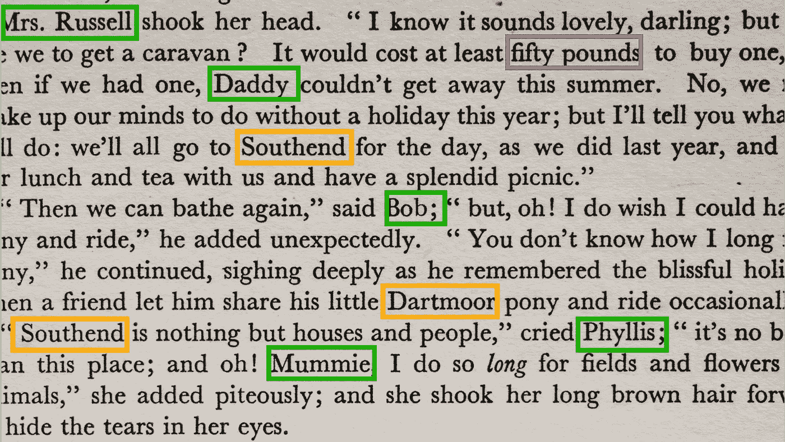

编辑过的照片。原创感谢来自 [Unsplash](https://unsplash.com/photos/askpr0s66Rg) 的[安妮·斯普拉特](https://unsplash.com/@anniespratt)。

F 分数对于分类算法来说是一个非常有用的指标，可以平衡假阳性(通过[精度](https://en.wikipedia.org/wiki/Precision_and_recall))和假阴性(通过[召回](https://en.wikipedia.org/wiki/Precision_and_recall))。然而，虽然它在经典分类任务中的实现相对简单，但它在命名实体识别(NER)中涉及更多，其中真阳性(TP)、假阳性(FP)和假阴性(FN)不仅仅是真标签与来自模型的输出张量的 argmax 的比较。

本文简要介绍了 NER 类型的问题，概述了 TP、FP 和 FN 的计算方法(包括这与基于 transformer 的模型有何不同)，最后介绍了 PyTorch 中利用 GPU 的 F 分数的高效实现。没有预先的自然语言处理知识，但是以前的自然语言处理经验将是有用的。

# 作为分类任务的 NER

在 NER，目标是预测一段文本中的哪些元素是“命名实体”，例如，人(PER)，组织(ORG)，地点(GEO)。一个好的 NER 模型应该能够识别命名实体，如下所示:

请注意，非 NER 单词表示为“其他”。稍后将详细介绍。

为了做到这一点，首先将文本表示为一个整数向量。它被分割成更小的组件([标记化](https://www.analyticsvidhya.com/blog/2020/05/what-is-tokenization-nlp/))，每个组件都根据它们所属的实体类型被赋予一个相关联的标签。为了给模型更多关于实体的信息，开始标记被赋予不同的标签(你可以在这里和这里阅读其他的标签策略)。因此，如果我们进行简单的空白符号化，上面的句子将表示如下:

这里我们使用了生物表示法。任何实体类型的开头都标记为' B-'，其他的标记为' I-'(表示内部)。任何非实体词都标为‘O’。

对于这个特殊的句子，我们的输入是一个 1x13 的向量，我们的输出是一个相应的 1x13 的向量。任务是将 13 个单词中的每一个分类为 7 个唯一标签之一{O，B-PER，I-PER，B-GEO，I-GEO，B-ORG，I-ORG}。这意味着我们的模型输出将是大小为 1x13x7 的，其中最后一个维度表示那个**单词 i** (i=1…13)属于**类 j** (j=1…5)的概率。现在，在一个标准的分类任务中，我们将简单地获取最后一个维度的 argmax，从而获得每个单词的预测标签。然后，我们可以获得标签的宏观 F1 分数，从而为我们提供模型表现如何的度量:

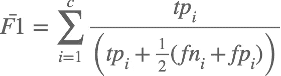

然而，这在 NER 的背景下是错误的，它大大高估了模型的性能。这是因为在 NER，我们不关心每个**个体**标记的好坏，相反，我们感兴趣的是 NER 标记的每个**序列**标记的好坏。除此之外，将宏 F1 直接应用于模型输出将衡量我们的模型相对于标签{O，B-PER，I-PER，B-GEO，I-GEO，B-ORG，I-ORG}的表现如何。但是回想一下，生物表征是我们用来提高训练的东西，但这不是我们在推理过程中感兴趣的。相反，我们关心哪些项目被分类为{O、PER、GEO 和 ORG}。这意味着我们需要将输出张量映射回我们的原始类标签，从而给我们一个缩减的输出张量 **1x13x4** 。在下一节中，我们将详细说明 F1 分数如何应用于**序列**级别，而不是**单个**标记级别。

> **关于 transformers 的一个注意事项:**使用 transformers 时，额外的复杂性是所使用的记号赋予器通常按子词而不是简单地按空白分割。比如‘苹果’可能会拆分成‘App’和‘le’。这增加了四个额外的复杂性:1)我们应该考虑训练/推理的子话题吗？2)如何标注子音？3)在确定类别标签时，如何从子音聚合回单词？4)我们需要删除特殊字符(CLS，9 月)。这里给出了关于这些的更多细节[。一旦处理了这些问题，问题就和上面描述的一样了，因此下面的步骤也适用于基于变压器的模型。](https://github.com/namiyousef/argument-mining)

# 定义 NER 的 TP、FP 和 FN

由于我们对预测**序列**的正确性感兴趣，我们需要调整 TP、FP 和 FN 的定义，以应用于序列级而不是令牌级。这给出了以下定义:

*   目标记号序列{ti，… tn}和预测记号序列{yi，… yn}之间的完美匹配

> **举例:**约翰·史密斯 **→** 真实标签 **:** {PER，PER}，预测标签:{PER，PER}

*   **FN:** 没有完全匹配的预测序列{yi，… yn}的目标序列{ti，… tn}

> **示例:** John Smith →真实标签:{PER，PER}，预测标签:{ORG，ORG}

*   **FP:** 没有完全匹配的目标序列{yi，… yn}的预测序列{yi，… yn}

> **示例:**美国→预测标签:{ORG，ORG}，真实标签:{ORG}(美国)

当试图确定 F 值时，这带来了许多挑战:

1.  **不同长度:**我们的黄金标签可能是(John Smith，PER)但是模型可能预测(John Smith He，PER)。
2.  **Missing targets:** 我们的金牌标签可能是(Apple，ORG)，但我们的模型可能不会预测整个句子的任何 ORG。
3.  **遗漏预测:**对于一个特定的句子，我们可能没有任何 ORG 标记，但是我们的模型可以预测一系列标记上的 ORG

另一个考虑是，有时我们对完美的比赛不感兴趣，但我们会对势均力敌的比赛感到满意。这是典型的情况，其中 NER 任务是在较长的序列上，例如，从专利中提取权利要求，从文章中提取论点，等等

在这种情况下，我们可以为匹配定义一个可接受的**阈值**，例如两个序列的 50%必须匹配。这意味着，如果我们有黄金标签(John Smith，PER)和预测(Smith He，PER ),那么它仍将被视为匹配，因为两个示例的匹配重叠为 50%。

下一节将更详细地描述该算法。

# 算法:一步一步来

我将展示在两个文档上工作的算法，以涵盖所有边缘情况。我还将使用一个基于 transformer 的模型来展示算法的完整范围。如果你对这些不熟悉，我建议从**步骤 5** 开始(但也强烈鼓励你学习变形金刚，因为它们是 NLP 中的 Step)).

步骤 1 和 2 与如何准备数据有关。步骤 3 和 4 与模型预测相关。从第 5 步开始就是严格的推理。

输入数据如下所示:

## 第一步:贴标签

标签是使用标签方案创建的。这里用的是 BIO。

## 第二步:符号化

现在标签已经创建，文档通过[贴合面](https://huggingface.co/)标记器。子标记也必须被标记。

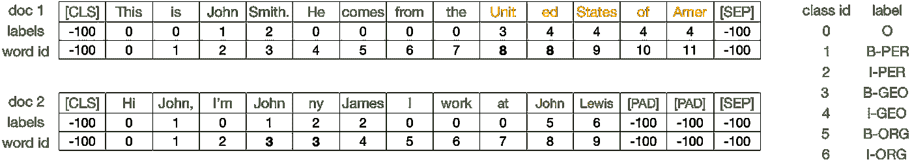

请注意，文档 1 中的“Unit”和“ed”以及文档 2 中的“John”和“ny”具有相同的 word _ ids，表明它们来自同一个单词。在这种情况下，子发音“ed”和“ny”被赋予了相同的标签“I-{ENT}”(您也可以赋予它们起始子发音的标签)。最后，特殊标记[CLS]、[SEP]和[PAD]被赋予-100 的标签，以便在损失计算和推断中忽略它们。

> **注意:**这里的标记化是任意的。选择了 15 的**最大长度**。attention_mask 被省略，并且添加了一个 **word_ids** 张量来反映记号所属的单词。

## 第三步:预测

输入被传递到一个拥抱脸模型中，并给出每一类的预测。

对于每个标记，模型输出每个类别的概率(每个标记的较高值以**粗体显示，在图像中**仅针对**文档 1** 显示)。通常，简单地采用 argmax 函数会给出最可能的类。然而，对于需要聚合回单词的子单词，argmax 操作是未定义的。例如，取' Unit '和' ed '的 argmax 分别给出类 3 和 0。但是我们如何给“曼联”分类呢？请注意，在这一点上，我们忽略了对特殊标记[CLS]、[SEP]和[PAD](灰显)的预测。

## 第四步:聚合回单词

使用每个子发音的预测，我们需要聚合回单词，以确定单词的类别标签。

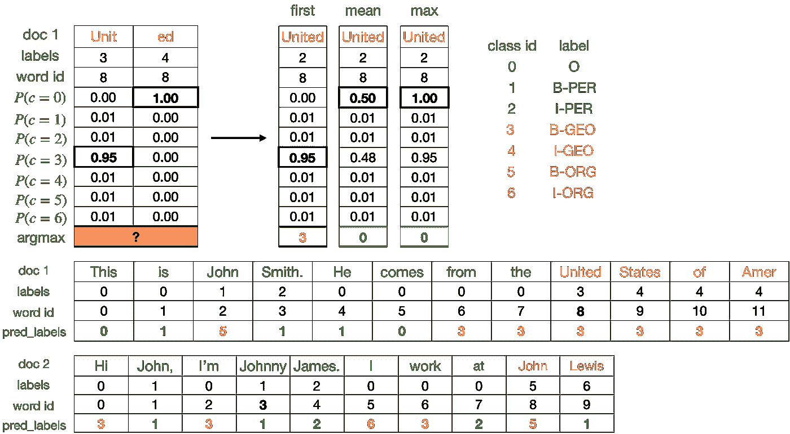

上图显示了如何为**文档 1** 处理不明确的术语。显示了三种聚合策略:第一，平均值和最大值。 **First** 只考虑第一个子发音的概率。**表示**取所有子音的平均值， **max** 取最大值。这显示在图像的上半部分。在下半部分，使用 first 聚合策略显示了两个文档的完整预测标签。

## 第五步:减少到金色标签

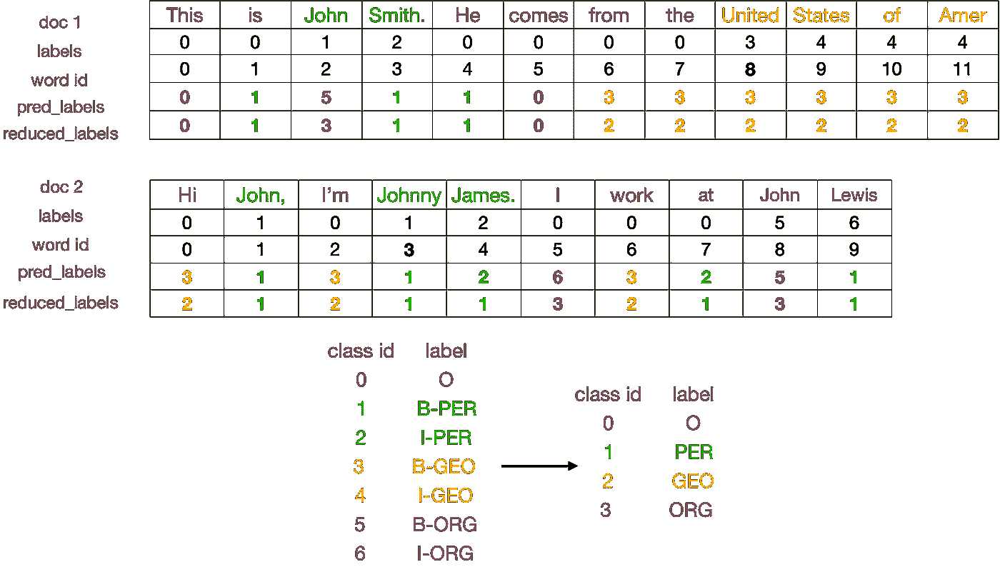

用于训练的扩展类(例如 B-{ENT}，I-{ENT})被减少到仅它们的核心标签(例如 ENT)。这在上面有图示。

## 步骤 6:获取连续的文本片段

对于预测和基本事实，连续文本段的数据帧(如类标签所示)被创建。

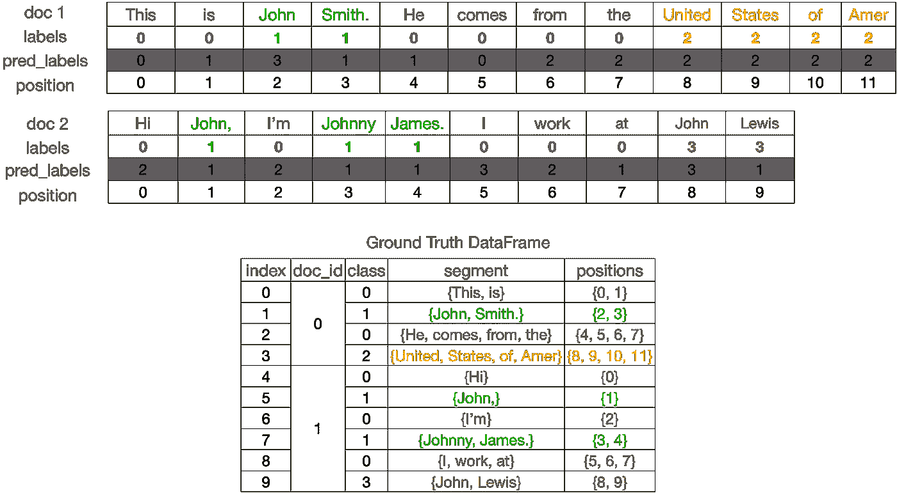

地面实况数据帧包含连续的文本段(基于类别标签)。值得注意的是，单词位置是比较段所必需的。这是因为一个文本文档可以有多个相同的文本段，但出现在不同的位置。

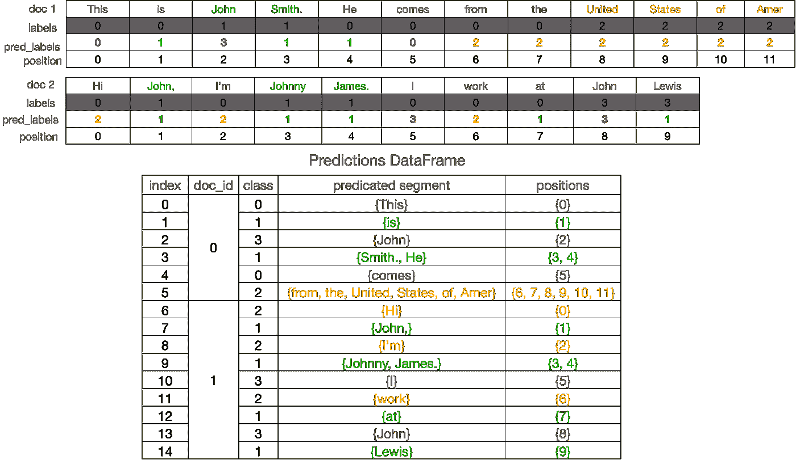

预测数据框。您可以看到这个数据帧有更多的行，因为预测非常不一致。值得注意的是，对于文档 1 (doc_id=0 ),我们有一个没有出现在基础事实中的对类 3 的预测。类似地，对于文件 2，我们有一个没有出现在地面真理中的对类 2 的预测。最后，在文件 2 中，我们可以看到，没有对 0 类的预测，即使地面真相有这些项目。在下一节中，我们将看到这些是如何处理的。

## 第七步:获得真正的肯定

为了确定连续文本段之间的重叠，在(doc_id，class)上进行完全连接。然后，比较每对位置段。使用下面的等式，可以找到基础事实与预测的重叠以及预测与基础事实的重叠:

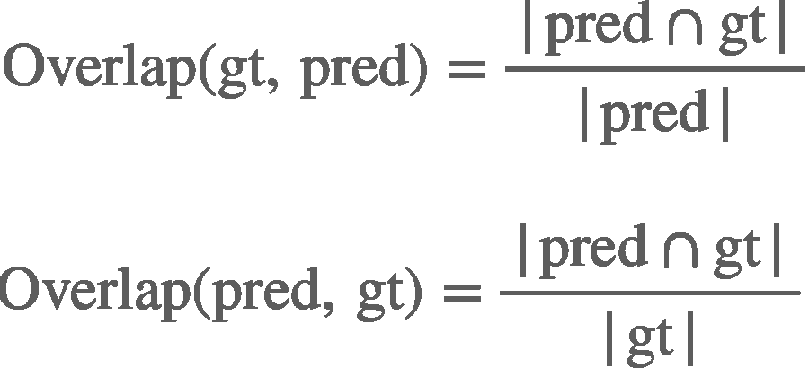

如果**和**都超过一个阈值(这里为 0.5)，则表明该对片段是真阳性:

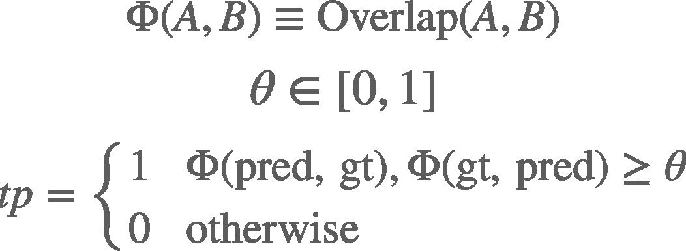

比较和重叠显示在以下示例中:

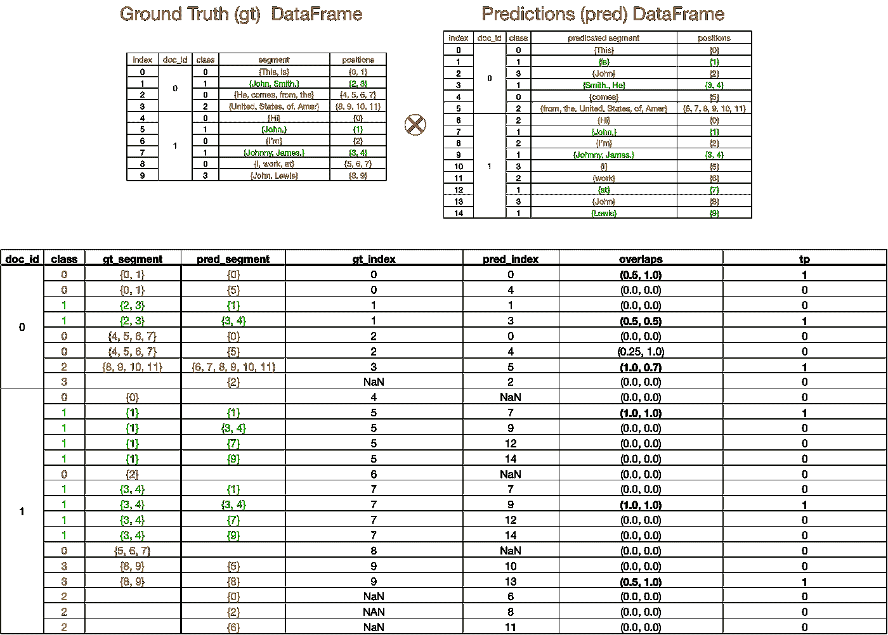

索引 **gt_index** 和 **pred_index** 指的是合并前每个数据帧的索引。这是必要的，以确保我们只计算每个项目一次。我们可以在 **gt_segment** 和 **pred_segment** 中看到一些空白项。这些分别表示预测过高/过低。例如，在文档 1 中，我们有一个{2}预测为类别 3 ( **过度预测**)，但是在基本事实中没有类别 3 的实例。因此 **gt_segment** 为空，而 **gt_index** 的值为 **NaN** 。另一方面，在文件 2 中，我们将{0}、{2}和{5，6，7}都作为地面真值表中的类 0，但是没有相应的预测( **underprediction** )。因此**预解码段**为空，并且**预解码索引**取值为 **NaN** 。

## 第八步:获得假阳性和假阴性

首先，来自真阳性的所有基础事实和预测片段被忽略。这是为了确保我们不会重复计算。

接下来，所有不匹配的地面事实被宣布为**假阴性**，而不匹配的预测被宣布为**假阳性**。这花了我一段时间来理解，所以我希望下面的数字有所帮助。

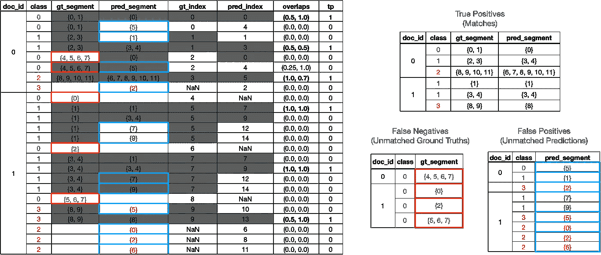

在左侧，您可以看到步骤 7 中的重叠表。所有被视为匹配的项目(例如，真阳性)都已变灰。任何不匹配的事实都用红色圈出，而所有不匹配的预测都用蓝色圈出。重复项变灰(例如，文档 1 中的{4，5，6，7})。在右边，您可以在不同的表格中看到真阳性、假阴性和假阳性！

## 第九步:分组

现在我们有了所有的 TP、FP 和 FN，我们可以按类对它们进行分组，并计算 F1 分数。我们还可以计算任何使用 TP-FP-FN 的度量。

然后，我们可以通过计算**宏观得分**来确定整体模型性能。在这种情况下，宏 F1 只是整个模型中 F1 分数的平均值。因此我们得到**宏 F1=0.465** 。

> N **注:**在实际执行中，我们通常在最后计算 F-Score。这是因为输入将被分批，因此我们在计算 F 分数之前收集每批的数据框架。

# 高效 PyTorch 实施

> **注意:**上面的代码块有很多本文没有讨论的实现细节(比如批处理)。我把它放在这里，这样你可以从这篇文章中了解到不同的部分是如何组合在一起的。可以在 [ArgMiner](https://github.com/namiyousef/argument-mining) 的评估模块下找到完整代码。

# 结束语

## 关键要点

*   F-Score 是一种广泛使用的度量标准，用于确定分类性能。它适用于 NER，并进行修正，以确保它适用于**序列**级，而不是**令牌**级。
*   它的计算伴随着寻找正确的真阳性、假阳性和假阴性的挑战
*   **真阳性**是超过用户指定的**阈值**的预测序列和基本真实序列之间的匹配
*   **假阳性**是没有匹配基础真实序列的预测序列
*   **假阴性**是没有匹配预测序列的基础真实序列
*   对于短序列预测任务(例如 NER ),阈值**通常非常高(接近 1 ),但对于较长序列预测任务(例如参数挖掘)则较低(接近 0.5)**
*   变压器模型给计算过程增加了挑战，因为它们需要将**子符号**聚合**回单词。**

## 实施说明:

*   如果对开箱即用的代码感兴趣，可以在 [ArgMiner](https://github.com/namiyousef/argument-mining) 的评估模块下找到一个**早期访问发布**版本
*   虽然代码的编写是为了提高效率，但我希望通过再次访问这些步骤来检查冗余，从而提高推理速度。我也在考虑使用 cuDF 来加快计算速度，因为主要的瓶颈来自熊猫。如果你对此感兴趣，请留意 [ArgMiner](https://github.com/namiyousef/argument-mining) 的变化。此外，请留意 [mlutils/torchtools](https://github.com/namiyousef/ml-utils) ，因为我可能会在那里重构部分推理代码以供通用(例如，不与 ArgMiner 绑定)。

 [## GitHub-Nami yousef/argument-mining:NLP 项目的存储库。当我们决定更改名称时…

### argminer 是一个基于 PyTorch 的包，用于在最先进的数据集上进行参数挖掘。它为…提供了一个高级 API

github.com](https://github.com/namiyousef/argument-mining)  [## GitHub - namiyousef/ml-utils:有用的 ML util 函数

### 此时您不能执行该操作。您已使用另一个标签页或窗口登录。您已在另一个选项卡中注销，或者…

github.com](https://github.com/namiyousef/ml-utils) 

# 参考

1.  我在 NER 语境下对 TP、FN 和 FP 的定义是基于对 [Kaggle](https://www.kaggle.com/competitions/feedback-prize-2021/overview/evaluation) 的反馈奖竞赛的评价。

*所有图片均由作者提供，除非另有说明*