# 使用机器学习的卡通化内部指南

> 原文：<https://pub.towardsai.net/an-insiders-guide-to-cartoonization-using-machine-learning-ce3648adfe8?source=collection_archive---------0----------------------->

## [深度学习](https://towardsai.net/p/category/machine-learning/deep-learning)，[计算机视觉](https://towardsai.net/p/category/computer-vision)

## 实施白盒模型以“卡通化”真正的高质量图像。

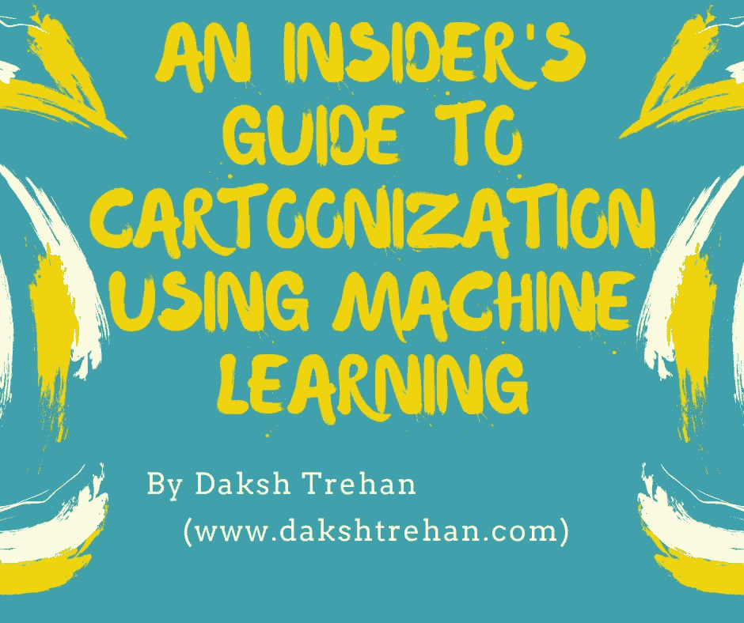

卡通化本身是一种经典艺术，但是，机器学习领域的发展几乎覆盖了每个领域。今天，在这篇文章中，我们将了解一种叫做“**白盒卡通化”**的新方法，它将照片重建为动画风格，专注于表情提取元素，使计划完全可控和灵活。

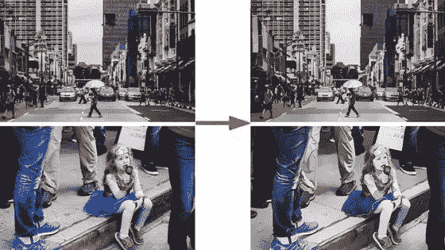

使用“白盒卡通化”获得的结果，[来源](https://gigazine.net/gsc_news/en/20200630-white-box-cartoonization/)

# 模型介绍

我敢打赌，每个人都一定喜欢卡通，它们也一定是你童年不可或缺的一部分。除了这些令人回味的回忆，这可能是我们中一些人的职业选择。

但是机器学习是不断发展的，因此几乎扩展到了每个领域。由和于金泽完成的研究工作让我们只需要一点点训练就能制作出真正高质量的图像。

将现实生活中的高质量画面转换成实用的卡通场景的过程被称为**卡通化**。

提出相同方法的早期模型使用**黑盒模型**，前一种模型实现了很高的准确性，但降低了风格化质量，导致一些不好的情况。就像，每个卡通工作流程考虑不同的功能，这些变化对黑盒模型构成了相关的影响。

为了克服以前模型的缺点，更加强调人类的绘画行为和不同风格的卡通形象，并开发了**白盒模型**。

该模型将图像分解为三种不同的卡通表现形式，进一步指导网络优化以生成卡通化的图像。

1.  **表面表示:**它有助于提取包含加权低频分量的图像的平滑表面，其中保留了颜色成分和表面纹理以及边缘、纹理和细节。
2.  **结构表示**:它有助于导出全局结构信息和稀疏色块，一旦完成，我们将实施自适应着色算法，如 Felzenswalb 算法，以开发结构表示，帮助我们为赛璐珞风格的卡通流程生成稀疏视觉效果。
3.  **纹理表现**:它帮助我们保留绘画的细节和边缘。三维图像被转换为单通道强度图，这有助于保持像素强度，同时兼顾颜色和亮度，它遵循手工艺术家的方法，即首先绘制具有轮廓的线条草图，然后对其应用颜色。

提取的输出被馈送到生成神经网络(GAN)框架，这有助于优化我们的问题，使解决方案更加灵活和多样化。

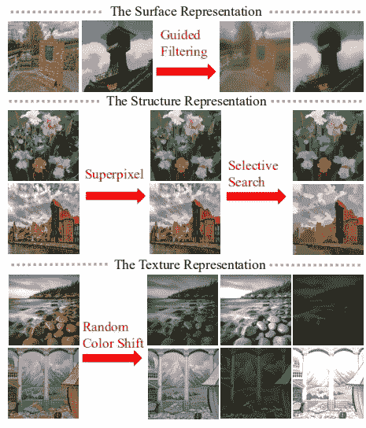

[来源](https://openaccess.thecvf.com/content_CVPR_2020/papers/Wang_Learning_to_Cartoonize_Using_White-Box_Cartoon_Representations_CVPR_2020_paper.pdf)

# 提议的方法

## 预处理

除了提出的三步方法，预处理也是我们模型的一个重要部分。它有助于平滑图像，过滤特征，将其转换为草图，并将输出从一个领域转换到另一个领域。在实现了这些相关的工作之后，我们可以确信由我们的模型生成的输出将会给我们保留最高质量特征的最佳输出。

*   **超像素和结构提取:**该方法用于将图像划分成区域，并定义一个谓词来度量两个区域之间的边界。基于谓词分割，开发了一种算法，其决策基于贪婪技术，但仍有助于满足全局性质。在识别轮廓后，我们执行**梯度上升，用粗略的聚类初始化图像，并迭代修改聚类直到收敛。为了推进我们的流程，我们使用***Felzenszwalb 算法*** 开发了一种类似卡通的分割方法，帮助我们获取全球内容信息，并为赛璐珞风格的卡通工作流程生成实际可用的结果。**

**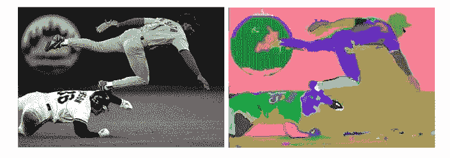**

**前 vs 后，[来源](http://people.cs.uchicago.edu/~pff/papers/seg-ijcv.pdf)**

*   ****图像平滑**:为了从图像中提取平滑且卡通似的表面，使用 ***导向滤波器*** 。导向过滤器是 ***双边过滤器*** 的高级版本，具有更好的边缘行为。目标仅仅是*去除/显著降低*噪声并获得有用的图像结构。导向滤波器的滤波输出是输入图像的最佳线性变换。遵循双边滤波器的方法，它保留了平滑特性，此外，没有梯度反转伪影。**

**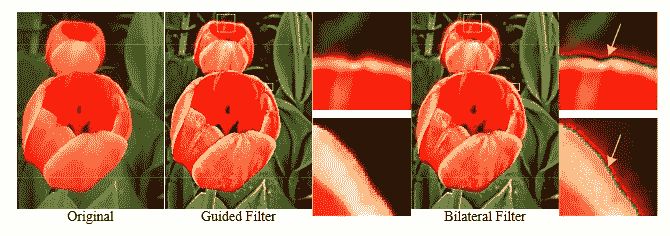**

**原件 vs 导向过滤器 vs 双边过滤器，[来源](http://kaiminghe.com/publications/eccv10guidedfilter.pdf)**

*   ****非真实感渲染:**它有助于将图像转换成艺术风格，如素描、绘画和水彩画。为了扩展其功能，我们将它与 ***神经风格转移方法*** 一起使用，这有助于总结一幅图像和另一幅图像的风格。组合的代码有助于标记语义边缘，同时分离图像细节。但是在“白盒卡通化”方法中，使用了单个图像，并从一组动画视觉效果中学习漫画家的特征，从而允许我们的模型在各种情况下产生高质量的输出。**

**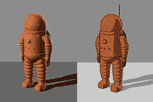**

**产量由 NPR 生产，[来源](https://en.wikipedia.org/wiki/Non-photorealistic_rendering)**

*   ****生成对抗网络:**它是一个图像合成器，使用联合概率帮助生成新数据。为了生成新的图像，它使用生成器和鉴别器。生成器生成图像，鉴别器检查图像的真假，然后向生成器发送反馈，要求其生成更好的数据。两个网络训练得越多，我们得到的图像就越好。**

****

**甘模型架构，[来源](https://developers.google.com/machine-learning/gan/gan_structure)**

*   ****图像到图像的转换**:GAN 的缺点是，它只对给定的训练数据有效，但是成对的训练数据并不总是可用的。为了克服这个缺点，我们采用了 cycleGAN，其目标是即使在没有成对训练数据的情况下，也将图像从源域 X 转换到目标域 Y。**

**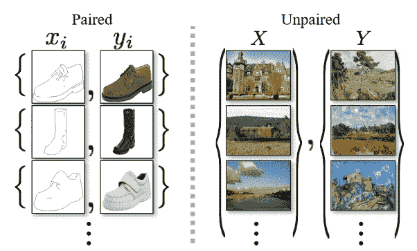**

**成对与不成对数据，[来源](https://arxiv.org/pdf/1703.10593v6.pdf)**

**为了继续该过程，我们分离图像特征，这加强了网络学习具有单独目标的不同特征，使得该过程更加健壮。**

**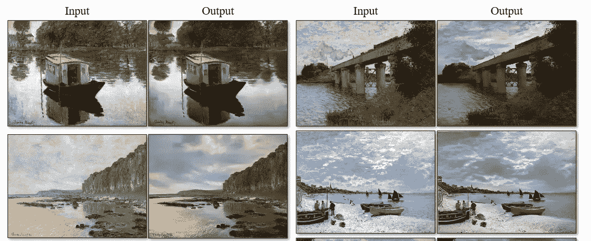**

**cycleGAN aka 图像到图像转换的输出，[来源](https://arxiv.org/pdf/1703.10593v6.pdf)**

# **了解整个模型**

**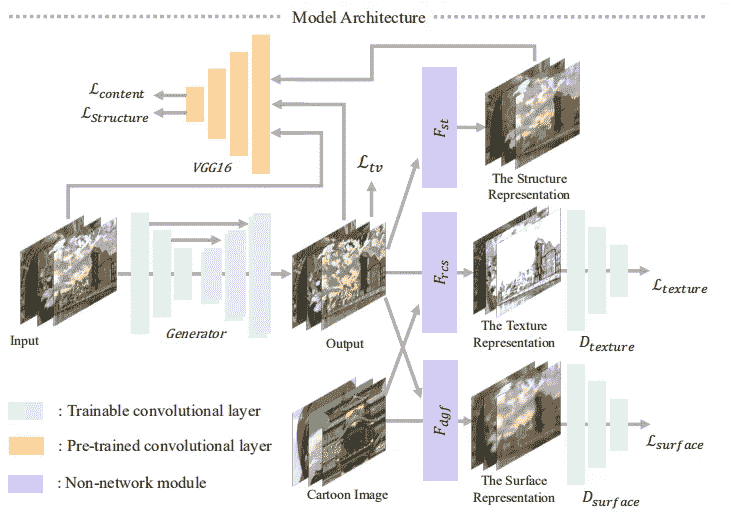**

**模型布局，[来源](https://openaccess.thecvf.com/content_CVPR_2020/papers/Wang_Learning_to_Cartoonize_Using_White-Box_Cartoon_Representations_CVPR_2020_paper.pdf)**

**输入图像被分解成三个部分:wiz *表面表示、结构表示*和*纹理表示。*介绍了一个带有生成器 G 和两个鉴别器 Ds 和 Dt 的 GAN 模型。Ds 的目标是表征从模型输出和动画中提取的表面特征，而 Dt 负责从模型输出和动画中分离纹理信息。为了提取高级特征并对输出和提供的成对卡通之间的全局内容施加空间约束，我们使用预训练的 *VGGNetwork* 。**

# **工作流程**

*   **输入首先通过表面表示，其中结构和纹理特征被移除，一旦我们模仿卡通绘画风格和平滑的表面，输出就通过导向过滤器，以便保留平滑的边缘。提出了鉴别器 *Ds* 来验证结果和配对的卡通图像是否具有相似的表面，并调节生成器 *G* 来学习存储在提取的表面表示中的信息。**
*   **结构特征然后通过结构表示传递，该结构表示在细胞风格框架中清除边界，然后我们实现 Felzenszwalb 算法来分割区域。该算法帮助我们用平均像素值给每个片段着色。为了对输出和提供的成对卡通之间的全局内容施加空间约束，我们使用预训练的 *VGGNetwork* 。**
*   **如前所述，亮度和颜色信息的变化对模型来说是重要的问题，因此，我们选择随机颜色偏移算法来将三通道输入转换为坚持高质量特征的一维输出。然后提出鉴别器 Dt 来验证来自结果和配对卡通图像的文本特征，并调节发生器 G 来学习存储在提取的纹理表示中的信息。**

**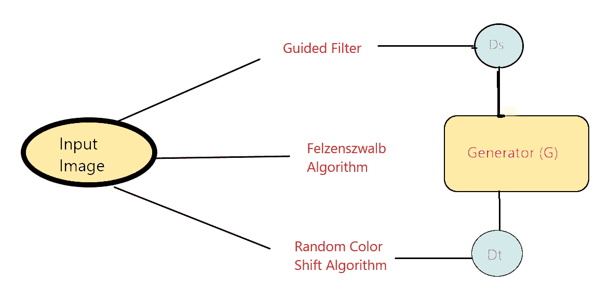**

**我们模型的工作流程。**

# **模型架构**

****

**模型架构，[来源](https://openaccess.thecvf.com/content_CVPR_2020/papers/Wang_Learning_to_Cartoonize_Using_White-Box_Cartoon_Representations_CVPR_2020_paper.pdf)**

**因为我们的模型是基于 GAN 的，所以在我们的模型中我们同时操作发生器和鉴别器。生成器是一个全卷积网络，跨距=2。网络进一步由三种层组成:卷积、泄漏 ReLU 和双线性调整层。**

**在鉴别器网络中，我们使用 PatchGAN，其中最后一层是卷积层。输出特征图中的每个像素对应于输入图像中的一个斑块。每个面片大小用于验证该面片是属于卡通图像还是生成的输出。贴片 GAN 增强了甄别器的操作性，加快了训练。**

# **输出**

**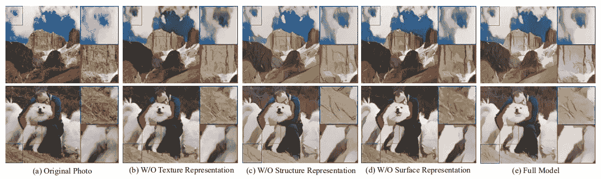**

**输出 wiz 不同的表示，[源](https://openaccess.thecvf.com/content_CVPR_2020/papers/Wang_Learning_to_Cartoonize_Using_White-Box_Cartoon_Representations_CVPR_2020_paper.pdf)**

**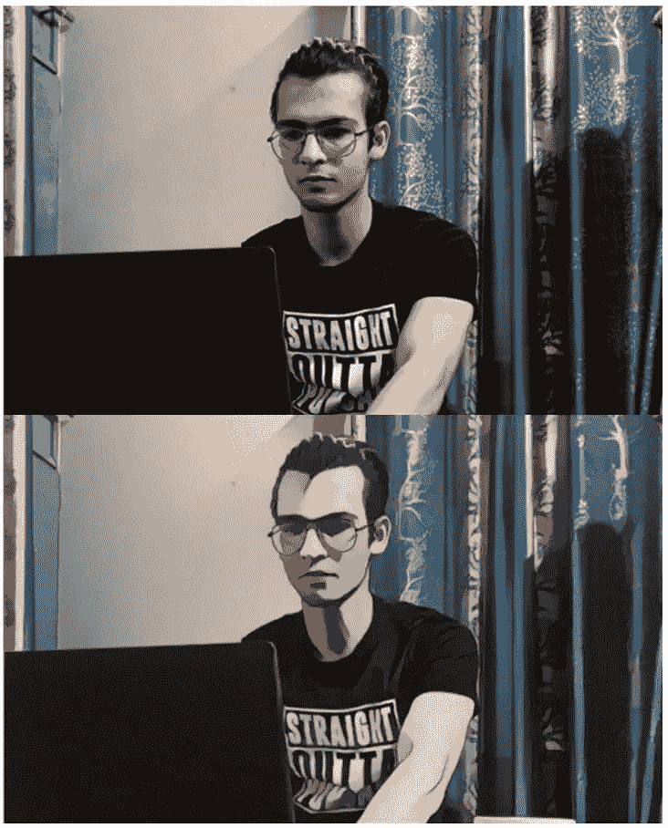****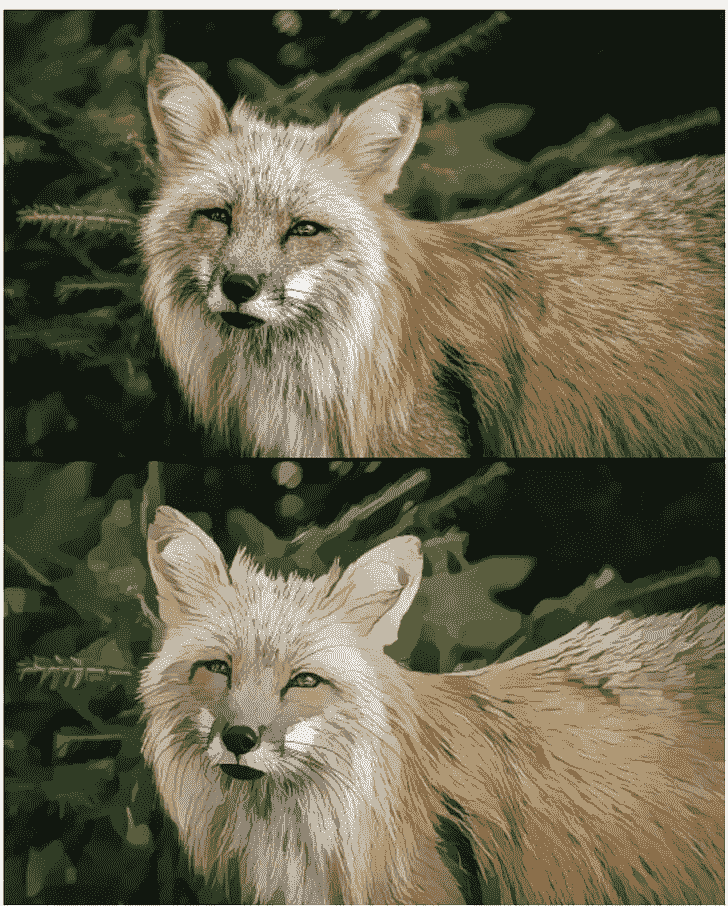****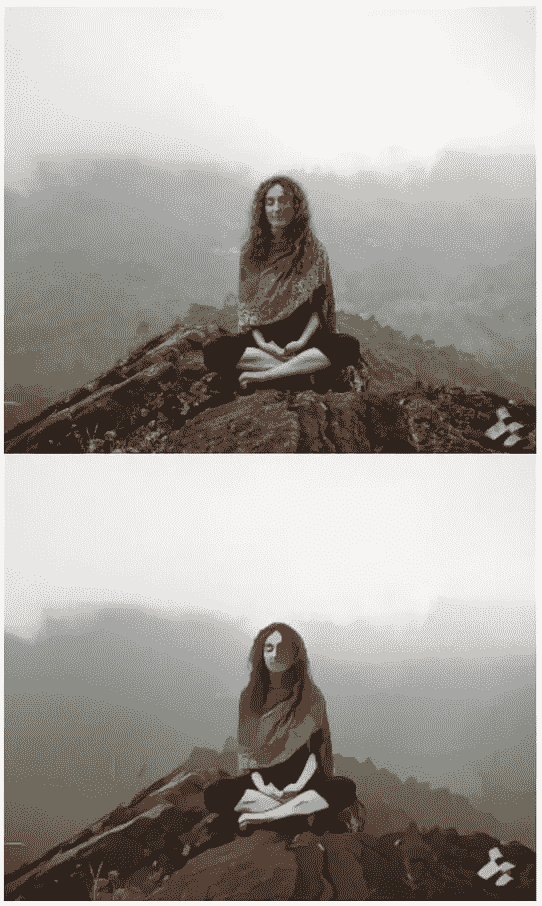**

**由模型、源产生的输出**

****如果你喜欢这篇文章，请考虑订阅我的简讯:** [**达克什·特雷汉每周简讯**](https://mailchi.mp/b535943b5fff/daksh-trehan-weekly-newsletter) **。****

# **密码**

**型号代码可在以下位置找到:**

** [## dakshtrehan/白盒卡通化

### 加入我在 www.dakshtrehan.com；www.linkedin.com/in/dakshtrehan 将测试图像存储在/test_code/test_images Run…

github.com](https://github.com/dakshtrehan/White-box-Cartoonization) 

和

 [## 系统错误王/白盒-卡通化

### CVPR2020 论文“使用白盒卡通表示学习卡通化”的 Tensorflow 实现。

github.com](https://github.com/SystemErrorWang/White-box-Cartoonization) 

# 结论

希望这篇文章能帮助你以最好的方式理解使用机器学习的图像卡通化，并帮助你实际应用。

一如既往，非常感谢您的阅读，如果您觉得这篇文章有用，请分享！

# 参考

[1]王，辛锐，于，金泽。学习使用白盒卡通表现卡通化。 *IEEE/CVF 计算机视觉和模式识别会议(CVPR)* 。2020 年 6 月。

[2]佩德罗·费尔曾兹瓦尔布和丹尼尔·胡滕洛赫。有效的基于图的图像分割。国际计算机视觉杂志，59(2):167–181，2004 年。

[3]吴，，，，黄.快速端到端可训练制导滤波器。在*IEEE 计算机视觉和模式识别会议论文集*中，第 1838–1847 页，2018。

[4]伊恩·古德菲勒、让·普吉-阿巴迪、迈赫迪·米尔扎、徐炳、戴维·沃德-法利、谢尔吉尔·奥泽尔、亚伦·库维尔和约舒阿·本吉奥。生成对抗网络。在*神经信息处理系统进展*中，第 2672–2680 页，2014 年。

[5]，何，，唐晓鸥。*引导图像过滤*。香港中文大学信息工程系，微软亚洲研究院，中国科学院深圳先进技术研究院

[6] [非真实感渲染](https://en.wikipedia.org/wiki/Non-photorealistic_rendering)

[7] [CycleGAN:机器学习如何学习不成对的图像到图像的翻译](https://towardsdatascience.com/cyclegan-how-machine-learning-learns-unpaired-image-to-image-translation-3fa8d9a6aa1d)

[8] [基于最小生成树的分割](https://en.wikipedia.org/wiki/Minimum_spanning_tree-based_segmentation)

[9] [氮化镓结构概述](https://developers.google.com/machine-learning/gan/gan_structure)

[10]陆，，贾亚嘉.素描与色调相结合的铅笔画制作。在*非真实感动画和渲染研讨会会议录*中，第 65–73 页。欧洲制图协会，2012 年。

请随意连接:

> *LinkedIn ~*[*https://www.linkedin.com/in/dakshtrehan/*](https://www.linkedin.com/in/dakshtrehan/)
> 
> *insta gram ~*[*https://www.instagram.com/_daksh_trehan_/*](https://www.instagram.com/_daksh_trehan_/)
> 
> *Github ~*[*https://github.com/dakshtrehan*](https://github.com/dakshtrehan)

关注更多机器学习/深度学习博客。

> *中等~*[*https://medium.com/@dakshtrehan*](https://medium.com/@dakshtrehan)

# 想了解更多？

[利用深度学习检测新冠肺炎](https://towardsdatascience.com/detecting-covid-19-using-deep-learning-262956b6f981)

[无法逃脱的人工智能算法:抖音](https://towardsdatascience.com/the-inescapable-ai-algorithm-tiktok-ad4c6fd981b8)

为什么你要为乔治·弗洛伊德的谋杀和德里的骚乱负责？

[为什么选择随机森林而不是决策树](https://medium.com/towards-artificial-intelligence/why-choose-random-forest-and-not-decision-trees-a28278daa5d)

[聚类:是什么？什么时候用？](https://medium.com/@dakshtrehan/clustering-what-it-is-when-to-use-it-a612bbe95881)

[从 k 近邻开始你的 ML 之旅](https://medium.com/@dakshtrehan/start-off-your-ml-journey-with-k-nearest-neighbors-f72a122f428)

[朴素贝叶斯解释了](https://medium.com/swlh/things-you-never-knew-about-naive-bayes-eb84b6ee039a)

[激活功能说明](https://medium.com/analytics-vidhya/activation-functions-explained-8690ea7bdec9)

[参数优化解释](https://towardsdatascience.com/parameters-optimization-explained-876561853de0)

[梯度下降解释](https://towardsdatascience.com/gradient-descent-explained-9b953fc0d2c)

[逻辑回归解释](https://towardsdatascience.com/logistic-regression-explained-ef1d816ea85a)

[线性回归解释](https://medium.com/towards-artificial-intelligence/linear-regression-explained-f5cc85ae2c5c)

[确定最适合您的 ML 模型](https://medium.com/datadriveninvestor/determining-perfect-fit-for-your-ml-model-339459eef670)

> *干杯！***