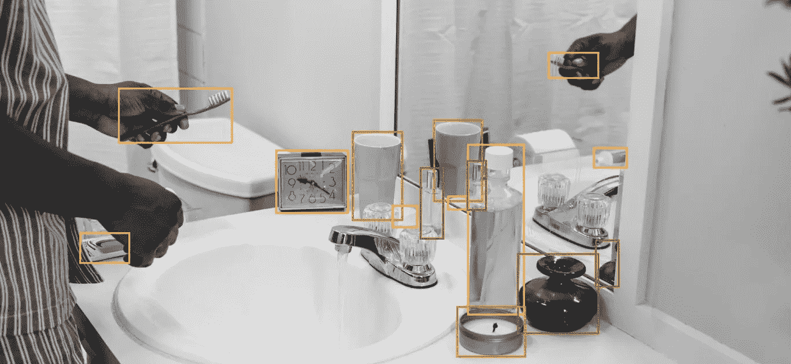
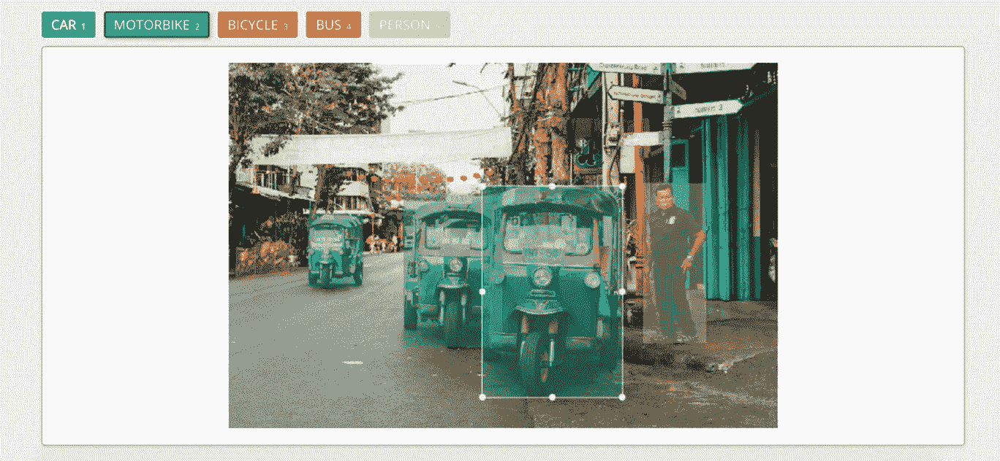
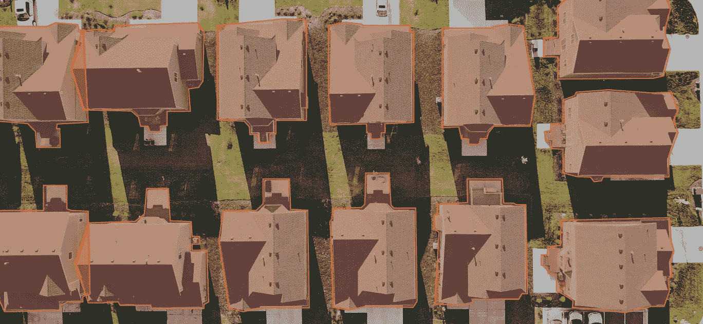
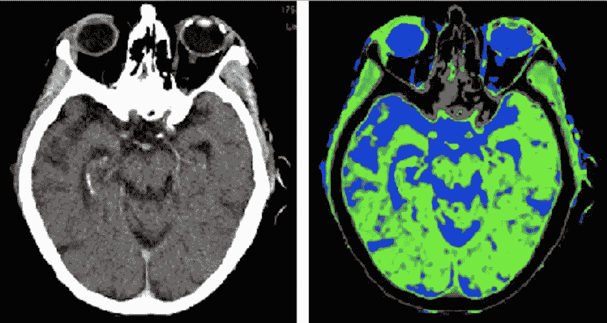

# 介绍 5 种图像注释

> 原文：<https://pub.towardsai.net/an-introduction-to-5-types-of-image-annotation-a6f486a6270f?source=collection_archive---------3----------------------->

## [数据科学](https://towardsai.net/p/category/data-science)，[机器学习](https://towardsai.net/p/category/machine-learning)

寻找不同图像注释类型的信息？在人工智能和机器学习的世界里，数据为王。没有数据，就不可能有数据科学。对于人工智能开发人员和研究人员来说，要实现他们项目的宏伟目标，他们需要访问大量高质量的数据。关于图像数据，需要大量带注释图像的机器学习的一个主要领域是计算机视觉。

**目录**

1.  什么是计算机视觉？
2.  什么是图像标注？
3.  常见的图像注释类型
4.  2D 包围盒
5.  3D 边界框/长方体
6.  多边形
7.  直线和样条曲线
8.  语义分割

*没时间看整篇文章？* ***改看我们的 5 分钟视频吧！***

# 什么是计算机视觉？

计算机视觉是机器学习和人工智能发展的最大领域之一。简而言之，计算机视觉是人工智能研究的领域，旨在让计算机看到并直观地解释世界。从自动驾驶汽车和无人机到医疗诊断技术和面部识别软件，计算机视觉的应用非常广泛，具有革命性。

由于计算机视觉致力于开发模仿或超越人类视觉能力的机器，训练这样的模型需要大量带注释的图像。

# 什么是图像标注？

图像注释就是给图像贴标签的过程。这可以是整个图像的一个标签，也可以是图像中每组像素的多个标签。一个简单的例子是为人类注释者提供动物图像，并让他们用正确的动物名称标记每张图像。当然，标注的方法依赖于项目所使用的图像注释类型。这些带注释的图像，有时被称为地面真实数据，然后被输入到计算机视觉算法中。通过训练，该模型将能够区分动物和未标注的图像。

虽然上面的例子非常简单，但进一步分支到更复杂的计算机视觉领域，如自动驾驶汽车，需要更复杂的图像注释。

# 最常见的图像注释类型有哪些？

想知道什么样的图像注释类型最适合您的项目？以下是五种常见的图像注释类型及其一些应用。

# 1.边界框

对于边界框注释，人类注释者被给予一幅图像，并被赋予在图像内的某些对象周围绘制一个框的任务。该框应该尽可能靠近对象的每个边缘。这项工作通常是在不同公司的定制平台上完成的。如果您的项目有独特的需求，一些公司可以调整他们现有的平台来满足您的需求。

边界框的一个具体应用是自主车辆开发。注释者将被告知在交通图像中的车辆、行人和骑自行车者等实体周围绘制边界框。

开发人员将向机器学习模型提供带边框注释的图像，以帮助自动驾驶汽车实时区分这些实体，并避免与它们接触。

# 2.三维长方体

与边界框非常相似，3D 长方体注释要求注释者在图像中的对象周围画一个框。边界框仅仅描述了长度和宽度，3D 立方体标注了长度、宽度和大概的深度。

使用 3D 长方体注释，人类注释者绘制一个封装感兴趣的对象的框，并在对象的每个边缘放置锚点。如果对象的一个边缘在视图之外或被图像中的另一个对象遮挡，注释器会根据对象的大小和高度以及图像的角度来估计边缘的位置。

# 3.多边形

有时，图像中的对象由于其形状、大小或在图像中的方向而不适合边界框或 3D 长方体。此外，有时开发人员希望对图像中的对象进行更精确的注释，如交通图像中的汽车或航拍图像中的地标和建筑物。在这些情况下，开发人员可能会选择多边形注释。

对于多边形，注释者通过在想要注释的对象的外边缘周围放置点来画线。这个过程就像同时放置点时的连接点练习。然后，使用一组预先确定的类别，即汽车、自行车、卡车，对由点包围的区域内的空间进行注释。当分配给一个以上的类进行注释时，它被称为多类注释。

# 4.直线和样条曲线

虽然直线和样条曲线可以用于各种目的，但它们主要用于训练机器识别车道和边界。顾名思义，注释器将简单地沿着您需要机器学习的边界画线。

线和样条可以用来训练仓库机器人准确地将箱子排成一行，或者将物品放在传送带上。然而，线和样条线注释最常见的应用是自动驾驶车辆。通过标注道路车道和人行道，自动驾驶汽车可以被训练成理解边界并保持在一条车道上而不转向。

# 5.语义分割

这个列表中的前几个例子处理的是对象外部边缘或边界的轮廓，而语义分割要精确和具体得多。语义分割是将整个图像中的每个像素与标签相关联的过程。对于需要语义分割的项目，通常会给人类注释者一个预先确定的标签列表，让他们从中进行选择，他们必须用这些标签来标记页面中的所有内容。

使用多边形注释中使用的类似平台，注释者可以在他们想要标记的一组像素周围画线。这也可以通过人工智能辅助平台来完成，例如，程序可以逼近汽车的边界，但可能会出错，并在分割中包括汽车下面的阴影。在这些情况下，人类注释者将使用一个单独的工具来剔除不属于它的像素。例如，对于自动驾驶汽车的训练数据，注释者可能会得到类似“请按照道路、建筑物、骑自行车的人、行人、障碍物、树木、人行道和车辆来分割图像中的所有东西”的指示

语义分段的另一个常见应用是医学成像设备。对于解剖学和身体部位标记，注释者会得到一张人的照片，并被告知用正确的身体部位名称标记每个身体部位。语义分割也可以用于难以置信的特殊任务，如在 CT 扫描图像中标记脑部病变。

这只是机器学习和人工智能开发中使用的五种常见图像注释类型。

如果您有一个具有独特要求的项目，或者需要定制的 [AI 培训数据](https://lionbridge.ai/training-data-guide/)，请联系 Lionbridge AI，看看我们如何为您提供帮助。我们拥有超过 100 万名贡献者的多语言社区可以在您需要时帮助您获得所需的数据。

*此前发布于:*[*https://lionbridge . ai/articles/an-introduction-to-5-types-of-image-annotation/*](https://lionbridge.ai/articles/an-introduction-to-5-types-of-image-annotation/)