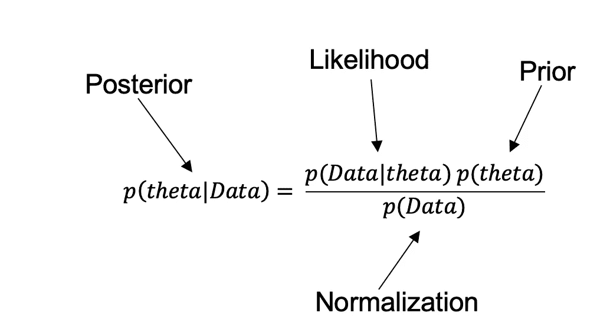
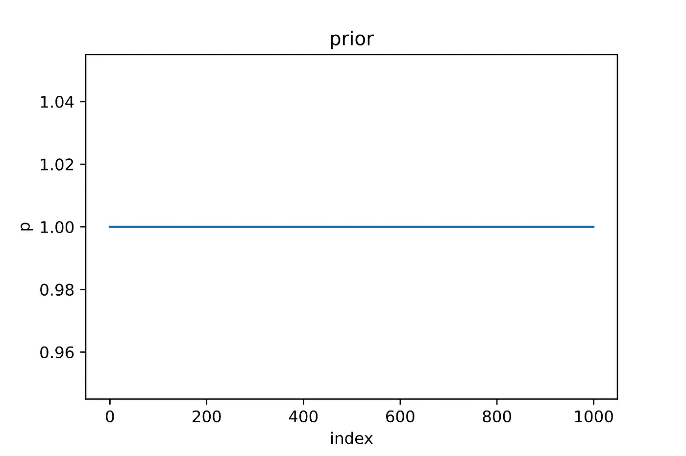
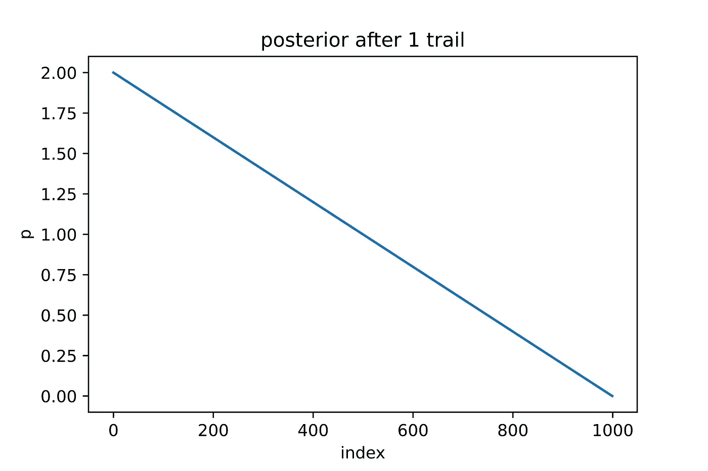
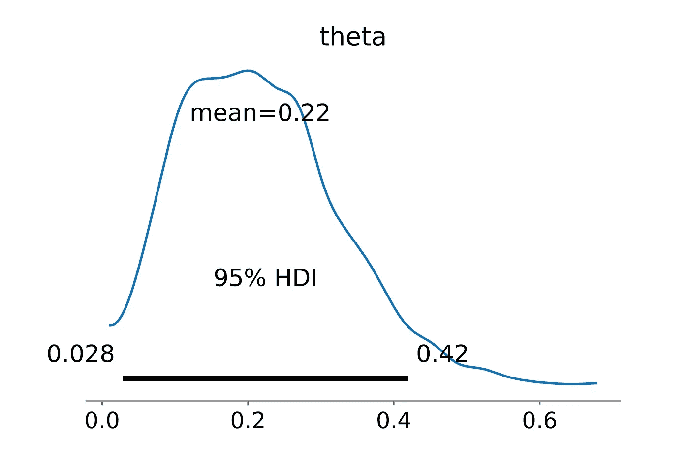
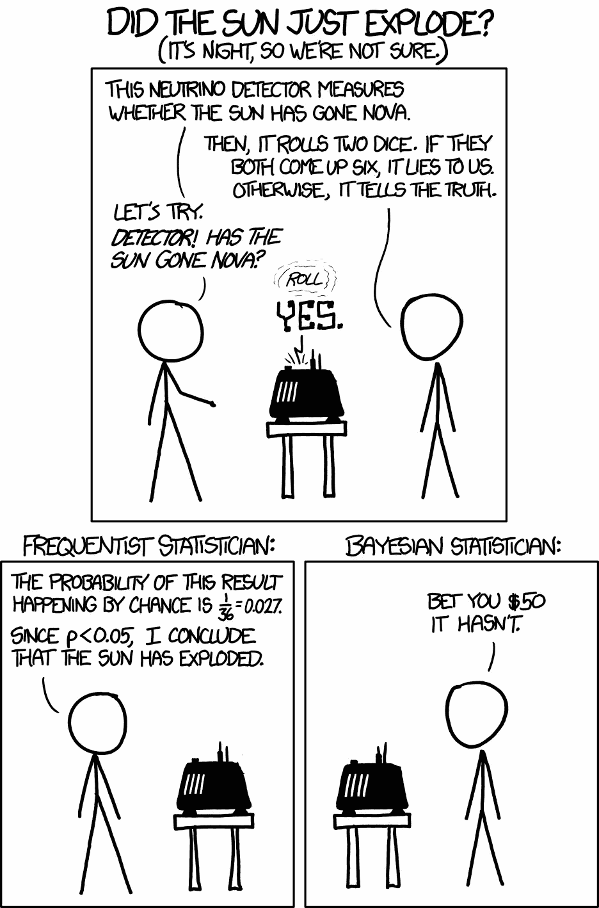

# Python 中的贝叶斯推理

> 原文：<https://pub.towardsai.net/an-introduction-to-bayesian-inference-88a1550f9040?source=collection_archive---------0----------------------->

## [概率](https://towardsai.net/p/category/probability)

## 发现频率主义者和贝叶斯方法之间的区别。


图片由[此时此地](https://pixabay.com/users/alexas_fotos-686414/?utm_source=link-attribution&utm_medium=referral&utm_campaign=image&utm_content=5244001)来自 [Pixabay](https://pixabay.com/?utm_source=link-attribution&utm_medium=referral&utm_campaign=image&utm_content=5244001)

> 不确定性是唯一存在的确定性，知道如何在不确定性中生活是唯一的安全——约翰·艾伦·保罗斯

人生是不确定的，统计学可以通过应用概率和推理的概念，帮助我们在这个不确定的世界中量化确定性。然而，有两种主要的推理方法:

*   **常客(古典)**
*   **贝叶斯**

让我们用众所周知的简单的**抛硬币**的例子来看看这两者。

**一枚硬币抛 10 次，观察 1 头 9 尾，我们能说什么公平？**

虽然 10 是确定硬币公平性的小样本量，但我选择它是因为在现实生活中收集大量样本可能很困难，尤其是在风险和机会成本很高的情况下。

# 频繁主义者推论:

这是大学里经常教的，工业界也经常使用的，但也不是没有批评。

**基本思想:**frequent ist 方法计算 p 值，p 值是在假设零假设为真的情况下，观察到至少与我们观察到的数据一样极端的结果的**概率。**

在这种情况下，无效和替代假设将是:
**H0** :硬币是公平的
**:硬币是有偏见的**

**假设硬币是公平的，我们计算出看到像 1 个头这样极端的东西的概率。也就是 1 个头，0 个头，另一边 9 个头，10 个头。将四者相加的结果是概率为 0.021。**

```
from scipy.stats import binombinom.pmf(k=9, n=10, p=0.5)  + binom.pmf(k=10, n=10, p=0.5) +binom.pmf(k=0, n=10, p=0.5)+binom.pmf(k=1, n=10, p=0.5)
```

**因此，在 5%的显著性下，我们可以自信地拒绝零假设，并以 95%的确定性得出结论，硬币是有偏差的。**

**目前看来一切正常，我们已经确定硬币是有偏差的。那么，问题是什么？**

**假设观察者对答案不满意，并继续用同一枚硬币观察另外十个样品。他会对硬币做出同样的推断吗？不一定。这一次，他可以看到 5 个正面和 5 个反面，并得出结论认为硬币没有偏向。因此，我们很难在相同的条件下重现相同的结果。**

**此外，我们永远也不会理解**我们的零假设**有多合理，因为我们假设它是真的——你可以提出一个荒谬的主张，然后设计一个实验来拒绝或接受零假设。**

**那么，我们有没有其他健壮的方法可以克服这些限制呢？**

# ****贝叶斯推断:****

**贝叶斯推理采用了与频率主义方法非常不同的观点，不是从观察到的数据中估计单个总体参数，而是用代表我们的知识和不确定性的整个概率分布来表征它们。**

**我们从先验概率开始，先验概率代表我们在看到数据之前对参数的了解，然后我们进行观察，根据观察结果，我们使用贝叶斯规则将先验更新为后验。**

**让我们从贝叶斯法则开始:**

****

**贝叶斯定理**

**方程中的θ是实验的成功，这里的数据是从实验中观察到的数据，让我们理解方程中的每一项**

**p(theta)——也叫**先验**——是在看到数据之前成功的概率，这个来了**

**p(theta | Data)-也称为**后验**-是考虑观察数据后假设为真的概率**

**P(Data | theta) —也称为**似然度** —它是数据提供的关于假设的证据**

**p(数据)——也称为**归一化**——是考虑所有可能假设的数据的总概率**

**对一个事件的推断有三种方式。**

1.  **完全基于你以前的经验，没有任何观察到的数据，即基于 p(theta)a . k . a .**previous**，这是一种非统计学家的方法。**
2.  **第二种方法是频率主义方法，在这种方法中，我们预计如果假设为真，观察到这种结果的可能性有多小，即 p(data | theta)又名**可能性**，这意味着我们只是依赖于观察到的数据，而不是其他任何东西。**
3.  **最后，我们有贝叶斯推理，它使用**我们的先验知识 p(theta)和我们的观测数据来构建概率后验分布。所以频率主义者和贝叶斯推理的一个关键区别是我们的先验知识，即 p (theta)。****

**因此，在贝叶斯推理中，我们从先验信念开始。然后我们检查观察到的数据，让每一个数据稍微改变我们先前的理解。我们观察的数据越多，我们就离最初的信念越远。这一过程最终导致后验信念。**

**但是有一个问题:如果先验指的是我们之前的理解，这不是增加了实验者的偏见吗？如果我们因为不同的前科而得到不同的结果呢？这些都是公平的问题，然而，先验是贝叶斯推理的重要组成部分，人们应该确保他的先验是相关的。**

**因此，为了精确计算后验概率，我们需要假设的先验和似然，但是在大多数实验中，假设的先验概率是未知的。在这种情况下，我们可以假设 prob(theta)在 0 和 1 之间均匀分布。**

**让我们回到掷硬币的例子:**

**p(theta) —成功的概率(正面)—在看到数据之前，成功的概率是多少—由于我们对硬币没有任何先验知识，我们假设它均匀分布在 0 和 1 之间。**

**让我们从贝叶斯分析开始——后验概率可以用几种方法计算。在这种情况下，我使用网格近似来估计它。**

**假设观察值为[T，T，T，T，T，T，T，T，T，T，T，H]**

```
#Lets import required packages
import numpy as np 
import matplotlib.pyplot as plt #Taking a grid of 1000 points between 0 and 1
probability_grid = np.linspace(0,1,num= 1000)#As we have assumed a uniform distribution between 0 and 1 (i.e. uniform distribution across all 1000 grid points)
prior_probability = np.ones(1000)
```

****

**先验分布 0 尾，0 和 1 之间的均匀分布**

```
#Now lets toss the coin once, and we observed a tail
probability_data = binom.cdf(k=0, n=1, p=probability_grid)
posterior = prior_probability * probability_data 
posterior = (posterior/sum(posterior))*1000
```

****

**1 次跟踪后的后部**

**必须对所有 10 次试验重复后验更新过程，每次试验后的后验如下所示:**

****

**每次试验后的后验概率**

**我分别遍历了所有的路径来演示这个过程。我们可以使用 Pymc3 包一次性完成。**

```
#Import required packages
import pymc3 as pm
import arviz as az
tosses_output = [ 0,0,0,0,0,0,0,0,0,1]with pm.Model() as model:
    # lets define the prior
    hypo = pm.Beta('hypo', 2, 2)

    # define probability
    data = pm.Bernoulli('data', hypo, observed=tosses)

    # sample
    trace = pm.sample(return_inferencedata=True)# visualize
az.plot_posterior(trace, hdi_prob=0.95)
```

****

**正面概率的 95%置信区间**

**那么，我们完成了什么？我们不是简单地说明硬币是否有偏差，而是获得了成功的整个分布，从中我们可以回答一些问题，如正面最可能的概率，正面的置信区间。**

**我将用一幅漫画来结束这篇文章，帮助你记住贝叶斯思维和频率主义思维的区别。**

****

**来源: [XKCD](https://xkcd.com/1132/)**

**频率主义者的推论没有考虑到太阳爆炸的“先验”概率，因为它仅仅基于观测数据，一个纯粹的频率主义者的方法可能会遇到问题。Frequentist 根据零假设检查发现的可能性，但它不考虑假设是否先验地更不可信。**

# **参考资料和补充阅读**

**[1] [统计学中的频率主义和贝叶斯方法](https://www.probabilisticworld.com/frequentist-bayesian-approaches-inferential-statistics/)**

**[2] [频率主义者和贝叶斯推理的比较](https://ocw.mit.edu/courses/mathematics/18-05-introduction-to-probability-and-statistics-spring-2014/readings/MIT18_05S14_Reading20.pdf)**

**【3】[信号和噪声](https://www.penguinrandomhouse.com/books/305826/the-signal-and-the-noise-by-nate-silver/)**

**[4] [贝叶斯 vs 频率主义方法](https://365datascience.com/bayesian-vs-frequentist-approach/)**

**【5】[概率概念讲解:参数估计的贝叶斯推断。](https://towardsdatascience.com/probability-concepts-explained-bayesian-inference-for-parameter-estimation-90e8930e5348)**

**[6] [安德烈·舒马赫在 DTC 上的讲话](https://www.youtube.com/watch?v=AkWmyE3kQ9k)**

**[【7】Richard McElreath 统计反思讲座 2019](https://www.youtube.com/playlist?list=PLDcUM9US4XdNM4Edgs7weiyIguLSToZRI)**