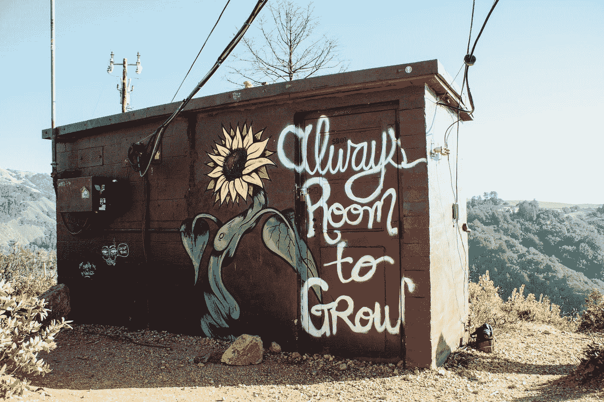
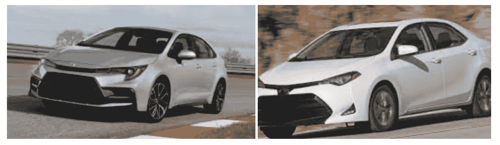
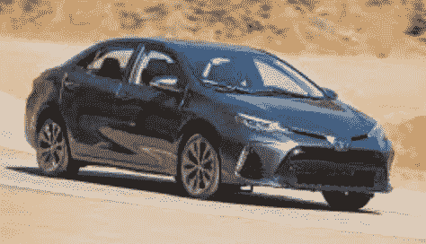
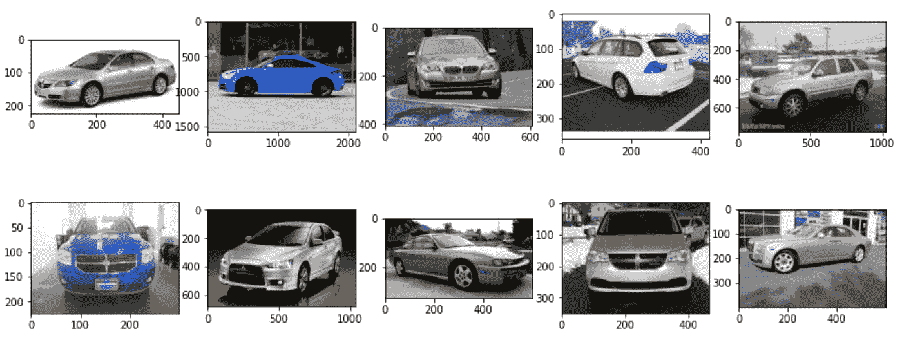
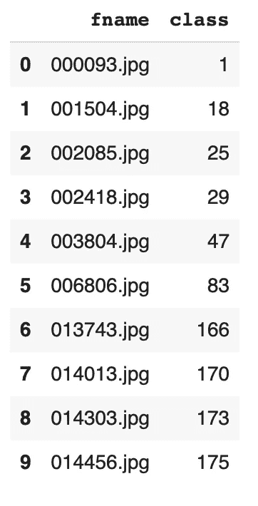
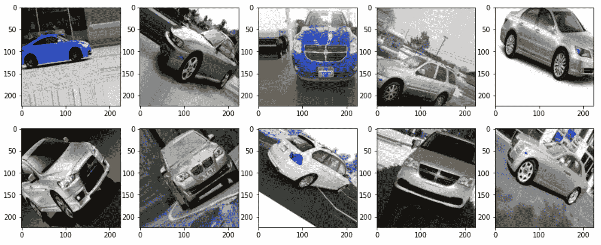
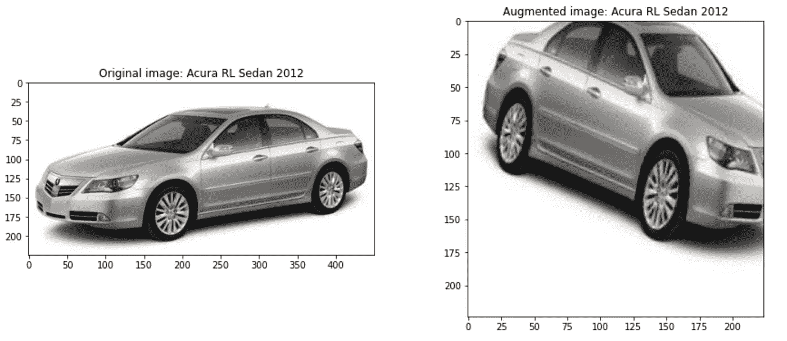

# 使用 Tensorflow 的 ImageDataGenerator 对图像进行数据扩充的介绍

> 原文：<https://pub.towardsai.net/an-introduction-to-data-augmentation-for-images-using-tensorflows-imagedatagenerator-45235dd0553b?source=collection_archive---------2----------------------->

## [计算机视觉](https://towardsai.net/p/category/computer-vision)，[机器学习](https://towardsai.net/p/category/machine-learning)

## 关于数据扩充的 Colab 教程。



照片由[凯尔·格伦](https://unsplash.com/@kylejglenn?utm_source=medium&utm_medium=referral)在 [Unsplash](https://unsplash.com?utm_source=medium&utm_medium=referral) 拍摄

让模型过度适应训练数据是数据科学家和机器学习研究人员经常面临的一个常见问题。各种技术可用于减少过拟合；在本文中，我们将重点关注**数据增强**。

细目:
1。什么是数据增强？
2。何时执行数据扩充？
3。使用 ImageDataGenerator 的数据扩充

# 什么是数据增强？

数据扩充是一种利用变换或过采样来人为扩大原始数据集的技术。[1]图像变换的例子有图像旋转、改变图像亮度、水平或垂直翻转图像等。

# 何时执行数据扩充？

深度学习已经帮助我们在计算机视觉任务上实现了最先进的性能。然而，它们容易过度拟合。让我们看一个简单的例子——

比如说你想建立一个神经网络来识别丰田卡罗拉。您已经收集了训练数据，您的图像与下图非常相似。



丰田卡罗拉。来源(左):[汽车趋势](https://www.motortrend.com/cars/toyota/corolla/2020/2020-toyota-corolla-sedan-first-drive/)，来源(右):[汽车和司机](https://www.caranddriver.com/toyota/corolla)

你想在野外测试你的模型。假设你看到了下面的图片。



丰田卡罗拉。来源:[埃德蒙兹](https://www.edmunds.com/toyota/corolla/2018/review/)

请注意，与您的训练图像相比，汽车面向相反的方向。鉴于这样的图像，您的模型可能无法识别汽车是丰田卡罗拉。当您的训练数据集包含彼此看起来非常相似的图像时，您的模型将无法学习相关的特征，并且无法归纳到它在现实世界中看到的图像。为了避免这个问题，我们可以应用数据扩充技术来减轻过度拟合并增强模型的泛化能力。

重要的是不要被数据扩充冲昏头脑，不要应用超出真实世界范围的转换。


丰田卡罗拉(垂直翻转)。来源:[埃德蒙兹](https://www.edmunds.com/toyota/corolla/2018/review/)

**在您试图解决的问题的上下文中应用转换。**

# 使用 ImageDataGenerator 的数据扩充

在本教程中，我们将使用[斯坦福汽车数据集](https://ai.stanford.edu/~jkrause/cars/car_dataset.html)。你可以通过 [Google Colab](https://colab.research.google.com/drive/1AOs6UNl0UF7FjK_AlICr0lhHIVRN_JZM?usp=sharing) 跟踪代码。

数据集很大。在本教程中，我们将对一些图像进行采样，以了解数据扩充。



样本图像。来源:作者图片

接下来，我们将定义图像生成器的参数。

```
DATA_AUG_BATCH_SIZE = 2  # batch size for data augmentation
img_size = (224, 224)  # input image size to model# Number of steps to perform data augmentation
n_steps_data_aug = np.ceil(df_sample.shape[0]/DATA_AUG_BATCH_SIZE).astype(int)
```

*   我们为图像生成器定义一个批量大小。这类似于模型训练中的批处理。
*   `img_size`是模型要求的图像尺寸。如果您使用迁移学习，特定的模型对于图像到模型的输入大小有自己的规范。
*   `n_steps_data_aug`类似于模型训练中的纪元。在本教程中，我们生成一个对应于每个采样图像的新图像。迭代生成器`n_steps_data_aug`次生成所需数量的图像。

```
# Image data generator. Transformations to be applied
datagen = ImageDataGenerator(rescale=1./255, 
rotation_range=40, 
width_shift_range=0.2,  
height_shift_range=0.2, 
zoom_range=0.2, 
horizontal_flip=True, 
brightness_range=[0.4, 1.0], 
fill_mode='nearest')
```

*   `rescale`将每个像素值乘以重新缩放因子。这有助于加快收敛。
*   `rotation_range`随机旋转图像，最大旋转角度为 40°。
*   `width_shift`根据图像总宽度的一部分移动图像，如果提供浮动。
*   `height_shift`如果提供浮动，按图像总高度的一部分移动图像。
*   `zoom_range`放大图像。在范围`[1-zoom_range, 1+zoom_range]`中选择一个随机数。
*   `horizontal_flip`随机水平翻转图像。
*   `brightness_range`改变图像的亮度。在提供的范围内选择一个随机数。
*   `fill_mode`使用用户选择的各种技术填充图像中的空白空间。当图像沿其宽度或高度移动时，会出现空白。

如果您想了解有关转换和其他选项的更多信息，请访问[tensor flow Core v 2 . 4 . 1—imagedata generator](https://www.tensorflow.org/api_docs/python/tf/keras/preprocessing/image/ImageDataGenerator)。

有几种方法可以将图像传递给数据生成器。

1.  `flow`:将图像数据和标签数据作为数组传递。
2.  `flow_from_dataframe`:您传递一个数据帧和一个包含图像的目录的路径。数据帧有两列，一列包含相对于目录路径的文件路径，第二列包含标签。
3.  `flow_from_directory`:您传递包含按子目录分类的图像的目录路径。每个子目录对应一个标签——文件路径结构的例子， *imgs/dogs/img01.png* ， *imgs/cats/img01.png* 。有两类，狗和猫。

我们将使用`flow_from_dataframe`将图像输入数据生成器。下面你可以看到数据帧的结构。在 [Google Colab 笔记本](https://colab.research.google.com/drive/1AOs6UNl0UF7FjK_AlICr0lhHIVRN_JZM?usp=sharing)中，你可以查看代码，看看我是如何创建这个数据框架的。



带有图像文件名和相应标签的数据帧。来源:作者图片

```
# Feed images to the data generator 
aug_gen = datagen.flow_from_dataframe(dataframe=df_sample, 
directory=img_path, 
save_to_dir=aug_img_path, 
save_prefix='aug', 
save_format='jpeg', 
x_col="fname", 
y_col="class", 
batch_size=DATA_AUG_BATCH_SIZE, 
seed=SEED, 
shuffle=False, 
class_mode="categorical", 
target_size=img_size)Output:
Found 10 validated image filenames belonging to 10 classes.
```

上述代码将图像提供给数据生成器。`df_sample`是我上面展示的数据框架。如果您想将图像保存到一个目录，请提供一个到`save_to_dir`的路径。`ImageDataGenerator`用模式定义的文件名保存生成的图像:`prefix_idx_randn`

*   **前缀:**前缀由用户提供
*   **idx:** 馈送给生成器的数据帧中数据点的索引
*   **randn:** 随机数

```
# Generated file names
['aug_1_5664789.jpeg',  'aug_7_631054.jpeg',  'aug_5_6028627.jpeg',  'aug_4_8351445.jpeg',  'aug_0_9784633.jpeg',  'aug_6_5123896.jpeg',  'aug_2_3921660.jpeg',  'aug_3_7757856.jpeg',  'aug_8_8252162.jpeg',  'aug_9_5698539.jpeg']
```

生成新图像。

```
# Run the data generator
for i in range(n_steps_data_aug):
    next(aug_gen)# Number of augmented images created
aug_file_nm = os.listdir(aug_img_path)
number_files = len(aug_file_nm)
print("Number of new images generated: {}".format(number_files))Output:
Number of new images generated: 10
```

我们使用`n_steps_data_aug`来控制运行数据发生器的次数。在本文的前面，我提到过我们希望为每个采样图像生成一个新图像。


原始图像。来源:作者图片



变形的图像。来源:作者图片

有些图像可能不像真实世界的数据，所以在对图像应用变换时要非常小心。

最后，如果您想将适当的类与生成的图像相关联，您可以拆分生成的文件名，提取索引并确定标签。确定适当标签的代码可在[谷歌 Colab 笔记本](https://colab.research.google.com/drive/1AOs6UNl0UF7FjK_AlICr0lhHIVRN_JZM?usp=sharing)中获得。



使用索引，您可以确定与生成的图像相关联的标签。来源:作者图片

我希望这篇文章对您有所帮助，并为您提供了对 Tensorflow 的 ImageDataGenerator 的高级理解。如果您想更深入地了解数据增强，这里有一些资源:

*   [tensor flow Core v 2 . 4 . 1—imagedata generator](https://www.tensorflow.org/api_docs/python/tf/keras/preprocessing/image/ImageDataGenerator)
*   [如何在 Keras 中配置图像数据增强](https://machinelearningmastery.com/how-to-configure-image-data-augmentation-when-training-deep-learning-neural-networks/)
*   [Tensorflow 的实验预处理层](https://www.tensorflow.org/tutorials/images/data_augmentation)

# 参考

[1] Shorten，c .，Khoshgoftaar，T.M .关于深度学习的图像数据增强的调查。 *J 大数据* **6、** 60 (2019)。[https://doi.org/10.1186/s40537-019-0197-0](https://doi.org/10.1186/s40537-019-0197-0)

[2][tensor flow Core v 2 . 4 . 1—imagedata generator](https://www.tensorflow.org/api_docs/python/tf/keras/preprocessing/image/ImageDataGenerator)