# Github 简介

> 原文：<https://pub.towardsai.net/an-introduction-to-github-34e22981ce16?source=collection_archive---------0----------------------->

## [编程](https://towardsai.net/p/category/programming)

## **初学者如何使用 GitHub 的详细文章**

由[罗曼·辛克维奇](https://unsplash.com/@synkevych?utm_source=medium&utm_medium=referral)在 [Unsplash](https://unsplash.com?utm_source=medium&utm_medium=referral) 上拍摄的照片

本文涵盖了 GitHub 的所有基本操作。例如:创建存储库，创建分支，提交，拉请求，以及它们的功能。以下说明仅适用于 Windows 操作系统。

> ***什么是 GitHub，为什么用它？***

GitHub 是一个免费的开源代码托管网站，程序员和开发人员可以在这里上传他们的代码并进行协作。它是一个内容跟踪器，由于它的许多特性，我们利用它来存储代码。

该网站是以这样一种方式开发的，用户可以在不影响当前用户使用的程序的情况下调整程序。

例如，当多个开发人员并行处理实时项目时，我们需要一个类似 GitHub 的版本控制系统，这样彼此之间就不会有代码冲突。

除了移动集成之外，Github 还提供了基于 web 的图形界面和桌面。它还提供访问控制和一些协作特性，如 wikis、任务管理和 bug 跟踪。

它还可以突出 200 多种不同编程语言的语法。像网飞、Shopify、Airbnb、Udemy 等许多公司都使用 GitHub 来改善他们的技术堆栈。

> ***GitHub 账户创建:***

要创建一个 GitHub 帐户，你所要做的就是访问“github.com ”,填写注册表格并使用你的电子邮件进行验证。您已经成功创建了您的 GitHub 帐户！

> ***GitHub 安装:***

要在您的桌面上安装 GitHub，请访问“desktop.github.com ”,并根据您的系统要求安装该软件。

> ***一些需要牢记的重要术语(词汇表)***

在我们开始 GitHub 的工作原理之前，让我们先来看一些重要的术语:

*   存储库:git 存储库是项目中的一个. git/文件夹，它记录了一段时间内所有的变更。这意味着，如果您删除了一个存储库，那么您在项目中所做的所有更改也会丢失。
*   Fork: Forking 是一种创建存储库副本的方法。您只能通过分叉将您的工作贡献给现有的项目。存储库是分叉的，这样我们可以在不影响原始项目的情况下自由地进行实验。
*   **Commit:**Commit 命令保存您当前工作的项目中所做的更改。
*   **推送:**git Push 命令将项目从本地存储库上传到远程存储库。例如:在用户提交了必要的变更之后，他现在可以将他的项目从他的系统转移到 git 存储库中，在那里每个人都可以访问它来进行他们的研究或者对它做出更多的贡献。
*   **Pull request:**Pull request 是一个 review request，它允许您告诉其他人您已经将变更推送到 GitHub 上的一个存储库中的一个分支。它也被称为合并请求。

> ***它是如何工作的？***

我们现在知道 GitHub 是一个任何人都可以为开源项目做出贡献的平台。使用 Github 有两种方法:

1.  用户可以创建一个存储库，将其克隆到系统中，对其进行处理，然后将其推回服务器。
2.  用户可以在本地处理他的项目。要将它移动到服务器，他们必须创建一个新的存储库并推送它。

> ***让我们详细探讨一下这两种方法:***

## 方法 1:创建一个存储库，将其克隆到您的 PC 上，然后使用它。

这是强烈推荐的方法之一，因为您可以在 GitHub 上创建一个新的存储库，在您的系统中制作一个副本来处理一个项目，然后将它推回存储库。

按照以下步骤执行该方法。

**第一步:**在 GitHub 上新建一个资源库:登录 GitHub，在右上角点击“+”号，选择“新建资源库”。

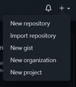

作者图片

**步骤 2:** 输入带有描述的存储库名称(描述是可选的)。使用“添加自述文件”初始化存储库本自述文件简要描述了您当前正在进行的项目。最后，单击 Create repository 按钮。您已经成功创建了您的第一个存储库！

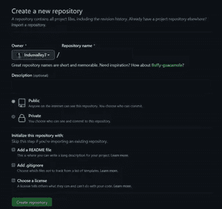

作者图片

**步骤 3:** 我们的下一个任务是在我们的系统中创建存储库的副本。为此，您必须将存储库从服务器克隆到您的系统中。概念就跟下载一样。在新创建的存储库页面上，单击“代码”(绿色按钮)并复制“HTTPS”地址。

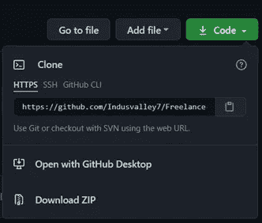

作者图片

**步骤 4:** 复制完链接后，打开系统中的终端，输入以下命令:

**命令:** git 克隆 HTTP _ 地址

作者图片

现在，您已经成功地在系统中创建了您的存储库的副本。

**第 5 步:**在创建一个副本之后，现在需要访问存储库。为此，请使用以下命令:

**命令:**CD[存储库名称]

作者图片

您现在已经成功克隆了一个存储库！在这个文件夹中，我们可以创建文件、处理项目并将它们保存在系统中。

步骤 6: 在处理完项目之后，您现在必须检查文件是否被修改。如果您已经关闭了终端，请再次执行步骤 5，然后执行如下命令:

**命令:** git 状态

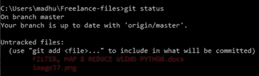

作者图片

现在，您将获得一个存储库中不存在的文件列表(红色)。

**第 7 步:**从列表中添加那些文件，使用下面的命令。

**命令:** git 添加文件名 filename

作者图片

该命令会将您命名的文件添加到存储库中(在系统本身中)。

**步骤 8:** 添加完所有文件后，使用以下命令保存这些更改:

命令: git commit -m

上面的命令也可以包含一个简短的消息来说明内容。

**示例:** git commit -m“该代表包含我的第一个项目”

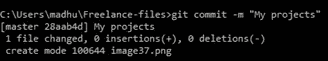

作者图片

**第九步:**现在，你终于准备好把作品搬到 GitHub 了。为此，您必须使用下面的命令将存储库推送到远程服务器。

**命令:** git 远程

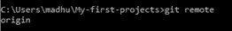

作者图片

如果在执行命令后，名称显示为 origin，则它最终准备好被推送到远程服务器。

**步骤 10:** 将存储库推送到服务器:

**命令:**饭桶推原点大师

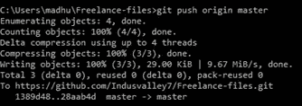

作者图片

现在，您已经成功地将存储库推送到远程服务器。现在，您可以到 GitHub 存储库检查文件是否被附加。

作者图片

## 方法 2:在本地处理您的项目，在 GitHub 上创建存储库并将其推送到远程。

该方法允许您从系统中现有的文件夹创建一个新的存储库，并将该文件夹移动到 GitHub 中。例如，一个用户想要将他系统中的一个文件夹作为 GitHub 中的存储库进行传输。

**第一步:**首先，访问你的目录执行这个方法。

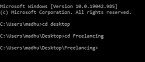

作者图片

**步骤 2:** 我们知道我们系统中的目录不是 Git 存储库。但是您可以通过在终端中执行以下命令来转换成一个。

命令: git init

在执行这个命令时，您的目录被转换成 Git 存储库。

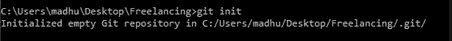

作者图片

下一步是使用以下命令检查存储库中的所有文件:

**命令:** git 状态

执行的命令将显示所有需要添加到存储库中的文件(红色)。

**步骤 3:** 这里，您应该使用下面的命令将所有需要的文件添加到存储库中。

**命令:** git 添加文件名文件名

作者图片

文件现在已成功添加到存储库中。

**要添加存储库中的所有文件，请使用以下命令:**

**命令:** git add -all

**步骤 4:** 使用“git status”命令检查文件是否被添加到存储库中。

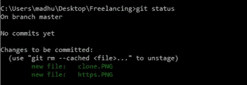

作者图片

**步骤 5:** 分析完文件后，您现在可以保存您所做的更改了。您还可以使用下面的命令提供一条关于该文件的简短消息。

**命令:** git commit -m“描述”

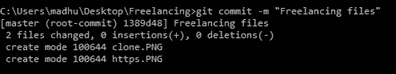

作者图片

现在可以将存储库推送到您的 GitHub 了。

**注:**

*   确保您已经创建了一个新的存储库，并预先在 GitHub 中将它命名为您的首选项。
*   当您在 GitHub 帐户上创建新的存储库时，不要用自述文件初始化存储库。

**第 6 步:**一旦您创建了存储库，您将得到类似这样的东西。

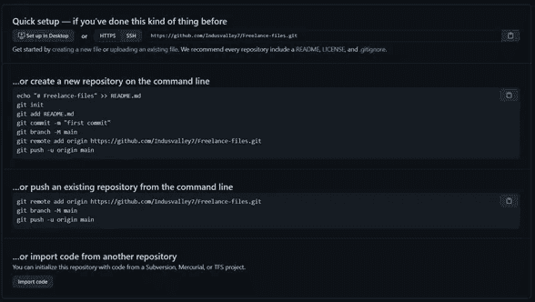

作者图片

复制 HTTPS 地址并执行以下命令为您的存储库创建一个远程。

**命令:** git 远程添加原点[https]

要检查上述命令是否成功执行，请使用:

**命令:** git 远程

如果输出显示为 origin，这意味着您已经成功地将遥控器添加到项目中。

**第七步:**现在，我们终于准备好将我们的项目推送到 GitHub 了！

**命令:**饭桶推原点大师

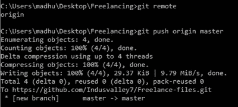

作者图片

现在，您已经成功地将存储库推送到远程服务器。现在，您可以到 GitHub 存储库检查文件是否被附加。

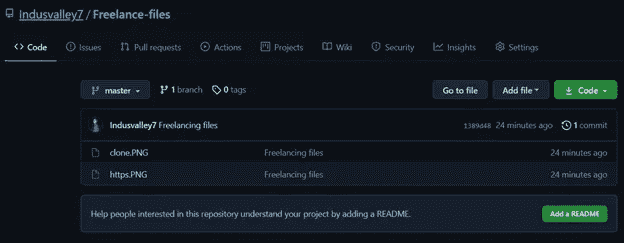

作者图片

**结论:**

我最后总结道，我们已经成功地探索了如何使用 GitHub 文件的两种方法。当你申请工作时，使用 GitHub 是非常有用的。它帮助你建立你的简历，让你的招聘人员通过检查你的项目了解你的能力。我强烈推荐阅读更多关于 GitHub 的文章，因为有很多关于这个主题的文章，使用不同的操作系统，你可以尝试。希望这篇文章对你有所帮助。

我希望你喜欢这篇文章。通过我的 [LinkedIn](https://www.linkedin.com/in/data-scientist-95040a1ab/) 和 [twitter](https://twitter.com/amitprius) 联系我。

# 推荐文章

[1。NLP —零到英雄与 Python](https://medium.com/towards-artificial-intelligence/nlp-zero-to-hero-with-python-2df6fcebff6e?sk=2231d868766e96b13d1e9d7db6064df1)
2。 [Python 数据结构数据类型和对象](https://medium.com/towards-artificial-intelligence/python-data-structures-data-types-and-objects-244d0a86c3cf?sk=42f4b462499f3fc3a160b21e2c94dba6)3 .[Python 中的异常处理概念](/exception-handling-concepts-in-python-4d5116decac3?source=friends_link&sk=a0ed49d9fdeaa67925eac34ecb55ea30)
4。[为什么 LSTM 在深度学习方面比 RNN 更有用？](/deep-learning-88e218b74a14?source=friends_link&sk=540bf9088d31859d50dbddab7524ba35)
5。[神经网络:递归神经网络的兴起](/neural-networks-the-rise-of-recurrent-neural-networks-df740252da88?source=friends_link&sk=6844935e3de14e478ce00f0b22e419eb)
6。[用 Python](https://medium.com/towards-artificial-intelligence/fully-explained-linear-regression-with-python-fe2b313f32f3?source=friends_link&sk=53c91a2a51347ec2d93f8222c0e06402)
7 全面讲解了线性回归。[用 Python](https://medium.com/towards-artificial-intelligence/fully-explained-logistic-regression-with-python-f4a16413ddcd?source=friends_link&sk=528181f15a44e48ea38fdd9579241a78)
充分解释了 Logistic 回归 8。[concat()、merge()和 join()与 Python](/differences-between-concat-merge-and-join-with-python-1a6541abc08d?source=friends_link&sk=3b37b694fb90db16275059ea752fc16a)
的区别 9。[与 Python 的数据角力—第一部分](/data-wrangling-with-python-part-1-969e3cc81d69?source=friends_link&sk=9c3649cf20f31a5c9ead51c50c89ba0b)
10。[机器学习中的混淆矩阵](https://medium.com/analytics-vidhya/confusion-matrix-in-machine-learning-91b6e2b3f9af?source=friends_link&sk=11c6531da0bab7b504d518d02746d4cc)