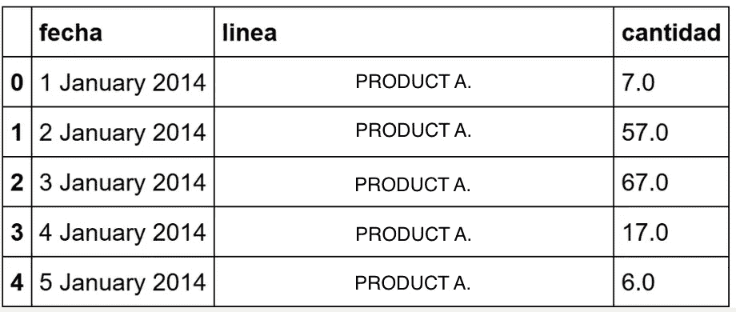
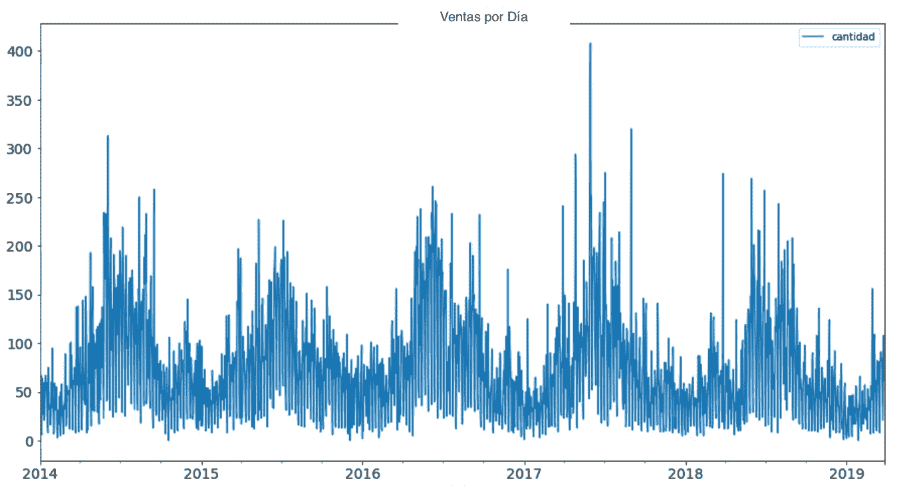
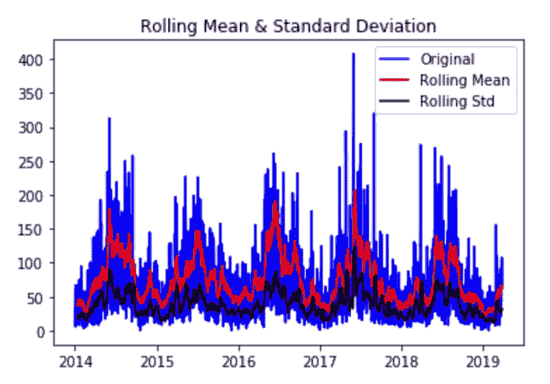
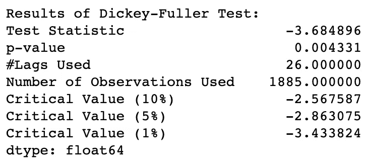
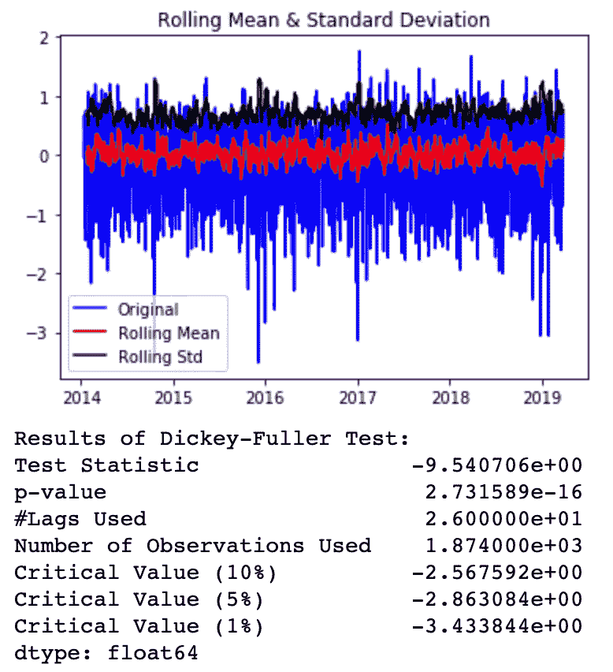
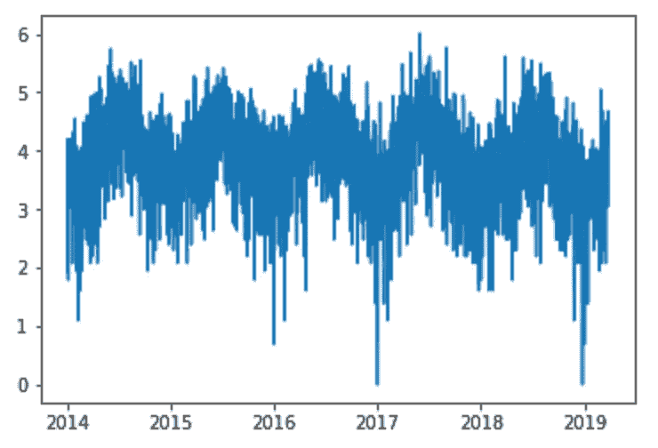
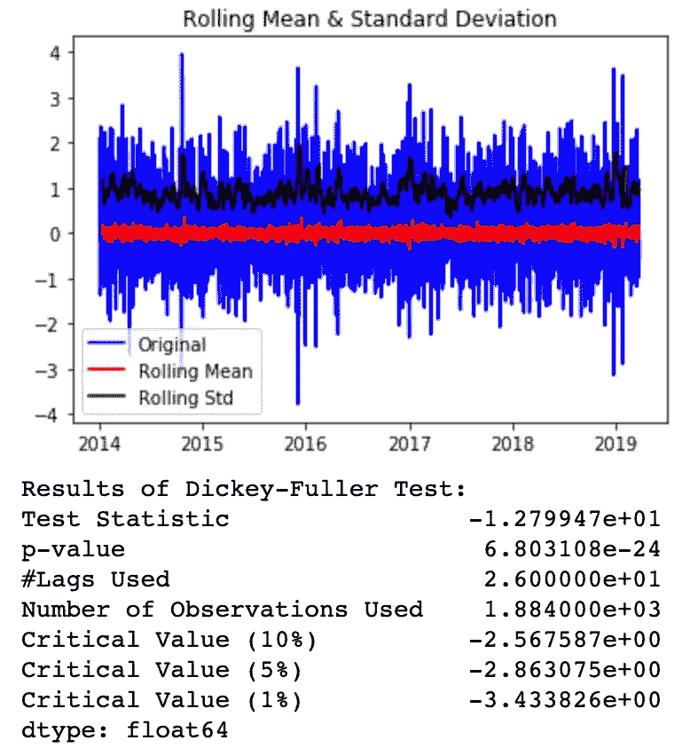

# 使用 Python 和 Pandas 进行时间序列分析的介绍

> 原文：<https://pub.towardsai.net/an-introduction-to-time-series-analysis-using-python-and-pandas-222fe72b191a?source=collection_archive---------1----------------------->

## 时间序列分析简介| [走向人工智能](https://towardsai.net)

## 分析和*站产生*时间序列的第一步

最近，我有机会作为一名 POC 来建立一名销售预测员。这是一个具有挑战性的项目，其结果是一个很酷的 MVP，通过这篇文章，我将分享我的部分旅程和分析我所获得的数据的发现。

## 假设

我假设你以前对 Python 和熊猫都有所了解。

## 首先要做的是…

这个项目像其他数据科学项目一样开始:通过检查我们手头的数据。为此，我导入了作为数据源提供的 CSV 文件。

```
path_to_csv = r'path\to\csv\file.csv'
data_df = pd.read_csv(path_to_csv)
data_df.head()
```



一旦我对数据有了一个清晰的概念，我就开始了最初的探索和通常的转换。

```
# Check for nulls: 
data_df.loc[data_df['cantidad'].isnull()]# Check for other odd values: data_df[data_df['cantidad'].isin([np.nan, np.inf, -np.inf])]# convert column fecha to datetime
data_df['fecha'] = data_df['fecha'].astype('datetime64[ns]')# Replace NaN values
data_df['cantidad'] = data_df['cantidad'].fillna(0)
```

为了简化将来对 pandas 数据帧的操作，我将‘fecha’作为数据帧的索引。由于记录已经按顺序出现，因此很容易执行这种转换，并通过对整个数据帧进行重新采样，将数据帧转换为具有“每日级别”频率的序列。

```
data_df.index = data_df.fecha
data_df = data_df.resample('D').mean()
```

更新索引还有助于以更直观的方式检索数据。

```
# this will work for ranges:
data_df['2014-02-01':'2015-02-02']
# this will work for a given year:
data_df['2016']
```

完成上述转换后，就可以绘制数据了。在 matplotlib 库的帮助下，我能够显示这些年来每天销售的产品数量的图表。

```
data_df.plot(figsize=(15,8), title= 'Ventas Por Día', fontsize=14)
plt.show()
```



## 那么……什么是时间序列，它的特别之处是什么？

从最初的数据探索来看，很明显我们正在处理一个被称为[的时间序列](https://en.wikipedia.org/wiki/Time_series)。时间序列只是我们处理按时间顺序索引的数据点的一种奇特方式。

通常，在处理时间序列时，我们会在数据中寻找一些特殊的特征，以便能够基于这些特征进行预测。具体来说，我们寻找一个平稳的时间序列。

## 时间序列的平稳性

当时间序列的均值和方差不是时间的函数时，我们可以说时间序列是平稳的(即，它们在时间上是恒定的)。

平稳性很重要，因为大多数进行分析和预测的统计方法都是在假设统计特性(均值、方差、相关性等)的基础上进行的。)在时间上是常数。

## 如何检验一个时间序列的平稳性？

可以通过两种方式评估平稳性:

*   目视检查数据点，并检查统计特性如何随时间变化。
*   进行迪基-富勒试验。

让我们先来一个视觉化的方法，看看效果如何。



通过标绘标准偏差和平均值以及原始数据点，我们可以看到它们在时间上是恒定的。然而，它们似乎遵循一种循环行为。

虽然视觉方法可以给我们一个线索，但应用 Dicky-Fuller 测试(DF-test)可以提供一个更精确的方法来测量我们的序列的平稳性。



DF 测试的结果

我不会详细介绍 DF 测试是如何工作的，但是假设我们需要关心的是我们在“测试统计”和“临界值”中看到的数字。我们总是希望前者小于后者。检验统计值越小越好。

假设检验统计量小于所有临界值，我们的序列是平稳的，尽管不是很多。

如果你需要的话，下面是我用来评估平稳性的代码。

```
def test_stationarity(timeseries):

    # Determining rolling statistics
    rolmean = timeseries.rolling(12).mean()
    rolstd = timeseries.rolling(12).std()

    # Plot rolling statistics:
    orig = plt.plot(timeseries, color='blue',label='Original')
    mean = plt.plot(rolmean, color='red', label='Rolling Mean')
    std = plt.plot(rolstd, color='black', label = 'Rolling Std')
    plt.legend(loc='best')
    plt.title('Rolling Mean & Standard Deviation')
    plt.show(block=False)

    # Perform Dickey-Fuller test:
    print ('Results of Dickey-Fuller Test:')
    timeseries = timeseries.iloc[:,0].values
    dftest = adfuller(timeseries, autolag='AIC')
    dfoutput = pd.Series(dftest[0:4], index=['Test Statistic','p-value','#Lags Used','Number of Observations Used'])
    for key,value in dftest[4].items():
        dfoutput['Critical Value (%s)'%key] = value
    print(dfoutput)
```

## 如果我们的时间序列是非平稳的呢？

有一些技术可以应用于*站出现*一个时间序列。我比较熟悉的两个是:

*   变换:应用对较大值比对较小值惩罚更多的变换。这些可以是取对数、平方根、立方根等。这种方法有助于减少这种趋势。
*   差异:将某一特定时刻的观察值与前一时间点的观察值进行比较。这处理了趋势和季节性，因此提高了平稳性。

熊猫和 numpy 为你提供了应用这些技术的非常实用的方法。

为了便于演示，我将对数据帧应用对数变换。

```
# Transform the dataframe:
ts_log = np.log(data_df)# Replace infs with NaN
ts_log.replace([np.inf, -np.inf], np.nan, inplace=True)# Remove all the NaN values
ts_log.dropna(inplace=True)
```

**奖励跟踪:**我们甚至可以对转换后的数据集应用平滑技术来消除可能存在的噪声。一种常见的平滑技术是从数据集中减去移动平均值。这可以通过以下方式轻松实现:

```
# Get the moving average of the series
moving_avg = ts_log.rolling(12).mean() # 12 months# Subtract the moving average of the log-transformed dataframe
ts_log_moving_avg_diff = ts_log - moving_avg# Remove all the NaN values
ts_log_moving_avg_diff.dropna(inplace=True)
test_stationarity(ts_log_moving_avg_diff)
```



显然，我们可以看到，将对数变换+移动平均平滑应用于我们的原始序列产生了更好的序列；在平稳性方面。

要应用差分，可以使用 Pandas shift()函数。在这种情况下，使用以下代码应用一阶差分。

```
ts_log_diff = ts_log - ts_log.shift()
plt.plot(ts_log_diff)
```



差分后的对数转换数据集

让我们对这个新的结果系列进行 DF 测试。

```
ts_log_diff.dropna(inplace=True)
test_stationarity(ts_log_diff)
```



通过对数变换和差分，检验统计量明显小于临界值，因此该序列比原始序列更加平稳。

## 正在总结…

当我们面对一个涉及时间序列的预测任务时，我们需要分析所述序列并确定它是否是平稳的。为了确定平稳性，我们可以绘制数据并直观地检查平均值和其他统计属性，或者执行 Dickey-Fuller 测试并查看测试统计和临界值。如果序列碰巧是非平稳的，我们可以应用变换或差分等技术使序列平稳。

在所有这些分析和准备之后，项目的下一步是用时间序列进行预测，但这是另一篇文章的主题:)