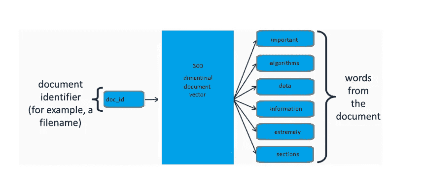
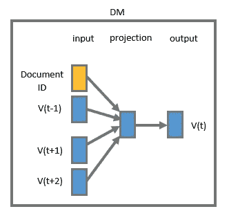
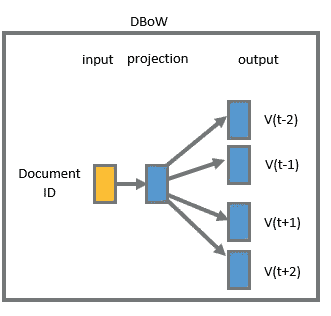

# 文档向量(Doc2Vec)的直观介绍

> 原文：<https://pub.towardsai.net/an-intuitive-introduction-of-document-vector-doc2vec-42c6205ca5a2?source=collection_archive---------2----------------------->

## Doc2Vec | [对 AI](https://towardsai.net) 的介绍

# 介绍

**Doc2Vec** 是 **Word2vec** 的扩展，它对整个文档进行编码，而不是对单个单词进行编码。可以在我的 [**上一篇**](https://medium.com/towards-artificial-intelligence/an-intuitive-introduction-of-word2vec-by-building-a-word2vec-from-scratch-a1647e1c266c) 中阅读关于 **Word2Vec** 。 **Doc2Vec** 向量表示文档的主题或整体含义。在这种情况下，文档是一个句子、一个段落、一篇文章或一篇短文等。

在 **Doc2Vec** 中，文档的名称，如文件名或文件 ID 将作为输入，文档中文字的滑动窗口作为输出。

与 **Word2vec** 类似，主要有两种训练方法，**段落向量分布式记忆模型(PV-DM)** 和**段落向量带分布式单词包** ( **PVDBOW** )。

它们是用于训练 Word2Vec 的 **CBOW 模型**和 **Skip Gram 模型**的变体，它通过添加标签或文档 ID 将上下文的概念扩展到段落。

*   **分布式内存模型**非常类似于 **Word2vec 的 **CBOW** 模型。**这个模型试图预测一个目标单词，给定它周围的上下文单词，加上一个段落 ID。

**分布式内存模型**

*   **分布式词袋模型**基于 **Word2vec skip-gram** 模型，除了不使用目标词作为输入之外，它将文档 ID 作为输入，并尝试从文档中预测随机采样的词。

**分布式词袋模型**

输入文件名并不重要。输出单词很重要，需要跟踪它们，因为它们来自同一个文档。所有这些单词都与该文件名相关联。

**Doc2Vec** 模型可以根据文件名预测文档的单词，而 **Doc2Vec** 模型知道哪些单词会出现在文档中。

文档的内容通常是关于一件事，例如，许多不同的正面词被用在正面评论中，许多负面词被用在负面评论中。

训练之后，我们可以有一个新的文档，我们需要找到它的文档向量。 **Doc2Vec** 使用在训练期间学习到的单词相似度来构建向量，该向量将预测新文档中的单词。

一旦我们获得了新文档向量，我们就可以将该文档向量与其他文档向量进行比较，并找出过去的哪些文档向量最相似。

所以， **Doc2Vec** 可以用来查找类似的文档。这将帮助我们找到正面和负面评论，因为一般来说，正面评论的文档将具有相关向量，而负面评论的文档将具有相关向量。

**为本帖配的 jupyter 笔记本可以在** [**Github**](https://github.com/nitwmanish/An-Intuitive-Introduction-Of-Document-Vector-Doc2Vec) **上找到。**

# 结论

我们知道向量表示文档的重要性，例如，文档聚类或分类任务，需要将文档表示为向量。

***希望这篇文章能帮助你了解* Doc2Vec *。它还将提供内部的* Doc2Vec 文件的表示，以及它的用途。**